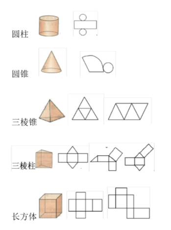
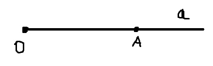
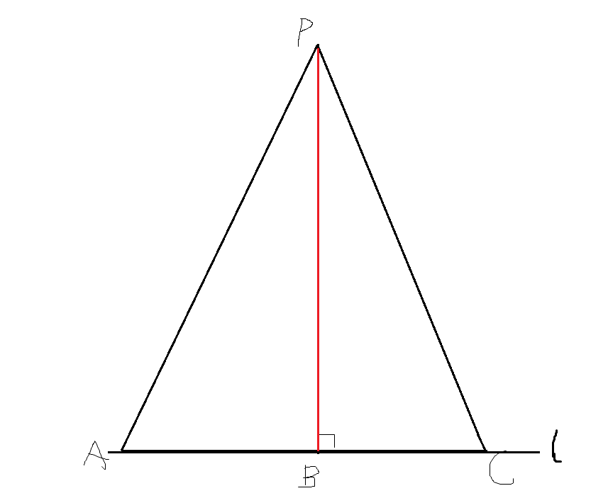
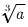
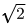
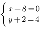
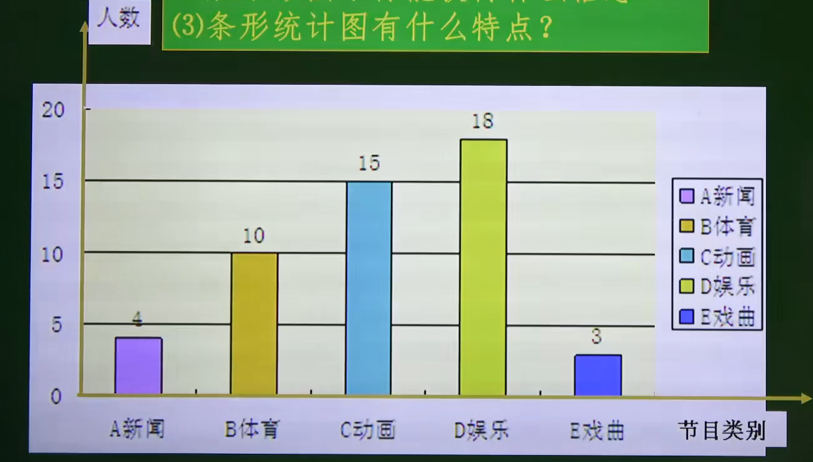

# 1. 有理数

## 正数与负数

1）0既不是正数，也不是负数，它是正数和负数的分界。

2）0是整数。


## 有理数

整数和分数统称为有理数。（由于整数和分数都可以表示为小数的形式，所以有时也称有限小数及无限循环小数为有理数）

1）整数。整数又分为正整数、0、负整数。

2）分数。分数又分为正分数、负分数。

注意：小数分为有限小数、无限循环小数、无限不循环小数。其中，有限小数和无限循环小数可以写成分数的形式，所以属于有理数；而无限不循环小数属于无理数。（初中阶段中将小数归为了分数）

​	


## 数轴

**1、数轴三要素**

数轴的三要素包括：原点、正方向、单位长度。

1）原点。在直线上任取一个点表示数0，这个点叫做原点。

2）正方向。通常规定直线上从原点向右（或上）为正方向，从原点向左（或下）为负方向。

3）单位长度。选取适当的长度作为数轴单位长度。

​	

**2、画数轴的四个步骤**

1）画一条直线。

2）在直线上选取一点作为原点0。

3）确定正方向，并用箭头表示。

4）根据需要选取适当的单位长度。


## 相反数

**1、认识相反数**

1）像-2和2，5和-5这样，只有符号不同的两个数叫做互为相反数。

2）一般地，a与-a互为相反数；特别地，0的相反数是0。

**2、求某个数的相反数**

1）求某个数的相反数，只需要在该数前面添加“-”负号即可。例如-5的相反数为-(-5)等于5，2的相反数为-(2)等于2。

2）在某个数的前面添加“+”正号，表示这个数本身。例如+(-4)等于-4，+(+12)等于12。

3）a-b的相反数是b-a。


## 绝对值

1）一般地，数轴上表示数a的点与原点的距离叫做数a的绝对值（数a可以是正数、负数、0），记作|a|。例如，-8的绝对值记作|-8|，绝对	 值等于8。（绝对值的几何意义）

2）正数的绝对值是它本身；负数的绝对值是它的相反数；0的绝对值是0。（绝对值的代数意义）

​		

提示：互为相反的两个数，它们的绝对值是相等的。例如-8与8互为相反数，它们的绝对值|-8|=8，|8|=8，因为它们与原点的距离是一样的。


## 有理数的大小比较

1）在数轴上的两点，右边的点表示的数比左边点表示的数要大，反过来，左边的点表示的数比右边的点表示的数要小，即左边的数<右边的数。（也适用于多个树的大小比较）

2）负数小于0，0大于负数；正数大于0，0小于正数。

3）负数小于正数，正数大于负数。

4）一个数与0比较，要考虑这个数的正负：正数大于0，0大于负数。

5）异号两数比较，要考虑这两个数的正负：正数大于负数。

6）同号两数比较，要考虑这两个数的绝对值：对于两个正数，绝对值大的数大；对于两个负数，绝对值大的反而小。

7）多个有理数比较，适合用数轴。数轴上的点表示的数左边的小，右边的大。

注意：需要化简时，先化简在比较大小。


## 有理数的加法

**1、有理数加法法则**

1）同号两数相加，取相同的符号，并把绝对值相加。例如-4与-5相加，等于-(4+5)=-9。

2）异号两数相加时：

* 若两数的绝对值不相等，取绝对值较大的数的符号，并用较大的数的绝对值减去较小的数的绝对值，例如（+5）+（-9），等于-（9-5）=-4；
* 若两数的绝对值相等，则结果为0（互为相反的两个数相加为0）。

3）一个数同0相加仍得这个数。

**2、有理数加法的交换律、结合律**

在有理数运算中，加法交换律和加法结合律仍适用。

1）加法交换律：两个数相加，交换加数的位置，和不变。表示成：a+b = b+a

2）加法结合律：三个数相加，先把前两个数相加，或者先把后两个数相加，和不变。表示成：(a+b)+c = a+(b+c)

一般地，任意若干个数相加，无论各数相加的先后次序如何，其和不变。


## 有理数的减法

1）有理数减法法则：减去一个数，等于加上这个数的相反数，如a-b = a+(-b)

2）把4.5-3.2+1.1-1.4看作为4.5+(-3.2)+(1.1)+(-1.4)的和，也叫“代数和”。

3）数字前“-”负号是奇数个时取“-”负号，如2-[-(-1)]=2-1=1；数字前“-”负号是偶数个时取“+”好，如-(-1)=1。

同样，在有理数运算中，减法交换律和减法结合律仍然适用。


## 有理数的乘法

**1、有理数乘法法则**

有理数乘法法则：

1）两数相乘，同号得正，异号得负，并把绝对值相乘。如(-5) × (-3) = +(3×5) = 15；(-5) × 3 = -(5 × 3) = -15

2）0乘以任何数都得0。

注意1：两数相乘时，先确定积的符号，再确定积的值。

注意2：两数相乘等于1，说明这两个数互为倒数，如-1/2和-2相乘等于1。

注意3：任何数乘以1都得到该数本身。

注意4：几个不等于0的因数相乘时，积的符号由负因数的个数决定，当负因数有奇数个时，积的符号为负；当负因数为偶数个时，积的符号为正。

**2、有理数乘法的交换律、结合律、分配律**

1）乘法交换律：两个数相乘，交换因子的位置，积相等。即ab = ba

2）乘法结合律：三个数相乘，先把前两个数相乘，或者先把后两个数相乘，积相等。即(ab)c = a(bc)

3）乘法分配率：一个数同两个数的和（差）相乘，等于把这个数分别同这两个数相乘，在把积相加（减）。即a(b+c) = ab+ac


## 有理数的除法

**1、利用倒数进行除法运算**

除以一个数乘以这个数的倒数。（倒数：如果两个数的乘积为1的话，这两个数互为倒数）

* 求小数的倒数时，先把小数化为分数
* 求带分数的倒数时，先把带分数化成假分数（带分数即整数带分数，念几又几分之几；假分数是纯分数，念几分之几）
* 0不能做除法

**2、有理数除法法则**

1）除以一个不等于0的数，等于乘以这个数的倒数。

2）两数相除，同号得正，异号得负，并把绝对值相除。

3）0除以任何一个不等于0的数都得0。

4）任何数都不能除以0。


## 乘方

求n个相同因数的积的运算叫做乘方，记作a<sup>n</sup>。

* 在a<sup>n</sup>中，表示n个a相乘，a称为底数，n称为指数，整个a<sup>n</sup>或a<sup>n</sup>的结果称为幂。

* a<sup>n</sup>可以读作a的n次方或a的n次幂。

1）表示负数的乘方，书写时一定要把整个负数（连同符号）用括号括起来，比如(-5)<sup>2</sup>和-5<sup>2</sup>是不相同的。

2）负数奇数幂是负数，负数的偶数幂是正数。

3）正数的任何次幂都是正数。

4）0的任何正整数次幂都是0。

5）1的任何次幂都为1。

6）-1的奇数幂是-1，-1的偶次幂时1。


##  有理数的混合运算

1）先算乘法，再算乘除，最后算加减。

2）如果有括号的要先算括号里的，按小括号、中括号、大括号的顺序依次进行计算。


## 科学计数法

1）科学计数法是日常生活中较大数的简单记数方法，它把一个大于10的数a表示成a×10<sup>n</sup>的形式，其中a大于或等于1且小于10，n是正整数。(注：对于小于-10的数，也可以用科学计数法)

2）a×10<sup>n</sup>中，10的指数总比整数a的位数少1，即n=a的位数-1。


## 近似数

1）准确数：与实际完全符合的数。

2）近似数：与实际非常接近的数。

近似数与准确数的接近程度，可以使用精确度表示，配合四舍五入法使用。如π≈3（3.14159进行四舍五入）精确到了个位，π≈3.1（3.14159进行四舍五入）精确到十分位，π≈3.14（3.14159进行四舍五入）精确到百分位，π≈3.142（3.14159进行四舍五入）精确到千分位。

提示：精确到哪个位，就数到哪个位，然后对该位后面数进行四舍五入（注意小数的整数部分表示个位，小数部分从十分位开始数）。


# 2. 整式的加减

## 整式

**1、单项式**

2.5x可以表示为2.5 × x，-n可以表示为-1 × n，vt可以表示为v × t，-3x<sup>2</sup>y<sup>3</sup>可以表示为-3 × x × x × y × y × y，它们都是数字或字母的乘积，像这样的式子叫做单项式（单独的一个数字或一个字母也是单项式）。以单项式-3x<sup>2</sup>y<sup>3</sup>为例：

* -3表示系数（单项式中的系数要包括其前面的负号）
* 单项式中，所有字母的指数的和叫做这个单项式的次数。-3x<sup>2</sup>y<sup>3</sup>的次数为2+3=5。

注意：“平方和”和“和的平方”是两个概念，如a与b的平方和为a<sup>2</sup>+b<sup>2</sup>，而和的平方为(a+b)<sup>2</sup>

**2、多项式**

两个及两个以上的单项式的代数和称为多项式。如3a+2b、2a-3c（因为它等于2a+(-3c)）。

* 在多项式中，每个单项式叫做多项式的项（注意：多项式的每一项都包括它前面的符号）。
* 在多项式中，不含字母的项叫做常数项。
* 在多项式中，次数最高项的次数叫做多项式的次数。

以多项式x<sup>2</sup>-2x<sup>2</sup>y+3x-5为例，x<sup>2</sup>、-2x<sup>2</sup>y、+3x、-5都是项，-5是常数项、多项式的次数为3，因为-2x<sup>2</sup>y次数为3并且最高。

**3、整数**

单项式与多项式统称为整式。


## 整式的加减

**1、同类项**

所含字母相同，并且相同字母的指数也相同的项叫做同类项。比如3ab<sup>2</sup>与-4ab<sup>2</sup>是同类项。

1）几个常数项也是同类项

2）判断同类项的方法：字母相同；相同字母的指数也相同；与系数无关；与字母顺序无关。

**2、合并同类项**

把多项式中的同类项合并成一项称为合并同类项。

合并同类项的法则为：系数相加，字母和字母的指数不变。

**3、去括号法则**

去括号的依据是乘法分配律，当括号内的运算仅为加减运算时，去括号时观察该括号前面的因数，然后遵循“负边正不变”法则：

1）如果括号外的因数是正数，取括号后原括号内各项的符号与原来的符号相同，即直接去掉括号。a+(b+c)=a+b+c

2）如果括号外的因数时负数，去括号后原括号内各项的符号与原来的符号相反。a-(b+c)=a-b-c


# 3. 一元一次方程

## 一元一次方程

**1、方程**

含有未知数的等式叫做方程。

```
1+2=3 不是方程，虽然构成了等式，但它没有未知数
1+2x=4 是方程，既含有未知数x，也构成等式
x+1-3 不是方程，虽然含有未知数，但不构成等式
x+2≥1 不是方程，虽然含有未知数，但不构成等式
```

**2、一元一次方程**

只含有一个未知数（元），并且未知数的最高次数是1，这样的方程叫做一元一次方程。

1）3x+2x=5、2x+1=6都是一元一次方程，而x<sup>2</sup>+1=5不是一元一次方程，因为它是一元二次。

2）一元一次方程的一般形式：ax+b=0（a≠0）

**3、方程的解**

使方程左右两边相等的未知数的值叫做方程的解，求方程的解的过程，叫做解方程。


## 等式的性质

1）等式的性质1：等式两边同时加上（或减去）同一个数或式子，等式仍然成立。

```
如果a=b，那么a±c=b±c
```

2）等式的性质2：等式两边同时乘以同一个数或式子，或者除以同一个不为0的数或式子，等式仍然成立。

```
如果a=b，那么ac=bc
如果a=b，那么a/c=b/c (c≠0)
```


## 解一元一次方程

1）**去分母**。找到所有分数中的分母的最小公倍数，然后等式两边中的每一项同时乘以该最小公倍数；并且在最小公倍数与分母进行约分时，如果分子是多项式，应该为分子看为一个整体，为其添加括号。

1）**去括号**。

2）**移项**。把同类项移动到等号的同一侧，亦或是把带有未知数的项移动到同一侧。（把等式一边的某项变号移到等式的另一边，叫做移项，其本质也是利用了等式的性质）

3）**合并同类项**。

4）**系数化为1**。将未知数的系数化为1，最终得到未知数的解。（将未知数系统化为1时可以采用移项，也可以利用等式的性质）


## 实际问题与一元一次方程

列方程解决实际问题的步骤：

1）设未知数。

2）列方程。

3）解方程。

4）检验。（结果是否能够应用于实际问题）


# 4. 几何图形初步

## 立体图形与平面图形

1）立体图形又叫做几何体，简称为体。

2）包围着体的是面。

3）面分为平面和曲面两种。

**1、立体图形（几何体）**

立体图形分为柱体、球体、椎体。

​	

1）柱体。柱体分为圆柱、椎柱。其中椎柱又分为三棱柱、四棱柱、五棱锥等等。

2）球体。

3）椎体。椎体分为圆锥和棱锥。其中棱锥又分为三棱锥、四棱锥、五棱锥等等。

**2、平面图形**

长方形、正方形、圆、三角形、梯形、矩形、扇形等都是平面图形。

**3、曲面**

圆柱的侧面、球的任意面、圆锥的侧面等都是曲面。


## 立体图形与平面图形的关系

**1、三视图**

立体图形从从不同的视图看，可以得到不同的平面：主视图（从正面看）、左视图（从左面看）、俯视图（从上面看）。

同样，由三视图可以确定立体图形。

**2、立体图形的展开图**

立体图形展开后可以得到平面图形；同样，由若干个平面图形可以围成一个立体图形。

​	


## 点、线、面、体

1）点动成线、线动成面（以直线上任意一点为轴进行旋转，或者将直线本身进行平移，但不能水平平移）、面动成体（如直角三角形沿着直角边旋转可以得到一个圆锥）。

2）线与线相交成点、面与面相交成线、体是由面组成的。


## 直线、射线、线段

**1、直线**

经过一点可以有无数条直线，经过两点有且仅有一条直线。直线的表示方法如下，可以记成直线AB，或直线a。（在表示直线时，一定要贯穿两点）

​		

**2、射线**

1线段向一个方向无限延伸就形成了一条射线。射线的的表示方法如下，可以记作射线OA（表示由O射向A），或射线a。

​	

注意：射线OA和射线AO不是同一射线；只有起点相同，方向相同的射线才是同一射线。如下图射线OA和射线OA是同一条射线。

​	

**3、线段**

线段是有固定长度的，它两端都不能延伸。线段的表示方法：

​	

记作线段AB、或线段BA、或线段a。

**4、直线、射线、线段的关系**

1）直线两端都可以无限延伸。（没有端点）

2）射线只有一端可以无限延伸。（有一个端点）

3）线段是有固定长度的，它两端都不能延伸。（有两个端点）

注意1：这里的端点指的是界点，而不是点。

注意2：表示线段、射线、直线的时候，都要在字母前标明“线段”，“射线”，“直线”，否则不知道它到底是哪种类型的线。

注意3：用两个大写字母表示直线或线段时，两个字母可以交换位置；但表示射线的两个大写字母不能交换位置，必须把端点放在前面。

**5、点与直线的关系**

点在直线外，点在直线上。

**6、线段长度的比较、和、差、中点、等分点、最短线段、两点之间的距离**

借助尺子或圆规进行线段的比较。

1）如果线段AB长度比CD小，则记作AB<CD。

2）线段的和等于线段长度相加。

3）线段的差等于长线段减去短线段。

4）点M把线段AB分成相等的两条线段AM与MB，则点M叫做线段的中点。类似地，还有线段的三等分点、四等分点等。

5）两点之间线段最短。

6）两点之间的距离：两点之间线段的长度叫做两点之间的距离。


## 角

**1、认识角**

角是由具有公共端点的两条射线组成的图形，这个公共端点叫做角的顶点。角也可以看作是一条射线绕着它的端点旋转而形成的图形。

1）平角：一条射线绕着它的端点旋转，当终边与始边成一条直线时，所成的角叫做平角。（平角180<sup>。</sup>）

2）周角：一条射线绕着它的端点旋转，当终边与始边重合时，所成的角叫做周角。（周角360<sup>。</sup>)

3）钝角：大于90<sup>。</sup>小于180<sup>。</sup>的角。

4）直角：等于90<sup>。</sup>的角。

5）锐角：小于90<sup>。</sup>的角。

1周角=2平角=4直角=360<sup>。</sup>

1平角=180<sup>。</sup>

1直角=90<sup>。</sup>

**2、角的表示方法**

角使用“∠”表示，读作“角”，角的表示方法有下面四种：

​	

1）角可以用三个大写字母表示，但表示顶点的字母一定要写在中间。如∠AOB

2）用一个字母表示角，但必须是以这个字母为顶点的角只有一个。如∠O

3）用一个数字表示角，在靠近顶点处画上弧线，写上数字。如∠1

4）用一个希腊字母表示角，在靠近顶点处画上弧线，写上希腊字母（同第3种方法是一样的，只不过将数字换成了希腊字母）。

**3、角度单位“度”、“分”、“秒”的转换**

1<sup>。</sup>= 60'（1度等于60分）			1' = 60''（1分等于60秒）


## 角的比较与运算

**1、角的比较**

角的比较是指比较角的度数，谁大谁小。有以下方法：

1）观察法。可借助平角、周角、锐角、钝角、直角的定义来判断。

2）叠合法。将某角平移，使得两个角的顶点及一边重合，然后观察两个角的另外一边，进行角的比较。

3）度量法。使用量角器度量，角的顶点对准量角器的中心，角的一边与量角器的0<sup>。</sup>进行重合，然后根据角的另一边得到角的度数。

注意：角的大小和角的两边长度无关，与角张开的程度有关，张开越小度数越小。

**2、角的和与差**

​	

∠AOC=∠AOB+∠BOC   =>   ∠AOB=∠AOC+∠BOC    =>   ∠BOC=∠AOC+∠AOB

**3、角平分线**

角平分线的定义：在角的内部，自顶	点引一条射线把这个角分成两个相等的角，那么这条射线叫做角的平分线。

​	

上图中，射线OB把∠AOC分成两个相等的角，得到∠AOB与∠BOC，这时OB叫做∠AOC的角平分线，也可以说OB平分∠AOC。由角平分线的定义可知：∵ OB平分∠AOC（已知），∴ ∠AOB = ∠BOC = 1/2∠AOC，或者∠AOC = 2∠AOB = 2∠BOC。


## 余角和补角

**1、补角**

1）补角：两个角的和等于180<sup>。</sup>（平角），就说这两个角互为补角，简称互补。即其中一个角是另一个角的补角。

2）补角用几何语言表示为：如果∠1+∠2 = 180<sup>。</sup>，那么∠1与∠2互为补角。（注意：∠1+∠2 = 180<sup>。</sup>可以进行变形，变形后依然互补）

**2、余角**

1）两个角的和等于90<sup>。</sup>（直角），就说这两个角互为余角，简称互余。即其中一个角是另一个角的余角。

2）余角用几何语言表示为：如果∠1+∠2 = 90<sup>。</sup>，那么∠1与∠2互为余角。（注意：∠1+∠2 = 90<sup>。</sup>可以进行变形，变形后依然互余）

**3、补角的性质**

同角（等角）的补角相等。（注意：同角是指一个角，从该角延伸出来的补角都是相等的；而等角是指两个或多个相等的角，它们的补角都是相等的）

**4、余角的性质**

同角（等角）的余角相等。（注意：同角是指一个角，从该角延伸出来的余角都是相等的；而等角是指两个或多个相等的角，它们的余角都是相等的）


# 5. 相交线与平行线

## 相交线

如果两条直线只有一个公共点，就说这两条直线相交，该公共点叫做两条直线的交点。

​		

上图中，∠1与∠2、∠2与∠3、∠3与∠4、∠4与∠1互补。除此之外还可以观察到以下结论：

1）邻补角：拥有同一条公共边，并且另外一边互为反向延长线。如上图中∠AOC与∠AOD拥有同一条公共边OA，并且它们的另外一边OC	  和OD互为反向延长线，所以它们是邻补角。

2）对顶角：顶点相同，角的两边互为反向延长线。如上图中的∠AOC与∠BOD。（对顶角的性质：对顶角相等。这是由补角的性质同角	  的补角相等而推理出来的）


## 垂线

**1、垂线及性质**

​	

当∠a=90<sup>。</sup>时，直线AB与直线CD互相垂直，记作AB⊥CD，垂足为O。垂线的性质如下：

1）过直线有无数条垂线与已知直线垂直。

2）过一点有且只有一条直线与已知直线垂直。（这点可以在直线上也可以在直线外）

**2、垂线段、点到直线的距离**

​	

上图中，PB⊥l，称PB为点P到直线l的垂线段。

1）垂线段的性质：连接直线外一点与直线上各点的所有线段中，垂线段最短。

2）直线外一点到这条直线的垂线段的长度，叫做点到直线的距离。


## 同位角、内错角、同旁内角

​	

上图中，两直线AB、CD被第三条直线EF所截，构成8个角，简称“三线八角”，其中直线AB、CD是被截直线，EF是截线。可得：

1）同位角：两角在都截线的同侧，并且在被截直线的同一方。如上图中的∠1和∠5都为于截线EF的右侧，并且都在被截直线的同一方，即∠1在被截直线AB的上方，∠5也在被截直线CD的上方。（同位角长得像字母F）

2）内错角：两角分别在截线的两侧，并且都在被截直线之间。如上图中的∠3和∠5分别位于截线EF的两侧，并且都在被截直线AB和被截	  直线CD之间。（内错角长得像字母Z）

3）同旁内角：两角都在截线的同一侧，并且都在被截直线之间。如上图中的∠4和∠5都位于截线EF的同一侧，并且都在被截直线AB和被	  截直线CD之间。（内错角长得像字母U）


## 平行线

**1、平行线定义、表示、公理**

在同一平面内，不相交的两条直线叫做平行线，平行线使用符号“//”表示平行，如下图中两条平行线可以记作AB//CD。（注意：直线可以无限延伸）

​	

1）同一平面内，两条直线的位置关系有两种：相交和平行。

2）平行公理：在同一平面内，经过直线外一点，有且只有一条直线与这条直线平行。

3）平行公理的推论：在同一平面内，如果两条直线都与第三条直线平行，那么这两条直线也互相平行。即b//a、c//a，那么c//b。

**2、平行线的判定**

平行线的判定方法如下：

1）如果两条直线都与第三条直线平行，那么这两条直线也互相平行。（平行线的传递性）

2）两条直线被第三条直线所截，如果同位角相等，那么这两条直线平行。（同位角相等，两直线平行）

3）两条直线被第三条直线所截，如果内错角相等，那么这两条直线平行。（内错角相等，两直线平行）

4）两条直线被第三条直线所截，如果同旁内角互补，那么这两条直线平行。（同旁内角互补，两直线平行）

5）在同一平面内，垂直于同一条直线的两条直线平行（可由2、3、4推出来）。

**3、平行线的性质**

利用同位角相等、内错角相等、同旁内角互补可以判定两条直线是否平行。反过来，可以得到以下性质：

1）性质1：如果两条平行线被第三条直线所截，同位角相等。（两直线平行，同位角相等）

2）性质2：如果两条平行线被第三条直线所截，内错角相等。（两直线平行，内错角相等）

3）性质3：如果两条平行线被第三条直线所截，同旁内角互补。（两直线平行，同旁内角互补）

推论：两条直线被第三条直线所截且这两条直线不平行，可得同位角不相等、内错角不相等、同旁内角不互补。


## 命题、定理、证明

**1、命题**

能够判断真假的语句叫做命题。

1）如果题设成立，并且结论一定成立，这样的命题称为真命题。

2）如果题设成立，但不能保证结论一定成立，这样的命题称为假命题。

**2、定理、证明**

一些命题的正确性是经过推理证明的，这样得到的真命题叫做定理。而这个推理过程叫做证明。


## 平移

把一个图形整体沿着某一直线方向移动，会得到一个新的图形，新图形与原图形的形状和大小完全相同。并且新图形中的每一点，都是原图形中的某一点移动后得到的，这两个点是对应点，连接各组对应点的线段平行且相等。图形的这种移动，叫做平移变换，简称平移。	

​		


# 6. 实数

## 算术平方根

如果一个非负数x的平方等于a，即x<sup>2</sup> = a，那么这个非负数x叫做a的算术平方根。a的算术平方根可以记为，读作“根号a”，a叫做被开方数。即x<sup>2</sup> = a (a ≥ 0)，x叫做a的算术平方根，记作：x = 

1）负数没有算术平方根。

2）在中，被开方数a必须是大于等于0的（因为任何数的平方都是大于等于0的），同时的算术平方根也是大于等于0的。


## 平方根

**1、平方根**

如果一个数x的平方等于a，即x<sup>2</sup> = a，那么这个数x叫做a的平方根，也叫二次方根。a的平方根可以记为，读作“正负根号a”，a叫做被开方数。

1）求一个数a的平方根的运算，叫做开平方运算。（平方运算x<sup>2</sup>与开平方运算互为逆运算）

2）负数没有平方根。

3）在中，被开方数a必须是大于等于0的（因为任何数的平方都是大于等于0的)。

4）的平方根是两个数，一个是正的，一个是负的（它们互为相反数) ；特别的，如果被开方数0，那么平方根就是0。

4）平方根是被开方数本身的数只有0。

**2、平方根与算术平方根的联系与区别**

1）联系：

* 具有包含关系。平方根包含算术平方根，算术平方根是平方根的一种。
* 0的平方根和算术平方根都是0。
* 被开方数都必须大于等于0。

2）区别：

* 个数不同。被开方数有两个平方根，而它的算术平方根只有一个。（被开方数是0时除外）
* 表示方法不同。被开方数a的平方根表示为，而它的算术平方根表示为


## 立方根

如果一个数x的立方等于a，即x<sup>3</sup>=a，这个数x就叫做a的立方根，也称为a的三次方根，记作。

1）中，3是根指数，a是被开方数。

2）在奇数方根（奇数根指数）中，被开方数除了可以是正数、0，也可以是负数，且任何数的奇数方根都是唯一的，只有一个值。

3）正数的立方根是正数，负数的立方数是负数，0的立方根是0。

4）求一个数的立方根运算，叫做开立方运算。（立方运算x<sup>3</sup>与开立方运算互为逆运算）

5）立方根是被开方数本身的数有-1、0、1。

6）互为相反数的数的立方根也互为相反数。


## 实数

**1、有理数**

事实上，任何一个有理数都可以写成有限小数或无限循环小数，返过来，任何有限小数或无限循环小数也都是有理数。

**2、无理数**

无限不循环小数叫做无理数。如：

1）圆周率。

2）开方开不尽的数。例如（注意只有开方开不尽的数才是无限不循环小数)

3）有一定的规律，但不循环的无限小数。如0.10100100010000...，它的0逐渐递增

**3、实数**

实数的定义：有理数和无理数统称为实数。

​	

实数也可以这样分类：

​	

1）实数与数轴上的点是一一对应的。

2）在实数范围内，相反数、倒数、绝对值的意义和有理数范围内的相反数、倒数、绝对值的意义完全一样。


# 7. 平面直角坐标系

## 有序数对

把有顺序的两个数a与b组成的数对叫做有序数对，记作（a,b）

注意：有序数对中的顺序不能调换，（a,b）与（b,a）是不一样的。


## 平面直角坐标系

**1、数轴上点的位置**

数轴上的点可以用一个数来表示，这个数叫做这个点在数轴上的坐标。反过来，知道数轴上一个点的坐标，这个点在数轴上的位置也就确定了。

**2、平面直角坐标系**

在同一平面上互相垂直且有公共原点的两条数轴构成平面直角坐标系（笛卡尔坐标系），两条数轴分别置于水平位置与垂直位置，取向右与向上的方向分别为两条数轴的正方向，水平的数轴叫做x轴或横轴，垂直的数轴叫做y轴，x轴和y轴统称为坐标轴，它们的公共原点O称为直角坐标系的原点，以点O为原点的平面直角坐标系记作为平面直角坐标系xOy。

**3、平面直角坐标系的象限、性质**

象限是平面直角坐标系中里的横轴和纵轴所划分的四个区域，每一个区域叫做一个象限，象限以原点为中心，x轴和y轴为分界线。右上的称为第一象限，左上的称为第二象限，左下的称为第三象限，右下的称为第四象限。（注意：原点和坐标轴上的点不属于任何象限）

​		

1）第一象限横坐标为正，纵坐标为正（+，+）。第二象限横坐标为负，纵坐标为正（-，+）。第三象限横坐标为负，纵坐标为负	    	   （-，-）。第四象限横坐标为正，纵坐标为负（+，-）。

2）x轴上方点的纵坐标全为正，x轴下方点的纵坐标全为负，x轴上点的纵坐标全为0。y轴左方点的横坐标全为负，y轴右方点的横坐标全	  为正，y轴上点的横坐标全为0。

3）坐标轴上的点的坐标至少有一个是0：x轴上点的纵坐标都是0，表示为（x，0），而y轴上的点横坐标都为0，表示为（0，y）。原点	  坐标为（0, 0）。

4）点关于x轴对称，则横坐标相同，纵坐标互为相反数。点关于y轴对称，则纵坐标相同，横坐标互为相反数。点关于原点对称，则横纵 	  坐标都互为相反数。（简记：关于哪个轴对称，哪个轴就不变，另一个轴的值互为相反数；如果是圆点对称，两轴值都互为相反数）

5）对于一个点的坐标，它的 |x轴坐标值| 表示该点到y轴的距离，|y轴坐标值| 表示该点到x轴的距离。

6）横坐标相同的点的连线平行于y轴；纵坐标相同的点的连线平行于x轴。


## 用坐标表示地理位置

用坐标表示地理位置的过程是：

1）建立坐标系，选择一个适当的参照点作为原点，确定x轴、y轴的正方向。

2）根据具体问题确定单位长度。

3）在坐标平面内画出这些点，并写出各点的坐标和各个地点的名称。


## 用坐标表示平移

1）平移变换不改变图形的形状和大小。

2）连接各组对应点的线段，平行且相等。

在直角坐标系中，将点（x,y）向右或向左平移a个单位长度，可以得到对应点（x+a,y）或（x-a,y）；将点 (x,y) 向上或向下平移b个单位，可以得到对应点（x,y+b）或（x,y-b）。


# 8. 二元一次方程组

## 二元一次方程组

**1、二元一次方程、二元一次方程组**

1）二元一次方程：含有两个未知数，并且含有未知数的项的次数都是1的方程，叫做二元一次方程。

2）二元一次方程组：把具有相同未知数的两个二元一次方程组合在一起，就构成了二元一次方程组。例如：

​	 特别地，和像这样的方程组也是二元一次方程组。


**2、二元一次方程、二元一次方程组的解**

1）二元一次方程的解：使二元一次方程两边的值相等的未知数的值叫做二元一次方程的解。

2）二元一次方程组的解：二元一次方程组的两个方程的公共解，叫做二元一次方程组的解。通常记作：


## 二元一次方程组的解法

**1、代入消元法**

用代入消元法解二元一次方程组的一般步骤：

1）变形。选择其中一个方程，把它变形为用含有一个未知数的代数式表示另一个未知数的形式。

2）代入求解。把变形后的方程代入到另一个方程中，消元后求出未知数的值。

3）回代求解。把求得的未知数的值代入到变形的方程中，求出另一个未知数的值。

4）写解。用的形式写出方程组的解。

**2、加减消元法**

在二元一次方程组中，两个二元一次方程中同一未知数的系数相反或相同时，把两个方程的两边分别相加或相减，就能消去这个未知数，得到一个一元一次方程，这种方法叫做加减消元法。用加减消元法解二元一次方程组的一般步骤：

1）变形。选择其中一个方程，将含有未知数项的系数变为与另一方程的与其含有相同未知数项系数的相同数或相反数。

2）加减消元求解。根据方程选择加消元或减消元，求得一个未知数的值。

3）回代求解。把求得的未知数的值代入到变形的方程中，求出另一个未知数的值。

4）写解。用的形式写出方程组的解。

注意：对于使用代入消元法比较复杂的或者无法使用加减消元法的二元一次方程组，可以先利用等式的性质将其中的二元一次方程进行变形，变形到能够方便的使用代入消元法或可以使用加减消元法进行求解。


## 实际问题与二元一次方程组

列二元一次方程组解决实际问题的主要步骤是：

1）弄清题意，找出两个等量关系。

2）设未知数。

3）根据等量关系，列出方程组。

4）解方程组。

5）写答案，答题。


## 三元一次方程组及其解法

**1、三元一次方程组**

含有三个未知数，并且含有未知数的项的次数都是1的方程，叫做三元一次方程。把具有相同未知数的三个三元一次方程组合在一起，就构成了三元一次方程组。

**2、三元一次方程组的解法**

求解三元一次方程组的关键问题是：使用代入消元法或加减消元法，把三元化成二元，然后再使用代入消元法或加减消元法对二元一次方程组求解。

提示：无论是解二元一次方程，还是三元一次方程，其核心思想都是消元，消元则意味着减元，以解三元一次方程组为例，将其消元变为二元一次方程组，对二元一次方程组时，对其进行消元，然后变为一元一次方程，等到了一元一次方程，直接移项就可以得到解了。


# 9. 不等式与不等式组

## 不等式及其解集

**1、不等式**

像5x<3、3y>10、z+1≠10、x≥5、y≤10这样用符号“<”或“>”或“≠”或“≥”或“≤”表示大小关系的式子，叫做不等式。

**2、不等式的解**

使不等式成立的未知数的值叫做不等式的解。

**3、不等式的解集**

一个含有未知数的不等式的所有解组成这个不等式的解集。例如x-5>1的解集表示为x>6

1）不等式的解集可以使用数轴表示，标出数轴上某一取件，其中的点对应的数值都是不等式的解。如x>6可以表示为：

​		

​	 在点6处画空心表示不等式的解不等于6，而是从6开始的6的右侧的值。如果要等于6则在6处画实心。

2）不等式的解集一定包括不等式全体的解，解集中任何一个数都是不等式的解。

**4、解不等式**

求不等式解集的过程叫解不等式。


## 不等式的性质

1）性质1：不等式的两边加（或减）同一个数（或式子），不等号的方向不变。

* 如果a > b，那么a+c > b+c
* 如果a > b，那么a-b > b-c

2）性质2：不等式的两边乘（或除以）同一个正数，不等号的方向不变。

* 如果a > b，c > 0，那么ac > bc
* 如果a > b，c > 0，那么a/c > b/c

3）性质3：不等式的两边乘（或除以）同一个负数，不等号的方向要改变。

* 如果a > b，c < 0，那么ac < bc
* 如果a > b，c < 0，那么a/c < b/c


## 一元一次不等式

含有一个未知数，未知数的次数是1的不等式，叫做一元一次不等式。例如2x+1>6


## 一元一次不等式组及其解集

**1、一元一次不等式组**

由两个及两个以上的一元一次不等式组合构成的式子称为一元一次不等式组。（注意：一元一次不等式组中只能有一个未知数，并且次数为1，否则就不是一元一次不等式组了）

**2、一元一次不等式组的解集**

解不等式组就是求该不等式组的解集，不等式组中每个不等式的解集的公共部分叫做该不等式组的解集。

1）如果这些不等式的解集没有公共部分，那么该不等式组无解。

2）如果公共部分不好判断，可以借助数轴，然后取公共部分。


# 10. 统计调查

## 统计调查

**1、统计调查**

统计调查是根据调查的目的与要求，运用科学的调查方法，有计划、有组织地搜集数据信息资料的统计工作过程。

**2、全面调查、抽样调查、简单随机抽样**

1）全面调查：对全体对象进行调查，称为全面调查，也叫普查。

* 当调查对象个数少，调查容易进行时，一般用全面调查。
* 全面调查收集到的数据全面、准确，但是一般花费多，耗时长，而且某些调查不宜全面调查。

2）抽样调查：只抽取一部分对象进行调查，然后根据调查数据推断全体对象的情况，这种调查的方法叫做抽样调查。

* 当调查对象个数较多，调查不宜进行，或调查具有破坏性时，一般用抽样调查。
* 抽样调查具有花费少，省时的特点，但抽取的样本是否具有代表性，这直接关系到对总体估计的准确程度。

3）简单随机抽样：为了使样本能较好地反映总体情况，除了有合适的样本容量外，抽象时还要尽量使每一个个体有相等的机会被抽到。	 总体中的每一个个体都有相等的机会被抽到，这样的抽样方法是一种简单随机抽样。

**3、相关概念**

总体：要考察的全体对象称为总体。

个体：组成总体的每一个考察对象叫个体。

样本：被抽取的那些个体组成一个样本。

样本容量：样本中个体的数目。（通常情况下，样本容量越大，估计精度就会越高，但为降低成本，人力、物力、财力，样本容量选取也要适当）

**4、数据的展示**

1）统计表（表格）

​	

2）条形统计图：条形统计图能清除地表示出每个项目的具体数目。

​		

3）扇形图：扇形统计图能够清除地表示出各部分在总体中所占的百分比（按各类所占比例计算出对应扇形的圆心角度数）

​	

**5、统计调查的基本步骤**

1）收集数据。（如设计调查问卷，通过调查问卷收集数据）

2）整理数据。（设计统计表，或划分法）

3）描述数据。（可画出条形图或扇形图）


## 直方图

画频数分布直方图的步骤如下：

1）计算最大值和最小值的差。

2）决定组距和组数。每个小组的两个端点之间的距离称为组距，根据组距、最大值与最小值之差（最大值与最小值之差/组距=组数），	  将数据分成若干组。

3）画频数分布表。

4）画频数分布直方图。

* 频数分布直方图中，横坐标表示组距，纵坐标的值表示频数/组距。
* 频数分布直方图中，小长方形的面积 = 组距 × 频数/组距 = 频数。
* 在等距分组的频数分布直方图中，用纵坐标直接表示频数，在矩形上标出频数，类似于条形图。
