# 11. 三角形

## 三角形

**1、三角形的定义**

由三条不在同一直线上的线段首尾顺次连接组成的平面图形叫做三角形.

​	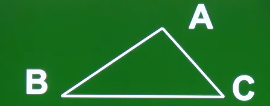

**2、三角形的表示**

​	

三角形用符号“△”表示，如上图的三角形，记作“△ABC”，读作“三角形ABC”.

**3、三角形的顶点**

​	

如上图，△ABC的三个顶点分别时A、B、C.

**4、三角形的边**

​	

如上图，△ABC的三条边分别是：AB、BC、CA。注意： 

* AB等同于BA，即字母先后顺序无要求

* 也可以用一个小写字母表示一条边，但需要在图中标出，如下：

  ​	

   将顶点A的对边标为a，将顶点B对应边标为b，将顶点C对应的边标为c（为清楚，遵循将大写字母对应的边标为相应的小写字母，             但并非强制性要求）

**5、三角形的内角**

如上图，三角形的三个角分别是∠A、∠B、∠C。它的含义如下：

​	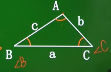

**6、对边、邻边**

​	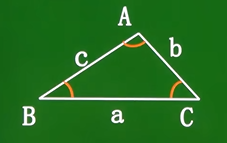

1）对边：将三角形中某个角对应的边称为该角的对边。上图中，∠A的对边为BC或a，∠B的对边为AC或b，∠C的对边为AB或c.

2）邻边：将三角形中某个角相邻的边称为该角的邻边。上图中，∠A的邻边为AB或c、AC或b，∠B的邻边为BA或c、BC或a，∠C的邻边	  为CB或a、CA或b.

**7、三角形的分类**

1）按角分：

* 锐角三角形（三角形的三个角均为锐角，锐角小于90。）
* 直角三角形（三角形中有一个直角，直角等于90。）
* 钝角三角形（三角形中有一个钝角，钝角大于90。)

2）按边分：

* 不等边三角形（三角形的三条边都不相等）
* 等腰三角形（三角形中至少有两个边是相等的，相等的两条边称为这个三角形的腰；如果三角形三边都相等，则为等边三角形，注意等边三角形属于等腰三角形的一种）

**8、三角形的三边关系**

1）三角形任意两边之和大于第三边。（这也说明三条线段要组成一个三角形必须满足任意两条线段的和大于另一条线段）

小窍门：在利用该性质判断给出的三条边是否可以构成三角形时，用较短的两条线段之和与最长的线段比较，若和大，则能组成三角形，反之则不能。

2）三角形任何两边之差小于第三边。（注意：这个差是用大边减小边，它是一个非负数；另外1、2可以相互推）

## 三角形的高

从三角形的一个顶点，向它的对边所在直线做垂线，顶点和垂足之间的线段加做三角形这边上的高，简称三角形的高。

 	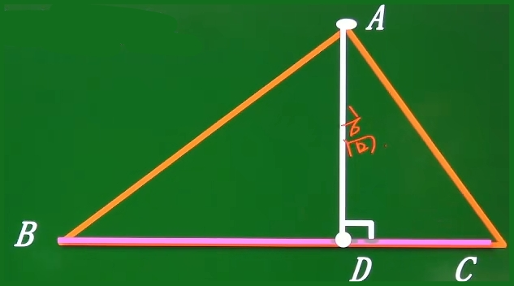

1）三角形的高是一条线段，所以是有长度的。

2）在画三角形的高时需要标明垂直的记号和垂直的符号。

**1、锐角三角形的三条高**

​	

1）锐角三角形的三条高相交于一点，这点位于三角形内。

2）锐角三角形的三条高都在该三角形的内部。

**2、直角三角形的三条高**

​	

1）直角三角形的两条直角边互为对方的高，斜边的高需要单独画出来。上图直角三角形中，线段AB是BC边上的高，线段BC是AB边上的	  高，线段BD是AC边上的高。

2） 直角三角形的三条高相交于直角顶点。上图直角三角形中，它的三条高相交于直角顶点B

3）直角三角形有两条高在该三角形上，有一条高在该三角形内部。

**3、钝角三角形的三条高**

​	

1）在画钝角三角形的高时，需要借助延长线来画。上图钝角三角形中，线段AD是BC边上的高，线段CE是AB边上的高，线段BF是AC边	 上的高。

2）钝角三角形的三条高不相交于一点。

3）钝角三角形的三条高所在直线交于一点，并且相交点位于三角形外部。上图钝角三角形中，将表示高的线段AD、FB、CE无限延长后 	  交于一点。

4）钝角三角形的三条高中，有两条高在三角形外，一条高在三角形内。

共同点：三角形的三条高所在的直线相交于一点。

## 三角形的中线

在三角形中，将顶点与它对边的中点连接起来所构成的线段，叫做这个三角形这边上的中线。

​	

1）上图中，三角形BC边上的中线是线段AD。

2）如果给出了中线，实际就告诉了边的二倍关系。上图中，已知线段AD是BC边上的中线，可知BD = CD = (1/2)BC

3）三角形的三条中线位于三角形的内部，它们相交于一点，并且交点也位于三角形的内部。

## 三角形的角平分线

在三角形中，一个内角的角平分线与它的对边相交，这个角的顶点与交点之间的线段，叫做三角形的角平分线。

​	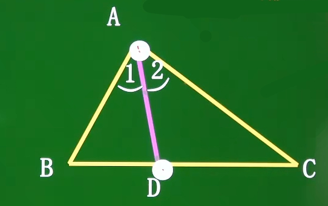

1）上图中，线段AD是∠BAC的角平分线。

2）如果给出了角平分线，实际上就告诉了角的二倍关系。上图中，已知线段AD是∠BAC的角平分线，可知∠BAD=∠CAD=(1/2)∠BAC

3）三角形的三条角平分线位于三角形的内部，它们相交于一点，并且交点也位于三角形的内部。

## 三角形的稳定性

三角形具有稳定性，而四边形具有不稳定性。通过利用三角形的稳定性将四边形划分为三角形，使其变为稳定：

​	

## 三角形的内角和

**1、三角形的内角和及其证明**

三角形的内角和等于180。

​	

证明三角形的内角和等于180。的核心思想是：利用平行线的性质。

1）证明方法1

​	

2）证明方法2

​	

3）证明方法3

​	

**2、三角形内角和的推理**

直角三角形的两个锐角互余。反之，两个锐角互余的三角形是直角三角形。证明如下：

​	

## 三角形的外角

三角形中内角的一边与另一半的反向延长线形成的角，叫做三角形的外角。（外角是内角邻补角）

​	

定理：三角形的一个外角等于与它不相邻的两个内角的和。

定理的推论：三角形的一个外角大于任何一个与它不相邻的内角。

## 多边形及其内角和

**1、多边形**

一般地，由n条不再同一条直线上的线段首尾顺次连接组成的平面图形叫做n变形，又称为多边形。

​	

 表示多边形时，选取某一个顶点，沿着逆时针或顺时针有顺序地遍历每个顶点，然后记为图形。

**2、正多边形**

在平面内，内角都相等，边也都相等的多边形叫做正多边形。

​	

**3、对角线**

连接多边形不相邻的两个顶点的线段，叫做对角线。

​	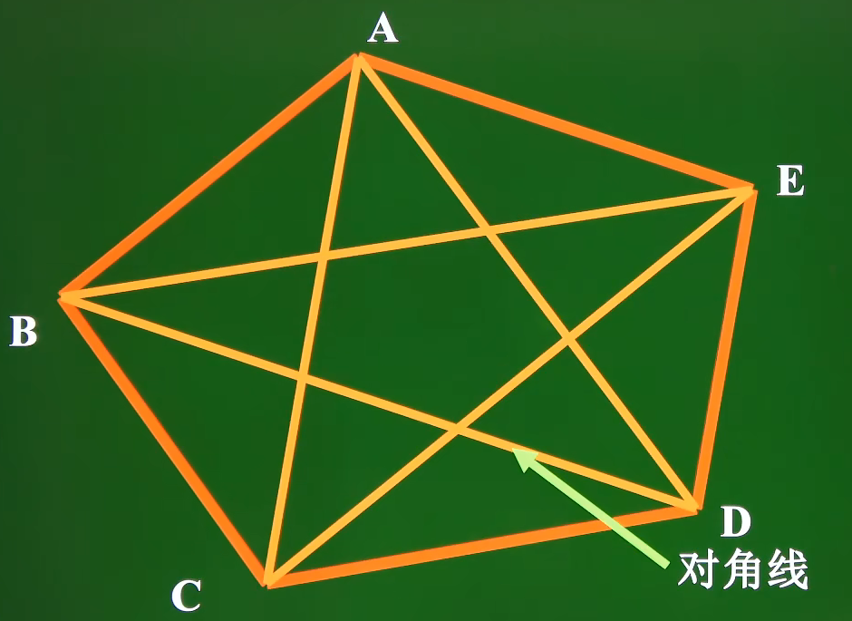

1）从n边形的一个顶点出发可以画出n-3条对角线。

2）通过对一个多边形画对角线，可以得到n-2个三角形，然后利用三角形的内角和定理对这些三角形的内角求总和，可以求出多边形的内角和。

**4、多边形的内角和**

通过对一个多边形画对角线，可以得到n-2个三角形，然后利用三角形的内角和定理对这些三角形的内角求总和，可以求出多边形的内角和。规律如下：

​	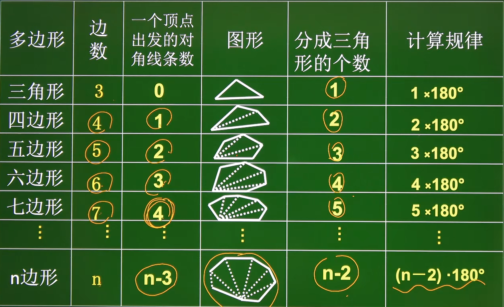

1）n边形中的一个顶点可以画n-3条对角线。

2）从n边形的一个顶点出发画出它的所有对角线，可以将该n边形分成对角线数量+1或n-3-+1个三角形，即在n边形中以一顶点作对角线	 可以得到n-2个三角形。

3）n边形的内角和等于对其中某个顶点作对角线得到的三角形数量 × 180。，即n边形的内角和等于 = (n-2) × 180。

补充：可以在n边形内部任取一个点，然后与n边形的n个顶点相连，可以得到n个三角形，然后利用三角形内角和定理求出所有三角形内角和的总内角和，再减去中间那点的360。，如下：

​		

由此可以得到n边形的内角和公式为：n × 180。- 360。对它进行化简也可以得到：(n-2) × 180。（这种方法在数三角形时好用）

**5、多边形的外角和**

在n边形的每个顶点处各取一个外角，这些外角的和叫做n边形的外角和。n边形的外角和为360。，理由如下：

​	

# 12. 全等三角形

## 全等三角形及其性质

**1、全等形**

能够完全重合的两个图形叫做全等形。

**2、全等三角形**

能够完全重合的两个三角形叫做全等三角形。

​	

1）如果两个三角形全等，比如上面三角形，则记作：△ABC ≌ △DEF，读作：△ABC 全等于 △DEF

2）在全等三角形中，互相重合的顶点称为对应顶点，互相重合的边称为对应边，互相重合的角称为对应角。

注意：在使用≌表示三角形全等时，通常把对应顶点的字母写在对应的位置上。如 △ABC ≌ △DEF可以看出顶点A的对应顶点为顶点D，顶点B的对应顶点为顶点E，顶点C的对应顶点为顶点F。

**3、全等三角形的性质**

1）性质1：全等三角形的对应边相等。

2）性质2：全等三角形的对应角相等。

3）性质3：全等三角形对应角所对的边是对应边。（如果给出两个角是对应角，可知对应的边）

4）性质4：全等三角形对应边所对的角是对应角。（如果给出了两条对应边，可知对应角）

## 全等三角形的判定

1）两个三角形全等，它们的三对对应角、三对对应边分别相等。

2）如果两个三角形三对对应角、三对对应边相等，那么这两个三角形全等。

判定两个三角形全等，不一定需要证明这两个三角形的三对对应角、三对对应边相等，只需满足其中一部分条件即可。方法如下：

（1）SSS（边边边）

（2）SAS（边角边）

（3）ASA（角边角）

（4）AAS（角角边）

（5）HL（斜边、直角边，这是直角三角形特有的判定定理）

**1、SSS（边边边）**

三角形全等判定定理1：三边对应相等的两个三角形全等，简写为：SSS或边边边。

​	

注意：在表示某边等于某边时，并且字母与其对应的字母必须对应顶点关系。如AB=DE，说明A顶点与D顶点是对应顶点，B顶点和E顶点是对应顶点。

总结：证明的书写步骤：

1）准备条件：证全等时要用的间接条件要先证好。

2）三角形全等书写三步骤：（1）写出在哪两个三角形中；（2）摆出三个条件用大括号括起来；（3）写出全等结论。

**2、SAS（边角边）**

三角形全等判定定理2：两边和它们的夹角对应相等的两个三角形全等，简写为：SAS或边角边。

​	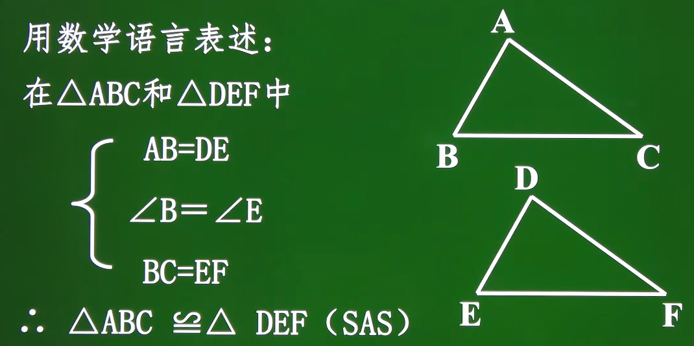

注意：书写条件条件时，按照边-角-边的顺序列出，并且字母与其对应的字母必须对应顶点关系。

**3、ASA（角边角）**

三角形全等判定定理3：两角和它们的夹边对应相等的两个三角形全等，简写为：ASA或角边角。

**4、AAS（角角边）**

三角形全等判定定理4：两角和其中一个角所对的边对应相等的两个三角形全等，简写为：AAS或角角边。（这是ASA角边角的推论，因为两个角相等，利用三角形的内角和可知另外一个角也必然相等，已知三角都对应相等，并且告诉了一条边，这条边就成了夹边，这就满足了ASA定理，所以可以利用ASA定理推出AAS定理） 

**5、HL（斜边、直角边）**

直角三角形是特殊的三角形，所以不仅有一般三角形判定全等的方法：SSS、SAS、ASA、AAS，还有直角三角形特有的判定方法：在直角（RT）三角形中，斜边和某一条直角边对应相等的两个直角三角形全等，简写为：HL或（斜边、直角边）。

## 角的平分线及其性质

1）性质1：角平分线将一个角分成两个大小相同的角。

2）性质2：角平分线上的一点向角的两边所作垂线的距离相等。（不严谨说法：角平分线的点到角的两边的距离相等）

​	

3）性质3：角的内部到角两边距离相等的垂线段的交点一定在角的平分线上。（不严谨说法：角的内部到角两边距离相等的点一定在角平	  分线上）

​	

# 13. 轴对称

## 轴对称

**1、轴对称图形**

如果一个图形沿着一条直线折叠，直线两旁的部分能够互相重合，这个图形就叫做轴对称图形，这条直线即折痕就是它的对称轴。

​	

1）有些轴对称图形的对称轴只有一条，但有的轴对称图形的对称轴不止一条，有的轴对称图形的对称轴甚至有无数条，如圆。

2）对称轴通常画成虚线，是直线，不是线段。

3）如果把一个轴对称图形沿着对称轴分成两个图形，那么这两个图形是全等的。

**2、两个图形关于某直线对称**

把一个图形沿着某一条直线折叠，如果它能够与另一个图形重合，那么就说这两个图形关于这条直线对称，或者说这两个图形成轴对称。同样，我们把这条直线叫做对称轴，折叠后重合的点是对应点，叫做对称点。

​	

成轴对称的两个图形全等。

**3、轴对称图形与两个图形关于某直线对称的区别与联系**

​	

**4、对称点**

关于对称轴对称的点叫做对称点。对称点有无数个。

​	

## 垂直平分线

经过线段的中点并且与该线段垂直的直线，就叫做该线段的垂直平分线，也叫中垂线。（简：垂直于线段中点的直线叫做该线段的垂直平分线或中垂线）

​	

**1、垂直平分线的性质**

线段的垂直平分线的性质如下：

1）线段的垂直平分线将该线段分成两了两个相等的线段，并且形成了两个直角。

2）线段的垂直平分线上的点到这条线段的两个端点的距离相等。（由SAS可推、可证）

3）到线段两端点距离相等的点都在该线段的垂直平分线上。（线段的垂直平分线可以看成是与线段两端点距离相等的所有点的集合）

4）三角形三条的垂直平分线相交于一点，这个点到三角形三个顶点的距离相等。（下图中点P是三个三角形三条边的垂直平分线的交点，	  这里没有画出垂直平分线）

​	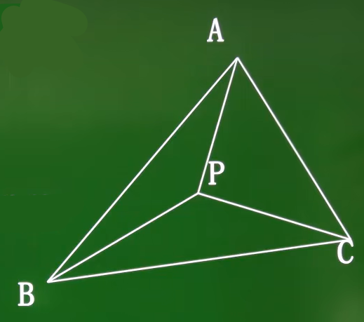

**2、两个图形关于某直线对称的性质**

如果两个图形关于某条直线对称，那么对称轴是任一对对称点所连线段的垂直平分线。

**3、轴对称图形的性质**

轴对称图形的对称轴是任何一对对称点所连线段的垂直平分线。

**4、作垂直平分线**

1）作线段的垂直平分线：由两点确定一条直线和线段的垂直平分线的性质可知，只要作出到线段两端点距离相等的两点，并连接即可（因为到线段两端点距离相等的点都在该线段的垂直平分线上）。

​	

2）轴对称图形的对称轴相当于垂直平分线。对于轴对称图形，只要找到任意一对对称点，作出对称点所连线段的垂直平分线，就得到此	  图形的对称轴。

## 轴对称变换及其作法

**1、轴对称变换**

由一个平面图形得到它的轴对称图形的过程叫做轴对称变换。

1）对原图形进行轴对称得到新图形，新图形与原图形的形状、大小完全一样，只是位置不同。

2）新图形上的每一点，都是原图形上的某一点关于直线l的对称点。

3）连接任意一对对称点的线段被对称轴垂直平分。

**2、作法**

作已知图形关于直线对称的图形的一般步骤：

1）找点。确定图形中一些特殊点。

2）画点。画出特殊点关于已知直线的对称点。

3）连线。

​	

​	

​	

## 利用坐标表示轴对称

点关于x轴对称，则横坐标相同，纵坐标互为相反数。点关于y轴对称，则纵坐标相同，横坐标互为相反数。点关于原点对称，则横纵 	  坐标都互为相反数。（简记：关于哪个轴对称，哪个轴就不变，另一个轴的值互为相反数；如果是圆点对称，两轴值都互为相反数）

## 等腰三角形

**1、等腰三角形**

有两条边相等的三角形叫做等腰三角形。

​	

等腰三角形中，相等的两边都叫做腰，另一边叫做底，两腰的的夹角叫做顶角，腰和底边的夹角叫做底角。

**2、等腰三角形的性质**

1）等腰三角形的两个腰、两个底角相等，简称“等边对等角”。（作垂直平分线，证两三角形全等，然后利用全等三角形的性质可得两底角	 相等）

2）等腰三角形的顶角平分线与底边上的中线，底边上的高互相重合，简称“三线合一”。

## 等边三角形

**1、等边三角形**

三边都相等的三角形是等边三角形。

**2、等边三角形的性质**

1）等边三角形的三边都相等。

2）等边三角形的三个内角都相等，并且每一个角都是60。

注意：等边三角形是特殊的等腰三角形，所以等腰三角形三线和一的性质也适用于等边三角形。

**3、等边三角形的判定方法**

1）三条边都相等的三角形是等边三角形。

2）三个角都相等的三角形是等边三角形。

3）有一个角是60。的等腰三角形是等边三角形。

**4、定理**

在直角三角形中，如果一个锐角等于30。，那么它所对的直角边等于斜边的一半。

​	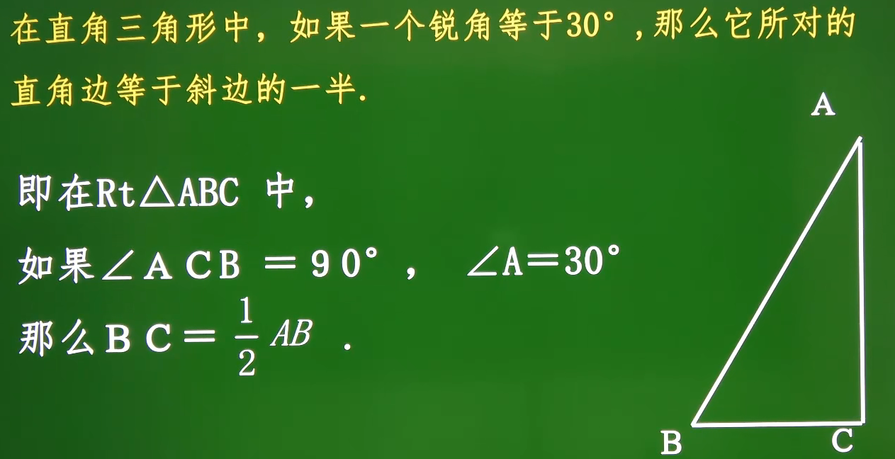

# 14. 整式的乘法与因式分解

## 同底数幂的乘法

**1、乘方（幂）**

an表示n个a相乘，这种运算叫做乘方。其中，a叫做底数，n叫做指数，整个an或an的结果叫做幂。

**2、同底数幂的乘法**

同底数幂的乘法指的是：底数相同的幂的乘法运算。

**3、同底数幂的乘法法则**

同底数幂相乘，底数不变，指数相加。（指数必须都是正整数）

1）代数形式为：am · an = am+n（m、n都是正整数）

2）当底数为多项式的时候，可以把这个多项式看成一个整体。

3）三个及以上的同底数幂相乘时，该法则依然适用。

注意：如果某个负数的指数是奇数，则可以先将负号拿出来，再使用同底数幂的乘法法则进行计算，最后再考虑负号。总之，如果底数不同时，可以想办法将其化为同底数幂。

​	

​	

## 幂的乘方

幂的乘法法则：底数不变，指数相乘。

1）(am)n = amn （m，n都是正整数）

2）a可以是单项式也可以是多项式。

## 积的乘法

**1、积的乘法**

已知一个正方体的棱长为2×103，求该正方体的体积。正方体的体积等于棱长×棱长×棱长，即V = a×a×a = a3，所以可知该正方体的体积为：(2 × 103) 3 。求(2 × 103) 3就是求2×103的积的三次方，这就是积的乘方，其中2×103是积。

**2、积的乘方法则**

积的乘方等于把积的每个因式分被乘方，再把所得的幂相乘。即 (ab)n = anbn（n为正整数）

三个或三个以上的积的乘方仍然可以用积的乘法法则，(abc)n = anbncn（n为正整数）

## 整式的乘法

1）单项式与单项式的相乘法则：单项式与单项式相乘时，把各个单项式中的系数、相同字母分别相乘，对于只在一个单项式里含有的字母，则连同它的指数作为积的一个因式。

2）单项式与多项式的相乘法则：单项式与多项式相乘时，利用乘法分配律，将单项式分别乘以多项式的每一项，再将所得的积相加。即m(a+b+c) = ma+mb+mc

3）多项式与多项式的相乘法则：多项式与多项式相乘，先用一个多项式的每一项分别乘以另一个多项式的每一项，再把所得的积相加。即(a+b+c)(m+n) = am+an+bm+bn+cm+cn

## 同底数幂的除法

同底数幂相除，商的底数不变，指数等于被除数的指数减去除数的指数。即am ÷ an = am-n（a≠0，m、n都是正整数，并且m>n）

1）任何不等于0的数的0次幂都等于1，即a0=1（a≠0）

2）任何不等于0的数的1次幂都等于该数本身，即a1=a（a≠0）

​	

## 整式的除法

1）单项式除以单项式的运算法则：单项式除以单项式时，把系数与同底数幂分别相除作为商的因式，对于只在被除式里含有的字母，则连同它的指数作为商的一个因式。

​	

2）多项式除以单项式的运算法则：多项式除以单项式时，把多项式的每一项分别除以单项式，化成单项式除以单项式的形式，再把所得的商相加。

​	

## 平方差公式

**1、平方差公式**

(a+b)(a-b) = a2-b2，即两个数（或式子）的和与两个数（或式子）的差等于这两个数（或式子）的平方差。

​	

平方差公式的逆用：a2-b2 = (a+b)(a-b) 

**2、平方差公式的几何解释**

​	

注意：

​	

​	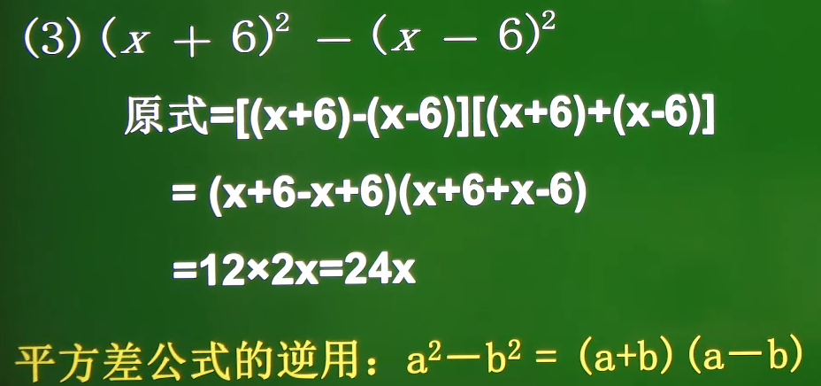

## 完全平方公式

**1、完全平方公式**

完全平方公式包括完全平方和公式与完全平方差公式。

​	(a+b)2 = a2 + 2ab + b2       完全平方和公式：两个数的和的平方，等于它们的平方和，加上它们的积的2倍。

​	(a-b)2 = a2 - 2ab + b2		 完全平方差公式：两个数的差的平方，等于它们的平方和，减去它们的积的2倍。

1）首平方，尾平方，首尾的2倍在中间。

2）公式中的字母a，b可以是数、单项式、多项式。

**2、完全平方和公式的几何解释**

完全平方和公式(a+b)2 = a2 + 2ab + b2的集合解释如下：

​	

**3、完全平方差公式的几何解释**

完全平方差公式(a-b)2 = a2 - 2ab + b2的几何解释如下：

​	

**4、推论**

(a-b)2 = (b-a)2 		  证明：(b-a)2 = -(-b+a)2 = [-(a-b)]2 = (-1)2×(a-b)2 = (a-b)2

(-a-b)2 = (a+b)2		 证明：(-a-b)2 = [-(a+b)]2 = (-1)2×(a+b)2 = (a+b)2

**5、利用添括号法则灵活应用完全平方公式**

添括号法则：添括号时，如果括号前面是正号，括到括号里的各项都不变符号；如果括号前面是负号，括到括号里的各项都改变符号。

## 因式分解

把一个多项式化成了几个整式的积的形式，像这样的式子变形加做这个多项式的因式分解，也叫做把这个多项式分解因式。如下：

​	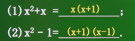

1）因式分解与整式的乘法是逆运算的关系。

​	

2）因式分解有很多方法，如提公因式法、公式法、十字相乘法等等。

3）因式分解的要求：必须进行到每一个多项式都不能再分解为止。

**1、提公因式法**

ma+mb+mc这个多项式中的各项都有一个公共的因式m，我们把因式m叫做这个多项式的公因式。由m(a+b+c) = ma+mb+mc可得：ma+mb+mc = m(a+b+c)，这样就把ma+mb+mc分解成两个因式乘积的形式，像这种分解因式的方法叫做提公因式法。

1）如果一个多项式的各项有公因式，可以把这个公因式提出来，从而将多项式化成两个因式乘积的形式，这种分解因式的方法叫做提公因式法。

2）各项都含有的公共的因式叫做这个多项式各项的公因式。公因式可以是单项式，也可以是多项式。

3）具体方法：在确定公因式前，应从系数和因式两个方面考虑。

* 当各项系数都是整数时，公因式的系数应取各项系数的最大公约数；当各项的系数有分数时，公因式系数为各分数的最大公约数。
* 最大公约数的字母取各项相同的字母，并且字母的指数取次数最低的。
* 如果多项式的第一项为负，要提出负号，使括号内的第一项的系数变为正数，提出负号时，多项式的各项都要变号。

**2、公式法**

如果多项式满足某些公式的特征，则可以将其化成公式的形式，这种因式分解的方法称为公式法。

1）能用平方差公式(a+b)(a-b) = a2-b2分解因式的多项式的特点（即平方差公式的特点）：

* 一个二项式
* 每项都可以化成整式的平方
* 整体来看是两个整式的平方差

2）能利用完全平方公式a2±2ab+b2 = (a±b)2分解因式的多项式的特点（即完全平方公式的特点）：

* 要求多项式有三项
* 其中两项同号，且都可以写成某数或式的平方，另一项是这两数或式的乘积的2倍，符号可正可负。

注意：在使用公式法时，有公因式时，先提公因式，再考虑用公式。

# 15. 分式

## *代数式

有理式和无理式统称为代数式

1）有理式：整式和分式统称为有理式。

2）无理式：带有根号且根号下含有字母的式子叫做无理式。

## 从分数到分式

**1、分式**

一般地，如果A，B表示两个整式，并且B中含有表示未知数的字母，那么式子叫做分式。其中A叫做分式的分子，B叫做分母。

**2、分式的特点**

1）分式是不同于整式的另一类有理式，分母中含有字母时分式的一大特点。

​	

2）在中，分母B≠0，分式才有意义。

3）在时，即满足A=0且B≠0，分式的值为零。

## 分式的基本性质

**1、分数的基本性质**

1）性质1：分数的分子分母同时乘以一个不为0的数，分数的值不变。

​		

2）性质2：分数的分子分母同时除以一个不为0的数，分数的值不变。

​		

**2、分式的基本性质**

与分数的基本性质类似，分式的基本性质如下：

1）性质1：分式的分子分母同时乘以一个不为0的整式，分式的值不变。

​		

2）性质2：分式的分子分母同时除以一个不为0的整式，分式的值不变。

​		

## 分式的约分与通分

**1、分式的约分**

根据分式的基本性质，把一个分式的分子和分母的公因式约去，这种变形称为分式的约分。约分的关键是确定分式中的分子与分母的公因式：

* 公因式的系数应取分子系数和分母系数的最大公约数
* 最大公约数的字母应取分子、分母相同的字母，并且字母的指数取次数最低的。

然后分子分母同时除以公因式进行约分。注意：

1）公因式有可能是多项式。

2）如果分子或分母是多项式，可以先分解因式，再进行约分。

​	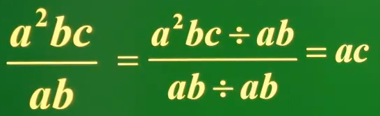

**2、分式的通分**

根据分式的基本性质，把几个异分母的分式分别化成与原来的分式相等的同分母的分式，叫做分式的通分。通分的关键是确定几个分式的最简公分母：

* 取各分式分母系数的最小公倍数
* 取各分式分母中所有因式的最高次幂的乘积

这两者的乘积作为公分母，叫做最简公分母。（也可以将各分式的分母分别相乘，但这样得到的公分母可能不是最简的）

​	

## 分式的乘法法则

**1、分数的乘法法则**

1）分数乘整数时，分母不变，分子乘整数，最后能约分的要约分。

​			

2）分数乘分数时，用分子乘分子，用分母乘分母，最后能约分的要约分。

​	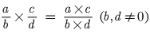

**2、分式的乘法法则**

分式的乘法法则：分式乘分式，用分子的积作为积的分子，分母的积作为积的分母。

​	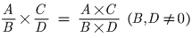

## 分式的除法法则

**1、分数的除法法则**

1）分数除以整数，分母不变，如果分子可以整除整数，则用分子除以整数，否则将整个分数乘以这个整数的倒数，最后能约分的约分。

​				

2）分数除以分数，等于被除数乘以除数的倒数，最后能约分的要约分。

​		

**2、分式的除法法则**

分式的除法法则：分式除以分式，把除式的分子、分母颠倒位置，再与被除式相乘。（除以一个分式，等于乘以这个分式的倒数）

​	

## 分式的乘方与开方

**1、分式的乘方**

计算分式的乘方时：分子的乘方做分子，分母的乘方做分母，可以约分的约分。

​	

**2、分式的开方**

计算分式的开方时：分子开方做分子，分母开方做分母，可以约分的约分。

​	

## 分式的加减

**1、同分母的分数或分式相加减**

同分母的分数或分式相加减，分母不变，分子相加减。

​		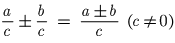

​		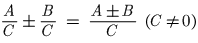

注意：分子是一个整体，先用括号括起来。并且最终的计算结果要化为最简分式。

**2、异分母的分数或分式相加减**

1）异分母的分数加减法则：找出各分数分母的最小公倍数，进行通分，变为同分母的分数，再加减。

​		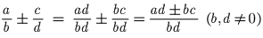

2）异分母的分式加减法则：按照分式的通分规则，把各个分式的分母变为相同的分式，再加减。

​		

## 分式的混合运算

对于分式的混合运算，运算顺序：先乘方、再乘除，然后加减，如果有括号，先算括号里面的。

## 整数指数幂

**1、正整数指数幂**

前面所学的都是正整数幂的运算，正整数幂有以下运算性质：

（1）am · an = am+n （m，n是正整数）

（2）(am)n = amn	（m，n是正整数）

（3）(ab)n = anbn	（n是正整数）

（4）am ÷ an = am-n	（a≠0，m，n是正整数，且m>n）

（5）

**2、负整数指数幂**

​	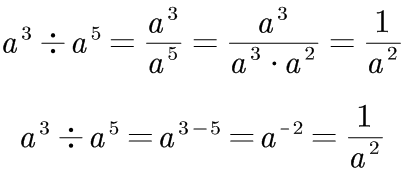

可知：am ÷ an = am-n 这条性质对于m，n是任意整数的情形仍然适用。当n是正整数时，有：

​	

**3、科学计数法的补充**

学完负整数指数幂后，类似地，我们可以利用10的负整数次幂，用科学计数法表示一些绝对值小于1的数，即将它们表示成a×10-n的性质，其中n是正整数，1 ≤ |a| < 10.  例如：

​	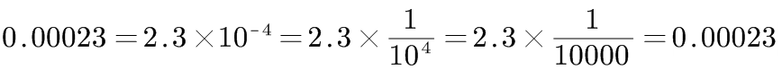

即如果10负整数次幂表示将小数点向左移动n位。

## 分式方程及其解法

**1、分式方程**

​	

像这样分母中含有未知数的方程叫做分式方程。（以前学过的分母中没有不含有未知数的方程叫做整式方程）

**2、分式方程的解法**

一化二解三检验。

1）去分母，将分式方程转换为整式分方程。可采用乘最简公分母法、交叉相乘法

2）解整式方程

3）验根作答

等式两边的分式同时乘以这两个分式的最简公分母，或采用交叉相乘法，这样就将分式方程变成了整式方程，然后解方程即可。比如：

​		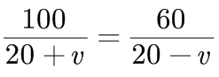

该方程：

（1）两边同时乘以最简公分母 (20+v) (20-v)，

（2）或者使用交叉相乘法，即等号左边分式的分子乘以等号右边分式的分母等于等号左边分式的分母乘以等号右边分式的分子（有些情	      况下交叉相乘法得到的整式方程解起来有一点的难度，此时可以采用最简公分母法）

可得：100(20-v) = 60(20+v)，然后解方程得v=5，解完方程后，需要将解代入方程中，进行检验，因为有时候方程的解在方程中是没有意义的，比如以下方程解得x=5，但分母为0：

​		

此时称方程无解。无解的原因是：分式方程两边同时乘一个零因式后，所得的根是整式方程的根，而不是分式方程的根。

# 16. 二次根式

## 二次根式

**1、二次根式**

把形如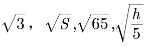用来表示一个非负数的算术平方根的式子，叫做二次根式。

一般地，把形如的式子叫做二次根式，“”称为二次根号。

1）二次根式的被开方数a≥0

2）根指数为2

注意：

* 根号里的不一定是个数，还可以是一个值大于等于0的式子
* 只有中的a≥0时，二次根式才有意义。
* 二次根式具有双重非负性，表现为中a≥0，且整个二次根式的值大于等于0，即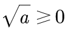

**2、最简二次根式**

1）被开方数不含分母，且分母中不含二次根式；

2）被开方数中不含能开得尽方的因数或因式。

把满足这两个条件的二次根式，叫做最简二次根式。比如：

​	

## 二次根式的性质

性质1：非负数的算术平方根的平方等于它本身。

性质2：

## 二次根式的乘除

**1、二次根式乘法法则**

二次根式与二次根式相乘，等于各被开方数相乘的算术平方根。

​	

反之，积的算术平方根，等于积中各非负因式的算术平方根的积。

​	

**2、二次根式除法法则**

​	

反之，

​	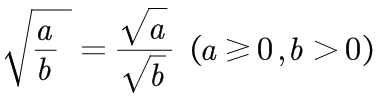

## 二次根式的加减

**1、同类二次根式**

被开方数相同，即为同类二次根式。比如：

​	

只有同类二次根式才可以进行加减运算。但有的二次根式的被开方数不同，我们可以将它们化为最简二次根式，变为同类二次根式后，再进行加减运算。比如：

​	

# 17. 勾股定理

## 勾股定理

**1、问题引入**

​	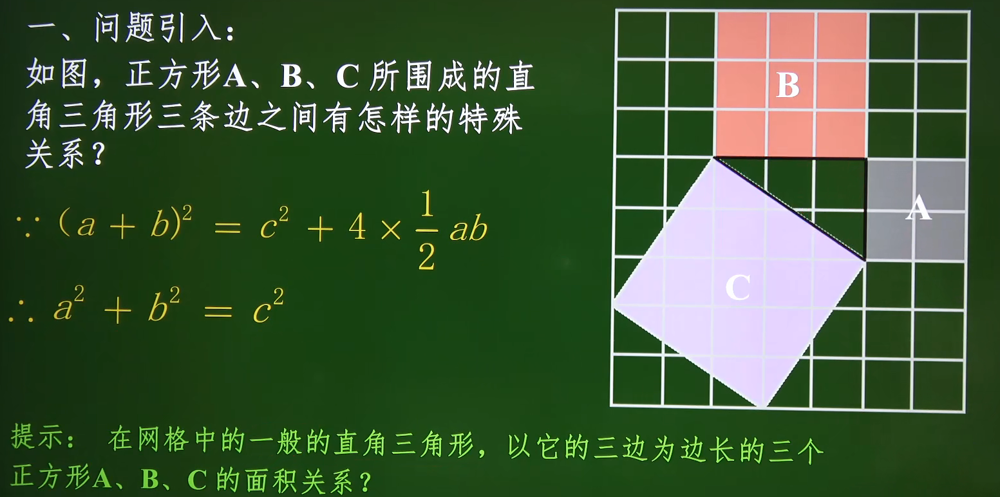

**2、勾股定理**

勾股定理：如果直角三角形两直角边长分别为a、b，斜边长c，那么a2+b2 = c2（两直角边平方的和等于斜边的平方）

​	

