# 21. 一元二次方程

## 一元二次方程

**1、一元二次方程的定义**

方程的等号两边都是整式，只含有一个未知数，且未知数的最高次数是2的方程叫做一元二次方程。（注意：如果等号两边存在分式，该方程就不是一元二次方程）

**2、一元二次方程的一般形式**

一般地，任何一个关于x的一元二次方程，经过整理后，都能化成如下形式：

​	

这种形式叫做一元二次方程的一般形式。其中：ax2是二次项，a是二次项系数；bx是一次项，b是一次项系数；c是常数项。

（注意：要想得到一元二次方程的二次项系数、一次项系数、常数项，必须先得到它的一般形式，因为它们都是根据一元二次方程的一般形式确定的）

**3、一元二次方程的解（根）**

使一元二次方程等号两边相等的未知数的取值，叫做一元二次方程的解，又叫做根。

注意：如果一元二次方程有解，那么解的数量可能是一个（在解是一个的情况下我们有时也称该方程有两个解，并且这两个解相同），也可能是两个。

## 解一元二次方程—直接开平方法

根据平方根的意义，运用直接开平方法求得一元二次方程的解，这种方法叫做直接开平方法。

​	

​	

直接开平方法针对的是形如 (x+m)2=n (n≥0) 的一元二次方程，

* 当n>0时，一元二次方程有两个不相等的实数根。
* 当n=0时，一元二次方程有两个相等的实数根。
* 当n<0时，一元二次方程无解。

## 解一元二次方程—配方法

将一元二次方程转换为 (x+m)2=n (n≥0) 的形式，然后利用直接开平方法对其进行求解，这种方法叫做配方法。配方法的关键配方，方法是：<u>左边常数项的为一次项系数一半的平方</u>，然后利用等式性质对方程进行变形。

​	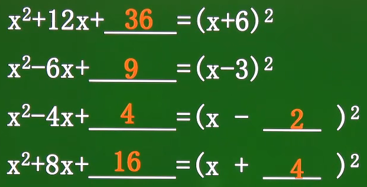

示例如下：

​	

## 解一元二次方程—公式法

用配方法解一般形式的一元二次方程 ax2+bx+c=0(a≠0)，可得：

​		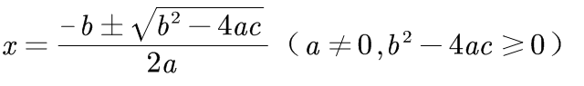

这叫做求根公式，用求根公式解一元二次方程的方法叫做公式法。其中b2-4ac叫做一元二次方程ax2+bx+c=0(a≠0)的判别式，通常用“△”表示它，即△=b2-4ac

1）当△>0时，该一元二次方程有两个不相同的实数根。

2）当△=0时，该一元二次方程有两个相同的实数根。

3）当△<0时，该一元二次方程无解。

求根公式的推导过程如下：

​	

使用公式法解一元二次方程的步骤：

1）将一元二次方程变成一般形式（如果各项系数能够化成整数则化成整数，以方便计算）

2）计算b2-4ac的值，确定根的个数。

3）如果方程有解，利用求根公式计算根。

4）作答。

## 解一元二次方程—因式分解法

用分解因式解一元二次方程的方法称为因式分解法。使用因式分解法解一元二次方程的步骤是：

1）化方程为一般形式。

2）将方程左边因式分解。

3）根据“至少有一个因式为零”，转化为两个一元一次方程。

4）分别解两个一元一次方程，它们的根就是原方程的根。

## 解一元二次方程—十字相乘法

**1、二次项系数为1时**

二次项系数为1时：

* 将二次项x2分解为x与x相乘
* 将常数项分解为两个数相乘，并且这两个数与二次项的两个分解数交叉相乘后，然后相加等于一次项
* 最后水平相加，再将两和相乘。

​	

​	上式中，二次项系数为1，将二次项x2分解为x与x的乘积，将3分解为-1与-3的乘积，将它们交叉相乘然后再相加-1x+-3x=-4x等于一次	项，最后将它们水平相加，再将两和相乘得：(x-1)·(x-3)=0，解得x1=1、x2=3

**2、二次项系数不为1时**

二次项系数不为1时：

* 将二次项分解为系数不同但都带有未知数的两项的乘积
* 将常数项分解为两数相乘，并且这两个数与二次项的两个分解数交叉相乘后，然后相加等于一次项
* 最后水平相加，再将两和相乘。

​	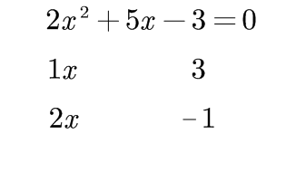

​	上式中，二次项系数不为1，将二次项2x2分解为x与2x的乘积，将-3分解为3与-1的乘积，将它们交叉相乘后再相加-x+6x=5x等于一次	项，最后将它们水平相加，再将两和相乘得：(x+3)·(2x-1)=0，解得x1=-3、x2=1/2

注意：

（1）使用十字相乘法必须先将二元一次方程化为一般形式。

（2）在十字中，各个数的位置是很重要的。

（3）使用十字相乘法时，关键是二次项、常数的分解，如果分解麻烦，可以考虑其他方法求解。

## 一元二次方程的根与系数的关系

如果一元二次方程 ax2+bx+c=0 (a≠0) 的两个实数根是x1、x2，那么：

​	

证明如下：

​	

# 22. 二次函数

## 二次函数

把形如y=ax2+bx+c（a、b、c为常数，a≠0）的函数叫做二次函数，其中x是自变量，a、b、c分别是函数解析式的二次项系数、一次向系数和常数项。

1）二次函数的自变量最高次一定为2，且二次项系数a不能等于0，否则就变成了一次函数；而另外的一次项和常数项不做要求。

2）二次函数y=ax2+bx+c（a、b、c为常数，a≠0）的几种不同表示形式如下：

* y=ax2（a≠0，b=0，c=0）
* y=ax2+bx（a≠0，b≠0，c=0）
* y=ax2+c（a≠0，b=0，c≠0）
* y=ax2+bx+c（a≠0，b≠0，c≠0）

## 描点法

​	

​		可以发现，y=x2的图像是一个开头向上的抛物线图像。、

## 二次函数的抛物线

二次函数的图像如物体抛射时所经过的路线，我们把它叫做抛物线（二次函数的图像都是抛物线，要么是开口向上，要么开口向下）

​		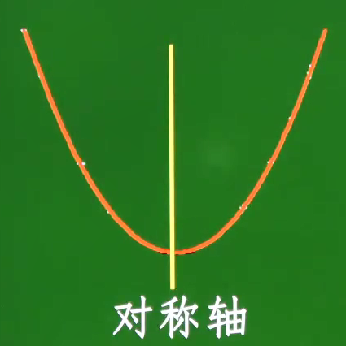

抛物线有如下性质：

1）二次函数的抛物线是对称的，对称轴与抛物线的交点叫做抛物线的顶点。

2）抛物线开口向上时，顶点是最低点，也是该函数的最小值；抛物线开口向下时，顶点是最高点，也是该函数的最大值。

3）抛物线开口向上时（二次项系数a>0），对称轴左边的y值随着x的增大而减小，对称轴右边的y值随着x的增大而增大；抛物线开口向下时（二次项系数a<0），对称轴左边的y值随着x的增大而增大，对称轴右边的y值随着x的增大而减小。

由于二次函数的图像就是抛物线，所以所有二次函数都拥有这些性质。

## 二次函数y=ax^2的图像与性质

1）当a>0时，二次函数y=ax2的对称轴是y轴；顶点是原点，并且顶点是抛物线的最低点；抛物线开口向上；a越大，抛物线的开口越小。

​			

2）当a<0时，二次函数y=ax2的对称轴是y轴，顶点是原点，并且顶点是抛物线的最高点；抛物线开口向下；a越小，抛物线的开口越小。

​			

3）y=ax2与y=-ax2的图像关于x轴对称。

二次函数y=ax2的图像的性质如下：

（1）a>0时，开口向上，顶点是最低点，表示该函数的最小值；a<0时，开口向下，顶点是最高点，表示该函数的最大值；

（2）|a|越大，抛物线的开口越小；

（3）关于y轴对称，即关于x=0对称（使得二次项值为0的x值）；

（4）顶点是原点。

（5）抛物线开口向上时（二次项系数a>0），对称轴左边的y值随着x的增大而减小，对称轴右边的y值随着x的增大而增大；抛物线开口向下时（二次项系数a<0），对称轴左边的y值随着x的增大而增大，对称轴右边的y值随着x的增大而减小。

​		

## 二次函数y=ax^2+k的图像与性质（上下平移）

二次函数y=ax2+k的图像可由y=ax2的图像向上、向下平移得到，

* 当k>0时，即ax2+k，表示向上平移k个单位
* 当k<0时，即ax2-k，表示向下平移k个单位

二次函数y=ax2+k图像的性质如下：

1）当a>0时，开口向上，顶点是最低点，表示该函数的最小值；当a<0时，开口向下，顶点是最高点，表示该函数的最大值；

2）|a|的绝对值越大，开口越小；

3）对称轴是y轴，即直线x=0（使得二次项值为0的x值）；

4）顶点坐标是(0,k)

5）抛物线开口向上时（二次项系数a>0），对称轴左边的y值随着x的增大而减小，对称轴右边的y值随着x的增大而增大；抛物线开口向下时（二次项系数a<0），对称轴左边的y值随着x的增大而增大，对称轴右边的y值随着x的增大而减小。

## 二次函数y=a(x-h)^2的图像与性质（左右平移）

二次函数y=a(x-h)2的图像可由y=ax2的图像向左、向右平移得到，

* 当h<0时，即y=a(x+h)2，表示x轴向左平移h个单位
* 当h>0时，即y=a(x-h)2，表示x轴向右平移h个单位

记为“左加右减”，即左移则加右移则减。二次函数y=a(x-h)2图像的性质如下：：

1）当a>0时，开口向上，顶点是最低点，表示该函数的最小值；当a<0时，开口向下，顶点是最高点，表示该函数的最大值；

2）|a|的绝对值越大，开口越小；

3）对称轴是直线x=h（使得二次项值为0的x值）

4）顶点坐标是(h,0)；

5）抛物线开口向上时（二次项系数a>0），对称轴左边的y值随着x的增大而减小，对称轴右边的y值随着x的增大而增大；抛物线开口向下时（二次项系数a<0），对称轴左边的y值随着x的增大而增大，对称轴右边的y值随着x的增大而减小。

## 二次函数的顶点式y=a(x-h)^2+k的图像与性质（左右上下平移）

二次函数的顶点式如下：

​	

二次函数顶点式是由图像y=ax2向左向右水平移动x-h和向上向下垂直移动+k得到的，图像性质如下：

1）当a>0时，开口向上，顶点是最低点，表示该函数的最小值；当a<0时，开口向下，顶点是最高点，表示该函数的最大值；

2）|a|的绝对值越大，开口越小；

3）对称轴是x=h（使得二次项值为0的x值）

4）顶点坐标为（h, k)

5）抛物线开口向上时（二次项系数a>0），对称轴左边的y值随着x的增大而减小，对称轴右边的y值随着x的增大而增大；抛物线开口向下时（二次项系数a<0），对称轴左边的y值随着x的增大而增大，对称轴右边的y值随着x的增大而减小。

​	

## 二次函数一般式y=ax^2+bx+c的图像与性质

**1、二次函数一般式与顶点式的转换**

对于二次函数的一般式y=ax2+bx+c，计算出它的对称轴和顶点坐标是有点复杂的，而通过二次函数的顶点式却可以轻松计算出对称轴和顶点坐标，所以可以利用配方法将二次函数一般式转换为二次函数顶点式，从而轻松地计算出该二次函数的对称轴和顶点坐标。比如：

​	

其通用方法如下：

​	

从中可以直接得到二次函数一般式的对称轴和顶点坐标公式：

​	

 以后计算二次函数的对称轴和顶点坐标时，可以直接使用该公式计算。

**2、二次函数一般式y=ax2+bx+c（a≠0）的图像和性质**

​		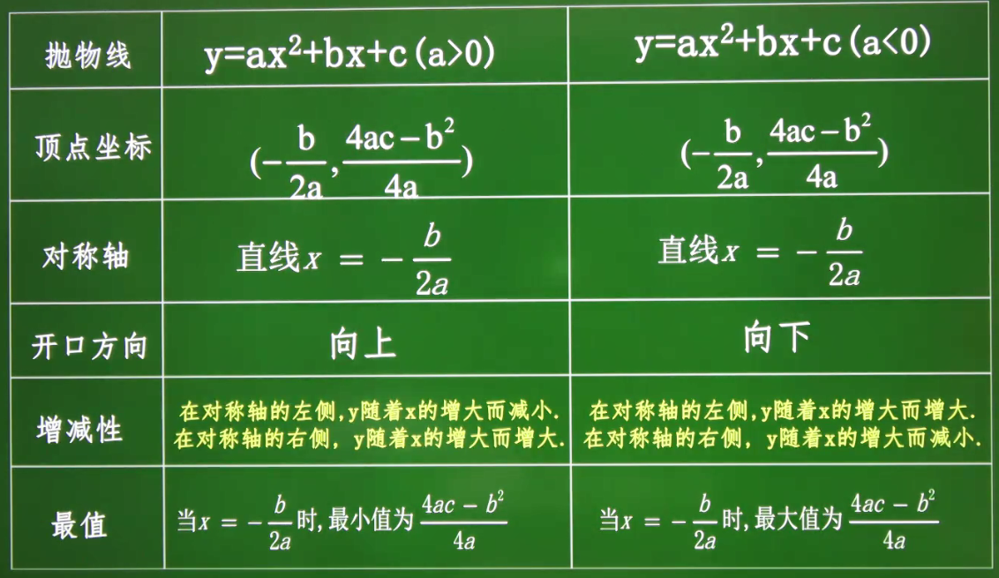

## 二次函数与一元二次方程

当二次函数y=ax2+bx2+c（a≠0）的y取确定的值时，实际上就变成了一元二次方程。例如y取0时可得：0=ax2+bx2+c（a≠0），该一元二次方程的不同解的个数就是该二次函数的图像与x轴交点的个数。

​	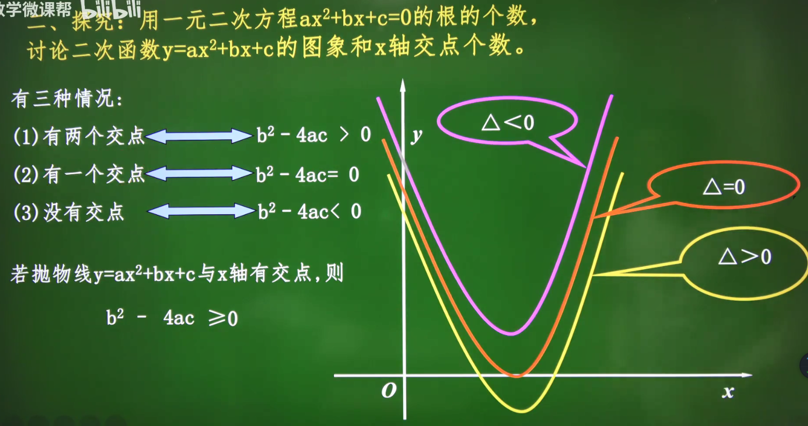

​	

# 23. 旋转

## 旋转的定义与基本性质

**1、旋转的定义**

把一个图形绕着某一定点O转动一定角度的图形变换叫做旋转，这个定点O叫旋转中心，转动的角叫做旋转角，如果图形上的点P经过旋转变为点P'，那么点P和P'叫做这个旋转的对应点。

​	

**2、旋转的基本性质**

旋转的基本性质如下：

（1）旋转前、后的图形全等。

（2）对应点到旋转中心的距离相等。

（3）每一对对应点与旋转中心所连线段的夹角等于旋转角。

## 中心对称

把一个图形绕着某一个点旋转180。，如果它能够与另一个图形重合，那么就说这两个图形关于这个点对称或中心对称，这个点叫做对称中心。这两个图形中的对应点叫做关于中心的对称点（对称点有无数对）。例如下图中△OCD和△OAB关于点O对称，点C与点A是关于点O的对称点：

​	

性质：

（1）关于中心对称的两个图形，对称点所连线段经过对称中心，并且被对称中心所平分。（多条对称点所连线段的交点就是对称点）

（2）关于中心对称的两个图形是全等图形。

## 中心对称图形

**1、中心对称图形**

把一个图形绕着某一个点旋转180。，如果旋转后的图形能够与原来的图形重合，那么这个图形叫做中心对称图形，这个点就是它的对称中心。

**2、中心对称与中心对称图形的区别与联系**

中心对称与中心对称图形是两个既有联系又有区别的概念。

1）区别：中心对称图形指两个全等图形的相互位置关系，中心对称图形指一个图形本身成中心对称。

2）联系：

* 如果将中心对称的两个图形看成一个整体，则它们是中心对称对称图形。
* 如果将中心对称图形对称的两个部分看成两个图形，则它们成中心对称。

## 点的对称

在平面直角坐标系中：

（1）关于x轴对称的两点，横坐标相同，纵坐标互为相反数

（2）关于y轴对称的两点，纵坐标相同，横坐标互为相反数

（3）关于原点对称的两个点，它们的横坐标纵坐标均互为相反数

​	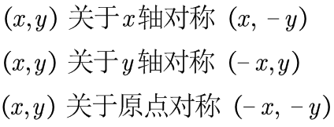

# 24. 圆

## 认识圆

如图，在一个平面内，线段OA绕它固定的一个端点O旋转一周，另一个端点A所形成的图形叫做圆。

​	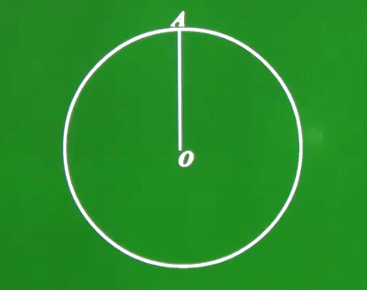

其中，固定的端点O叫做圆心，线段OA叫做圆的半径，以点O为圆心的圆，记作“⊙O”，读作“圆O”。

1）圆上的点到定点（圆心O）的距离都等于定长（半径r）

2）到定点（圆心O）的距离等于定长（半径r）的点都在同一个圆上.

归纳：圆心为O，半径为r的圆可以看成是所有到定点O的距离等于定长r的点的集合。

## 与圆有关的概念

​	

1）弦：连接圆上任意两点的线段叫做弦。如图中的AC

2）直径：经过圆心的弦叫做直径。如图中的AB

3）弧：圆上任意两点间的曲线部分叫做圆弧，简称弧。以A、B为端点的弧记作，读作“圆弧AB”或“弧AB”。（注意：在表示弧时，字母顺序无要求，弧AB与弧BA是同一条弧。）

4）半圆：原的任意一条直径的两个端点把圆分成两条等长的弧，每一条弧都叫做半圆。

5）劣弧：小于半圆的弧叫做劣弧。如图中的

6）优弧：大于半圆的弧叫做优弧，用三个字母表示。如图中的

7）同心圆：圆心相同的圆，称为同心圆。

8）等圆：能够重合的圆叫做等圆。

9）等弧：在同圆或等圆中，能够互相重合的弧叫做等弧。

10）弦心距：圆心到弦的垂线段的长度称为这条弦的弦心距。

11）圆心角：顶点在圆心的角称为圆心角，圆心角会产生该圆心角所对的弧、该圆心角所对的弦。

12）圆周角：角的顶点在圆上，并且角两边都和圆相交，这样的角叫做圆周角。

13）同圆：相同的圆。

14）同弧：相同圆中的相同的弧。

## 垂径定理及其推论

垂径定理：垂直于弦的直径平分这条弦，并且平分弦所对应的两条弧。

​	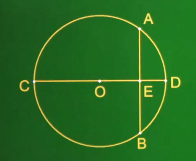

垂径定理的推论：

1）平分弦（不能是直径）的直径一定垂直于该弦，并且平分该弦所对的两条弧。

2）圆的两条平行弦所夹的弧相等。

​	

小诀窍：关于弦的问题，常常需要经过圆心作弦的垂线段（可以是直径也可以是弦心距线段），这是一条非常重要的辅助线。

## 圆心角、弧、弦

顶点在圆心的角称为圆心角，圆心角会产生该圆心角所对的弧、该圆心角所对的弦。有：

1）定理：在同圆或等圆中，相等的圆心角所对的弧相等、所对弦相等。

2）推论1：在同圆或等圆中，如果两条弧相等，那么它所对的圆心角相等，所对的弦相等。

3）推论2：在同圆或等圆中，如果两条弦相等，那么它所对的圆心角相等，所对的弧相等。

即：在圆心角、弧、弦中，只要它们其中一个量相等，就可以确定另外两个量也是相等的。

## 圆周角定理

角的顶点在圆上，并且角两边都和圆相交，这样的角叫做圆周角。

​	

圆周角定理：一条弧所对的圆周角等于它所对的圆心角的一半。

推论：

（1）同弧或等弧所对的圆周角相等；在同圆或等圆中，相同的圆周角所对的弧相等。

（2）半圆（或直径）所对的圆周角是90。；90。的圆周角所对的弦是直径。

（3）如果三角形一边上的中线等于这条边的一半，那么这个三角形是直角三角形。

## 点和圆的位置关系

**1、点和圆的位置关系**

设⊙O的半径为r，点P到圆心的距离OP=d，则有：

1）点P在⊙O内  **↔**  d<r

2）点P在⊙O上 **↔**  d=r

3）点P在⊙O外 **↔**  d>r

​		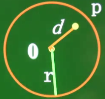				

**2、点与圆**

1）平面上有一点A，经过已知点A的圆有无数个，圆心为点A以外的任意一点，半径为这点与点A的距离。

2）平面上有两点A、B，经过已知点A、B的圆有无数个，它们的圆心在线段AB的垂直平分线上，以线段AB的垂直平分线上的任意一点为圆心，以这点到A或B的距离为半径作圆。

3）平面上有不共线（不在一条直线上）的三点A、B、C，经过A、B、C三点的圆只有1个，圆心为任意两条线段的垂直平分线的交点，半径为圆心到A或B或C点的距离。

​		

结论：不在同一条直线上的三个点确定一个圆。

**3、三角形与圆**

由不在同一条直线上的三个点确定一个圆，可知：经过三角形三个顶点可以画一个圆，并且只能画一个，这个圆叫作该三角形的外接圆，三角形外接圆的圆心叫做这个三角形的外心，这个三角形叫做这个圆的内接三角形。

​	

三角形的外心到三角形各个顶点的距离都相等。

## 直线和圆的位置关系

**1、直线和圆的位置关系**

1）直线与圆有两个公共点时，叫做直线和圆相交，这时直线叫做圆的割线。

2）直线和圆有唯一公共点时，叫做直线和圆相切，这时直线叫做圆的切线，唯一的公共点叫做切点。

3）直线和圆没有公共点时，叫做直线和圆相离。

​			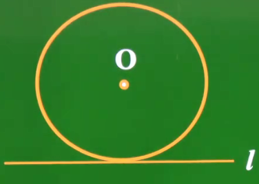		

**2、直线和圆位置关系的距离**

用圆心到直线的垂直距离d与该圆半径r的大小关系，来刻画直线与圆的距离。

1）直线l和⊙O相交  **↔**  d<r

2）直线l和⊙O相切  **↔**  d=r

3）直线l和⊙O相离  **↔**  d>r

​					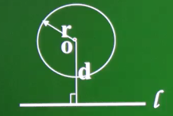

**3、直线与圆的位置关系的判定方法**

判定直线与圆的位置关系的方法有两种：

1）根据定义，由直线与圆的公共点的个数来判断；

2）根据性质，由圆心到直线的垂直距离d与半径r的大小关系来判断。

​	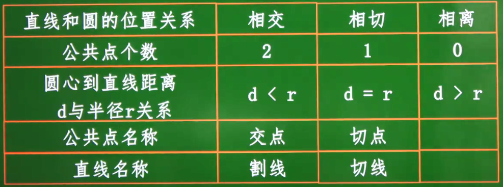

## 切线及其判定

**1、切线**

经过半径的外端并且垂直于这条半径的直线是圆的切线。

​	

几何语言：  ∵ OA⊥l且A是半径外端	 ∴ l是⊙O的切线

**2、切线的性质定理**

圆的切线垂直于过切点的半径。如下图直线l垂直于过切点的半径OA：

​	

**3、内切圆和内心的定义**

与三角形各边都相切且位于三角形内部的圆叫做三角形的内切圆。内切圆的圆心是三角形三条角平分线的交点，叫做三角形的内心。

​	

**4、过圆外一点作圆的切线**

过⊙O外一点可以作该圆的两条切线。作法如下：

1）连接圆心O与圆外点P，构成一条线段。

2）找出OP线段的中点，然后以点P为圆心，以二分之一的OP长度为半径作一个大圆。

3）大圆与小圆相交两点A、B

4）连接OA和OB，OA⊥AP，AP为切线，OB⊥BP，BP为切线。

​	

**5、切线长**

在经过圆外一点的切线上，这一点和切点之间的线段叫做这点到圆的切线长。如下图中的线段PA、PB

​	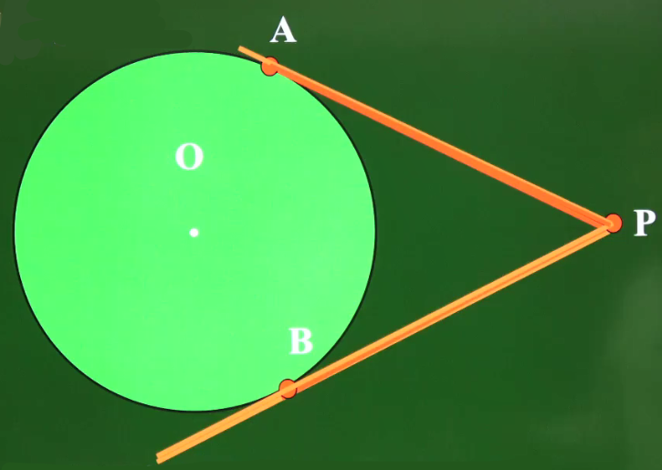

注意：切线是一条与圆相切的直线，不能度量。而切线长是线段的长，这条线段的两个端点分别是圆外一点和切点，可以度量。

切线长定理：从圆外一点引圆的两条切线，它们的切线长相等，圆心和这一点的连线平分该点两条切线的所形成的夹角。

​	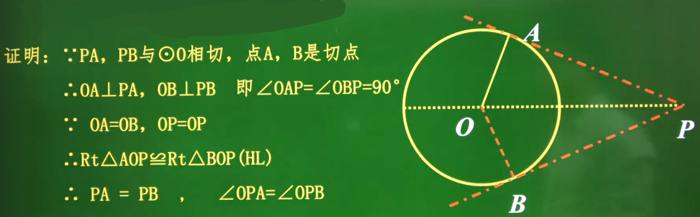

几何语言：∵ PA、PB分别切⊙O于A、B， ∴ PA=PB，OP平分∠APB

**6、圆的外切四边形**

圆的外切四边形的两组对边的和相等。

​	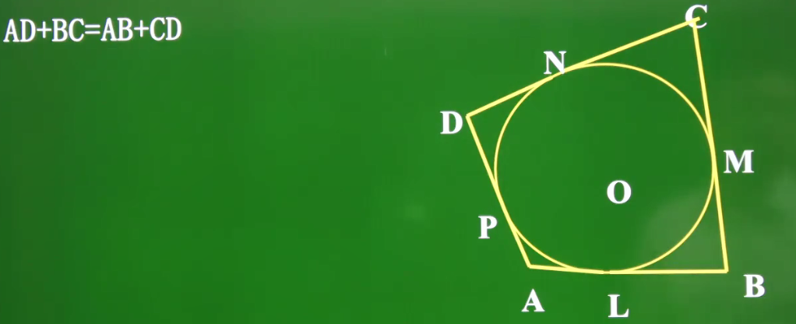

## 圆和圆的位置关系

**1、圆和圆的位置关系**

圆和圆的位置关系分为相离、相切、相交三种。

1）相离：没有公共点；相离又分为外离、内含（内含包括了同心圆的情况）两种情况。

​	

2）相切：有一个公共点；相切又分为外切、内切两种情况。

​	

3）相交：有两个公共点。

​	

**2、连心线与圆心距**

连接两个圆心的直线叫做连心线，如果有切点则连心线一定过切点。下图中直线O1O2是连心线且过切点T。

两圆心之间的距离叫做圆心距，记作：O1O2=d。

​	

两圆外切时，整个图形是轴对称图形，对称轴是连心线，连心线过切点。

**3、使用圆心距刻画圆和圆的位置关系**

d表示圆心距，R表示大圆的半径，r表示小圆的半径。有：

（1）外离

​		

（2）外切

​		

（3）内切

​		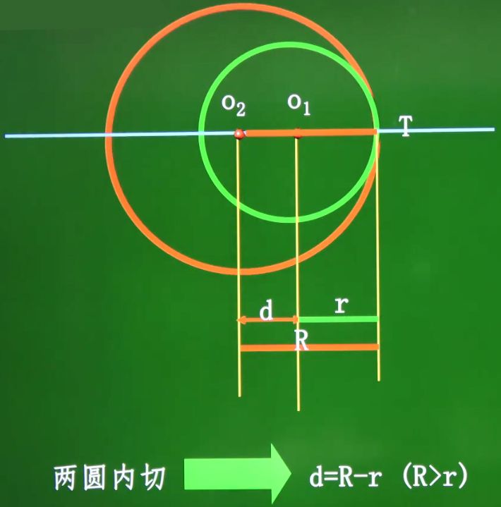

​		如果没告诉哪个是大圆半径和哪个是小圆半径，可以使用绝对值表示：d=|R-r|

（4）相交

​		

（5）内含

​		

结论：

​	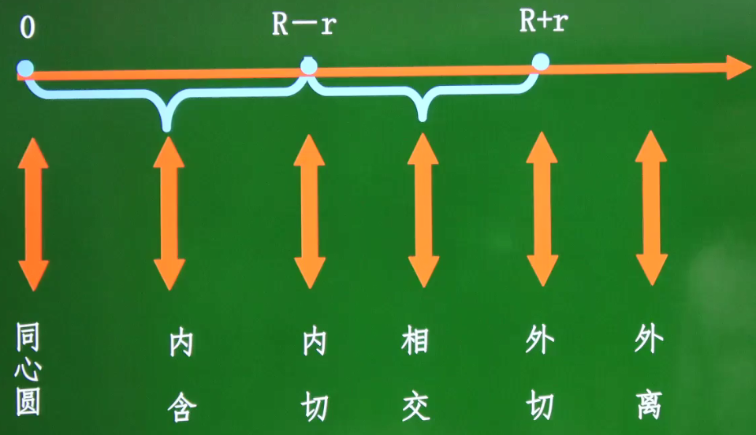

## 正多边形和圆

**1、正多边形**

各边相等，各角也相等的多边形叫做正多边形。

​	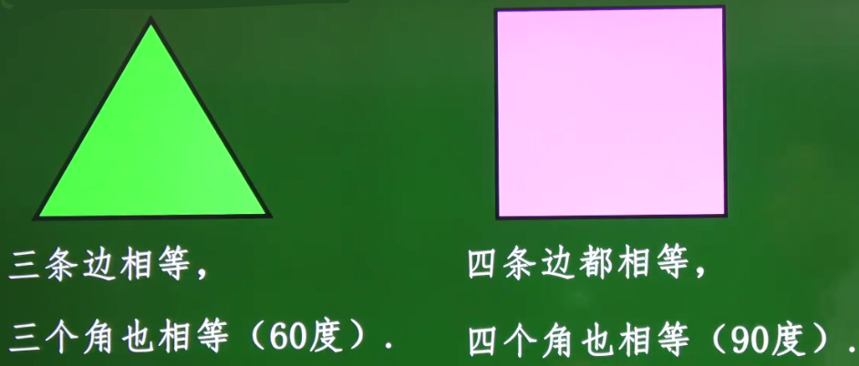

正n边形：如果一个正多边形有n条边，那么这个正多边形叫做正n边形（n≥3）。

**2、正多边形和圆**

圆的内接正n边形与圆的外切正n边形把圆分成n（n≥3）等份。

1）依次连接各分点所得的多边形是这个圆的内接正n边形；而这个圆称为正n边形的外接圆。

​		

2）经过各分点所作圆的切线，以相邻切线的交点为顶点的多边形是这个圆的外切正n边形，而这个圆称为正n边形的内切圆。

​		

**3、正多边形的相关概念**

正多边形的中心：一个正多边形的外接圆的圆心。

正多边形的半径：外接圆的半径。

正多边形的中心角：正多边形的每一条边所对的圆心角。

正多边形的边心距：中心到正多边形的一边的垂直距离。

​	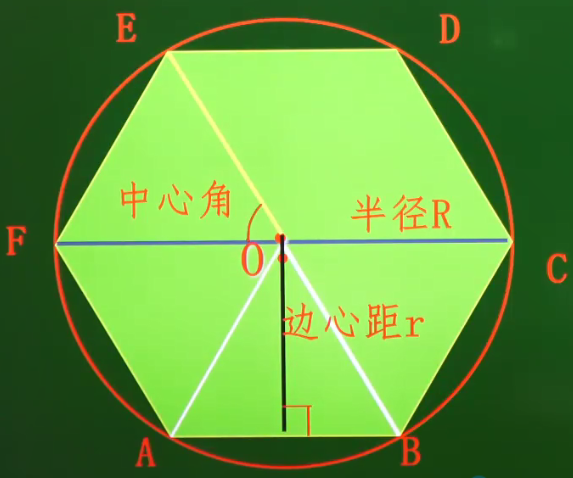

## 弧长和扇形面积

**1、弧长公式**

若圆的半径为r，则n。圆心角所对的弧长l为： 

​	

递推过程如下：

（1）半径为r的圆的周长为：

​		

（2）1。圆心角所对的弧长为：

​		

（3）n。圆心角角所的弧长为：

​		

**2、扇形面积公式**

由组成圆心角的两条半径和圆心角所对的弧所围成的图形叫扇形。若圆半径为r，则扇形面积公式为：

​	

递推过程如下：

（1）半径为r的圆的面积为：

​			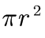

（2）1。圆心角所对的扇形面积为：

​			

（3）n。圆心角所对的扇形面积为：

​			

**3、弧长与扇形面积的关系**

弧长公式为：

​	

扇形面积公式为：

​	

则用弧长表示扇形面积的公式为：

​	

## 圆锥及其面积公式

**1、圆锥**

圆锥可以看做是一个直角三角形绕着它的一条直角边旋转一周所成的图形。

**2、圆锥的相关概念**

​	

（1）母线：连接圆锥顶点与底面圆周上的任意一点的线段叫做圆锥的母线。圆锥的母线有无数条。

（2）高：连接圆锥顶点与底面圆心的线段叫做圆锥的高。

（3）侧面：由直角三角形旋转时斜边所成的一个曲面。

（4）底面半径：底面圆的半径。

（5）底面：圆锥的底面，它是一个圆。

（6）圆锥的轴截面：直角三角形围绕高旋转时所形成的一个面，如上图中的△ABC。轴截面有无数个。

**3、圆锥的底面半径、母线及其高的关系**

设圆锥的底面半径为r，母线长为l，高为h，它们满足勾股定理，有：l2=r2+h2

​		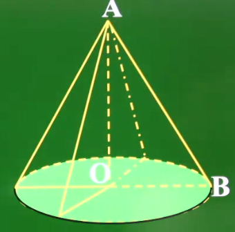

即：OA2+OB2=AB2

**4、圆锥的侧面积与全面积**

1）圆锥的侧面展开后是一个扇形。如图，设圆锥的母线长为l，底面半径为r：

​		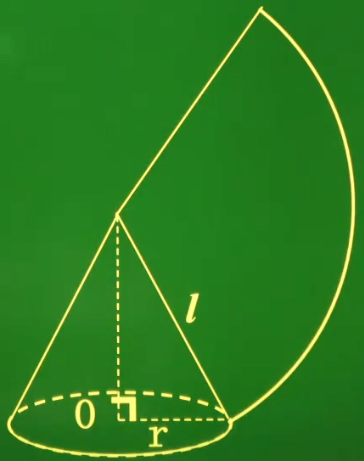

可知该扇形的半径为母线l；弧长是根据底面圆周展开的，所以弧长为底面圆的周长，即弧长为2πr。已知半径和弧长，可知圆锥侧面扇形的面积公式为：

​	

注意：这里的l表示的是圆锥的母线，也是扇形的半径，而不是表示弧长。

2）圆锥的全面积等于该圆锥的侧面积加上底面的面积：

​	

# 25. 概率初步

## 随机事件

一定条件下：

* 必然发生的事件叫必然事件；
* 必然不会发生的事件叫不可能事件；
* 可能会发生，也可能不发生的事件叫不确定事件或随机事件。

一般地，随机事件发生的可能性是有大小的，不同的随机事件发生的可能性的大小有可能不同。

​	

## 概率

**1、概率**

一般地，随机事件A发生的可能性是有大小的，我们把刻画其发生可能性大小的数值，称为随机事件A发送的概率，记为：P(A)

注意：事件一般用大写英文字母A，B，C...表示。

**2、概率的计算方法**

一般地，如果在一次试验中，有n种可能的结果，并且它们发生的可能性相等，事件A包含其他的m种结果，那么事件A发生的概率P(A)为：

​	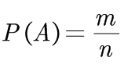

注意：在n种可能的结果中，事件A发生的频数m满足0≤m≤n，两边同时除以n，所以有：

​	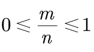

因此0≤P(A)≤1。

（1）当m=n时，A为必然事件，概率P(A)=1

（2）当m=0时，A为不可能事件，概率P(A)=0

​	

## 计算概率—列举法

1）当随机事件发生的可能性是有限的等可能时，我们可以直接使用列举法来计算概率。

​		

2）如果随件事件发生的可能性依赖于多个事物时，我们可以借助列表来计算概率。

​		

​		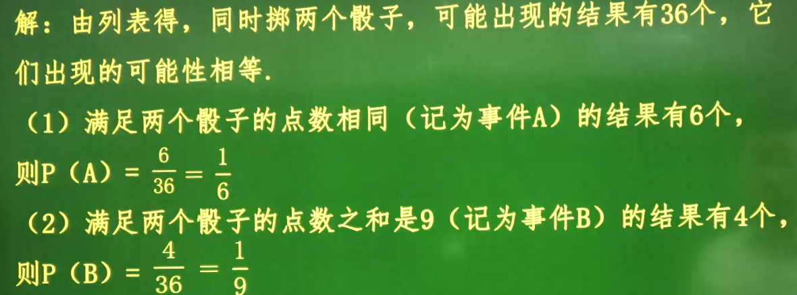

3）当随件事件发生的可能性依赖于多个事物时，除了可以借助列表来计算概率，还可以借助树状图来计算概率。

​		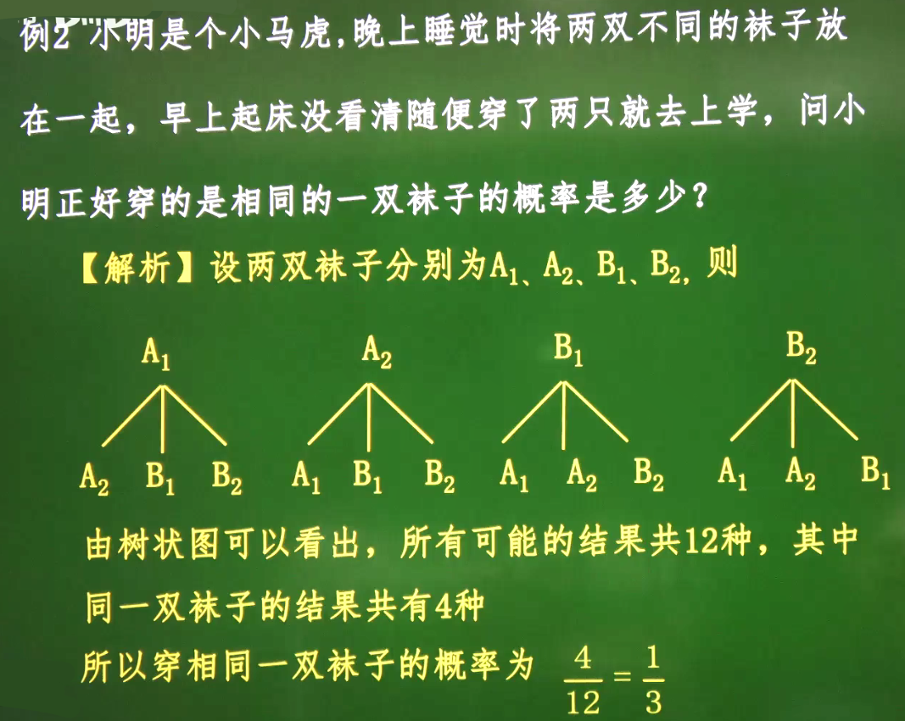

## 计算概率—频率估计法

一般地，在大量重复试验中，如果事件A发生的频率稳定在某个常数p附近，那么这个常数p就叫做事件A的概率，记为P(A)=p。

​	

由上图可知，抛硬币正面向上的频率稳定在0.5附近，所以可知抛硬币正面向上的概率为二分之一。

# 27. 图形的相似

## 图形的相似

1）把形状相同的图形叫做相似图形。

​		

2）相似多边形：边数相同的两个多边形，若对应角相等，对应边成比例，则这两个多边形相似。

​	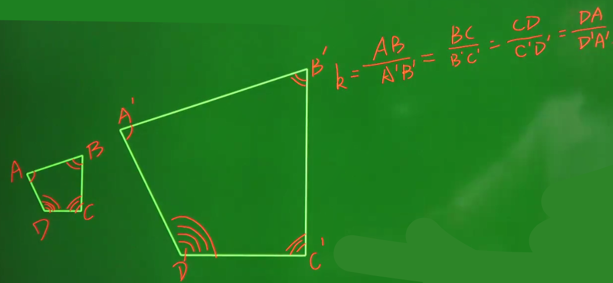

3）相似比：相似多边形对应边的比称为相似比。（相似比为1时，相似的两个图形全等）

​	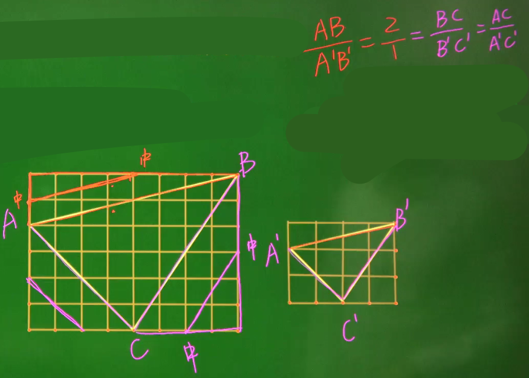

4）比例线段：对于四条线段，a、b、c、d，如果其中两条线段的比（即它们长度的比）与另两条线段的比相等，如a:b=c:d（即ad=bc），我们就称这四条线段是成比例线段，简称比例线段。

## 相似三角形

​	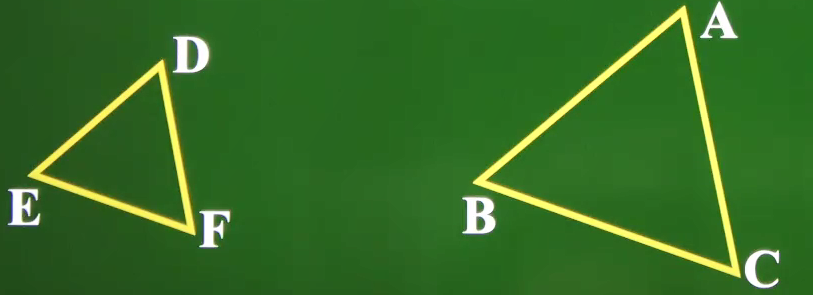

如果两个三角形的对应角相等，对应边的比也相等：

​	

则△ABC与△DEF相似，记作△ABC∽△DEF，相似比为k。（注意：△ABC∽△DEF意为着A的对应点是D，B的对应点时E，C的对应点时F，它们的对应顺序不能乱）

## 平行线分线段成比例定理及其推论

平行线分线段成比例定理：三条平行线截两条直线所得的对应线段的比相等。

​	

推论：平行于三角形一边的直线截其他两边（或两边的延长线）所得的对应线段成比例。

​	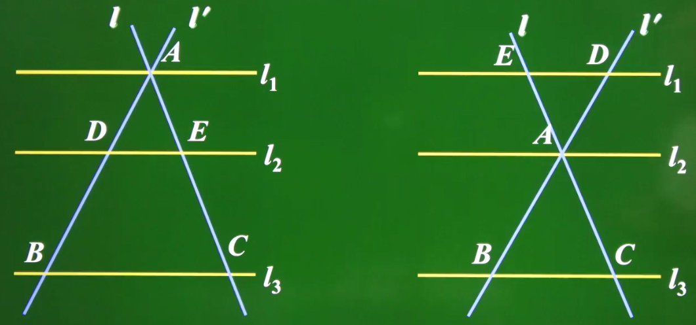

## 相似三角形的判定

判断两个三角形是否相似，有以下4种方法：

方法1：通过定义判定，三个角对应相等，三边对应成比例的两个三角形相似。

方法2：三边对应成比例。

方法3：平行于三角形一边的直线。

方法4：两边对应成比例且夹角相等。

方法5：通过两角对应相等。

**1、定义法**

如果一个三角形的三条边和另一个三角形的三条边对应成比例，并且三个角也对应相等，那么这两个三角形相似。（定义法不常用，因为它要找出所有条件，但判定三角形相似与判定三角形全等类似，并不需要找出所有条件）

**2、三边法**

如果一个三角形的三条边和另一个三角形的三条边对应成比例，那么这两个三角形相似。（三边对应成比例，两三角形相似）

​	

**3、平行线法**

平行于三角形一边的直线与其他两边（或延长线）相交，所得的三角形与原三角形相似。（利用平行线分线段等比例定理推）

​	

**4、两边夹角法**

如果一个三角形的两条边与另一个三角形的两条边对应成比例，并且夹角相等，那么这两个三角形相似。（两边对应成比例且夹角相等，两三角形相似。

​	

注意：如果是判断两个直角形是否相似时，当斜边和一条直角边成比例时，这两个直角三角形相似。

**5、两角相等法**

两个三角形的三个角对应相等，可以得出：三个角分别对应相等的两个三角形相似。但实际上，可以将其写为：两个角分别对应相等的两个三角形相似（因为两个角分别对应相等，根据三角形内角和定理，另外一个角也一定对应相等）

​	

## 相似三角形的性质

1）相似三角形周长的比等于相似比。证明如下：

​		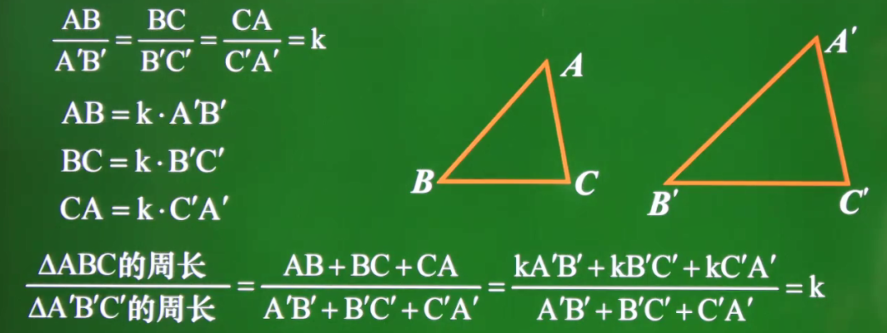

​		推论：两个相似多边形周长的比也等于相似比。

2）相似三角形的对应高线之比，对应角平分线之比，中线之比，都等于相似比。

3）相似三角形面积的比等于相似比的平方。

​		

​		推论：相似多边形面积的比等于相似比的平方。
