# 1. 有理数

## 正数与负数

1）0既不是正数，也不是负数，它是正数和负数的分界。

2）0是整数。


## 有理数

整数和分数统称为有理数。（由于整数和分数都可以表示为小数的形式，所以有时也称有限小数及无限循环小数为有理数）

1）整数。整数又分为正整数、0、负整数。

2）分数。分数又分为正分数、负分数。

注意：小数分为有限小数、无限循环小数、无限不循环小数。其中，有限小数和无限循环小数可以写成分数的形式，所以属于有理数；而无限不循环小数属于无理数。（初中阶段中将小数归为了分数）

​	


## 数轴

**1、数轴三要素**

数轴的三要素包括：原点、正方向、单位长度。

1）原点。在直线上任取一个点表示数0，这个点叫做原点。

2）正方向。通常规定直线上从原点向右（或上）为正方向，从原点向左（或下）为负方向。

3）单位长度。选取适当的长度作为数轴单位长度。

​	

**2、画数轴的四个步骤**

1）画一条直线。

2）在直线上选取一点作为原点0。

3）确定正方向，并用箭头表示。

4）根据需要选取适当的单位长度。


## 相反数

**1、认识相反数**

1）像-2和2，5和-5这样，只有符号不同的两个数叫做互为相反数。

2）一般地，a与-a互为相反数；特别地，0的相反数是0。

**2、求某个数的相反数**

1）求某个数的相反数，只需要在该数前面添加“-”负号即可。例如-5的相反数为-(-5)等于5，2的相反数为-(2)等于2。

2）在某个数的前面添加“+”正号，表示这个数本身。例如+(-4)等于-4，+(+12)等于12。

3）a-b的相反数是b-a。


## 绝对值

1）一般地，数轴上表示数a的点与原点的距离叫做数a的绝对值（数a可以是正数、负数、0），记作|a|。例如，-8的绝对值记作|-8|，绝对	 值等于8。（绝对值的几何意义）

2）正数的绝对值是它本身；负数的绝对值是它的相反数；0的绝对值是0。（绝对值的代数意义）

​		

提示：互为相反的两个数，它们的绝对值是相等的。例如-8与8互为相反数，它们的绝对值|-8|=8，|8|=8，因为它们与原点的距离是一样的。


## 有理数的大小比较

1）在数轴上的两点，右边的点表示的数比左边点表示的数要大，反过来，左边的点表示的数比右边的点表示的数要小，即左边的数<右边的数。（也适用于多个树的大小比较）

2）负数小于0，0大于负数；正数大于0，0小于正数。

3）负数小于正数，正数大于负数。

4）一个数与0比较，要考虑这个数的正负：正数大于0，0大于负数。

5）异号两数比较，要考虑这两个数的正负：正数大于负数。

6）同号两数比较，要考虑这两个数的绝对值：对于两个正数，绝对值大的数大；对于两个负数，绝对值大的反而小。

7）多个有理数比较，适合用数轴。数轴上的点表示的数左边的小，右边的大。

注意：需要化简时，先化简在比较大小。


## 有理数的加法

**1、有理数加法法则**

1）同号两数相加，取相同的符号，并把绝对值相加。例如-4与-5相加，等于-(4+5)=-9。

2）异号两数相加时：

* 若两数的绝对值不相等，取绝对值较大的数的符号，并用较大的数的绝对值减去较小的数的绝对值，例如（+5）+（-9），等于-（9-5）=-4；
* 若两数的绝对值相等，则结果为0（互为相反的两个数相加为0）。

3）一个数同0相加仍得这个数。

**2、有理数加法的交换律、结合律**

在有理数运算中，加法交换律和加法结合律仍适用。

1）加法交换律：两个数相加，交换加数的位置，和不变。表示成：a+b = b+a

2）加法结合律：三个数相加，先把前两个数相加，或者先把后两个数相加，和不变。表示成：(a+b)+c = a+(b+c)

一般地，任意若干个数相加，无论各数相加的先后次序如何，其和不变。


## 有理数的减法

1）有理数减法法则：减去一个数，等于加上这个数的相反数，如a-b = a+(-b)

2）把4.5-3.2+1.1-1.4看作为4.5+(-3.2)+(1.1)+(-1.4)的和，也叫“代数和”。

3）数字前“-”负号是奇数个时取“-”负号，如2-[-(-1)]=2-1=1；数字前“-”负号是偶数个时取“+”好，如-(-1)=1。

同样，在有理数运算中，减法交换律和减法结合律仍然适用。


## 有理数的乘法

**1、有理数乘法法则**

有理数乘法法则：

1）两数相乘，同号得正，异号得负，并把绝对值相乘。如(-5) × (-3) = +(3×5) = 15；(-5) × 3 = -(5 × 3) = -15

2）0乘以任何数都得0。

注意1：两数相乘时，先确定积的符号，再确定积的值。

注意2：两数相乘等于1，说明这两个数互为倒数，如-1/2和-2相乘等于1。

注意3：任何数乘以1都得到该数本身。

注意4：几个不等于0的因数相乘时，积的符号由负因数的个数决定，当负因数有奇数个时，积的符号为负；当负因数为偶数个时，积的符号为正。

**2、有理数乘法的交换律、结合律、分配律**

1）乘法交换律：两个数相乘，交换因子的位置，积相等。即ab = ba

2）乘法结合律：三个数相乘，先把前两个数相乘，或者先把后两个数相乘，积相等。即(ab)c = a(bc)

3）乘法分配率：一个数同两个数的和（差）相乘，等于把这个数分别同这两个数相乘，在把积相加（减）。即a(b+c) = ab+ac


## 有理数的除法

**1、利用倒数进行除法运算**

除以一个数乘以这个数的倒数。（倒数：如果两个数的乘积为1的话，这两个数互为倒数）

* 求小数的倒数时，先把小数化为分数
* 求带分数的倒数时，先把带分数化成假分数（带分数即整数带分数，念几又几分之几；假分数是纯分数，念几分之几）
* 0不能做除法

**2、有理数除法法则**

1）除以一个不等于0的数，等于乘以这个数的倒数。

2）两数相除，同号得正，异号得负，并把绝对值相除。

3）0除以任何一个不等于0的数都得0。

4）任何数都不能除以0。


## 乘方

求n个相同因数的积的运算叫做乘方，记作a<sup>n</sup>。

* 在a<sup>n</sup>中，表示n个a相乘，a称为底数，n称为指数，整个a<sup>n</sup>或a<sup>n</sup>的结果称为幂。

* a<sup>n</sup>可以读作a的n次方或a的n次幂。

1）表示负数的乘方，书写时一定要把整个负数（连同符号）用括号括起来，比如(-5)<sup>2</sup>和-5<sup>2</sup>是不相同的。

2）负数奇数幂是负数，负数的偶数幂是正数。

3）正数的任何次幂都是正数。

4）0的任何正整数次幂都是0。

5）1的任何次幂都为1。

6）-1的奇数幂是-1，-1的偶次幂时1。


##  有理数的混合运算

1）先算乘法，再算乘除，最后算加减。

2）如果有括号的要先算括号里的，按小括号、中括号、大括号的顺序依次进行计算。


## 科学计数法

1）科学计数法是日常生活中较大数的简单记数方法，它把一个大于10的数a表示成a×10<sup>n</sup>的形式，其中a大于或等于1且小于10，n是正整数。(注：对于小于-10的数，也可以用科学计数法)

2）a×10<sup>n</sup>中，10的指数总比整数a的位数少1，即n=a的位数-1。


## 近似数

1）准确数：与实际完全符合的数。

2）近似数：与实际非常接近的数。

近似数与准确数的接近程度，可以使用精确度表示，配合四舍五入法使用。如π≈3（3.14159进行四舍五入）精确到了个位，π≈3.1（3.14159进行四舍五入）精确到十分位，π≈3.14（3.14159进行四舍五入）精确到百分位，π≈3.142（3.14159进行四舍五入）精确到千分位。

提示：精确到哪个位，就数到哪个位，然后对该位后面数进行四舍五入（注意小数的整数部分表示个位，小数部分从十分位开始数）。


# 2. 整式的加减

## 整式

**1、单项式**

2.5x可以表示为2.5 × x，-n可以表示为-1 × n，vt可以表示为v × t，-3x<sup>2</sup>y<sup>3</sup>可以表示为-3 × x × x × y × y × y，它们都是数字或字母的乘积，像这样的式子叫做单项式（单独的一个数字或一个字母也是单项式）。以单项式-3x<sup>2</sup>y<sup>3</sup>为例：

* -3表示系数（单项式中的系数要包括其前面的负号）
* 单项式中，所有字母的指数的和叫做这个单项式的次数。-3x<sup>2</sup>y<sup>3</sup>的次数为2+3=5。

注意：“平方和”和“和的平方”是两个概念，如a与b的平方和为a<sup>2</sup>+b<sup>2</sup>，而和的平方为(a+b)<sup>2</sup>

**2、多项式**

两个及两个以上的单项式的代数和称为多项式。如3a+2b、2a-3c（因为它等于2a+(-3c)）。

* 在多项式中，每个单项式叫做多项式的项（注意：多项式的每一项都包括它前面的符号）。
* 在多项式中，不含字母的项叫做常数项。
* 在多项式中，次数最高项的次数叫做多项式的次数。

以多项式x<sup>2</sup>-2x<sup>2</sup>y+3x-5为例，x<sup>2</sup>、-2x<sup>2</sup>y、+3x、-5都是项，-5是常数项、多项式的次数为3，因为-2x<sup>2</sup>y次数为3并且最高。

**3、整数**

单项式与多项式统称为整式。


## 整式的加减

**1、同类项**

所含字母相同，并且相同字母的指数也相同的项叫做同类项。比如3ab<sup>2</sup>与-4ab<sup>2</sup>是同类项。

1）几个常数项也是同类项

2）判断同类项的方法：字母相同；相同字母的指数也相同；与系数无关；与字母顺序无关。

**2、合并同类项**

把多项式中的同类项合并成一项称为合并同类项。

合并同类项的法则为：系数相加，字母和字母的指数不变。

**3、去括号法则**

去括号的依据是乘法分配律，当括号内的运算仅为加减运算时，去括号时观察该括号前面的因数，然后遵循“负边正不变”法则：

1）如果括号外的因数是正数，取括号后原括号内各项的符号与原来的符号相同，即直接去掉括号。a+(b+c)=a+b+c

2）如果括号外的因数时负数，去括号后原括号内各项的符号与原来的符号相反。a-(b+c)=a-b-c


# 3. 一元一次方程

## 一元一次方程

**1、方程**

含有未知数的等式叫做方程。

```
1+2=3 不是方程，虽然构成了等式，但它没有未知数
1+2x=4 是方程，既含有未知数x，也构成等式
x+1-3 不是方程，虽然含有未知数，但不构成等式
x+2≥1 不是方程，虽然含有未知数，但不构成等式
```

**2、一元一次方程**

只含有一个未知数（元），并且未知数的最高次数是1，这样的方程叫做一元一次方程。

1）3x+2x=5、2x+1=6都是一元一次方程，而x<sup>2</sup>+1=5不是一元一次方程，因为它是一元二次。

2）一元一次方程的一般形式：ax+b=0（a≠0）

**3、方程的解**

使方程左右两边相等的未知数的值叫做方程的解，求方程的解的过程，叫做解方程。


## 等式的性质

1）等式的性质1：等式两边同时加上（或减去）同一个数或式子，等式仍然成立。

```
如果a=b，那么a±c=b±c
```

2）等式的性质2：等式两边同时乘以同一个数或式子，或者除以同一个不为0的数或式子，等式仍然成立。

```
如果a=b，那么ac=bc
如果a=b，那么a/c=b/c (c≠0)
```


## 解一元一次方程

1）**去分母**。找到所有分数中的分母的最小公倍数，然后等式两边中的每一项同时乘以该最小公倍数；并且在最小公倍数与分母进行约分时，如果分子是多项式，应该为分子看为一个整体，为其添加括号。

1）**去括号**。

2）**移项**。把同类项移动到等号的同一侧，亦或是把带有未知数的项移动到同一侧。（把等式一边的某项变号移到等式的另一边，叫做移项，其本质也是利用了等式的性质）

3）**合并同类项**。

4）**系数化为1**。将未知数的系数化为1，最终得到未知数的解。（将未知数系统化为1时可以采用移项，也可以利用等式的性质）


## 实际问题与一元一次方程

列方程解决实际问题的步骤：

1）设未知数。

2）列方程。

3）解方程。

4）检验。（结果是否能够应用于实际问题）


# 4. 几何图形初步

## 立体图形与平面图形

1）立体图形又叫做几何体，简称为体。

2）包围着体的是面。

3）面分为平面和曲面两种。

**1、立体图形（几何体）**

立体图形分为柱体、球体、椎体。

​	

1）柱体。柱体分为圆柱、椎柱。其中椎柱又分为三棱柱、四棱柱、五棱锥等等。

2）球体。

3）椎体。椎体分为圆锥和棱锥。其中棱锥又分为三棱锥、四棱锥、五棱锥等等。

**2、平面图形**

长方形、正方形、圆、三角形、梯形、矩形、扇形等都是平面图形。

**3、曲面**

圆柱的侧面、球的任意面、圆锥的侧面等都是曲面。


## 立体图形与平面图形的关系

**1、三视图**

立体图形从从不同的视图看，可以得到不同的平面：主视图（从正面看）、左视图（从左面看）、俯视图（从上面看）。

同样，由三视图可以确定立体图形。

**2、立体图形的展开图**

立体图形展开后可以得到平面图形；同样，由若干个平面图形可以围成一个立体图形。

​	


## 点、线、面、体

1）点动成线、线动成面（以直线上任意一点为轴进行旋转，或者将直线本身进行平移，但不能水平平移）、面动成体（如直角三角形沿着直角边旋转可以得到一个圆锥）。

2）线与线相交成点、面与面相交成线、体是由面组成的。


## 直线、射线、线段

**1、直线**

经过一点可以有无数条直线，经过两点有且仅有一条直线。直线的表示方法如下，可以记成直线AB，或直线a。（在表示直线时，一定要贯穿两点）

​		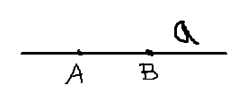

**2、射线**

1线段向一个方向无限延伸就形成了一条射线。射线的的表示方法如下，可以记作射线OA（表示由O射向A），或射线a。

​	

注意：射线OA和射线AO不是同一射线；只有起点相同，方向相同的射线才是同一射线。如下图射线OA和射线OA是同一条射线。

​	

**3、线段**

线段是有固定长度的，它两端都不能延伸。线段的表示方法：

​	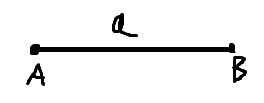

记作线段AB、或线段BA、或线段a。

**4、直线、射线、线段的关系**

1）直线两端都可以无限延伸。（没有端点）

2）射线只有一端可以无限延伸。（有一个端点）

3）线段是有固定长度的，它两端都不能延伸。（有两个端点）

注意1：这里的端点指的是界点，而不是点。

注意2：表示线段、射线、直线的时候，都要在字母前标明“线段”，“射线”，“直线”，否则不知道它到底是哪种类型的线。

注意3：用两个大写字母表示直线或线段时，两个字母可以交换位置；但表示射线的两个大写字母不能交换位置，必须把端点放在前面。

**5、点与直线的关系**

点在直线外，点在直线上。

**6、线段长度的比较、和、差、中点、等分点、最短线段、两点之间的距离**

借助尺子或圆规进行线段的比较。

1）如果线段AB长度比CD小，则记作AB<CD。

2）线段的和等于线段长度相加。

3）线段的差等于长线段减去短线段。

4）点M把线段AB分成相等的两条线段AM与MB，则点M叫做线段的中点。类似地，还有线段的三等分点、四等分点等。

5）两点之间线段最短。

6）两点之间的距离：两点之间线段的长度叫做两点之间的距离。


## 角

**1、认识角**

角是由具有公共端点的两条射线组成的图形，这个公共端点叫做角的顶点。角也可以看作是一条射线绕着它的端点旋转而形成的图形。

1）平角：一条射线绕着它的端点旋转，当终边与始边成一条直线时，所成的角叫做平角。（平角180<sup>。</sup>）

2）周角：一条射线绕着它的端点旋转，当终边与始边重合时，所成的角叫做周角。（周角360<sup>。</sup>)

3）钝角：大于90<sup>。</sup>小于180<sup>。</sup>的角。

4）直角：等于90<sup>。</sup>的角。

5）锐角：小于90<sup>。</sup>的角。

1周角=2平角=4直角=360<sup>。</sup>

1平角=180<sup>。</sup>

1直角=90<sup>。</sup>

**2、角的表示方法**

角使用“∠”表示，读作“角”，角的表示方法有下面四种：

​	

1）角可以用三个大写字母表示，但表示顶点的字母一定要写在中间。如∠AOB

2）用一个字母表示角，但必须是以这个字母为顶点的角只有一个。如∠O

3）用一个数字表示角，在靠近顶点处画上弧线，写上数字。如∠1

4）用一个希腊字母表示角，在靠近顶点处画上弧线，写上希腊字母（同第3种方法是一样的，只不过将数字换成了希腊字母）。

**3、角度单位“度”、“分”、“秒”的转换**

1<sup>。</sup>= 60'（1度等于60分）			1' = 60''（1分等于60秒）


## 角的比较与运算

**1、角的比较**

角的比较是指比较角的度数，谁大谁小。有以下方法：

1）观察法。可借助平角、周角、锐角、钝角、直角的定义来判断。

2）叠合法。将某角平移，使得两个角的顶点及一边重合，然后观察两个角的另外一边，进行角的比较。

3）度量法。使用量角器度量，角的顶点对准量角器的中心，角的一边与量角器的0<sup>。</sup>进行重合，然后根据角的另一边得到角的度数。

注意：角的大小和角的两边长度无关，与角张开的程度有关，张开越小度数越小。

**2、角的和与差**

​	

∠AOC=∠AOB+∠BOC   =>   ∠AOB=∠AOC+∠BOC    =>   ∠BOC=∠AOC+∠AOB

**3、角平分线**

角平分线的定义：在角的内部，自顶	点引一条射线把这个角分成两个相等的角，那么这条射线叫做角的平分线。

​	

上图中，射线OB把∠AOC分成两个相等的角，得到∠AOB与∠BOC，这时OB叫做∠AOC的角平分线，也可以说OB平分∠AOC。由角平分线的定义可知：∵ OB平分∠AOC（已知），∴ ∠AOB = ∠BOC = 1/2∠AOC，或者∠AOC = 2∠AOB = 2∠BOC。


## 余角和补角

**1、补角**

1）补角：两个角的和等于180<sup>。</sup>（平角），就说这两个角互为补角，简称互补。即其中一个角是另一个角的补角。

2）补角用几何语言表示为：如果∠1+∠2 = 180<sup>。</sup>，那么∠1与∠2互为补角。（注意：∠1+∠2 = 180<sup>。</sup>可以进行变形，变形后依然互补）

**2、余角**

1）两个角的和等于90<sup>。</sup>（直角），就说这两个角互为余角，简称互余。即其中一个角是另一个角的余角。

2）余角用几何语言表示为：如果∠1+∠2 = 90<sup>。</sup>，那么∠1与∠2互为余角。（注意：∠1+∠2 = 90<sup>。</sup>可以进行变形，变形后依然互余）

**3、补角的性质**

同角（等角）的补角相等。（注意：同角是指一个角，从该角延伸出来的补角都是相等的；而等角是指两个或多个相等的角，它们的补角都是相等的）

**4、余角的性质**

同角（等角）的余角相等。（注意：同角是指一个角，从该角延伸出来的余角都是相等的；而等角是指两个或多个相等的角，它们的余角都是相等的）


# 5. 相交线与平行线

## 相交线

如果两条直线只有一个公共点，就说这两条直线相交，该公共点叫做两条直线的交点。

​		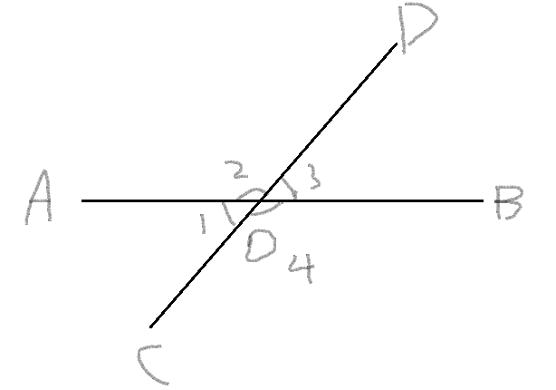

上图中，∠1与∠2、∠2与∠3、∠3与∠4、∠4与∠1互补。除此之外还可以观察到以下结论：

1）邻补角：拥有同一条公共边，并且另外一边互为反向延长线。如上图中∠AOC与∠AOD拥有同一条公共边OA，并且它们的另外一边OC	  和OD互为反向延长线，所以它们是邻补角。

2）对顶角：顶点相同，角的两边互为反向延长线。如上图中的∠AOC与∠BOD。（对顶角的性质：对顶角相等。这是由补角的性质同角	  的补角相等而推理出来的）


## 垂线

**1、垂线及性质**

​	

当∠a=90<sup>。</sup>时，直线AB与直线CD互相垂直，记作AB⊥CD，垂足为O。垂线的性质如下：

1）过直线有无数条垂线与已知直线垂直。

2）过一点有且只有一条直线与已知直线垂直。（这点可以在直线上也可以在直线外）

**2、垂线段、点到直线的距离**

​	

上图中，PB⊥l，称PB为点P到直线l的垂线段。

1）垂线段的性质：连接直线外一点与直线上各点的所有线段中，垂线段最短。

2）直线外一点到这条直线的垂线段的长度，叫做点到直线的距离。


## 同位角、内错角、同旁内角

​	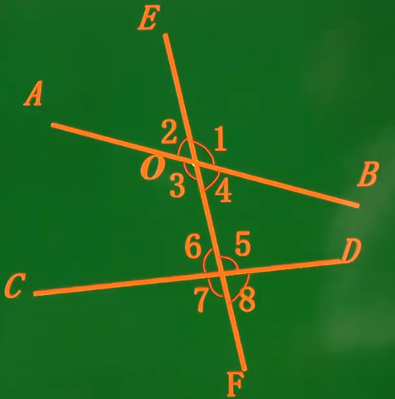

上图中，两直线AB、CD被第三条直线EF所截，构成8个角，简称“三线八角”，其中直线AB、CD是被截直线，EF是截线。可得：

1）同位角：两角在都截线的同侧，并且在被截直线的同一方。如上图中的∠1和∠5都为于截线EF的右侧，并且都在被截直线的同一方，即∠1在被截直线AB的上方，∠5也在被截直线CD的上方。（同位角长得像字母F）

2）内错角：两角分别在截线的两侧，并且都在被截直线之间。如上图中的∠3和∠5分别位于截线EF的两侧，并且都在被截直线AB和被截	  直线CD之间。（内错角长得像字母Z）

3）同旁内角：两角都在截线的同一侧，并且都在被截直线之间。如上图中的∠4和∠5都位于截线EF的同一侧，并且都在被截直线AB和被	  截直线CD之间。（内错角长得像字母U）


## 平行线

**1、平行线定义、表示、公理**

在同一平面内，不相交的两条直线叫做平行线，平行线使用符号“//”表示平行，如下图中两条平行线可以记作AB//CD。（注意：直线可以无限延伸）

​	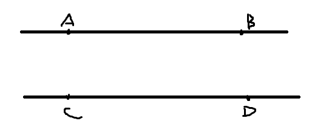

1）同一平面内，两条直线的位置关系有两种：相交和平行。

2）平行公理：在同一平面内，经过直线外一点，有且只有一条直线与这条直线平行。

3）平行公理的推论：在同一平面内，如果两条直线都与第三条直线平行，那么这两条直线也互相平行。即b//a、c//a，那么c//b。

**2、平行线的判定**

平行线的判定方法如下：

1）如果两条直线都与第三条直线平行，那么这两条直线也互相平行。（平行线的传递性）

2）两条直线被第三条直线所截，如果同位角相等，那么这两条直线平行。（同位角相等，两直线平行）

3）两条直线被第三条直线所截，如果内错角相等，那么这两条直线平行。（内错角相等，两直线平行）

4）两条直线被第三条直线所截，如果同旁内角互补，那么这两条直线平行。（同旁内角互补，两直线平行）

5）在同一平面内，垂直于同一条直线的两条直线平行（可由2、3、4推出来）。

**3、平行线的性质**

利用同位角相等、内错角相等、同旁内角互补可以判定两条直线是否平行。反过来，可以得到以下性质：

1）性质1：如果两条平行线被第三条直线所截，同位角相等。（两直线平行，同位角相等）

2）性质2：如果两条平行线被第三条直线所截，内错角相等。（两直线平行，内错角相等）

3）性质3：如果两条平行线被第三条直线所截，同旁内角互补。（两直线平行，同旁内角互补）

推论：两条直线被第三条直线所截且这两条直线不平行，可得同位角不相等、内错角不相等、同旁内角不互补。


## 命题、定理、证明

**1、命题**

能够判断真假的语句叫做命题。

1）如果题设成立，并且结论一定成立，这样的命题称为真命题。

2）如果题设成立，但不能保证结论一定成立，这样的命题称为假命题。

**2、定理、证明**

一些命题的正确性是经过推理证明的，这样得到的真命题叫做定理。而这个推理过程叫做证明。


## 平移

把一个图形整体沿着某一直线方向移动，会得到一个新的图形，新图形与原图形的形状和大小完全相同。并且新图形中的每一点，都是原图形中的某一点移动后得到的，这两个点是对应点，连接各组对应点的线段平行且相等。图形的这种移动，叫做平移变换，简称平移。	

​		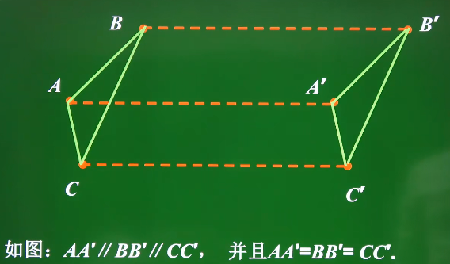


# 6. 实数

## 算术平方根

如果一个非负数x的平方等于a，即x<sup>2</sup> = a，那么这个非负数x叫做a的算术平方根。a的算术平方根可以记为，读作“根号a”，a叫做被开方数。即x<sup>2</sup> = a (a ≥ 0)，x叫做a的算术平方根，记作：x = 

1）负数没有算术平方根。

2）在中，被开方数a必须是大于等于0的（因为任何数的平方都是大于等于0的），同时的算术平方根也是大于等于0的。


## 平方根

**1、平方根**

如果一个数x的平方等于a，即x<sup>2</sup> = a，那么这个数x叫做a的平方根，也叫二次方根。a的平方根可以记为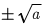，读作“正负根号a”，a叫做被开方数。

1）求一个数a的平方根的运算，叫做开平方运算。（平方运算x<sup>2</sup>与开平方运算互为逆运算）

2）负数没有平方根。

3）在中，被开方数a必须是大于等于0的（因为任何数的平方都是大于等于0的)。

4）的平方根是两个数，一个是正的，一个是负的（它们互为相反数) ；特别的，如果被开方数0，那么平方根就是0。

4）平方根是被开方数本身的数只有0。

**2、平方根与算术平方根的联系与区别**

1）联系：

* 具有包含关系。平方根包含算术平方根，算术平方根是平方根的一种。
* 0的平方根和算术平方根都是0。
* 被开方数都必须大于等于0。

2）区别：

* 个数不同。被开方数有两个平方根，而它的算术平方根只有一个。（被开方数是0时除外）
* 表示方法不同。被开方数a的平方根表示为，而它的算术平方根表示为


## 立方根

如果一个数x的立方等于a，即x<sup>3</sup>=a，这个数x就叫做a的立方根，也称为a的三次方根，记作。

1）中，3是根指数，a是被开方数。

2）在奇数方根（奇数根指数）中，被开方数除了可以是正数、0，也可以是负数。

3）正数的立方根是正数，负数的立方数是负数，0的立方根是0。

4）求一个数的立方根运算，叫做开立方运算。（立方运算x<sup>3</sup>与开立方运算互为逆运算）

5）立方根是被开方数本身的数有-1、0、1。

6）互为相反数的数的立方根也互为相反数。


## 实数

**1、有理数**

事实上，任何一个有理数都可以写成有限小数或无限循环小数，返过来，任何有限小数或无限循环小数也都是有理数。

**2、无理数**

无限不循环小数叫做无理数。如：

1）圆周率。

2）开方开不尽的数。例如（注意只有开方开不尽的数才是无限不循环小数)

3）有一定的规律，但不循环的无限小数。如0.10100100010000...，它的0逐渐递增

**3、实数**

实数的定义：有理数和无理数统称为实数。

​	

实数也可以这样分类：

​	

1）实数与数轴上的点是一一对应的。

2）在实数范围内，相反数、倒数、绝对值的意义和有理数范围内的相反数、倒数、绝对值的意义完全一样。


# 7. 平面直角坐标系

## 有序数对

把有顺序的两个数a与b组成的数对叫做有序数对，记作（a,b）

注意：有序数对中的顺序不能调换，（a,b）与（b,a）是不一样的。


## 平面直角坐标系

**1、数轴上点的位置**

数轴上的点可以用一个数来表示，这个数叫做这个点在数轴上的坐标。反过来，知道数轴上一个点的坐标，这个点在数轴上的位置也就确定了。

**2、平面直角坐标系**

在同一平面上互相垂直且有公共原点的两条数轴构成平面直角坐标系（笛卡尔坐标系），两条数轴分别置于水平位置与垂直位置，取向右与向上的方向分别为两条数轴的正方向，水平的数轴叫做x轴或横轴，垂直的数轴叫做y轴，x轴和y轴统称为坐标轴，它们的公共原点O称为直角坐标系的原点，以点O为原点的平面直角坐标系记作为平面直角坐标系xOy。

**3、平面直角坐标系的象限、性质**

象限是平面直角坐标系中里的横轴和纵轴所划分的四个区域，每一个区域叫做一个象限，象限以原点为中心，x轴和y轴为分界线。右上的称为第一象限，左上的称为第二象限，左下的称为第三象限，右下的称为第四象限。（注意：原点和坐标轴上的点不属于任何象限）

​		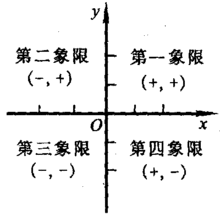

1）第一象限横坐标为正，纵坐标为正（+，+）。第二象限横坐标为负，纵坐标为正（-，+）。第三象限横坐标为负，纵坐标为负	    	   （-，-）。第四象限横坐标为正，纵坐标为负（+，-）。

2）x轴上方点的纵坐标全为正，x轴下方点的纵坐标全为负，x轴上点的纵坐标全为0。y轴左方点的横坐标全为负，y轴右方点的横坐标全	  为正，y轴上点的横坐标全为0。

3）坐标轴上的点的坐标至少有一个是0：x轴上点的纵坐标都是0，表示为（x，0），而y轴上的点横坐标都为0，表示为（0，y）。原点	  坐标为（0, 0）。

4）点关于x轴对称，则横坐标相同，纵坐标互为相反数。点关于y轴对称，则纵坐标相同，横坐标互为相反数。点关于原点对称，则横纵 	  坐标都互为相反数。（简记：关于哪个轴对称，哪个轴就不变，另一个轴的值互为相反数；如果是圆点对称，两轴值都互为相反数）

5）对于一个点的坐标，它的 |x轴坐标值| 表示该点到y轴的距离，|y轴坐标值| 表示该点到x轴的距离。

6）横坐标相同的点的连线平行于y轴；纵坐标相同的点的连线平行于x轴。


## 用坐标表示地理位置

用坐标表示地理位置的过程是：

1）建立坐标系，选择一个适当的参照点作为原点，确定x轴、y轴的正方向。

2）根据具体问题确定单位长度。

3）在坐标平面内画出这些点，并写出各点的坐标和各个地点的名称。


## 用坐标表示平移

1）平移变换不改变图形的形状和大小。

2）连接各组对应点的线段，平行且相等。

在直角坐标系中，将点（x,y）向右或向左平移a个单位长度，可以得到对应点（x+a,y）或（x-a,y）；将点 (x,y) 向上或向下平移b个单位，可以得到对应点（x,y+b）或（x,y-b）。


# 8. 二元一次方程组

## 二元一次方程组

**1、二元一次方程、二元一次方程组**

1）二元一次方程：含有两个未知数，并且含有未知数的项的次数都是1的方程，叫做二元一次方程。

2）二元一次方程组：把具有相同未知数的两个二元一次方程组合在一起，就构成了二元一次方程组。例如：

​	 特别地，和像这样的方程组也是二元一次方程组。


**2、二元一次方程、二元一次方程组的解**

1）二元一次方程的解：使二元一次方程两边的值相等的未知数的值叫做二元一次方程的解。

2）二元一次方程组的解：二元一次方程组的两个方程的公共解，叫做二元一次方程组的解。通常记作：


## 二元一次方程组的解法

**1、代入消元法**

用代入消元法解二元一次方程组的一般步骤：

1）变形。选择其中一个方程，把它变形为用含有一个未知数的代数式表示另一个未知数的形式。

2）代入求解。把变形后的方程代入到另一个方程中，消元后求出未知数的值。

3）回代求解。把求得的未知数的值代入到变形的方程中，求出另一个未知数的值。

4）写解。用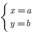的形式写出方程组的解。

**2、加减消元法**

在二元一次方程组中，两个二元一次方程中同一未知数的系数相反或相同时，把两个方程的两边分别相加或相减，就能消去这个未知数，得到一个一元一次方程，这种方法叫做加减消元法。用加减消元法解二元一次方程组的一般步骤：

1）变形。选择其中一个方程，将含有未知数项的系数变为与另一方程的与其含有相同未知数项系数的相同数或相反数。

2）加减消元求解。根据方程选择加消元或减消元，求得一个未知数的值。

3）回代求解。把求得的未知数的值代入到变形的方程中，求出另一个未知数的值。

4）写解。用的形式写出方程组的解。

注意：对于使用代入消元法比较复杂的或者无法使用加减消元法的二元一次方程组，可以先利用等式的性质将其中的二元一次方程进行变形，变形到能够方便的使用代入消元法或可以使用加减消元法进行求解。


## 实际问题与二元一次方程组

列二元一次方程组解决实际问题的主要步骤是：

1）弄清题意，找出两个等量关系。

2）设未知数。

3）根据等量关系，列出方程组。

4）解方程组。

5）写答案，答题。


## 三元一次方程组及其解法

**1、三元一次方程组**

含有三个未知数，并且含有未知数的项的次数都是1的方程，叫做三元一次方程。把具有相同未知数的三个三元一次方程组合在一起，就构成了三元一次方程组。

**2、三元一次方程组的解法**

求解三元一次方程组的关键问题是：使用代入消元法或加减消元法，把三元化成二元，然后再使用代入消元法或加减消元法对二元一次方程组求解。

提示：无论是解二元一次方程，还是三元一次方程，其核心思想都是消元，消元则意味着减元，以解三元一次方程组为例，将其消元变为二元一次方程组，对二元一次方程组时，对其进行消元，然后变为一元一次方程，等到了一元一次方程，直接移项就可以得到解了。


# 9. 不等式与不等式组

## 不等式及其解集

**1、不等式**

像5x<3、3y>10、z+1≠10、x≥5、y≤10这样用符号“<”或“>”或“≠”或“≥”或“≤”表示大小关系的式子，叫做不等式。

**2、不等式的解**

使不等式成立的未知数的值叫做不等式的解。

**3、不等式的解集**

一个含有未知数的不等式的所有解组成这个不等式的解集。例如x-5>1的解集表示为x>6

1）不等式的解集可以使用数轴表示，标出数轴上某一取件，其中的点对应的数值都是不等式的解。如x>6可以表示为：

​		

​	 在点6处画空心表示不等式的解不等于6，而是从6开始的6的右侧的值。如果要等于6则在6处画实心。

2）不等式的解集一定包括不等式全体的解，解集中任何一个数都是不等式的解。

**4、解不等式**

求不等式解集的过程叫解不等式。


## 不等式的性质

1）性质1：不等式的两边加（或减）同一个数（或式子），不等号的方向不变。

* 如果a > b，那么a+c > b+c
* 如果a > b，那么a-b > b-c

2）性质2：不等式的两边乘（或除以）同一个正数，不等号的方向不变。

* 如果a > b，c > 0，那么ac > bc
* 如果a > b，c > 0，那么a/c > b/c

3）性质3：不等式的两边乘（或除以）同一个负数，不等号的方向要改变。

* 如果a > b，c < 0，那么ac < bc
* 如果a > b，c < 0，那么a/c < b/c


## 一元一次不等式

含有一个未知数，未知数的次数是1的不等式，叫做一元一次不等式。例如2x+1>6


## 一元一次不等式组及其解集

**1、一元一次不等式组**

由两个及两个以上的一元一次不等式组合构成的式子称为一元一次不等式组。（注意：一元一次不等式组中只能有一个未知数，并且次数为1，否则就不是一元一次不等式组了）

**2、一元一次不等式组的解集**

解不等式组就是求该不等式组的解集，不等式组中每个不等式的解集的公共部分叫做该不等式组的解集。

1）如果这些不等式的解集没有公共部分，那么该不等式组无解。

2）如果公共部分不好判断，可以借助数轴，然后取公共部分。


# 10. 统计调查

## 统计调查

**1、统计调查**

统计调查是根据调查的目的与要求，运用科学的调查方法，有计划、有组织地搜集数据信息资料的统计工作过程。

**2、全面调查、抽样调查、简单随机抽样**

1）全面调查：对全体对象进行调查，称为全面调查，也叫普查。

* 当调查对象个数少，调查容易进行时，一般用全面调查。
* 全面调查收集到的数据全面、准确，但是一般花费多，耗时长，而且某些调查不宜全面调查。

2）抽样调查：只抽取一部分对象进行调查，然后根据调查数据推断全体对象的情况，这种调查的方法叫做抽样调查。

* 当调查对象个数较多，调查不宜进行，或调查具有破坏性时，一般用抽样调查。
* 抽样调查具有花费少，省时的特点，但抽取的样本是否具有代表性，这直接关系到对总体估计的准确程度。

3）简单随机抽样：为了使样本能较好地反映总体情况，除了有合适的样本容量外，抽象时还要尽量使每一个个体有相等的机会被抽到。	 总体中的每一个个体都有相等的机会被抽到，这样的抽样方法是一种简单随机抽样。

**3、相关概念**

总体：要考察的全体对象称为总体。

个体：组成总体的每一个考察对象叫个体。

样本：被抽取的那些个体组成一个样本。

样本容量：样本中个体的数目。（通常情况下，样本容量越大，估计精度就会越高，但为降低成本，人力、物力、财力，样本容量选取也要适当）

**4、数据的展示**

1）统计表（表格）

​	

2）条形统计图：条形统计图能清除地表示出每个项目的具体数目。

​		

3）扇形图：扇形统计图能够清除地表示出各部分在总体中所占的百分比（按各类所占比例计算出对应扇形的圆心角度数）

​	

**5、统计调查的基本步骤**

1）收集数据。（如设计调查问卷，通过调查问卷收集数据）

2）整理数据。（设计统计表，或划分法）

3）描述数据。（可画出条形图或扇形图）


## 直方图

画频数分布直方图的步骤如下：

1）计算最大值和最小值的差。

2）决定组距和组数。每个小组的两个端点之间的距离称为组距，根据组距、最大值与最小值之差（最大值与最小值之差/组距=组数），	  将数据分成若干组。

3）画频数分布表。

4）画频数分布直方图。

* 频数分布直方图中，横坐标表示组距，纵坐标的值表示频数/组距。
* 频数分布直方图中，小长方形的面积 = 组距 × 频数/组距 = 频数。
* 在等距分组的频数分布直方图中，用纵坐标直接表示频数，在矩形上标出频数，类似于条形图。


# 11. 三角形

## 三角形

**1、三角形的定义**

由三条不在同一直线上的线段首尾顺次连接组成的平面图形叫做三角形.

​	

**2、三角形的表示**

​	

三角形用符号“△”表示，如上图的三角形，记作“△ABC”，读作“三角形ABC”.

**3、三角形的顶点**

​	

如上图，△ABC的三个顶点分别时A、B、C.

**4、三角形的边**

​	

如上图，△ABC的三条边分别是：AB、BC、CA。注意： 

* AB等同于BA，即字母先后顺序无要求

* 也可以用一个小写字母表示一条边，但需要在图中标出，如下：

  ​	

   将顶点A的对边标为a，将顶点B对应边标为b，将顶点C对应的边标为c（为清楚，遵循将大写字母对应的边标为相应的小写字母，             但并非强制性要求）

**5、三角形的内角**

如上图，三角形的三个角分别是∠A、∠B、∠C。它的含义如下：

​	

**6、对边、邻边**

​	

1）对边：将三角形中某个角对应的边称为该角的对边。上图中，∠A的对边为BC或a，∠B的对边为AC或b，∠C的对边为AB或c.

2）邻边：将三角形中某个角相邻的边称为该角的邻边。上图中，∠A的邻边为AB或c、AC或b，∠B的邻边为BA或c、BC或a，∠C的邻边	  为CB或a、CA或b.

**7、三角形的分类**

1）按角分：

* 锐角三角形（三角形的三个角均为锐角，锐角小于90<sup>。</sup>）
* 直角三角形（三角形中有一个直角，直角等于90<sup>。</sup>）
* 钝角三角形（三角形中有一个钝角，钝角大于90<sup>。</sup>)

2）按边分：

* 不等边三角形（三角形的三条边都不相等）
* 等腰三角形（三角形中至少有两个边是相等的，相等的两条边称为这个三角形的腰；如果三角形三边都相等，则为等边三角形，注意等边三角形属于等腰三角形的一种）

**8、三角形的三边关系**

1）三角形任意两边之和大于第三边。（这也说明三条线段要组成一个三角形必须满足任意两条线段的和大于另一条线段）

小窍门：在利用该性质判断给出的三条边是否可以构成三角形时，用较短的两条线段之和与最长的线段比较，若和大，则能组成三角形，反之则不能。

2）三角形任何两边之差小于第三边。（注意：这个差是用大边减小边，它是一个非负数；另外1、2可以相互推）


## 三角形的高

从三角形的一个顶点，向它的对边所在直线做垂线，顶点和垂足之间的线段加做三角形这边上的高，简称三角形的高。

​	

1）三角形的高是一条线段，所以是有长度的。

2）在画三角形的高时需要标明垂直的记号和垂直的符号。

**1、锐角三角形的三条高**

​	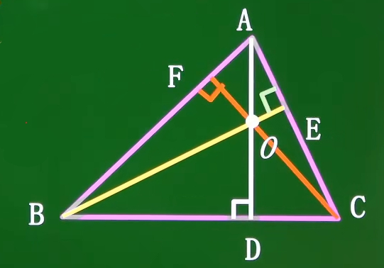

1）锐角三角形的三条高相交于一点，这点位于三角形内。

2）锐角三角形的三条高都在该三角形的内部。

**2、直角三角形的三条高**

​	

1）直角三角形的两条直角边互为对方的高，斜边的高需要单独画出来。上图直角三角形中，线段AB是BC边上的高，线段BC是AB边上的	  高，线段BD是AC边上的高。

2） 直角三角形的三条高相交于直角顶点。上图直角三角形中，它的三条高相交于直角顶点B

3）直角三角形有两条高在该三角形上，有一条高在该三角形内部。

**3、钝角三角形的三条高**

​	

1）在画钝角三角形的高时，需要借助延长线来画。上图钝角三角形中，线段AD是BC边上的高，线段CE是AB边上的高，线段BF是AC边	 上的高。

2）钝角三角形的三条高不相交于一点。

3）钝角三角形的三条高所在直线交于一点，并且相交点位于三角形外部。上图钝角三角形中，将表示高的线段AD、FB、CE无限延长后 	  交于一点。

4）钝角三角形的三条高中，有两条高在三角形外，一条高在三角形内。


共同点：三角形的三条高所在的直线相交于一点。


## 三角形的中线

在三角形中，将顶点与它对边的中点连接起来所构成的线段，叫做这个三角形这边上的中线。

​	

1）上图中，三角形BC边上的中线是线段AD。

2）如果给出了中线，实际就告诉了边的二倍关系。上图中，已知线段AD是BC边上的中线，可知BD = CD = (1/2)BC

3）三角形的三条中线位于三角形的内部，它们相交于一点，并且交点也位于三角形的内部。


## 三角形的角平分线

在三角形中，一个内角的角平分线与它的对边相交，这个角的顶点与交点之间的线段，叫做三角形的角平分线。

​	

1）上图中，线段AD是∠BAC的角平分线。

2）如果给出了角平分线，实际上就告诉了角的二倍关系。上图中，已知线段AD是∠BAC的角平分线，可知∠BAD=∠CAD=(1/2)∠BAC

3）三角形的三条角平分线位于三角形的内部，它们相交于一点，并且交点也位于三角形的内部。


## 三角形的稳定性

三角形具有稳定性，而四边形具有不稳定性。通过利用三角形的稳定性将四边形划分为三角形，使其变为稳定：

​	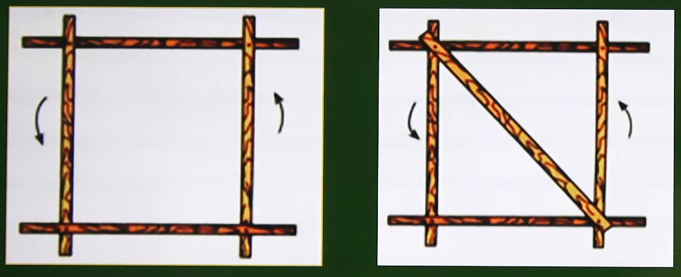


## 三角形的内角和

**1、三角形的内角和及其证明**

三角形的内角和等于180<sup>。</sup>

​	

证明三角形的内角和等于180<sup>。</sup>的核心思想是：利用平行线的性质。

1）证明方法1

​	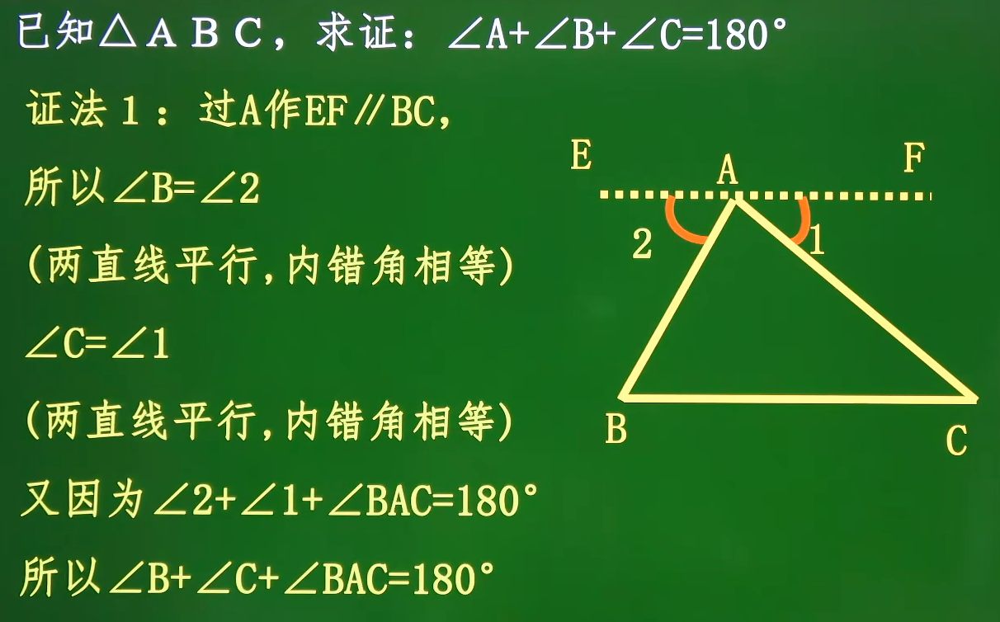

2）证明方法2

​	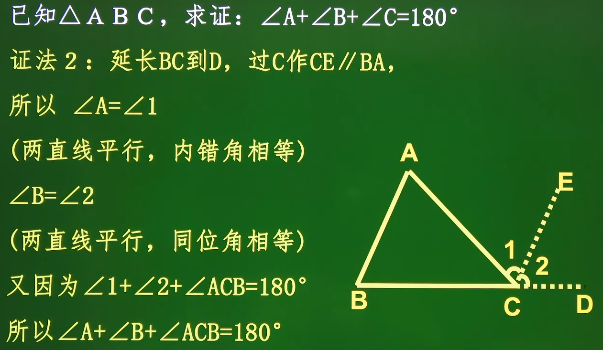

3）证明方法3

​	

**2、三角形内角和的推理**

直角三角形的两个锐角互余。反之，两个锐角互余的三角形是直角三角形。证明如下：

​	


## 三角形的外角

三角形中内角的一边与另一半的反向延长线形成的角，叫做三角形的外角。（外角是内角邻补角）

​	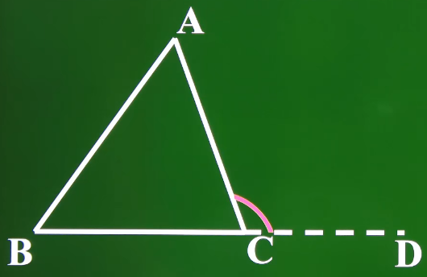

定理：三角形的一个外角等于与它不相邻的两个内角的和。

定理的推论：三角形的一个外角大于任何一个与它不相邻的内角。


## 多边形及其内角和

**1、多边形**

一般地，由n条不再同一条直线上的线段首尾顺次连接组成的平面图形叫做n变形，又称为多边形。

​	

 表示多边形时，选取某一个顶点，沿着逆时针或顺时针有顺序地遍历每个顶点，然后记为图形。

**2、正多边形**

在平面内，内角都相等，边也都相等的多边形叫做正多边形。

​	

**3、对角线**

连接多边形不相邻的两个顶点的线段，叫做对角线。

​	

1）从n边形的一个顶点出发可以画出n-3条对角线。

2）通过对一个多边形画对角线，可以得到n-2个三角形，然后利用三角形的内角和定理对这些三角形的内角求总和，可以求出多边形的内角和。

**4、多边形的内角和**

通过对一个多边形画对角线，可以得到n-2个三角形，然后利用三角形的内角和定理对这些三角形的内角求总和，可以求出多边形的内角和。规律如下：

​	

1）n边形中的一个顶点可以画n-3条对角线。

2）从n边形的一个顶点出发画出它的所有对角线，可以将该n边形分成对角线数量+1或n-3-+1个三角形，即在n边形中以一顶点作对角线	 可以得到n-2个三角形。

3）n边形的内角和等于对其中某个顶点作对角线得到的三角形数量 × 180<sup>。</sup>，即n边形的内角和等于 = (n-2) × 180<sup>。</sup>

补充：可以在n边形内部任取一个点，然后与n边形的n个顶点相连，可以得到n个三角形，然后利用三角形内角和定理求出所有三角形内角和的总内角和，再减去中间那点的360<sup>。</sup>，如下：

​		

由此可以得到n边形的内角和公式为：n × 180<sup>。</sup>- 360<sup>。</sup>对它进行化简也可以得到：(n-2) × 180<sup>。</sup>（这种方法在数三角形时好用）

**5、多边形的外角和**

在n边形的每个顶点处各取一个外角，这些外角的和叫做n边形的外角和。n边形的外角和为360<sup>。</sup>，理由如下：

​	


# 12. 全等三角形

## 全等三角形及其性质

**1、全等形**

能够完全重合的两个图形叫做全等形。

**2、全等三角形**

能够完全重合的两个三角形叫做全等三角形。

​	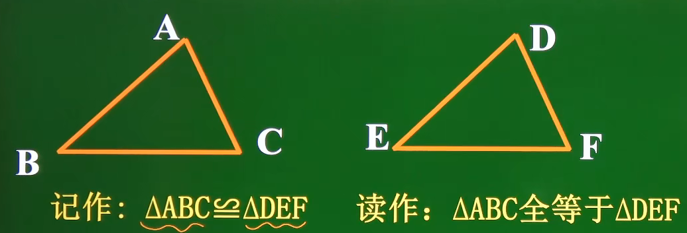

1）如果两个三角形全等，比如上面三角形，则记作：△ABC ≌ △DEF，读作：△ABC 全等于 △DEF

2）在全等三角形中，互相重合的顶点称为对应顶点，互相重合的边称为对应边，互相重合的角称为对应角。

注意：在使用≌表示三角形全等时，通常把对应顶点的字母写在对应的位置上。如 △ABC ≌ △DEF可以看出顶点A的对应顶点为顶点D，顶点B的对应顶点为顶点E，顶点C的对应顶点为顶点F。

**3、全等三角形的性质**

1）性质1：全等三角形的对应边相等。

2）性质2：全等三角形的对应角相等。

3）性质3：全等三角形对应角所对的边是对应边。（如果给出两个角是对应角，可知对应的边）

4）性质4：全等三角形对应边所对的角是对应角。（如果给出了两条对应边，可知对应角）


## 全等三角形的判定

1）两个三角形全等，它们的三对对应角、三对对应边分别相等。

2）如果两个三角形三对对应角、三对对应边相等，那么这两个三角形全等。

判定两个三角形全等，不一定需要证明这两个三角形的三对对应角、三对对应边相等，只需满足其中一部分条件即可。方法如下：

（1）SSS（边边边）

（2）SAS（边角边）

（3）ASA（角边角）

（4）AAS（角角边）

（5）HL（斜边、直角边，这是直角三角形特有的判定定理）

**1、SSS（边边边）**

三角形全等判定定理1：三边对应相等的两个三角形全等，简写为：SSS或边边边。

​	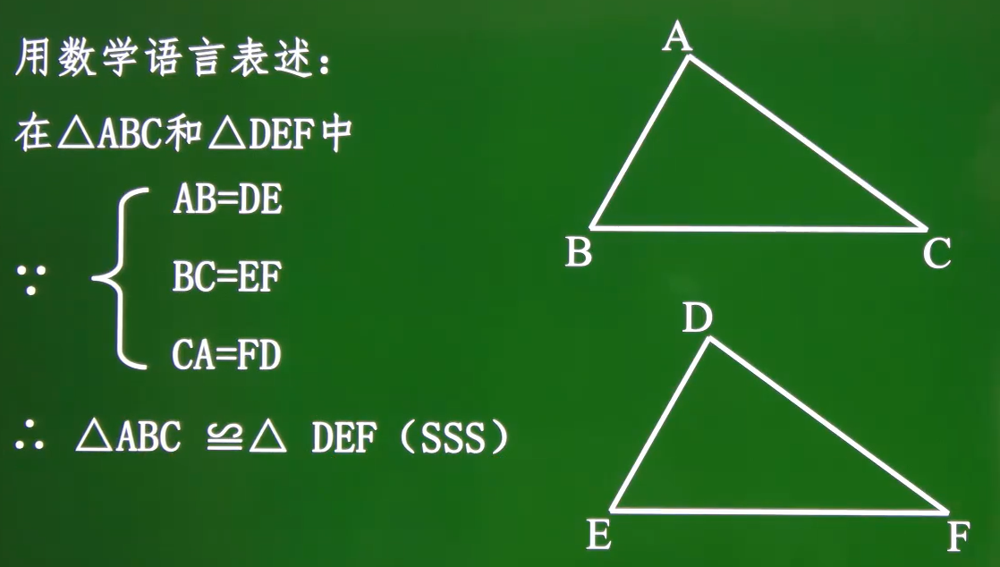

注意：在表示某边等于某边时，并且字母与其对应的字母必须对应顶点关系。如AB=DE，说明A顶点与D顶点是对应顶点，B顶点和E顶点是对应顶点。

总结：证明的书写步骤：

1）准备条件：证全等时要用的间接条件要先证好。

2）三角形全等书写三步骤：（1）写出在哪两个三角形中；（2）摆出三个条件用大括号括起来；（3）写出全等结论。

**2、SAS（边角边）**

三角形全等判定定理2：两边和它们的夹角对应相等的两个三角形全等，简写为：SAS或边角边。

​	

注意：书写条件条件时，按照边-角-边的顺序列出，并且字母与其对应的字母必须对应顶点关系。

**3、ASA（角边角）**

三角形全等判定定理3：两角和它们的夹边对应相等的两个三角形全等，简写为：ASA或角边角。

**4、AAS（角角边）**

三角形全等判定定理4：两角和其中一个角所对的边对应相等的两个三角形全等，简写为：AAS或角角边。（这是ASA角边角的推论，因为两个角相等，利用三角形的内角和可知另外一个角也必然相等，已知三角都对应相等，并且告诉了一条边，这条边就成了夹边，这就满足了ASA定理，所以可以利用ASA定理推出AAS定理） 

**5、HL（斜边、直角边）**

直角三角形是特殊的三角形，所以不仅有一般三角形判定全等的方法：SSS、SAS、ASA、AAS，还有直角三角形特有的判定方法：在直角（RT）三角形中，斜边和某一条直角边对应相等的两个直角三角形全等，简写为：HL或（斜边、直角边）。


## 角的平分线及其性质

1）性质1：角平分线将一个角分成两个大小相同的角。

2）性质2：角平分线上的一点向角的两边所作垂线的距离相等。（不严谨说法：角平分线的点到角的两边的距离相等）

​	

3）性质3：角的内部到角两边距离相等的垂线段的交点一定在角的平分线上。（不严谨说法：角的内部到角两边距离相等的点一定在角平	  分线上）

​	


# 13. 轴对称

## 轴对称

**1、轴对称图形**

如果一个图形沿着一条直线折叠，直线两旁的部分能够互相重合，这个图形就叫做轴对称图形，这条直线即折痕就是它的对称轴。

​	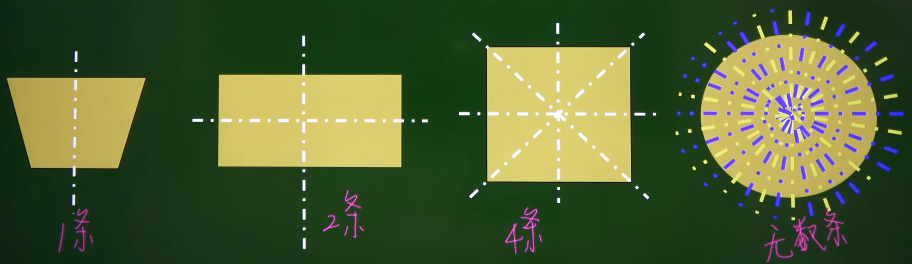

1）有些轴对称图形的对称轴只有一条，但有的轴对称图形的对称轴不止一条，有的轴对称图形的对称轴甚至有无数条，如圆。

2）对称轴通常画成虚线，是直线，不是线段。

3）如果把一个轴对称图形沿着对称轴分成两个图形，那么这两个图形是全等的。


**2、两个图形关于某直线对称**

把一个图形沿着某一条直线折叠，如果它能够与另一个图形重合，那么就说这两个图形关于这条直线对称，或者说这两个图形成轴对称。同样，我们把这条直线叫做对称轴，折叠后重合的点是对应点，叫做对称点。

​	

成轴对称的两个图形全等。

**3、轴对称图形与两个图形关于某直线对称的区别与联系**

​	

**4、对称点**

关于对称轴对称的点叫做对称点。对称点有无数个。

​	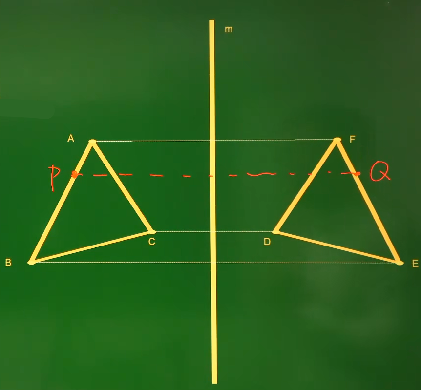


## 垂直平分线

经过线段的中点并且与该线段垂直的直线，就叫做该线段的垂直平分线，也叫中垂线。（简：垂直于线段中点的直线叫做该线段的垂直平分线或中垂线）

​	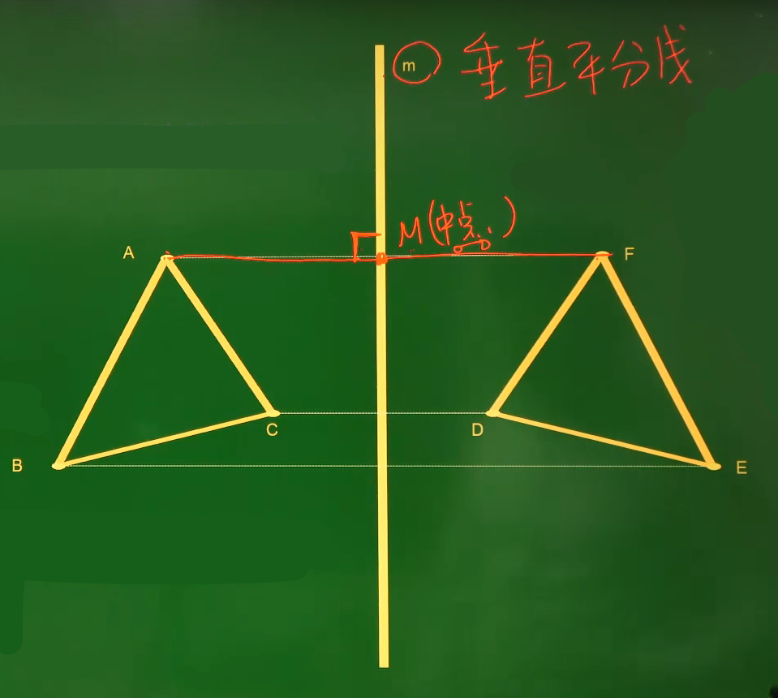

**1、垂直平分线的性质**

线段的垂直平分线的性质如下：

1）线段的垂直平分线将该线段分成两了两个相等的线段，并且形成了两个直角。

2）线段的垂直平分线上的点到这条线段的两个端点的距离相等。（由SAS可推、可证）

3）到线段两端点距离相等的点都在该线段的垂直平分线上。（线段的垂直平分线可以看成是与线段两端点距离相等的所有点的集合）

4）三角形三条的垂直平分线相交于一点，这个点到三角形三个顶点的距离相等。（下图中点P是三个三角形三条边的垂直平分线的交点，	  这里没有画出垂直平分线）

​	

**2、两个图形关于某直线对称的性质**

如果两个图形关于某条直线对称，那么对称轴是任一对对称点所连线段的垂直平分线。

**3、轴对称图形的性质**

轴对称图形的对称轴是任何一对对称点所连线段的垂直平分线。

**4、作垂直平分线**

1）作线段的垂直平分线：由两点确定一条直线和线段的垂直平分线的性质可知，只要作出到线段两端点距离相等的两点，并连接即可（因为到线段两端点距离相等的点都在该线段的垂直平分线上）。

​	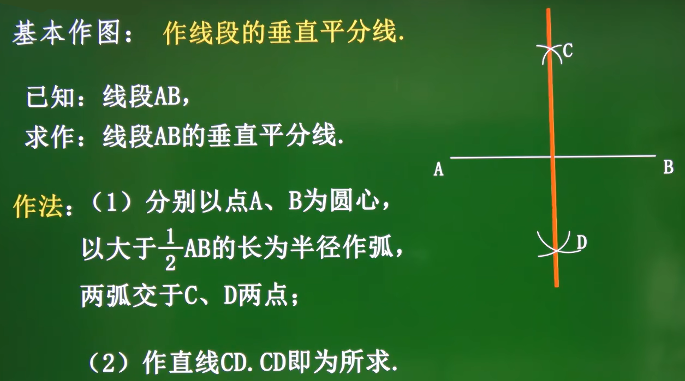

2）轴对称图形的对称轴相当于垂直平分线。对于轴对称图形，只要找到任意一对对称点，作出对称点所连线段的垂直平分线，就得到此	  图形的对称轴。


## 轴对称变换及其作法

**1、轴对称变换**

由一个平面图形得到它的轴对称图形的过程叫做轴对称变换。

1）对原图形进行轴对称得到新图形，新图形与原图形的形状、大小完全一样，只是位置不同。

2）新图形上的每一点，都是原图形上的某一点关于直线l的对称点。

3）连接任意一对对称点的线段被对称轴垂直平分。

**2、作法**

作已知图形关于直线对称的图形的一般步骤：

1）找点。确定图形中一些特殊点。

2）画点。画出特殊点关于已知直线的对称点。

3）连线。

​	

​	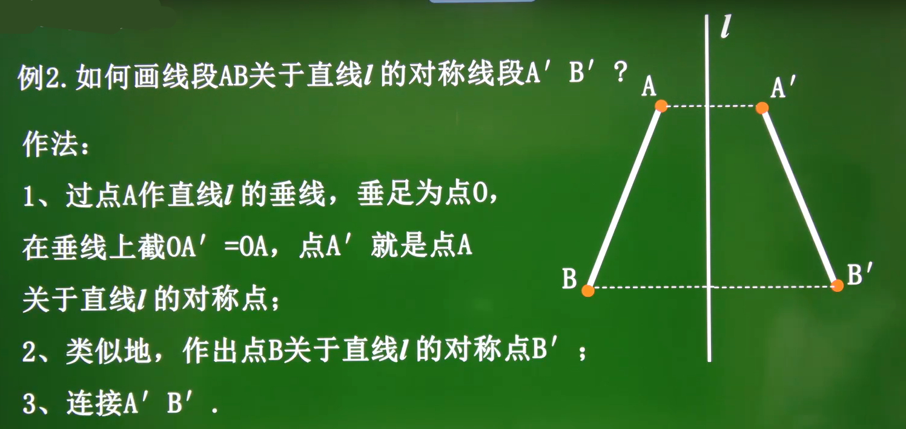

​	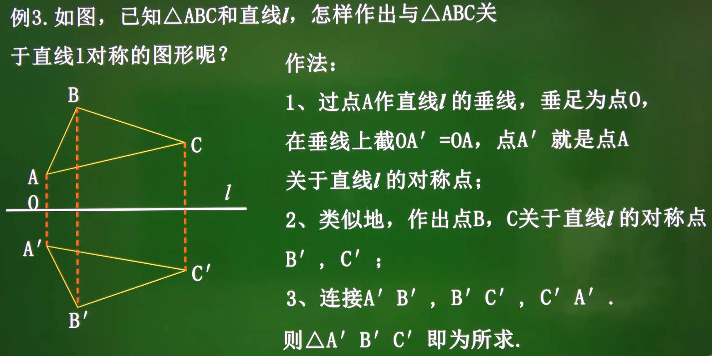


## 利用坐标表示轴对称

点关于x轴对称，则横坐标相同，纵坐标互为相反数。点关于y轴对称，则纵坐标相同，横坐标互为相反数。点关于原点对称，则横纵 	  坐标都互为相反数。（简记：关于哪个轴对称，哪个轴就不变，另一个轴的值互为相反数；如果是圆点对称，两轴值都互为相反数）


## 等腰三角形

**1、等腰三角形**

有两条边相等的三角形叫做等腰三角形。

​	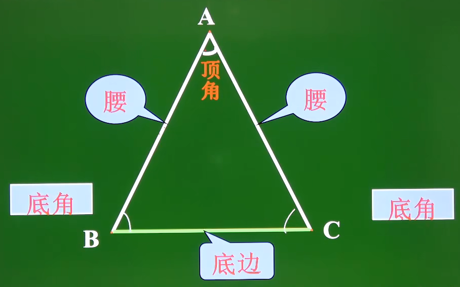

等腰三角形中，相等的两边都叫做腰，另一边叫做底，两腰的的夹角叫做顶角，腰和底边的夹角叫做底角。

**2、等腰三角形的性质**

1）等腰三角形的两个腰、两个底角相等，简称“等边对等角”。（作垂直平分线，证两三角形全等，然后利用全等三角形的性质可得两底角	 相等）

2）等腰三角形的顶角平分线与底边上的中线，底边上的高互相重合，简称“三线合一”。


## 等边三角形

**1、等边三角形**

三边都相等的三角形是等边三角形。

**2、等边三角形的性质**

1）等边三角形的三边都相等。

2）等边三角形的三个内角都相等，并且每一个角都是60<sup>。</sup>

注意：等边三角形是特殊的等腰三角形，所以等腰三角形三线和一的性质也适用于等边三角形。

**3、等边三角形的判定方法**

1）三条边都相等的三角形是等边三角形。

2）三个角都相等的三角形是等边三角形。

3）有一个角是60<sup>。</sup>的等腰三角形是等边三角形。

**4、定理**

在直角三角形中，如果一个锐角等于30<sup>。</sup>，那么它所对的直角边等于斜边的一半。

​	


# 14. 整式的乘法与因式分解

## 同底数幂的乘法

**1、乘方（幂）**

a<sup>n</sup>表示n个a相乘，这种运算叫做乘方。其中，a叫做底数，n叫做指数，整个a<sup>n</sup>或a<sup>n</sup>的结果叫做幂。

**2、同底数幂的乘法**

同底数幂的乘法指的是：底数相同的幂的乘法运算。

**3、同底数幂的乘法法则**

同底数幂相乘，底数不变，指数相加。（指数必须都是正整数）

1）代数形式为：a<sup>m</sup> · a<sup>n</sup> = a<sup>m+n</sup>（m、n都是正整数）

2）当底数为多项式的时候，可以把这个多项式看成一个整体。

3）三个及以上的同底数幂相乘时，该法则依然适用。

注意：如果某个负数的指数是奇数，则可以先将负号拿出来，再使用同底数幂的乘法法则进行计算，最后再考虑负号。总之，如果底数不同时，可以想办法将其化为同底数幂。

​	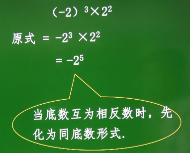

​	


## 幂的乘方

幂的乘法法则：底数不变，指数相乘。

1）(a<sup>m</sup>)<sup>n</sup> = a<sup>mn</sup> （m，n都是正整数）

2）a可以是单项式也可以是多项式。


## 积的乘法

**1、积的乘法**

已知一个正方体的棱长为2×10<sup>3</sup>，求该正方体的体积。正方体的体积等于棱长×棱长×棱长，即V = a×a×a = a<sup>3</sup>，所以可知该正方体的体积为：(2 × 10<sup>3</sup>) <sup>3</sup> 。求(2 × 10<sup>3</sup>) <sup>3</sup>就是求2×10<sup>3</sup>的积的三次方，这就是积的乘方，其中2×10<sup>3</sup>是积。

**2、积的乘方法则**

积的乘方等于把积的每个因式分被乘方，再把所得的幂相乘。即 (ab)<sup>n</sup> = a<sup>n</sup>b<sup>n</sup>（n为正整数）

三个或三个以上的积的乘方仍然可以用积的乘法法则，(abc)<sup>n</sup> = a<sup>n</sup>b<sup>n</sup>c<sup>n</sup>（n为正整数）


## 整式的乘法

1）单项式与单项式的相乘法则：单项式与单项式相乘时，把各个单项式中的系数、相同字母分别相乘，对于只在一个单项式里含有的字母，则连同它的指数作为积的一个因式。

2）单项式与多项式的相乘法则：单项式与多项式相乘时，利用乘法分配律，将单项式分别乘以多项式的每一项，再将所得的积相加。即m(a+b+c) = ma+mb+mc

3）多项式与多项式的相乘法则：多项式与多项式相乘，先用一个多项式的每一项分别乘以另一个多项式的每一项，再把所得的积相加。即(a+b+c)(m+n) = am+an+bm+bn+cm+cn


## 同底数幂的除法

同底数幂相除，商的底数不变，指数等于被除数的指数减去除数的指数。即a<sup>m</sup> ÷ a<sup>n</sup> = a<sup>m-n</sup>（a≠0，m、n都是正整数，并且m>n）

1）任何不等于0的数的0次幂都等于1，即a<sup>0</sup>=1（a≠0）

2）任何不等于0的数的1次幂都等于该数本身，即a<sup>1</sup>=a（a≠0）

​	


## 整式的除法

1）单项式除以单项式的运算法则：单项式除以单项式时，把系数与同底数幂分别相除作为商的因式，对于只在被除式里含有的字母，则连同它的指数作为商的一个因式。

​	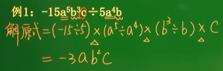

2）多项式除以单项式的运算法则：多项式除以单项式时，把多项式的每一项分别除以单项式，化成单项式除以单项式的形式，再把所得的商相加。

​	


## 平方差公式

**1、平方差公式**

(a+b)(a-b) = a<sup>2</sup>-b<sup>2</sup>，即两个数（或式子）的和与两个数（或式子）的差等于这两个数（或式子）的平方差。

​	

平方差公式的逆用：a<sup>2</sup>-b<sup>2</sup> = (a+b)(a-b) 

**2、平方差公式的几何解释**

​	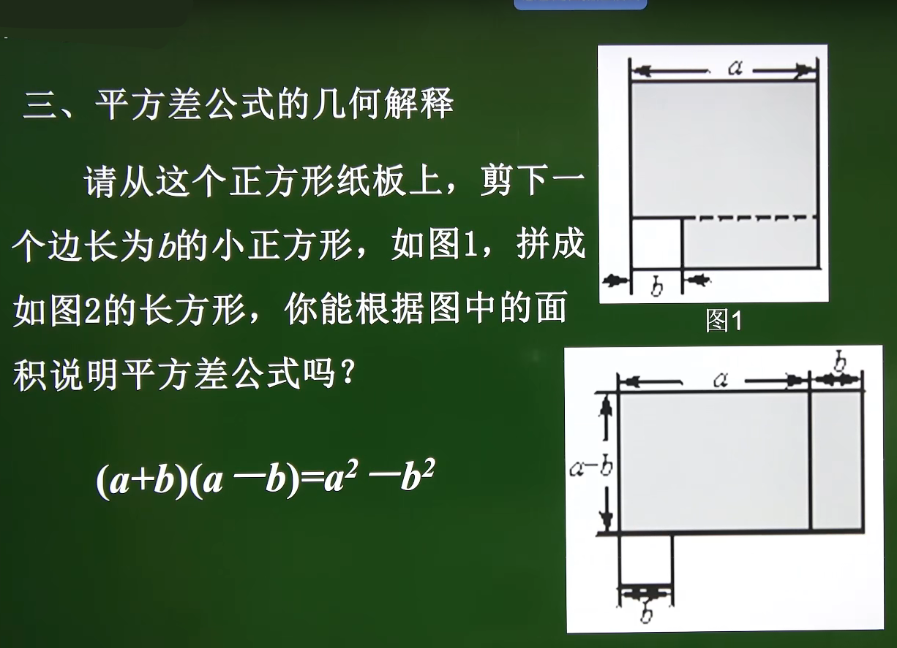

注意：

​	

​	


## 完全平方公式

**1、完全平方公式**

完全平方公式包括完全平方和公式与完全平方差公式。

​	(a+b)<sup>2</sup> = a<sup>2</sup> + 2ab + b<sup>2</sup>       完全平方和公式：两个数的和的平方，等于它们的平方和，加上它们的积的2倍。

​	(a-b)<sup>2</sup> = a<sup>2 </sup>- 2ab + b<sup>2</sup>		 完全平方差公式：两个数的差的平方，等于它们的平方和，减去它们的积的2倍。

1）首平方，尾平方，首尾的2倍在中间。

2）公式中的字母a，b可以是数、单项式、多项式。

**2、完全平方和公式的几何解释**

完全平方和公式(a+b)<sup>2</sup> = a<sup>2</sup> + 2ab + b<sup>2</sup>的集合解释如下：

​	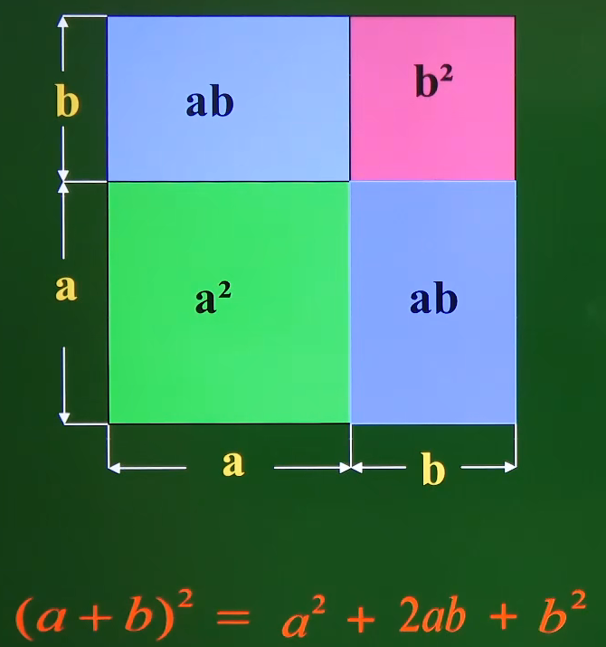

**3、完全平方差公式的几何解释**

完全平方差公式(a-b)<sup>2</sup> = a<sup>2 </sup>- 2ab + b<sup>2</sup>的几何解释如下：

​	

**4、推论**

(a-b)<sup>2</sup> = (b-a)<sup>2</sup> 		  证明：(b-a)<sup>2</sup> = -(-b+a)<sup>2</sup> = [-(a-b)]<sup>2</sup> = (-1)<sup>2</sup>×(a-b)<sup>2</sup> = (a-b)<sup>2</sup>

(-a-b)<sup>2</sup> = (a+b)<sup>2</sup>		 证明：(-a-b)<sup>2</sup> = [-(a+b)]<sup>2</sup> = (-1)<sup>2</sup>×(a+b)<sup>2</sup> = (a+b)<sup>2</sup>

**5、利用添括号法则灵活应用完全平方公式**

添括号法则：添括号时，如果括号前面是正号，括到括号里的各项都不变符号；如果括号前面是负号，括到括号里的各项都改变符号。


## 因式分解

把一个多项式化成了几个整式的积的形式，像这样的式子变形叫做这个多项式的因式分解，也叫做把这个多项式分解因式。如下：

​	

1）因式分解与整式的乘法是逆运算的关系。

​	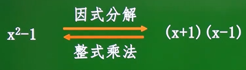

2）因式分解有很多方法，如提公因式法、公式法、十字相乘法等等。

3）因式分解的要求：必须进行到每一个多项式都不能再分解为止。

**1、提公因式法**

ma+mb+mc这个多项式中的各项都有一个公共的因式m，我们把因式m叫做这个多项式的公因式。由m(a+b+c) = ma+mb+mc可得：ma+mb+mc = m(a+b+c)，这样就把ma+mb+mc分解成两个因式乘积的形式，像这种分解因式的方法叫做提公因式法。

1）如果一个多项式的各项有公因式，可以把这个公因式提出来，从而将多项式化成两个因式乘积的形式，这种分解因式的方法叫做提公因式法。

2）各项都含有的公共的因式叫做这个多项式各项的公因式。公因式可以是单项式，也可以是多项式。

3）具体方法：在确定公因式前，应从系数和因式两个方面考虑。

* 当各项系数都是整数时，公因式的系数应取各项系数的最大公约数；当各项的系数有分数时，公因式系数为各分数的最大公约数。
* 最大公约数的字母取各项相同的字母，并且字母的指数取次数最低的。
* 如果多项式的第一项为负，要提出负号，使括号内的第一项的系数变为正数，提出负号时，多项式的各项都要变号。

**2、公式法**

如果多项式满足某些公式的特征，则可以将其化成公式的形式，这种因式分解的方法称为公式法。

1）能用平方差公式(a+b)(a-b) = a<sup>2</sup>-b<sup>2</sup>分解因式的多项式的特点（即平方差公式的特点）：

* 一个二项式
* 每项都可以化成整式的平方
* 整体来看是两个整式的平方差

2）能利用完全平方公式a<sup>2</sup>±2ab+b<sup>2</sup> = (a±b)<sup>2</sup>分解因式的多项式的特点（即完全平方公式的特点）：

* 要求多项式有三项
* 其中两项同号，且都可以写成某数或式的平方，另一项是这两数或式的乘积的2倍，符号可正可负。

注意：在使用公式法时，有公因式时，先提公因式，再考虑用公式。


# 15. 分式

## *代数式

有理式和无理式统称为代数式

1）有理式：整式和分式统称为有理式。

2）无理式：带有根号且根号下含有字母的式子叫做无理式。


## 从分数到分式

**1、分式**

一般地，如果A，B表示两个整式，并且B中含有表示未知数的字母，那么式子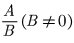叫做分式。其中A叫做分式的分子，B叫做分母。

**2、分式的特点**

1）分式是不同于整式的另一类有理式，分母中含有字母时分式的一大特点。

​	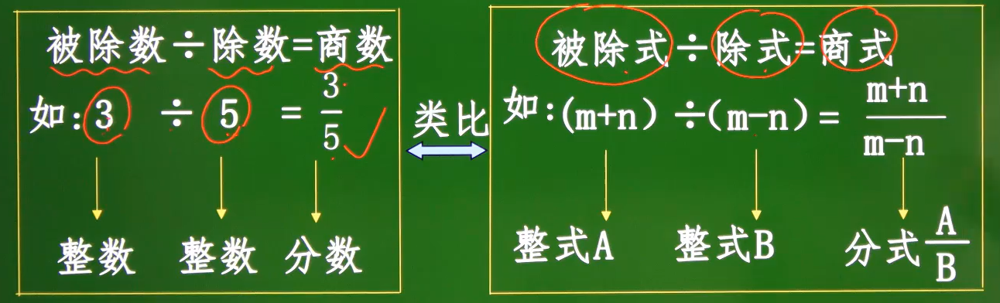

2）在中，分母B≠0，分式才有意义。

3）在时，即满足A=0且B≠0，分式的值为零。


## 分式的基本性质

**1、分数的基本性质**

1）性质1：分数的分子分母同时乘以一个不为0的数，分数的值不变。

​		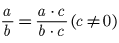

2）性质2：分数的分子分母同时除以一个不为0的数，分数的值不变。

​		

**2、分式的基本性质**

与分数的基本性质类似，分式的基本性质如下：

1）性质1：分式的分子分母同时乘以一个不为0的整式，分式的值不变。

​		

2）性质2：分式的分子分母同时除以一个不为0的整式，分式的值不变。

​		


## 分式的约分与通分

**1、分式的约分**

根据分式的基本性质，把一个分式的分子和分母的公因式约去，这种变形称为分式的约分。约分的关键是确定分式中的分子与分母的公因式：

* 公因式的系数应取分子系数和分母系数的最大公约数
* 最大公约数的字母应取分子、分母相同的字母，并且字母的指数取次数最低的。

然后分子分母同时除以公因式进行约分。注意：

1）公因式有可能是多项式。

2）如果分子或分母是多项式，可以先分解因式，再进行约分。

​	

**2、分式的通分**

根据分式的基本性质，把几个异分母的分式分别化成与原来的分式相等的同分母的分式，叫做分式的通分。通分的关键是确定几个分式的最简公分母：

* 取各分式分母系数的最小公倍数
* 取各分式分母中所有因式的最高次幂的乘积

这两者的乘积作为公分母，叫做最简公分母。（也可以将各分式的分母分别相乘，但这样得到的公分母可能不是最简的）

​	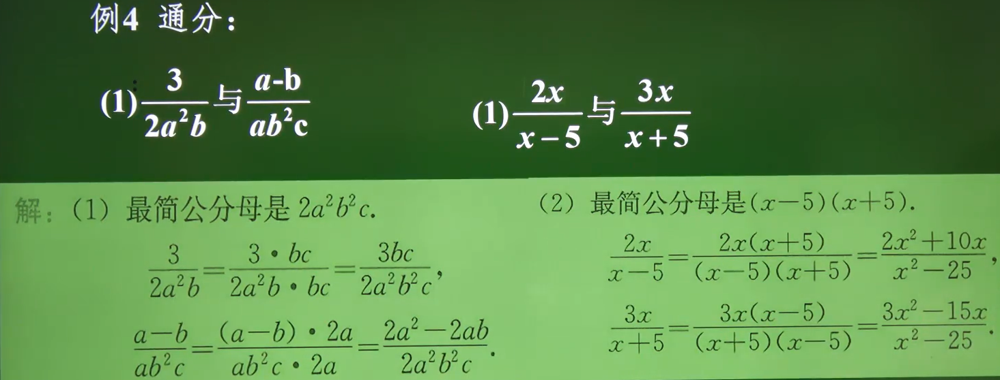


## 分式的乘法法则

**1、分数的乘法法则**

1）分数乘整数时，分母不变，分子乘整数，最后能约分的要约分。

​			

2）分数乘分数时，用分子乘分子，用分母乘分母，最后能约分的要约分。

​	

**2、分式的乘法法则**

分式的乘法法则：分式乘分式，用分子的积作为积的分子，分母的积作为积的分母。

​	


## 分式的除法法则

**1、分数的除法法则**

1）分数除以整数，分母不变，如果分子可以整除整数，则用分子除以整数，否则将整个分数乘以这个整数的倒数，最后能约分的约分。

​				

2）分数除以分数，等于被除数乘以除数的倒数，最后能约分的要约分。

​		

**2、分式的除法法则**

分式的除法法则：分式除以分式，把除式的分子、分母颠倒位置，再与被除式相乘。（除以一个分式，等于乘以这个分式的倒数）

​	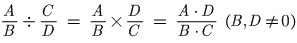


## 分式的乘方与开方

**1、分式的乘方**

计算分式的乘方时：分子的乘方做分子，分母的乘方做分母，可以约分的约分。

​	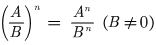

**2、分式的开方**

计算分式的开方时：分子开方做分子，分母开方做分母，可以约分的约分。

​	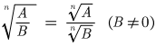


## 分式的加减

**1、同分母的分数或分式相加减**

同分母的分数或分式相加减，分母不变，分子相加减。

​		

​		

注意：分子是一个整体，先用括号括起来。并且最终的计算结果要化为最简分式。

**2、异分母的分数或分式相加减**

1）异分母的分数加减法则：找出各分数分母的最小公倍数，进行通分，变为同分母的分数，再加减。

​		

2）异分母的分式加减法则：按照分式的通分规则，把各个分式的分母变为相同的分式，再加减。

​		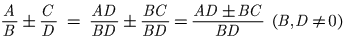


## 分式的混合运算

对于分式的混合运算，运算顺序：先乘方、再乘除，然后加减，如果有括号，先算括号里面的。


## 整数指数幂

**1、正整数指数幂**

前面所学的都是正整数幂的运算，正整数幂有以下运算性质：

（1）a<sup>m</sup> · a<sup>n</sup> = a<sup>m+n</sup> （m，n是正整数）

（2）(a<sup>m</sup>)<sup>n</sup> = a<sup>mn</sup>	（m，n是正整数）

（3）(ab)<sup>n</sup> = a<sup>n</sup>b<sup>n</sup>	（n是正整数）

（4）a<sup>m</sup> ÷ a<sup>n</sup> = a<sup>m-n</sup>	（a≠0，m，n是正整数，且m>n）

（5）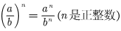

**2、负整数指数幂**

​	

可知：a<sup>m</sup> ÷ a<sup>n</sup> = a<sup>m-n</sup> 这条性质对于m，n是任意整数的情形仍然适用。当n是正整数时，有：

​	

**3、科学计数法的补充**

学完负整数指数幂后，类似地，我们可以利用10的负整数次幂，用科学计数法表示一些绝对值小于1的数，即将它们表示成a×10<sup>-n</sup>的性质，其中n是正整数，1 ≤ |a| < 10.  例如：

​	

即如果10负整数次幂表示将小数点向左移动n位。


## 分式方程及其解法

**1、分式方程**

​	

像这样分母中含有未知数的方程叫做分式方程。（以前学过的分母中没有不含有未知数的方程叫做整式方程）

**2、分式方程的解法**

一化二解三检验。

1）去分母，将分式方程转换为整式分方程。可采用乘最简公分母法、交叉相乘法

2）解整式方程

3）验根作答

等式两边的分式同时乘以这两个分式的最简公分母，或采用交叉相乘法，这样就将分式方程变成了整式方程，然后解方程即可。比如：

​		

该方程：

（1）两边同时乘以最简公分母 (20+v) (20-v)，

（2）或者使用交叉相乘法，即等号左边分式的分子乘以等号右边分式的分母等于等号左边分式的分母乘以等号右边分式的分子（有些情	      况下交叉相乘法得到的整式方程解起来有一点的难度，此时可以采用最简公分母法）

可得：100(20-v) = 60(20+v)，然后解方程得v=5，解完方程后，需要将解代入方程中，进行检验，因为有时候方程的解在方程中是没有意义的，比如以下方程解得x=5，但分母为0：

​		

此时称方程无解。无解的原因是：分式方程两边同时乘一个零因式后，所得的根是整式方程的根，而不是分式方程的根。


# 16. 二次根式

## 二次根式

**1、二次根式**

把形如用来表示一个非负数的算术平方根的式子，叫做二次根式。

一般地，把形如的式子叫做二次根式，“”称为二次根号。

1）二次根式的被开方数a≥0

2）根指数为2

注意：

* 根号里的不一定是个数，还可以是一个值大于等于0的式子
* 只有中的a≥0时，二次根式才有意义。
* 二次根式具有双重非负性，表现为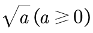中a≥0，且整个二次根式的值大于等于0，即

**2、最简二次根式**

1）被开方数不含分母，且分母中不含二次根式；

2）被开方数中不含能开得尽方的因数或因式。

把满足这两个条件的二次根式，叫做最简二次根式。比如：

​	


## 二次根式的性质

性质1：非负数的算术平方根的平方等于它本身。

性质2：


## 二次根式的乘除

**1、二次根式乘法法则**

二次根式与二次根式相乘，等于各被开方数相乘的算术平方根。

​	

反之，积的算术平方根，等于积中各非负因式的算术平方根的积。

​	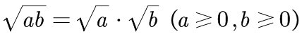


**2、二次根式除法法则**

​	

反之，

​	


## 二次根式的加减

被开方数相同，即为同类二次根式。比如：

​	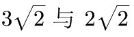

只有同类二次根式才可以进行加减运算。但有的二次根式的被开方数不同，我们可以将它们化为最简二次根式，变为同类二次根式后，再进行加减运算。比如：

​	


# 17. 勾股定理

## 勾股定理

**1、问题引入**

​	

**2、勾股定理**

勾股定理：如果直角三角形两直角边长分别为a、b，斜边长c，那么a<sup>2</sup>+b<sup>2</sup> = c<sup>2</sup>（两直角边平方的和等于斜边的平方）

​	


## 勾股定理的逆定理

**1、勾股定理的逆定理**

勾股定理的逆定理（勾股定理的逆命题）：如果三角形的三边长a、b、c满足a<sup>2</sup>+b<sup>2</sup> = c<sup>2</sup>，那么这个三角形是直角三角形。

**2、勾股数**

满足勾股定理的三个正整数，称为勾股数。

**3、原命题与逆命题**

1）两个命题的题设与结论正好相反，像这样的两个命题叫做互逆命题，如果把其中一个命题叫做原命题，那么另一个命题叫做它的逆命题。

2）任何一个命题都有逆命题。

3）原命题是真命题，逆命题不一定是真命题。


# 18. 平行四边形

## 平行四边形

两组对边分别平行的四边形叫做平行四边形。

​	


## 平行四边形的性质

性质1：平行四边形的两组对边分别平行。

性质2：平行四边形的两组对边分别相等，两组对角分别相等。（做线段利用平行线的性质证明两三角形全等，即可证明）

​	

性质3：平行四边形的对角线互相平分。（证明见下）

​	

​	

性质4：平行四边形的对角线将其分成了四个面积相等的三角形。

性质5：平行四边形的相邻的两个角互补。

（提示：在研究平行四边形问题时，经常将其转换为三角形的问题进行解决。）


## 平行四边形的判定

对一个四边形进行判定，如果它是平行四边形，就可以使用平行四边形的定义和性质。平行四边形的四种判定方法：

（1）两组对边分别相等的四边形是平行四边形。

（2）两组对角分别相等的四边形是平行四边形。

（3）对角线互相平分的四边形是平行四边形。

（4）一组对边平行且相等的四边形是平行四边形。


## 三角形的中位线

把连接三角形两边中点的线段叫做三角形的中位线。

​	

三角形中文线的性质：三角形的中位线平行于三角形的第三边，且等于第三边的一半。证明如下：

​	

其证明用到了平行四边形的知识。


# 21. 一元二次方程

## 一元二次方程

**1、一元二次方程的定义**

方程的等号两边都是整式，只含有一个未知数，且未知数的最高次数是2的方程叫做一元二次方程。（注意：如果等号两边存在分式，该方程就不是一元二次方程）

**2、一元二次方程的一般形式**

一般地，任何一个关于x的一元二次方程，经过整理后，都能化成如下形式：

​	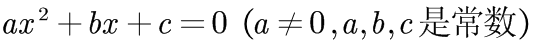

这种形式叫做一元二次方程的一般形式。其中：ax<sup>2</sup>是二次项，a是二次项系数；bx是一次项，b是一次项系数；c是常数项。

（注意：要想得到一元二次方程的二次项系数、一次项系数、常数项，必须先得到它的一般形式，因为它们都是根据一元二次方程的一般形式确定的）

**3、一元二次方程的解（根）**

使一元二次方程等号两边相等的未知数的取值，叫做一元二次方程的解，又叫做根。

注意：如果一元二次方程有解，那么解的数量可能是一个（在解是一个的情况下我们有时也称该方程有两个解，并且这两个解相同），也可能是两个。


## 解一元二次方程—直接开平方法

根据平方根的意义，运用直接开平方法求得一元二次方程的解，这种方法叫做直接开平方法。

​	

​	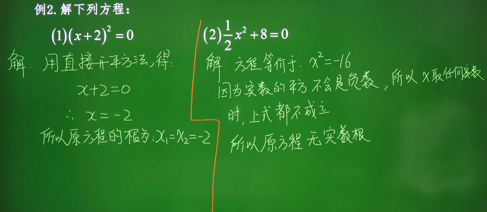

直接开平方法针对的是形如 (x+m)<sup>2</sup>=n (n≥0) 的一元二次方程，

* 当n>0时，一元二次方程有两个不相等的实数根。
* 当n=0时，一元二次方程有两个相等的实数根。
* 当n<0时，一元二次方程无解。


## 解一元二次方程—配方法

将一元二次方程转换为 (x+m)<sup>2</sup>=n (n≥0) 的形式，然后利用直接开平方法对其进行求解，这种方法叫做配方法。配方法的关键是配方，方法是：<u>左边常数项的为一次项系数一半的平方</u>，然后利用等式性质对方程进行变形。

​	

示例如下：

​	


## 解一元二次方程—公式法

用配方法解一般形式的一元二次方程 ax<sup>2</sup>+bx+c=0(a≠0)，可得：

​		

这叫做求根公式，用求根公式解一元二次方程的方法叫做公式法。其中b<sup>2</sup>-4ac叫做一元二次方程ax<sup>2</sup>+bx+c=0(a≠0)的判别式，通常用“△”表示它，即△=b<sup>2</sup>-4ac

1）当△>0时，该一元二次方程有两个不相同的实数根。

2）当△=0时，该一元二次方程有两个相同的实数根。

3）当△<0时，该一元二次方程无解。

求根公式的推导过程如下：

​	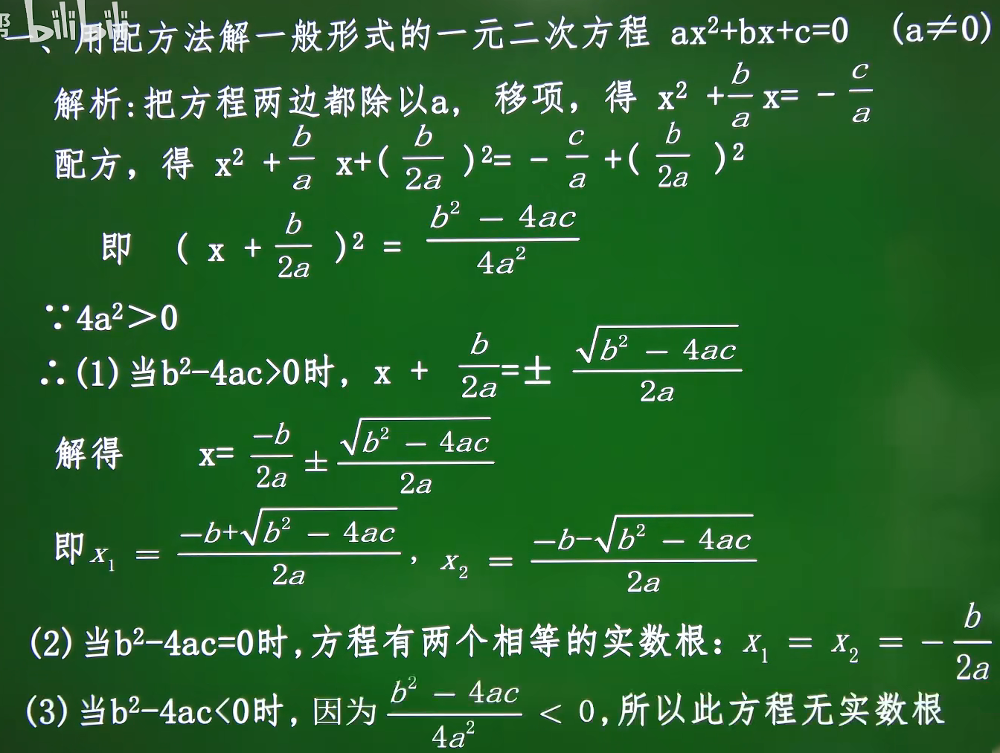

使用公式法解一元二次方程的步骤：

1）将一元二次方程变成一般形式（如果各项系数能够化成整数则化成整数，以方便计算）

2）计算b<sup>2</sup>-4ac的值，确定根的个数。

3）如果方程有解，利用求根公式计算根。

4）作答。


## 解一元二次方程—因式分解法

用分解因式解一元二次方程的方法称为因式分解法。使用因式分解法解一元二次方程的步骤是：

1）化方程为一般形式。

2）将方程左边因式分解。

3）根据“至少有一个因式为零”，转化为两个一元一次方程。

4）分别解两个一元一次方程，它们的根就是原方程的根。


## 解一元二次方程—十字相乘法

**1、二次项系数为1时**

二次项系数为1时：

* 将二次项x<sup>2</sup>分解为x与x相乘
* 将常数项分解为两个数相乘，并且这两个数与二次项的两个分解数交叉相乘后，然后相加等于一次项
* 最后水平相加，再将两和相乘。

​	

​	上式中，二次项系数为1，将二次项x<sup>2</sup>分解为x与x的乘积，将3分解为-1与-3的乘积，将它们交叉相乘然后再相加-1x+-3x=-4x等于一次	项，最后将它们水平相加，再将两和相乘得：(x-1)·(x-3)=0，解得x<sub>1</sub>=1、x<sub>2</sub>=3

**2、二次项系数不为1时**

二次项系数不为1时：

* 将二次项分解为系数不同但都带有未知数的两项的乘积
* 将常数项分解为两数相乘，并且这两个数与二次项的两个分解数交叉相乘后，然后相加等于一次项
* 最后水平相加，再将两和相乘。

​	

​	上式中，二次项系数不为1，将二次项2x<sup>2</sup>分解为x与2x的乘积，将-3分解为3与-1的乘积，将它们交叉相乘后再相加-x+6x=5x等于一次	项，最后将它们水平相加，再将两和相乘得：(x+3)·(2x-1)=0，解得x<sub>1</sub>=-3、x<sub>2</sub>=1/2

注意：

（1）使用十字相乘法必须先将二元一次方程化为一般形式。

（2）在十字中，各个数的位置是很重要的。

（3）使用十字相乘法时，关键是二次项、常数的分解，如果分解麻烦，可以考虑其他方法求解。


## 一元二次方程的根与系数的关系

如果一元二次方程 ax<sup>2</sup>+bx+c=0 (a≠0) 的两个实数根是x<sub>1</sub>、x<sub>2</sub>，那么：

​	

证明如下：

​	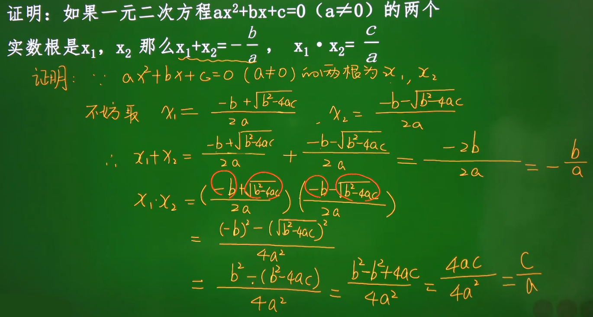


# 22. 二次函数

## 二次函数

把形如y=ax<sup>2</sup>+bx+c（a、b、c为常数，a≠0）的函数叫做二次函数，其中x是自变量，a、b、c分别是函数解析式的二次项系数、一次向系数和常数项。

1）二次函数的自变量最高次一定为2，且二次项系数a不能等于0，否则就变成了一次函数；而另外的一次项和常数项不做要求。

2）二次函数y=ax<sup>2</sup>+bx+c（a、b、c为常数，a≠0）的几种不同表示形式如下：

* y=ax<sup>2</sup>（a≠0，b=0，c=0）
* y=ax<sup>2</sup>+bx（a≠0，b≠0，c=0）
* y=ax<sup>2</sup>+c（a≠0，b=0，c≠0）
* y=ax<sup>2</sup>+bx+c（a≠0，b≠0，c≠0）


## 描点法

​	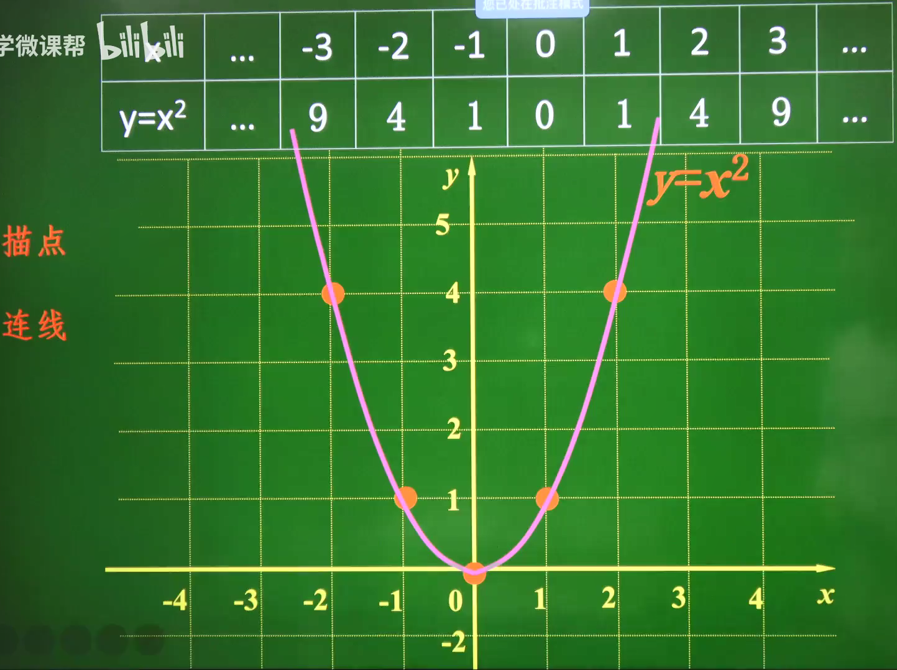

​		可以发现，y=x<sup>2</sup>的图像是一个开头向上的抛物线图像。、


## 二次函数的抛物线

二次函数的图像如物体抛射时所经过的路线，我们把它叫做抛物线（二次函数的图像都是抛物线，要么是开口向上，要么开口向下）

​		

抛物线有如下性质：

1）二次函数的抛物线是对称的，对称轴与抛物线的交点叫做抛物线的顶点。

2）抛物线开口向上时，顶点是最低点，也是该函数的最小值；抛物线开口向下时，顶点是最高点，也是该函数的最大值。

3）抛物线开口向上时（二次项系数a>0），对称轴左边的y值随着x的增大而减小，对称轴右边的y值随着x的增大而增大；抛物线开口向下时（二次项系数a<0），对称轴左边的y值随着x的增大而增大，对称轴右边的y值随着x的增大而减小。

由于二次函数的图像就是抛物线，所以所有二次函数都拥有这些性质。


## 二次函数y=ax^2的图像与性质

1）当a>0时，二次函数y=ax<sup>2</sup>的对称轴是y轴；顶点是原点，并且顶点是抛物线的最低点；抛物线开口向上；a越大，抛物线的开口越小。

​			

2）当a<0时，二次函数y=ax<sup>2</sup>的对称轴是y轴，顶点是原点，并且顶点是抛物线的最高点；抛物线开口向下；a越小，抛物线的开口越小。

​			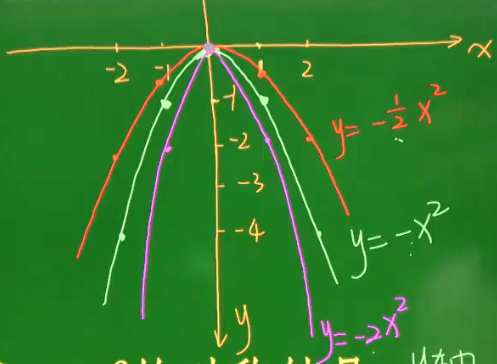

3）y=ax<sup>2</sup>与y=-ax<sup>2</sup>的图像关于x轴对称。

二次函数y=ax<sup>2</sup>的图像的性质如下：

（1）a>0时，开口向上，顶点是最低点，表示该函数的最小值；a<0时，开口向下，顶点是最高点，表示该函数的最大值；

（2）|a|越大，抛物线的开口越小；

（3）关于y轴对称，即关于x=0对称（使得二次项值为0的x值）；

（4）顶点是原点。

（5）抛物线开口向上时（二次项系数a>0），对称轴左边的y值随着x的增大而减小，对称轴右边的y值随着x的增大而增大；抛物线开口向下时（二次项系数a<0），对称轴左边的y值随着x的增大而增大，对称轴右边的y值随着x的增大而减小。

​		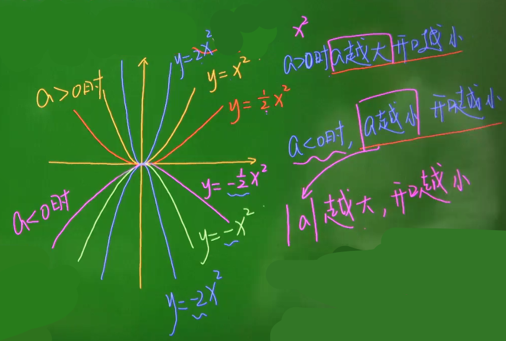


## 二次函数y=ax^2+k的图像与性质（上下平移）

二次函数y=ax<sup>2</sup>+k的图像可由y=ax<sup>2</sup>的图像向上、向下平移得到，

* 当k>0时，即ax<sup>2</sup>+k，表示向上平移k个单位
* 当k<0时，即ax<sup>2</sup>-k，表示向下平移k个单位

二次函数y=ax<sup>2</sup>+k图像的性质如下：

1）当a>0时，开口向上，顶点是最低点，表示该函数的最小值；当a<0时，开口向下，顶点是最高点，表示该函数的最大值；

2）|a|的绝对值越大，开口越小；

3）对称轴是y轴，即直线x=0（使得二次项值为0的x值）；

4）顶点坐标是(0,k)

5）抛物线开口向上时（二次项系数a>0），对称轴左边的y值随着x的增大而减小，对称轴右边的y值随着x的增大而增大；抛物线开口向下时（二次项系数a<0），对称轴左边的y值随着x的增大而增大，对称轴右边的y值随着x的增大而减小。


## 二次函数y=a(x-h)^2的图像与性质（左右平移）

二次函数y=a(x-h)<sup>2</sup>的图像可由y=ax<sup>2</sup>的图像向左、向右平移得到，

* 当h<0时，即y=a(x+h)<sup>2</sup>，表示x轴向左平移h个单位
* 当h>0时，即y=a(x-h)<sup>2</sup>，表示x轴向右平移h个单位

记为“左加右减”，即左移则加右移则减。二次函数y=a(x-h)<sup>2</sup>图像的性质如下：：

1）当a>0时，开口向上，顶点是最低点，表示该函数的最小值；当a<0时，开口向下，顶点是最高点，表示该函数的最大值；

2）|a|的绝对值越大，开口越小；

3）对称轴是直线x=h（使得二次项值为0的x值）

4）顶点坐标是(h,0)；

5）抛物线开口向上时（二次项系数a>0），对称轴左边的y值随着x的增大而减小，对称轴右边的y值随着x的增大而增大；抛物线开口向下时（二次项系数a<0），对称轴左边的y值随着x的增大而增大，对称轴右边的y值随着x的增大而减小。


## 二次函数的顶点式y=a(x-h)^2+k的图像与性质（左右上下平移）

二次函数的顶点式如下：

​	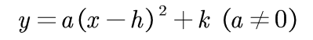

二次函数顶点式是由图像y=ax<sup>2</sup>向左向右水平移动x-h和向上向下垂直移动+k得到的，图像性质如下：

1）当a>0时，开口向上，顶点是最低点，表示该函数的最小值；当a<0时，开口向下，顶点是最高点，表示该函数的最大值；

2）|a|的绝对值越大，开口越小；

3）对称轴是x=h（使得二次项值为0的x值）

4）顶点坐标为（h, k)

5）抛物线开口向上时（二次项系数a>0），对称轴左边的y值随着x的增大而减小，对称轴右边的y值随着x的增大而增大；抛物线开口向下时（二次项系数a<0），对称轴左边的y值随着x的增大而增大，对称轴右边的y值随着x的增大而减小。

​	


## 二次函数一般式y=ax^2+bx+c的图像与性质

**1、二次函数一般式与顶点式的转换**

对于二次函数的一般式y=ax<sup>2</sup>+bx+c，计算出它的对称轴和顶点坐标是有点复杂的，而通过二次函数的顶点式却可以轻松计算出对称轴和顶点坐标，所以可以利用配方法将二次函数一般式转换为二次函数顶点式，从而轻松地计算出该二次函数的对称轴和顶点坐标。比如：

​	 

其通用方法如下：

​	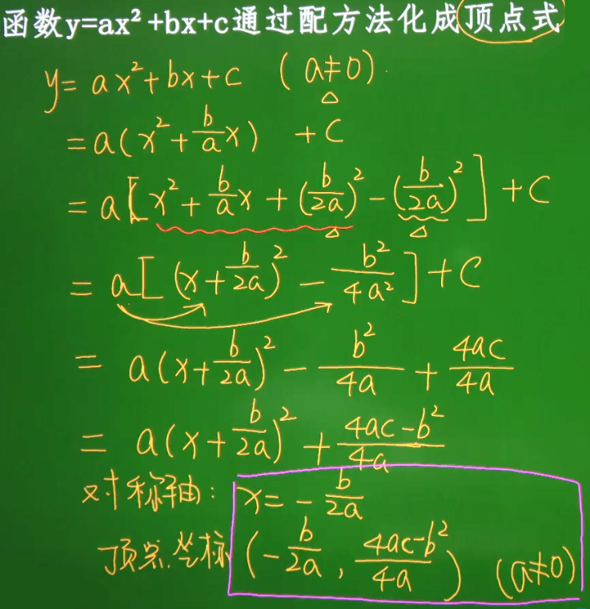

从中可以直接得到二次函数一般式的对称轴和顶点坐标公式：

​	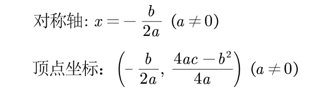

 以后计算二次函数的对称轴和顶点坐标时，可以直接使用该公式计算。

**2、二次函数一般式y=ax<sup>2</sup>+bx+c（a≠0）的图像和性质**

​		


## 二次函数与一元二次方程

当二次函数y=ax<sup>2</sup>+bx<sup>2</sup>+c（a≠0）的y取确定的值时，实际上就变成了一元二次方程。例如y取0时可得：0=ax<sup>2</sup>+bx<sup>2</sup>+c（a≠0），该一元二次方程的不同解的个数就是该二次函数的图像与x轴交点的个数。

​	

​	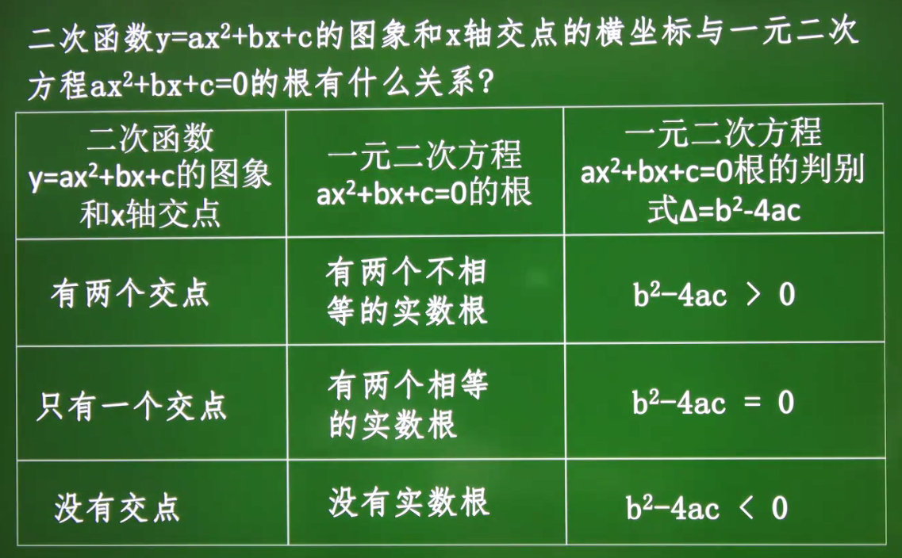


# 23. 旋转

## 旋转的定义与基本性质

**1、旋转的定义**

把一个图形绕着某一定点O转动一定角度的图形变换叫做旋转，这个定点O叫旋转中心，转动的角叫做旋转角，如果图形上的点P经过旋转变为点P'，那么点P和P'叫做这个旋转的对应点。

​	

**2、旋转的基本性质**

旋转的基本性质如下：

（1）旋转前、后的图形全等。

（2）对应点到旋转中心的距离相等。

（3）每一对对应点与旋转中心所连线段的夹角等于旋转角。


## 中心对称

把一个图形绕着某一个点旋转180<sup>。</sup>，如果它能够与另一个图形重合，那么就说这两个图形关于这个点对称或中心对称，这个点叫做对称中心。这两个图形中的对应点叫做关于中心的对称点（对称点有无数对）。例如下图中△OCD和△OAB关于点O对称，点C与点A是关于点O的对称点：

​	

性质：

（1）关于中心对称的两个图形，对称点所连线段经过对称中心，并且被对称中心所平分。（多条对称点所连线段的交点就是对称点）

（2）关于中心对称的两个图形是全等图形。


## 中心对称图形

**1、中心对称图形**

把一个图形绕着某一个点旋转180<sup>。</sup>，如果旋转后的图形能够与原来的图形重合，那么这个图形叫做中心对称图形，这个点就是它的对称中心。

**2、中心对称与中心对称图形的区别与联系**

中心对称与中心对称图形是两个既有联系又有区别的概念。

1）区别：中心对称图形指两个全等图形的相互位置关系，中心对称图形指一个图形本身成中心对称。

2）联系：

* 如果将中心对称的两个图形看成一个整体，则它们是中心对称对称图形。
* 如果将中心对称图形对称的两个部分看成两个图形，则它们成中心对称。


## 点的对称

在平面直角坐标系中：

（1）关于x轴对称的两点，横坐标相同，纵坐标互为相反数

（2）关于y轴对称的两点，纵坐标相同，横坐标互为相反数

（3）关于原点对称的两个点，它们的横坐标纵坐标均互为相反数

​	


# 24. 圆

## 认识圆

如图，在一个平面内，线段OA绕它固定的一个端点O旋转一周，另一个端点A所形成的图形叫做圆。

​	

其中，固定的端点O叫做圆心，线段OA叫做圆的半径，以点O为圆心的圆，记作“⊙O”，读作“圆O”。

1）圆上的点到定点（圆心O）的距离都等于定长（半径r）

2）到定点（圆心O）的距离等于定长（半径r）的点都在同一个圆上.

归纳：圆心为O，半径为r的圆可以看成是所有到定点O的距离等于定长r的点的集合。


## 与圆有关的概念

​	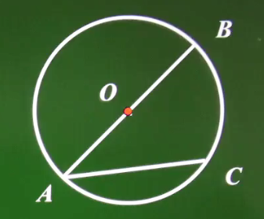

1）弦：连接圆上任意两点的线段叫做弦。如图中的AC

2）直径：经过圆心的弦叫做直径。如图中的AB

3）弧：圆上任意两点间的曲线部分叫做圆弧，简称弧。以A、B为端点的弧记作，读作“圆弧AB”或“弧AB”。（注意：在表示弧时，字母顺序无要求，弧AB与弧BA是同一条弧。）

4）半圆：原的任意一条直径的两个端点把圆分成两条等长的弧，每一条弧都叫做半圆。

5）劣弧：小于半圆的弧叫做劣弧。如图中的

6）优弧：大于半圆的弧叫做优弧，用三个字母表示。如图中的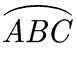

7）同心圆：圆心相同的圆，称为同心圆。

8）等圆：能够重合的圆叫做等圆。

9）等弧：在同圆或等圆中，能够互相重合的弧叫做等弧。

10）弦心距：圆心到弦的垂线段的长度称为这条弦的弦心距。

11）圆心角：顶点在圆心的角称为圆心角，圆心角会产生该圆心角所对的弧、该圆心角所对的弦。

12）圆周角：角的顶点在圆上，并且角两边都和圆相交，这样的角叫做圆周角。

13）同圆：相同的圆。

14）同弧：相同圆中的相同的弧。


## 垂径定理及其推论

垂径定理：垂直于弦的直径平分这条弦，并且平分弦所对应的两条弧。

​	

垂径定理的推论：

1）平分弦（不能是直径）的直径一定垂直于该弦，并且平分该弦所对的两条弧。

2）圆的两条平行弦所夹的弧相等。

​	

小诀窍：关于弦的问题，常常需要经过圆心作弦的垂线段（可以是直径也可以是弦心距线段），这是一条非常重要的辅助线。


## 圆心角、弧、弦

顶点在圆心的角称为圆心角，圆心角会产生该圆心角所对的弧、该圆心角所对的弦。有：

1）定理：在同圆或等圆中，相等的圆心角所对的弧相等、所对弦相等。

2）推论1：在同圆或等圆中，如果两条弧相等，那么它所对的圆心角相等，所对的弦相等。

3）推论2：在同圆或等圆中，如果两条弦相等，那么它所对的圆心角相等，所对的弧相等。

即：在圆心角、弧、弦中，只要它们其中一个量相等，就可以确定另外两个量也是相等的。


## 圆周角定理

角的顶点在圆上，并且角两边都和圆相交，这样的角叫做圆周角。

​	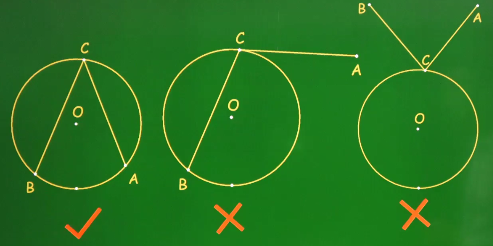

圆周角定理：一条弧所对的圆周角等于它所对的圆心角的一半。

推论：

（1）同弧或等弧所对的圆周角相等；在同圆或等圆中，相同的圆周角所对的弧相等。

（2）半圆（或直径）所对的圆周角是90<sup>。</sup>；90<sup>。</sup>的圆周角所对的弦是直径。

（3）如果三角形一边上的中线等于这条边的一半，那么这个三角形是直角三角形。


## 点和圆的位置关系

**1、点和圆的位置关系**

设⊙O的半径为r，点P到圆心的距离OP=d，则有：

1）点P在⊙O内  **↔**  d<r

2）点P在⊙O上 **↔**  d=r

3）点P在⊙O外 **↔**  d>r

​						

**2、点与圆**

1）平面上有一点A，经过已知点A的圆有无数个，圆心为点A以外的任意一点，半径为这点与点A的距离。

2）平面上有两点A、B，经过已知点A、B的圆有无数个，它们的圆心在线段AB的垂直平分线上，以线段AB的垂直平分线上的任意一点为圆心，以这点到A或B的距离为半径作圆。

3）平面上有不共线（不在一条直线上）的三点A、B、C，经过A、B、C三点的圆只有1个，圆心为任意两条线段的垂直平分线的交点，半径为圆心到A或B或C点的距离。

​		

结论：不在同一条直线上的三个点确定一个圆。

**3、三角形与圆**

由不在同一条直线上的三个点确定一个圆，可知：经过三角形三个顶点可以画一个圆，并且只能画一个，这个圆叫作该三角形的外接圆，三角形外接圆的圆心叫做这个三角形的外心，这个三角形叫做这个圆的内接三角形。

​	

三角形的外心到三角形各个顶点的距离都相等。


## 直线和圆的位置关系

**1、直线和圆的位置关系**

1）直线与圆有两个公共点时，叫做直线和圆相交，这时直线叫做圆的割线。

2）直线和圆有唯一公共点时，叫做直线和圆相切，这时直线叫做圆的切线，唯一的公共点叫做切点。

3）直线和圆没有公共点时，叫做直线和圆相离。

​	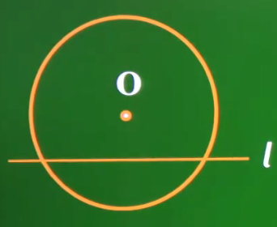				

**2、直线和圆位置关系的距离**

用圆心到直线的垂直距离d与该圆半径r的大小关系，来刻画直线与圆的距离。

1）直线l和⊙O相交  **↔**  d<r

2）直线l和⊙O相切  **↔**  d=r

3）直线l和⊙O相离  **↔**  d>r

​					

**3、直线与圆的位置关系的判定方法**

判定直线与圆的位置关系的方法有两种：

1）根据定义，由直线与圆的公共点的个数来判断；

2）根据性质，由圆心到直线的垂直距离d与半径r的大小关系来判断。

​	


## 切线及其判定

**1、切线**

经过半径的外端并且垂直于这条半径的直线是圆的切线。

​	

几何语言：  ∵ OA⊥l且A是半径外端	 ∴ l是⊙O的切线

**2、切线的性质定理**

圆的切线垂直于过切点的半径。如下图直线l垂直于过切点的半径OA：

​	

**3、内切圆和内心的定义**

与三角形各边都相切且位于三角形内部的圆叫做三角形的内切圆。内切圆的圆心是三角形三条角平分线的交点，叫做三角形的内心。

​	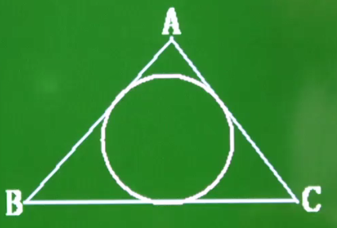

**4、过圆外一点作圆的切线**

过⊙O外一点可以作该圆的两条切线。作法如下：

1）连接圆心O与圆外点P，构成一条线段。

2）找出OP线段的中点，然后以点P为圆心，以二分之一的OP长度为半径作一个大圆。

3）大圆与小圆相交两点A、B

4）连接OA和OB，OA⊥AP，AP为切线，OB⊥BP，BP为切线。

​	

**5、切线长**

在经过圆外一点的切线上，这一点和切点之间的线段叫做这点到圆的切线长。如下图中的线段PA、PB

​	

注意：切线是一条与圆相切的直线，不能度量。而切线长是线段的长，这条线段的两个端点分别是圆外一点和切点，可以度量。

切线长定理：从圆外一点引圆的两条切线，它们的切线长相等，圆心和这一点的连线平分该点两条切线的所形成的夹角。

​	

几何语言：∵ PA、PB分别切⊙O于A、B， ∴ PA=PB，OP平分∠APB

**6、圆的外切四边形**

圆的外切四边形的两组对边的和相等。

​	


## 圆和圆的位置关系

**1、圆和圆的位置关系**

圆和圆的位置关系分为相离、相切、相交三种。

1）相离：没有公共点；相离又分为外离、内含（内含包括了同心圆的情况）两种情况。

​	

2）相切：有一个公共点；相切又分为外切、内切两种情况。

​	

3）相交：有两个公共点。

​	

**2、连心线与圆心距**

连接两个圆心的直线叫做连心线，如果有切点则连心线一定过切点。下图中直线O<sub>1</sub>O<sub>2</sub>是连心线且过切点T。

两圆心之间的距离叫做圆心距，记作：O<sub>1</sub>O<sub>2</sub>=d。

​	

两圆外切时，整个图形是轴对称图形，对称轴是连心线，连心线过切点。

**3、使用圆心距刻画圆和圆的位置关系**

d表示圆心距，R表示大圆的半径，r表示小圆的半径。有：

（1）外离

​		

（2）外切

​		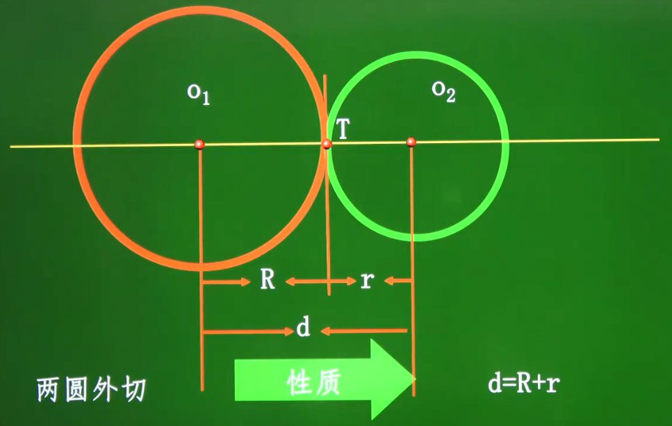

（3）内切

​		

​		如果没告诉哪个是大圆半径和哪个是小圆半径，可以使用绝对值表示：d=|R-r|

（4）相交

​		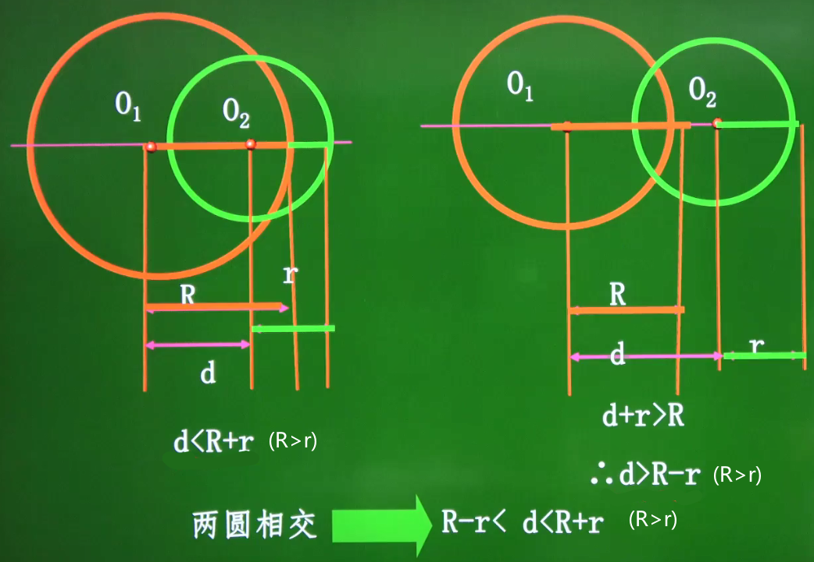

（5）内含

​		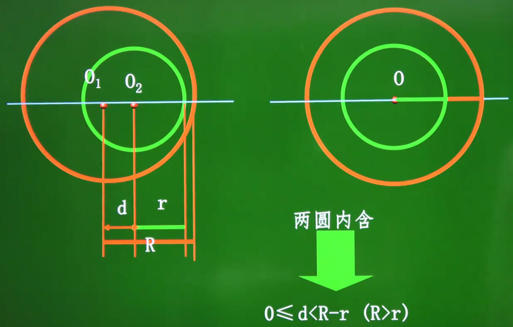

结论：

​	


## 正多边形和圆

**1、正多边形**

各边相等，各角也相等的多边形叫做正多边形。

​	

正n边形：如果一个正多边形有n条边，那么这个正多边形叫做正n边形（n≥3）。

**2、正多边形和圆**

圆的内接正n边形与圆的外切正n边形把圆分成n（n≥3）等份。

1）依次连接各分点所得的多边形是这个圆的内接正n边形；而这个圆称为正n边形的外接圆。

​		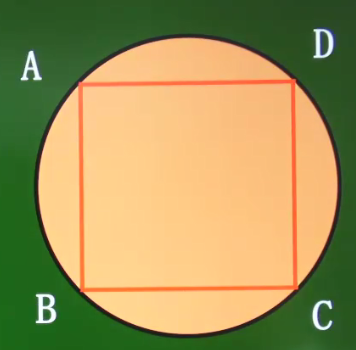

2）经过各分点所作圆的切线，以相邻切线的交点为顶点的多边形是这个圆的外切正n边形，而这个圆称为正n边形的内切圆。

​		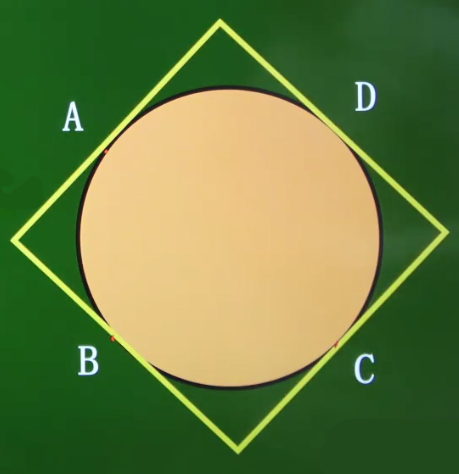

**3、正多边形的相关概念**

正多边形的中心：一个正多边形的外接圆的圆心。

正多边形的半径：外接圆的半径。

正多边形的中心角：正多边形的每一条边所对的圆心角。

正多边形的边心距：中心到正多边形的一边的垂直距离。

​	


## 弧长和扇形面积

**1、弧长公式**

若圆的半径为r，则n<sup>。</sup>圆心角所对的弧长l为： 

​	

递推过程如下：

（1）半径为r的圆的周长为：

​		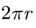

（2）1<sup>。</sup>圆心角所对的弧长为：

​		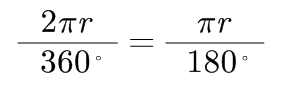

（3）n<sup>。</sup>圆心角角所的弧长为：

​		

**2、扇形面积公式**

由组成圆心角的两条半径和圆心角所对的弧所围成的图形叫扇形。若圆半径为r，则扇形面积公式为：

​	

递推过程如下：

（1）半径为r的圆的面积为：

​			

（2）1<sup>。</sup>圆心角所对的扇形面积为：

​			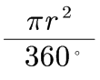

（3）n<sup>。</sup>圆心角所对的扇形面积为：

​			

**3、弧长与扇形面积的关系**

弧长公式为：

​	

扇形面积公式为：

​	

则用弧长表示扇形面积的公式为：

​	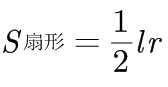


## 圆锥及其面积公式

**1、圆锥**

圆锥可以看做是一个直角三角形绕着它的一条直角边旋转一周所成的图形。

**2、圆锥的相关概念**

​	

（1）母线：连接圆锥顶点与底面圆周上的任意一点的线段叫做圆锥的母线。圆锥的母线有无数条。

（2）高：连接圆锥顶点与底面圆心的线段叫做圆锥的高。

（3）侧面：由直角三角形旋转时斜边所成的一个曲面。

（4）底面半径：底面圆的半径。

（5）底面：圆锥的底面，它是一个圆。

（6）圆锥的轴截面：直角三角形围绕高旋转时所形成的一个面，如上图中的△ABC。轴截面有无数个。

**3、圆锥的底面半径、母线及其高的关系**

设圆锥的底面半径为r，母线长为l，高为h，它们满足勾股定理，有：l<sup>2</sup>=r<sup>2</sup>+h<sup>2</sup>

​		

即：OA<sup>2</sup>+OB<sup>2</sup>=AB<sup>2</sup>

**4、圆锥的侧面积与全面积**

1）圆锥的侧面展开后是一个扇形。如图，设圆锥的母线长为l，底面半径为r：

​		

可知该扇形的半径为母线l；弧长是根据底面圆周展开的，所以弧长为底面圆的周长，即弧长为2πr。已知半径和弧长，可知圆锥侧面扇形的面积公式为：

​	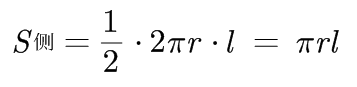

注意：这里的l表示的是圆锥的母线，也是扇形的半径，而不是表示弧长。

2）圆锥的全面积等于该圆锥的侧面积加上底面的面积：

​	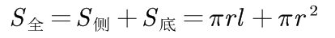


# 25. 概率初步

## 随机事件

一定条件下：

* 必然发生的事件叫必然事件；
* 必然不会发生的事件叫不可能事件；
* 可能会发生，也可能不发生的事件叫不确定事件或随机事件。

一般地，随机事件发生的可能性是有大小的，不同的随机事件发生的可能性的大小有可能不同。

​	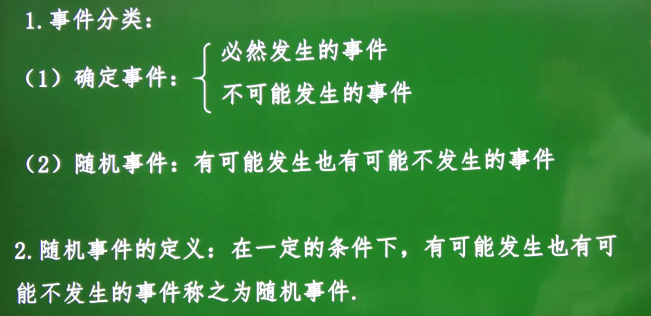


## 概率

**1、概率**

一般地，随机事件A发生的可能性是有大小的，我们把刻画其发生可能性大小的数值，称为随机事件A发送的概率，记为：P(A)

注意：事件一般用大写英文字母A，B，C...表示。

**2、概率的计算方法**

一般地，如果在一次试验中，有n种可能的结果，并且它们发生的可能性相等，事件A包含其他的m种结果，那么事件A发生的概率P(A)为：

​	

注意：在n种可能的结果中，事件A发生的频数m满足0≤m≤n，两边同时除以n，所以有：

​	

因此0≤P(A)≤1。

（1）当m=n时，A为必然事件，概率P(A)=1

（2）当m=0时，A为不可能事件，概率P(A)=0

​	


## 计算概率—列举法

1）当随机事件发生的可能性是有限的等可能时，我们可以直接使用列举法来计算概率。

​		

2）如果随件事件发生的可能性依赖于多个事物时，我们可以借助列表来计算概率。

​		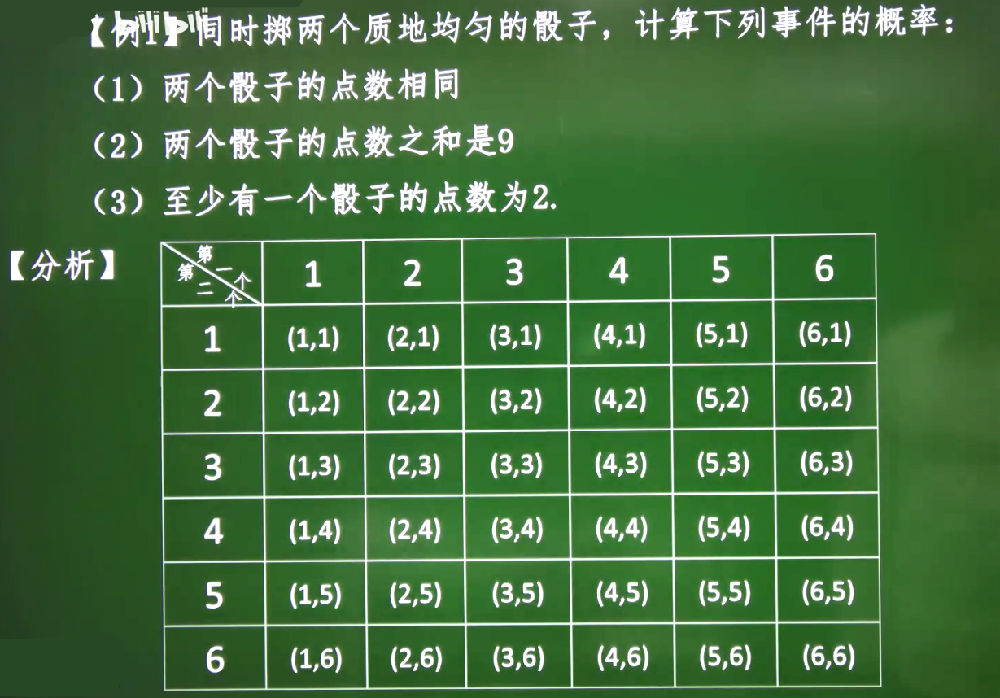

​		

3）当随件事件发生的可能性依赖于多个事物时，除了可以借助列表来计算概率，还可以借助树状图来计算概率。

​		


## 计算概率—频率估计法

一般地，在大量重复试验中，如果事件A发生的频率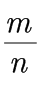稳定在某个常数p附近，那么这个常数p就叫做事件A的概率，记为P(A)=p。

​	

由上图可知，抛硬币正面向上的频率稳定在0.5附近，所以可知抛硬币正面向上的概率为二分之一。


# 26. 反比例函数

## 反比例函数

一般地，把形如

​			

的函数称为反比例函数。

1）反比例函数的自变量x的取值范围是不等于0的一切实数。

2）反比例函数可以变形为以下形式：

​		


## 反比例函数的图像与性质

反比例函数的图像是双曲线。

​		

1）当k>0时，图像的两个分支分布在第一、三象限内，在每个象限内，y随x的增大而减小；当k<0时，图像的两个分支分布在第二、四象限内，在每个象限内，y随x的增大而增大。

2）当k>0时，x和y的值是同号的；当k<0时，x和y的值都是异号的。

3）反比例函数图像关于原点对称，且关于直线y=x和y=-x对称。

​	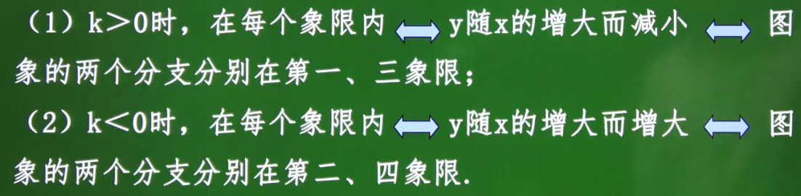

​	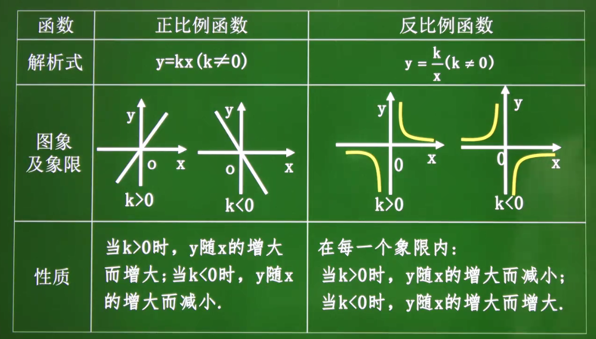


## * 待定系数法

待定系数法即先把解析式设出来，然后运用已知条件把那些待定的系数解出来，通常有几个待定系数就需要几个条件，每个条件可以列出一个方程。


# 27. 图形的相似

## 图形的相似

1）把形状相同的图形叫做相似图形。

​		

2）相似多边形：边数相同的两个多边形，若对应角相等，对应边比例也相等，则这两个多边形相似。

​	

3）相似比：相似多边形对应边的比称为相似比。（相似比为1时，相似的两个图形全等）

​	

4）比例线段：对于四条线段，a、b、c、d，如果其中两条线段的比（即它们长度的比）与另两条线段的比相等，如a:b=c:d（即ad=bc），我们就称这四条线段是成比例线段，简称比例线段。


## 相似三角形

​	

如果两个三角形的对应角相等，对应边的比也相等：

​	

则△ABC与△DEF相似，记作△ABC∽△DEF，相似比为k。（注意：△ABC∽△DEF意味着A的对应点是D，B的对应点时E，C的对应点时F，它们的对应顺序不能乱）


## 平行线分线段成比例定理及其推论

平行线分线段成比例定理：三条平行线截两条直线所得的对应线段的比相等。

​	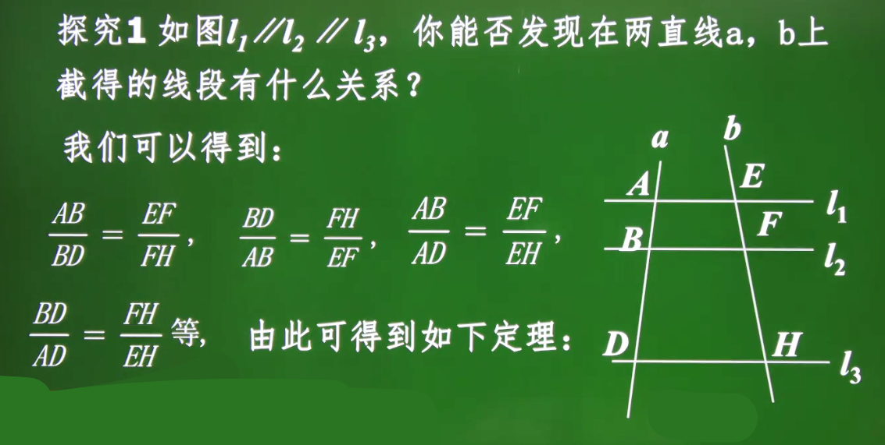

推论：平行于三角形一边的直线截其他两边（或两边的延长线）所得的对应线段成比例。

​	


## 相似三角形的判定

判断两个三角形是否相似，有以下4种方法：

方法1：通过定义判定，三个角对应相等，三边对应成比例也相等的两个三角形相似。

方法2：三边对应成比例。

方法3：平行于三角形一边的直线。

方法4：两边对应成比例且夹角相等。

方法5：两角对应相等。

**1、定义法**

如果一个三角形的三条边和另一个三角形的三条边对应成比例且相等，并且三个角也对应相等，那么这两个三角形相似。（定义法不常用，因为它要找出所有条件，但判定三角形相似与判定三角形全等类似，并不需要找出所有条件）

**2、三边法**

如果一个三角形的三条边和另一个三角形的三条边对应成比例，那么这两个三角形相似。（三边对应成比例，两三角形相似）

​	

**3、平行线法**

平行于三角形一边的直线与其他两边（或延长线）相交，所得的三角形与原三角形相似。（利用平行线分线段等比例定理推）

​	

**4、两边夹角法**

如果一个三角形的两条边与另一个三角形的两条边对应成比例相等，并且夹角相等，那么这两个三角形相似。（两边对应成比例相等且夹角相等，两三角形相似）

​	

注意：如果是判断两个直角三角形是否相似时，当斜边和一条直角边成比例时，这两个直角三角形相似。

**5、两角相等法**

两个三角形的三个角对应相等，则这两个三角形相似。但实际上，可以将其写为：两个角分别对应相等的两个三角形相似（因为两个角分别对应相等，根据三角形内角和定理，另外一个角也一定对应相等）

​	


## 相似三角形的性质

1）相似三角形周长的比等于相似比。证明如下：

​		

​		推论：两个相似多边形周长的比也等于相似比。

2）相似三角形的对应高线之比，对应角平分线之比，中线之比，都等于相似比。

3）相似三角形面积的比等于相似比的平方。

​		

​		推论：相似多边形面积的比等于相似比的平方。


# 28. 锐角三角函数

## 正弦

**1、引入**

1）在Rt△ABC中，∠C=90<sup>。</sup>，当∠A=30<sup>。</sup>时，∠A的对边与斜边的比等于是一个固定值；（这其实就是：在有一个30<sup>。</sup>的直角三角形中，30<sup>。</sup>所对的边是斜边的一半）当∠A=45<sup>。</sup>时，∠A的对边与斜边的比都等于，也是一个固定值。

2）在直角三角形中，当锐角A的度数一定时，不管三角形的大小如何，∠A的对边与斜边的比也是一个固定值。

**2、正弦的概念**

在直角三角形中，角的对边与斜边的比称为该角的正弦。例如在Rt△ABC中，∠C=90<sup>。</sup>，我们把锐角A的对边与斜边的比叫做∠A的正弦，记作sinA（某个角的正弦值等于该角的对边比斜边）

​	

1）sinA是在直角三角形中定义的，∠A是锐角；

2）sinA是一个比值（数值）；

3）sinA的大小只与∠A的大小有关，而与直角三角形的边长无关。（如果两个角的度数两相同，那么这两个角的正弦值也相同）

相应的，锐角B的对边与斜边的的比叫做∠B的正弦，记作sinB。

**3、特殊锐角的正弦值**

​	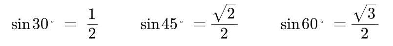


## 余弦、正切

​	

**余弦**：在直角三角形中，角的邻边与斜边的比称为该角的余弦。例如在Rt△ABC中，∠C=90<sup>。</sup>，我们把锐角A的邻边与斜边的比叫做∠A的余弦，记作cosA（某个角的余弦值等于该角的邻边比斜边）

**正切**：在直角三角形中，角的对边与邻边的比称为该角的正切。例如在Rt△ABC中，∠C=90<sup>。</sup>，我们把锐角A的对边与邻边的比叫做∠A的正切，记作tanA（某个角的正切值等于该角的对边比邻边）

​	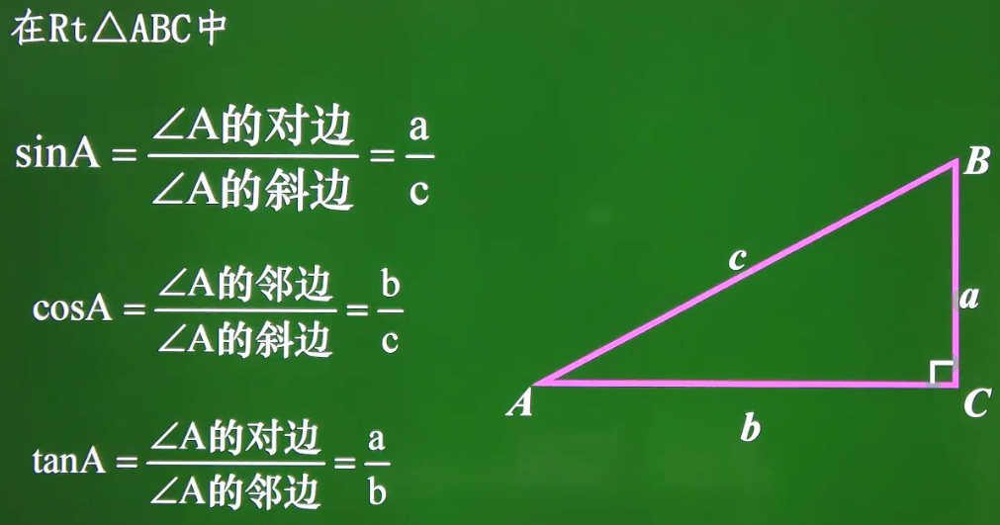


## 特殊锐角的三角函数值及其性质

特殊锐角三角形函数值如下（推导过程见视频）：

​	

1）一个锐角的正弦值等于这个角余角的余弦值。

​		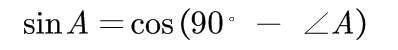

2）一个锐角的余弦值等于这个角余角的正弦值。

​		

3）一个锐角的正切值与这个角余角的正切值互为倒数。（互为倒数的两个数相乘为1）

​		

说明：cos<sup>2</sup>A表示的是（cosA）<sup>2</sup>

