# 1. 集合与函数概念

## 集合的含义与表示

**1、集合的有关概念**

1）元素：把研究的对象称为元素。（一般常用小写字母a,b,c···表示元素）

2）集合：把一些元素组成的总体叫做集合，简称集。（一般常用大写字母A,B,C···表示集合）

注意：组成集合的元素可以是物、数、点等等。

**2、集合的三大特性**

（1）确定性：集合中的元素必须是确定的。

（2）互异性：集合中的元素必须是互不相同的。

（3）无序性：集合中的元素是无先后顺序的，集合中的任何两个元素都可以交换位置。

只要构成两个集合的元素是一样的，我们就称这两个集合是相等的。

**3、重要数集**

（1）N：自然数集（含0），即非负整数集

（2）N+或N*：正整数集（不含0）

（3）Z：整数集

（4）Q：有理数集

（5）R：实数集

**4、元素对于集合的关系**

（1）属于（belong to）：如果a是集合A中的元素，就说a属于A，记作a∈A

（2）不属于（not belong to）：如果a不是集合A中的元素，就说a不属于A，记作a∉A

**5、集合的分类**

（1）有限集：含有限个元素的集合

（2）无限集：含无限个元素的集合

（3）空集：不含任何元素的集合（空集记作Ø，空集也是集合）

**6、集合的表示方法**

（1）列举法：将集合中的元素一一列举出来，并用花括号 { } 括起来的方法叫做列举法。

（2）描述法：将集合的所有元素都具有的性质（满足的条件）表示出来，写成 {x|p(x)} 的形式。其中x表示被描述的对象p(x)被描述对象的特征。

​	

## 集合间的基本关系

**1、子集**

对于两个集合A与B，如果集合A中的任意一个元素都是集合B中的元素，我们就说这两个集合有包含关系，称集合A为集合B的子集（subset)，记作A⊆B，读作A包含于B，或记作B⊇A，读作B包含A。

​		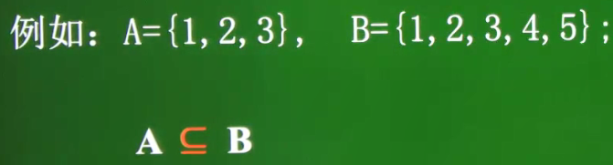

​		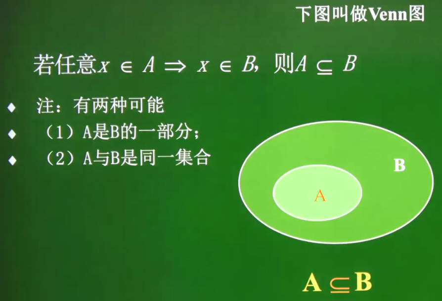

注意，包含关系有两种可能：

（1）A是B的一部分。

（2）A与B是相同的集合（此时两者相互包含，互为子集）。

**2、真子集**

对于两个集合A与B，如果A⊆B，但存在元素x∈B且x∉A，则称集合A是集合B的真子集（proper subset），记作A⫋B，读作A真包含于B。

​		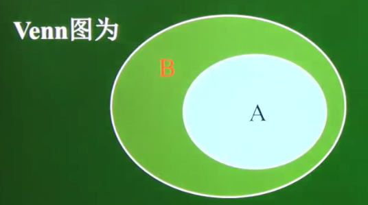

**3、集合相等**

对于两个集合A与B，如果集合A中的任意一个元素都是集合B的元素，同时集合B中的任意一个元素都是集合A的元素，则称集合A等于集合B，记作A=B。（若A⊆B且B⊇A，则A=B）

**4、重要结论**

（1）空集是任何集合的子集Ø⊆A。

（2）空集是任何非空集合的真子集Ø⫋A。

（3）任何一个集合是它本身的子集A⊆A。

（4）对于集合A、B、C，如果A⊇B且B⊇C，则A⊇C。

## 集合的基本运算

**1、并集与交集**

1）并集：把属于集合A或集合B的所有元素组成的集合叫做A与B的并集，记作A∪B，读作A并B，即A∪B = {x|x∈A或x∈B}。（并集可以理解为是把多个集合进行合并，然后去掉重复元素而得到的集合）

​				

2）交集：把属于集合A且又属于集合B的所有元素组成的集合叫做A与B的交集，记作A∩B，读作A交B，即A∩B = {x|x∈A且x∈B}。（交集可以理解为是多个集合的公共元素组成的集合）

​				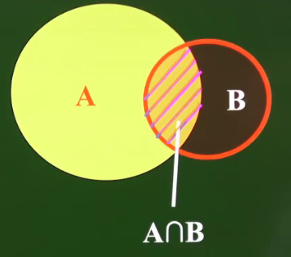

**2、相关性质**

​	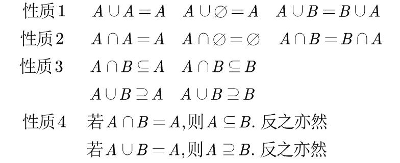

**3、全集与补集**

1）全集：如果一个集合含有我们所要研究的各个集合的全部元素，就称这个集合为全集（universer set），全集常用大写字母U表示。

2）补集：对于一个集合A，由集合U中不属于A的所有元素组成的集合，称为集合A相对于全集U的补集（complementary set），简称集合A的补集，记作CUA，读作集合A相对于全集U的补集，即CUA = {x|x∈U，且x∉A}。（A的补集就是全集U中除了A集合以外的元素构成的集合）

​		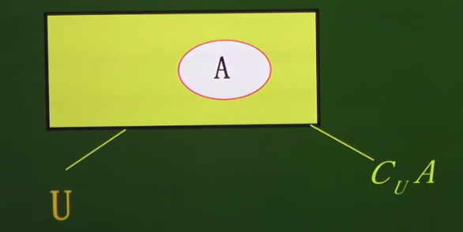

**4、集合中元素的个数**

用card来表示有限集合A中的元素个数。如：A={a,b,c}，则card(A)=3。

## 函数的概念

**1、初中阶段所学函数的复习**

设在一个变化过程中有两个变量x和y，如果对于x的每一个值，y都有唯一的值与它对应，那么就说x是自变量，y是x的函数。

1）将自变量x取值的集合叫做函数的定义域，和自变量x的值对应的y值叫做函数值，函数值的集合叫做函数的值域。

2）初中阶段学过的函数有：

* 正比例函数  y=kx（k≠0）

* 一次函数  y=kx+b（k≠0）

* 反比例函数  y=k/x（k≠0）

* 二次函数  y=ax2+bx+c（a≠0）

**2、函数的相关概念**

函数的定义：设A、B是非空的数集，如果按照某种确定的对应法则f，使得对于集合A中的任意一个数x，在集合B中都有唯一确定的数f(x)和它对应，那么就称 f: A→B为从集合A到集合B的一个函数，记作y=f(x)，x∈A。

1）定义域：x的取值范围A叫做函数的定义域。

* 偶次方被开方数必须大于等于0
* 分数的分母不能为0

2）值域：与x值相对应的y值叫做函数值，函数值的集合称为函数的值域。

**3、函数三要素**

对应法则f、定义域A、值域{f(x)|x∈A}称为函数的三要素。（判读两个函数是否是同一函数时，只有当这三要素完全相同时，这两个函数才能称为同一函数。因为值域由对应法则和定义域决定，所以在判断两个函数是否相同时，只需要判断它们的值域和对应法则是否相同即可）

​		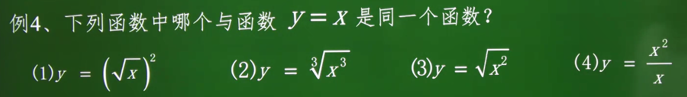

## 区间

设a、b是两个实数，且a<b，规定：

1）满足不等式 a≤x≤b 的实数的x集合叫作闭区间，表示为 [a,b]

2）满足不等式 a<x<b 的实数的x集合叫作开区间，表示为（a,b）

3）满足不等式 a≤x<b 的实数的x集合叫作半开半闭区间，表示为 [a,b）

4）满足不等式 a<x≤b 的实数的x集合也叫作半开半闭区间，表示为（a,b]

注意：

（1）对于[a,b]，(a,b)，[a,b)，(a,b] 都称数a和数b为区间的端点，其中a为左端点，b为右端点，称 b-a 为区间长度。

（2）引入区间概念后，以实数为元素的集合就有常用的两种表示方法，一是集合表示法：{x|3<x<7}；二是区间表示法：(3,7)。

（3）在数轴上，这些区间都可以用一条以a和b为端点的线段来表示，用实心点表示包括在区间内的端点，用空心点表示不包括在区间内的端点。

（4）实数集R也可以用区间表示为（-∞，+∞），“∞”读作“无穷大”，“-∞”读作“负无穷大”，“+∞”读作“正无穷大”，还可以把满足 x≥a , x>a，x≤b，x<b的实数x的集合分别表示为[a,+∞]、(a,+∞)、(-∞,b]、(-∞,b)。

## 函数的表示方法

函数的表示方法有三种：解析式法、表格法、图像法。

1）解析式法：把两个变量的函数关系，用一个等式表示，这个等式叫做函数的解析表达式，简称解析式。

* 优点：一是简明、全面地概括了变量间的关系；二是可以通过解析式求出任何一个自变量的值所对应的函数值，中学阶段研究的函数主要是用解析式法表示的函数
* 求函数解析式是函数题型之一，常用的求函数解析式的方法有：待定系数法、配凑法、换元法、解方程组法（注意定义域）等。

2）列表法：列出表格来表示两个变量的函数关系。

* 优点：不需要计算就可以直接看出与自变量的值相对应的函数值。

3）图像法：用函数图形表示两个变量之间的关系。

* 优点：能直观形象地表示出自变量的变化，相应的函数值变化的趋势，这样使得我们可以通过图像来研究函数的某些性质）

* 函数的图象通常是一段或几段光滑的曲线，但有时也可以由一些孤立点或一段几段线段组成。

## 映射

映射定义：设A、B是两个非空集合，如果按某一个确定的对应法则f，使得集合A中的任意一个元素x，在集合B中都有唯一确定的元素y与之对应，那么就成对应f：A→B为从集合A到集合B的一个映射（mapping），记作 “f：A→B"

1）映射三要素：集合A、集合B、对应法则，三者缺一不可。

2）x经过对应法则f得到y，其中，x称为原象，y称为象。

## 函数的单调性

**1、增函数**

一般地，设函数y=f(x)的定义域为I，如果对于定义域I内的某个区间D内的任意两个自变量x1, x2，当x1< x2时，都有f(x1)<f(x2)，那么就说f(x)在区间D上是增函数。

​		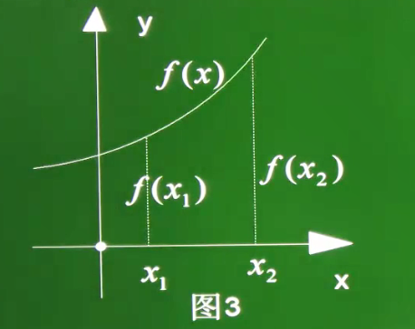

（1）函数的单调性是在定义域内的某个区间上的性质，是函数的局部性质；

（2）必须是对于区间D内的任意两个自变量x1, x2，当x1< x2时，都有f(x1)<f(x2)，才能说f(x)在区间D上是增函数。

**2、减函数**

一般地，设函数y=f(x)的定义域为I，如果对于定义域I内的某个区间D内的任意两个自变量x1, x2，当x1< x2时，都有f(x1)>f(x2)，那么就说f(x)在区间D上是减函数。

​		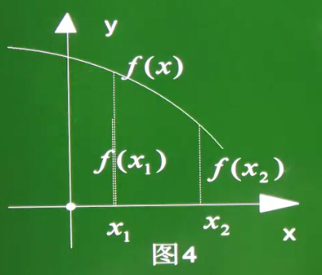

**3、单调性与单调区间**

如果函数y=f(x)在某个区间上是增函数或减函数，那么就说函数y=f(x)在这一区间具有（严格的）单调性，区间D叫做y=f(x)的单调区间；单调区间分两种，一种是单调递增区间，一种是单调递减区间。

**4、判断函数单调性的步骤**

在证明函数在定义域某区间内的单调性或判断某个函数单调性，其步骤如下：

（1）任取x1x2，且x1 < x2

（2）作差f(x1) - f(x2)

（3）变形（这样更容易得到差是正的还是负的）

（4）定号（判断差的正负性，如果差是负的，说明f(x1)<f(x2)，函数单调增；如果差是正的，说明f(x1)>f(x2)，此时函数单调减）

（5）下结论（指出函数f(x)在给定的区间D上的单调性）

## 函数的最值

**1、最大值**

一般地，设函数y=f(x)的定义域为I，如果存在实数M满足：

（1）对于任意的x∈I，都有f(x)≤M

（2）存在x0∈I，使得f(x0)=M

那么，称M是函数y=f(x)的最大值。

**2、最小值**

一般地，设函数y=f(x)的定义域为I，如果存在实数M满足：

（1）对于任意的x∈I，都有f(x)≥M

（2）存在x0∈I，使得f(x0)=M

那么，称M是函数y=f(x)的最小值。 

注意：

（1）函数的最大（小）值首先应该是某一个函数值，即存在x0∈I，使得f(x0)=M

（2）函数的最大（小）值应该是所有函数值中最大（小）的，即对于任意的x∈I，都有f(x)≤M（f(x)≥M）	

**3、利用函数单调性判断函数的最大（小）值的方法**

1）如果是二次函数，可以利用二次函数的性质（配方法）求函数的最大（小）值（二次函数的图形的顶点是最大值或是最小值）。

2）利用图像求函数的最大（小）值。

3）利用函数的单调性判断函数的最大（小）值：

* 如果函数y=f(x)在区间[a,b]上单调递增，则函数y=f(x)在x=a处有最小值f(a)，在x=b处有最大值f(b)

* 如果函数y=f(x)在区间[a,b]上单调递减，在区间[b,c]上单调递增，则函数y=f(x)在x=b处有最小值f(b)

## 函数的奇偶性

**1、奇偶函数**

偶函数：对于函数f(x)的定义域内的任意一个x，都有f(-x)=f(x)，那么f(x)就叫做偶函数。

奇函数：对于函数f(x)的定义域内的任意一个x，都有f(-x)=-f(x)，那么f(x)就叫做奇函数。

1）函数是奇函数或是偶函数称为函数的奇偶性，函数的奇偶性是函数的整体性质。

2）由函数的奇偶性定义可知，函数具有奇偶性的一个必要条件是，对于定义域内的任意一个x，则-x也一定是定义域内的一个自变量，即函数具有奇偶性的一个必要条件是该函数的定义域关于原点对称。

3）对于函数f(x)=xn，n∈Z时，n为奇数时，该函数为奇函数，n为偶数时，该函数为偶函数。

**2、用定义法判断函数奇偶性的步骤**

（1）先求定义域，并判断定义域是否关于原点对称（注意不是判断图像是否关于原点对称），如果定义域关于原点对称则说明函数具有奇偶性，才可以继续讨论函数的奇偶性，如果定义域不关于原点对称则说明函数无奇偶性，就没有必要往下继续讨论函数的奇偶性了。

（2）再判断f(-x)=-f(x)或f(-x)=f(x)是否恒成立，如果f(-x)=-f(x)恒成立则说明函数是奇函数，如果f(-x)=f(x)恒成立则说明函数是偶函数。

**3、函数奇偶性的情况**

一个函数的奇偶性有四种情况：

1）奇函数。满足f(-x)=-f(x)

2）偶函数。满足f(-x)=f(x)

3）既是奇函数又是偶函数。既满足f(-x)=-f(x)又满足f(-x)=f(x)，比如函数f(x)=0，它的函数图象是x轴

4）既不是奇函数也不是偶函数，简称非奇非偶函数。此时有两种情况：

* 该函数的定义域不关于原点对称
* 该函数的定义域虽然关于原点对称，但不满足f(-x)=-f(x)，也不满足f(-x)=f(x)

**4、奇偶函数图象的性质**

1）奇函数的图象关于原点中心对称；反过来，如果一个函数的图象关于原点对称，那么这个函数是奇函数。

2）偶函数的图象关于y轴对称；反过来，如果一个函数的图象关于y轴对称，那么这个函数是偶函数。

奇偶函数图象的性质可用于：（1）简化函数图像的画法  （2）判断函数的奇偶性

​	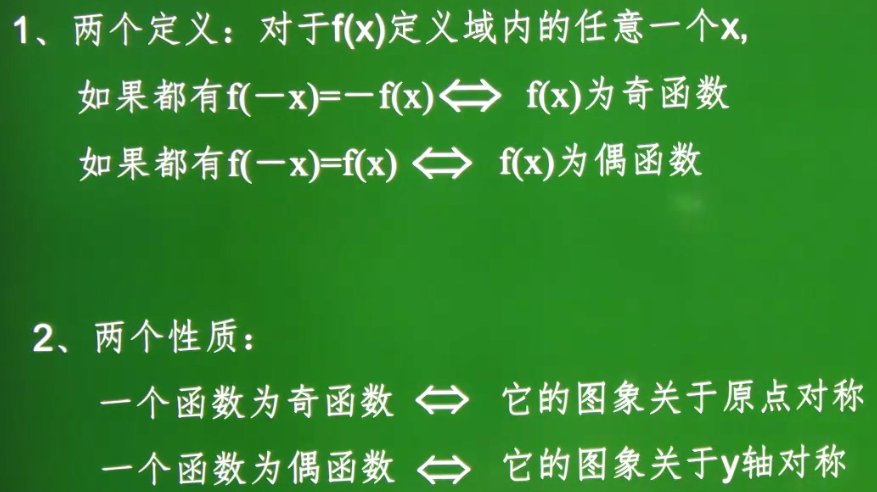

# 2. 基本初等函数

## 根式的运算

**1、初中知识回顾**

​		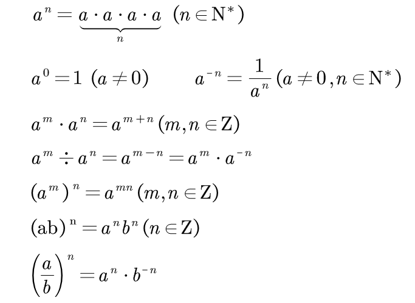

**2、n次方根的定义及性质**

一般地，如果xn=a，那么x叫做a的n次方根，其中n>1，且n∈N*。

（1）当n为奇数时（如立方根），有下列性质：正数的奇数次方根是正数，负数的奇数方根是负数，0的奇数方根是0；任何一个数的奇数次方根都是唯一的。此时，a的n次方根可以表示为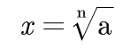

（2）当n为偶数时（如平方根），有下列性质：正数的偶次方根有两个且值且互为相反数，负数没有偶次方根，0的偶次方根是0；此时正数a的n次方根可以表示为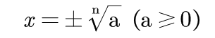

​		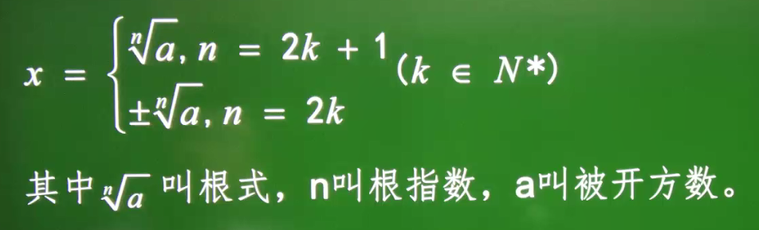

**3、根式运算性质**

1）若对一个数先开方，再乘方（同方），其结果等于该数本身。

​		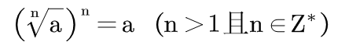

2）若对一个数先乘方，再开方（同方），其结果等于该数的绝对值。

​		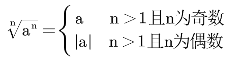

## 分数指数幂

1）正数的正分数指数幂的意义是：

​			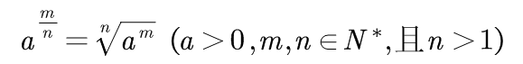

​		需要注意，a必须大于0，否则当n为偶数时，am为负数时，根式将无意义。

2）正数的负分数指数幂的意义是：

​			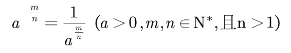

3）0的分数指数幂：0的正分数指数幂为0，0的0次幂指数和0的负分数指数幂无意义（因为分母不能为0，比如)。

注意：

（1）规定了分数指数幂的意义以后，指数的概念就从整数指数推广到了有理数指数。

（2）整数指数幂的运算性质，对于有理数幂也同样适用。如下：

​			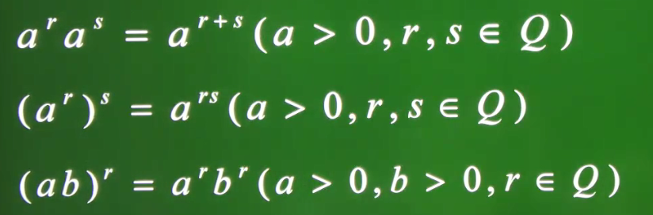

## 指数函数及其图像与性质

**1、指数函数**

函数y=ax (a>0,a≠1) 叫做指数函数，其中a叫做底数，x是自变量，即指数，函数的定义域为R。

​		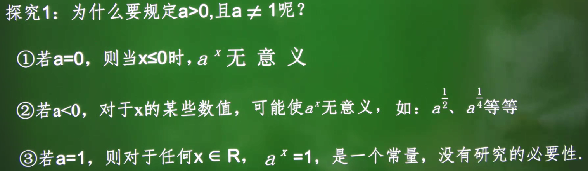

**2、指数函数的图像与性质**

指数函数y=ax (a>0,a≠1) 

1）当底数a>1时

* 都是增函数

* 图像都在x轴上方（y>0），向上无限伸展，向下无限接近与x轴，x∈R
* 图像都经过点（0,1），f(0)=1

* 底数a越大，第一象限的图像越靠近y轴，第二象限的图像越靠近x轴

​		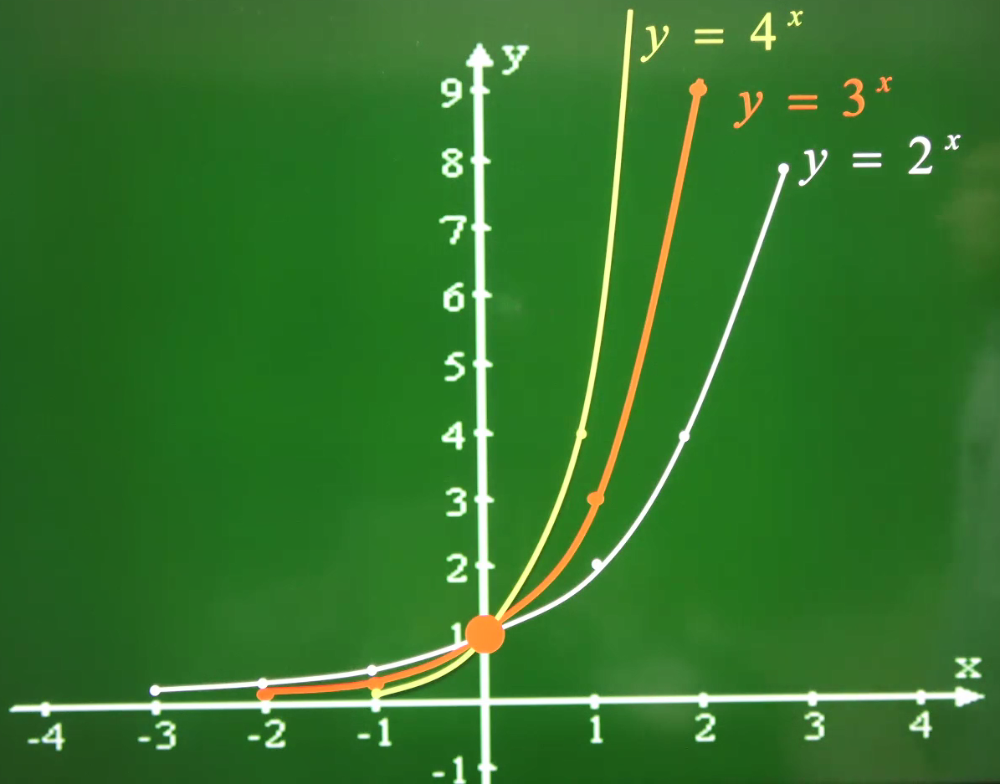

2）当底数0<a<1时

* 都是减函数
* 图像都在x轴上方（y>0），向上无限伸展，向下无限接近与x轴，x∈R
* 图像都经过点（0,1），f(0)=1
* 底数a越小，第二象限的图像越靠近y轴，第一象限的图像越靠近x轴

​		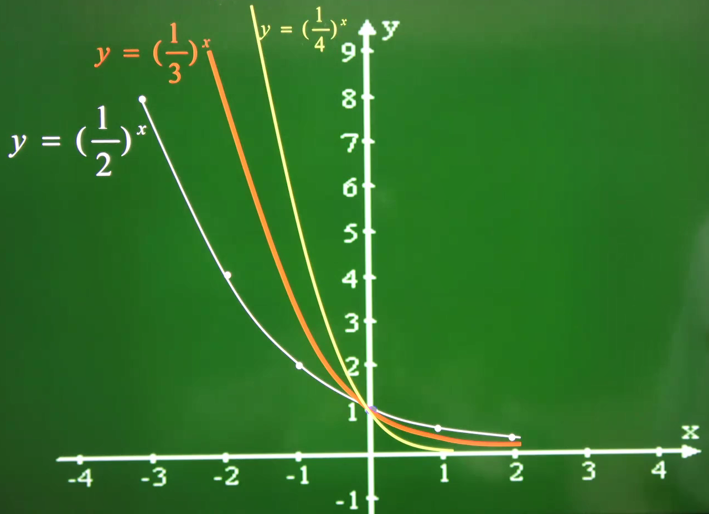

概括如下：

​	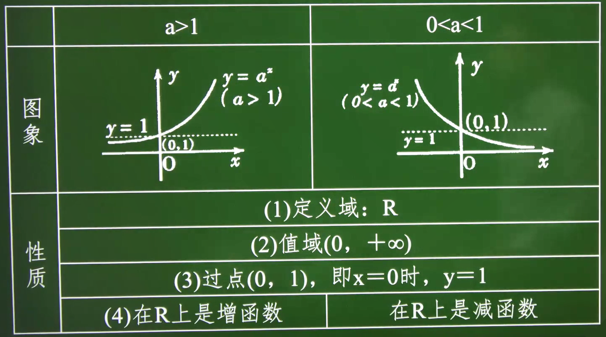

**3、指数函数图像的对称性**

在指数函数中，互为倒数的两个数的指数函数的图像关于y轴对称。

​			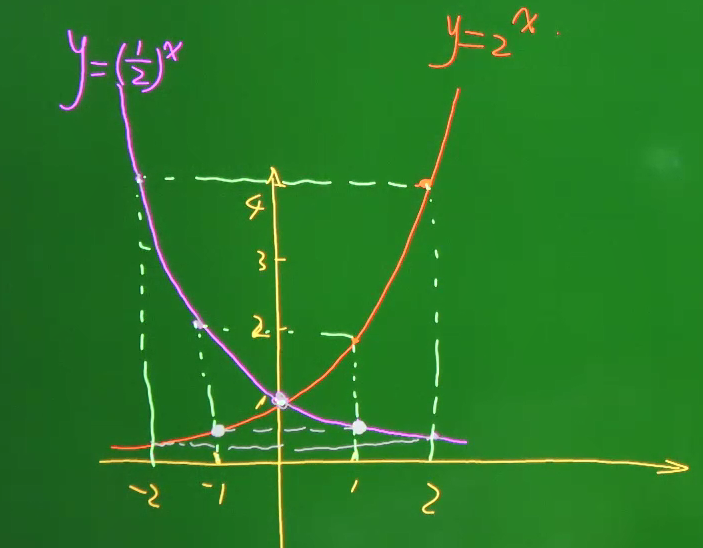

## 对数及对数的运算

**1、对数**

如果ax=N（a>0,且a≠1），那么数x叫做以a为底的N的对数，记作x=logaN。其中a叫做对数的底数，N叫做真数，x或logaN叫做对数。

（1）对数式logaN可以看做是一种记号，也可以看成幂运算的逆运算，将其理解为a的多少次方的N。

（2）因为正数的任何次幂都是整数，即ax>0，所以N也是大于0的。

（3）指数式与对数式的变换：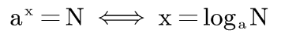

**2、两种特殊的对数**

（1）常用对数：以10位底的对数，将log10N记作1gN

​			

（2）自然对数：以e为底的对数，将logeN记作InN（e=2.71828...）

​			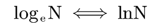

**3、对数的常用结论**

（1）loga1=0      logaa=1

​			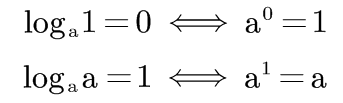

（2）负数与零没有对数（因为真数N是ax，它一定是大于0的）

**4、对数的运算**

对数x=logaN（a>0且a≠1，N>0），有以下常见运算：

1）已知底数a和真数N，求对数x（将对数式转换为指数式，然后求解）

2）已知底数a和对数x，求真数N（利用N=ax公式进行计算，如果能将指数化简则化简，不能化简则硬算）

3）已知真数N和对数x，求底数a（先将对数式化为指数式，然后对指数式求解）

对数的运算所涉及的知识点大致有：对数的定义、两个特殊的对数、对数的常用结论、对数式与指数式的转换，指数式与分数指数幂式的互相转换。

**5、对数恒等式**

​			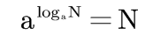

证明如下：

​			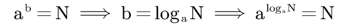

**6、积、商、幂的对数运算法则**

如果a>0，a≠1，M>0，N>0，则有：

​	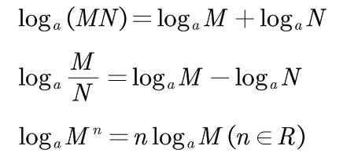

证明过程见视频。

**7、对数换底公式及其推论**

​		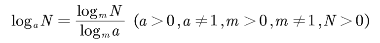

证明过程见视频，此外，对数换底公式有两个重要的推论：

​		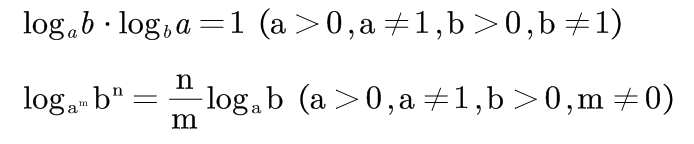

证明过程见视频。

## 对数函数及其图像与性质

**1、对数函数的定义**

把函数y=logax（a>0，且a≠1）叫做对数函数，其中x是自变量。

（1）对数函数的底数a的限制条件为：a>0，且a≠1

（2）对数函数的定义域时（0, +∞）

**2、对数函数的图形与性质**

​		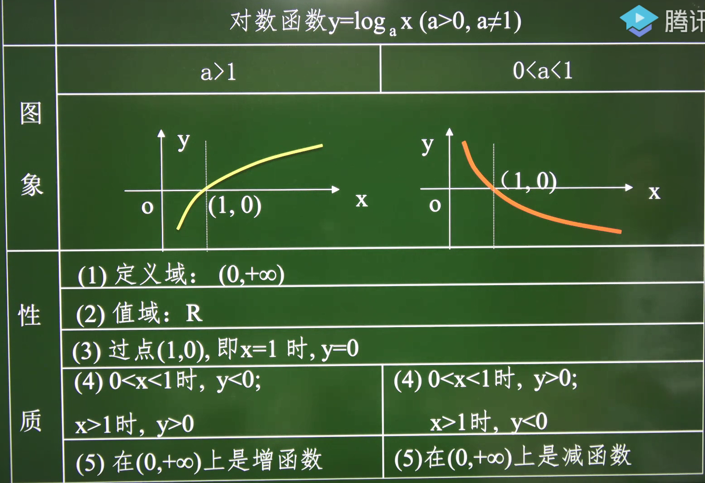

1）对数函数的定义域为（0,+∞)，值域为R

2）对数函数的图像过点（1,0），即x=1时，y=0

3）对数函数的底数a>1时，当0<x<1时，y<0，x>1时，y>0。对数函数的底数0<a<1时，当0<x<1时，y>0，x>1时，y<0。

4）对数函数的底数a>1时，为增函数；对数函数的底数0<a<1时，为减函数。

5）如果两个对数函数的底数a互为倒数，定义域相同，则这两个对数函数的图像关于x轴对称。

​		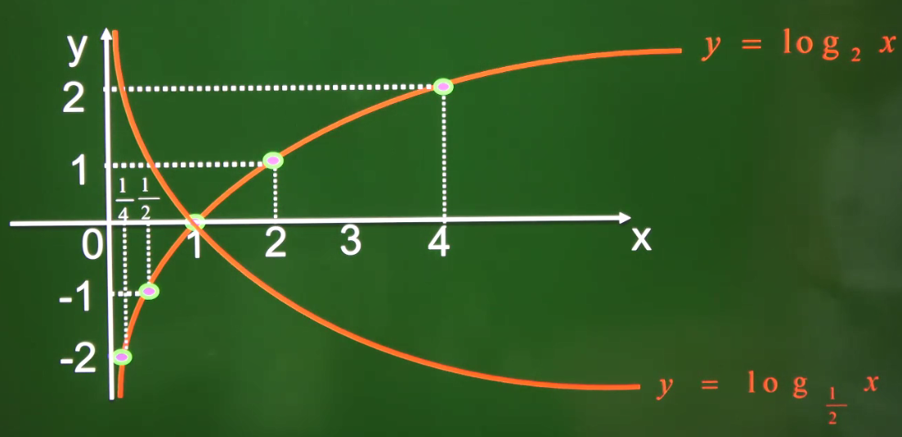

6）多个对数函数的底数a>1时，底数越大的对数函数的图像在第一象限离x轴最近，在第四象限离y轴最近；多个对数函数的底数0<a<1时，底数越小的对数函数图像在第一象限离y轴越近，在第四象限离x轴越近。

​		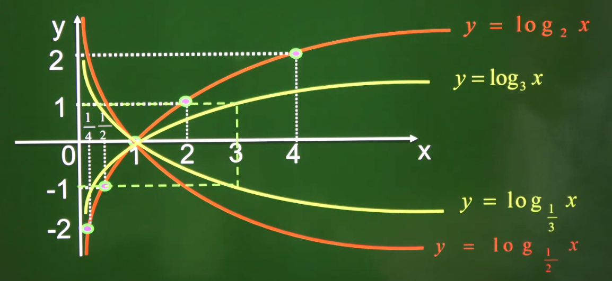

## 反函数

**1、反函数的定义**

设A、B分别为函数y=f(x)的定义域和值域，如果由函数y=f(x)所解得x=g(y)也是一个函数（即对任意一个y∈B，都有唯一的x∈A与之对应），那么就称函数x=g(y)是函数y=f(x)的反函数，记作：x=f-1(y)。但习惯上使用y表示因变量，x表示自变量，因此反函数y=f-1(y)通常协作：y=f-1(x)。

1）对数函数 y=ax 和指数函数 y=logax 互为反函数。

​		

2）原函数的定义域是反函数的值域，原函数的值域是反函数的定义域。

**2、指数函数与对数函数的关系**

由于对数函数 y=ax 和指数函数 y=logax 互为反函数，所以它们的图象关于y=x轴对称。

​		

## 幂函数及其图像与性质

**1、幂函数的定义**

函数y=xa叫做幂函数，其中x是自变量，a是常数。

**2、常见的幂函数及其图像与性质**

常见的幂函数有y=x、y=x2、y=x3、y=x1/2、y=x-1，它们的图像如下：

​		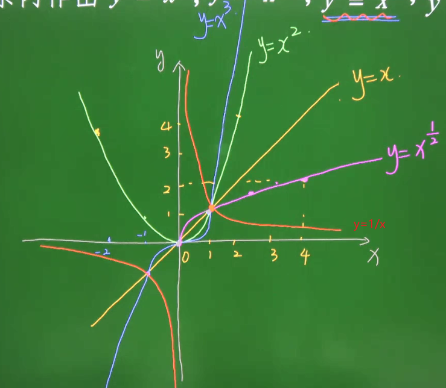

各个常见幂函数的性质如下：

​		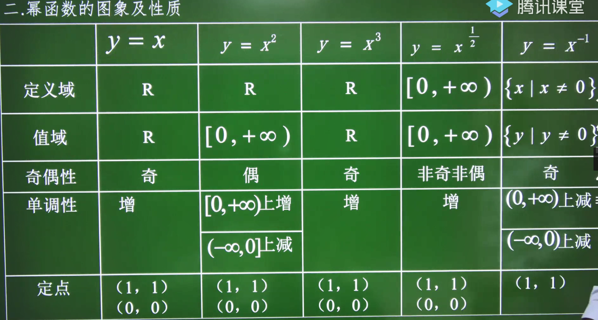

**3、幂函数的图像与性质**

幂函数y=xa的图像是5个常见幂函数的图形，如下：

​		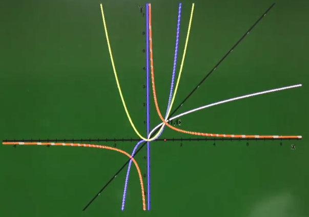

幂函数的性质如下：

（1）所有的幂函数在(0,+∞)都有定义，并且都经过点(1,1)。（注意并不是说所有幂函数都只在(0,+∞)有定义）

（2）当a>0时，幂函数的图像都经过原点，并且在[0,+∞]上是单调递增的；当a<0时，幂函数的图像不经过原点，在(0,+∞)是单调递减的。

（3）当a为奇数时，幂函数为奇函数；当a为偶数时，幂函数为偶函数。

# 3. 函数的应用

## 方程的根与函数的零点

**1、方程的根**

​		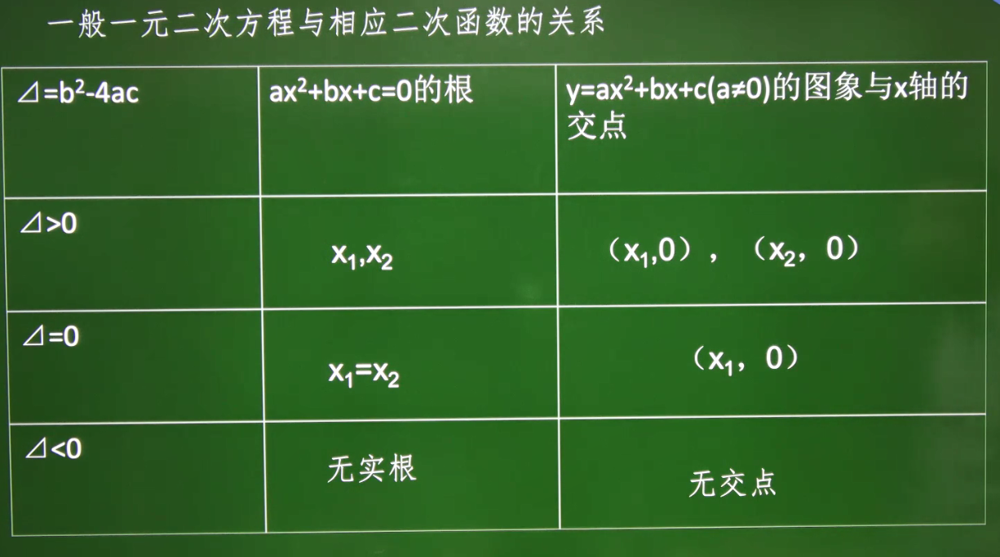

​		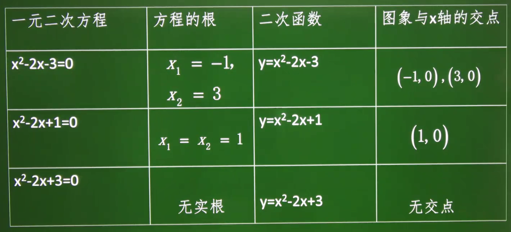

**2、函数的零点**

对于函数y=f(x)，把使得f(x)=0的实数x叫做函数y=f(x)的零点。

（1）零点不是一个点，而是一个实数值。

（2）函数的零点是相对于该函数的定义域或区间而言的，函数在其定义域或指定区间内可能没有零点，也可能有一个或者多个零点。

（3）函数的零点实际上就是该函数图像与x轴的交点。

​			

（4）如果函数y=f(x)在区间[a,b]上的图像是连续不断的一条曲线或线段，并且有f(a)·f(b)<0，那么函数y=f(x)在区间(a,b)内一定有至少一个零点，即存在c∈(a,b)，使得f(c)=0，这个c也就是方程f(x)=0的根，也是零点、与x轴的交点。（说明：f(a)·f(b)<0说明两者的值是异号，一个在x轴上方，一个在x轴下方，两者相连一定经过x轴）

​			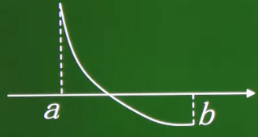

* f(a)·f(b)<0时，至少有一个零点，也可能有多个零点，比如：

  ​	

* 只有函数图像是连续曲线或线段时才能通过此方法判断有无零点，如果图像曲线或线段不连续，则无法使用，比如：

  ​	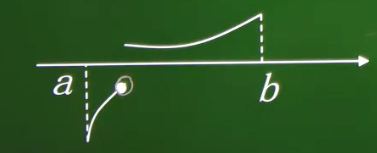

* f(a)·f(b)>0时可能没有零点也可能有二个或多个零点，比如：

  ​	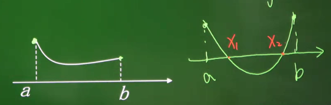

## 用二分法求方程的近似解

用二分法求方程的近似解的一般步骤如下：

（1）确定区间[a,b]，验证f(a)·f(b)<0，给定精确度k

（2）求区间(a,b)的中点c

（3）计算f(c)

* 若f(c)=0，则c就是函数的零点
* 若f(a)·f(c)<0，说明函数的零点位于(a,c)区间，则令b=c
* 若f(c)·f(b)<0，说明函数的零点位于(c,b)区间，则令a=c

（4）判断是否达到给定精确度k的要求，即若|a-b|<k，则得到零点近似值a或者b，或者是(a,b)之间；否则如果没有达到精确度则继续上述2、3步骤。

​	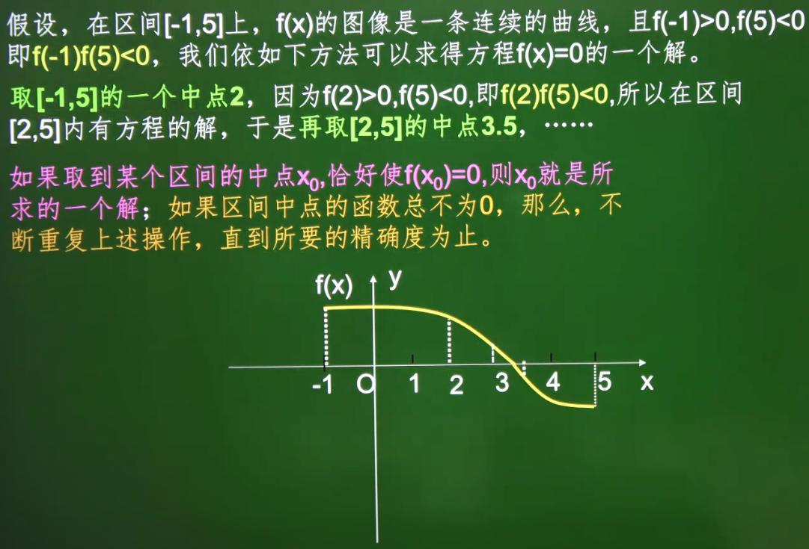

说明：

（1）用二分法求函数的零点近似值的方法仅对函数的变号零点适用，对函数的不变号零点不适用。

（2）用二分法求函数的零点近似值必须先求出零点所在的区间。

（3）二分法类似于数据结构中的二分查找法。

