# 1. 空间几何体

## 棱柱、棱锥、棱台的结构特征

**1、棱柱**

有两个面互相平行，其余各面都是四边形，并且每相邻两个四边形的公共边都互相平行，由这些面所围成的多面体叫做棱柱。

​		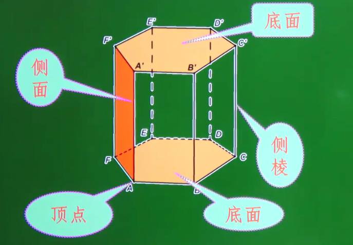

1）棱柱的结构特征（只有满足这些结构特征的才算是棱柱）：

* 上底面和下底面互相平行
* 侧面都是四边形
* 在侧面中，每相邻的两个四边形的公共边都互相平行

2）棱柱使用表示上底面和下底面的各顶点字母表示棱柱， 如上图中：六棱柱ABCDEF-A'B'C'D'E'F‘

3）底面是三角形、四边形、五边形······的棱柱分别叫做三棱柱、四棱柱、五棱锥······

4）棱柱的分类

（1）按照侧棱是否垂直于底面可以将棱柱分为：

* 斜棱柱（侧棱不垂直于底面的棱柱叫做斜棱柱）
* 直棱柱（侧棱垂直于底面的棱柱叫做直棱柱）

（2）按照棱柱底面形状可以将棱柱分为：

* 平行六面体（底面是平行四边形的四棱柱叫做平行六面体）
* 直平行六面体（侧棱垂直于底面的平行六面体叫做直平行六面体）
* 长方体（底面是矩形的直平行六面体叫做长方体）
* 正方体（上下底面的边和侧棱都相等的长方体加做正方体）

特别地，底面是正多边形的直棱柱叫做正棱柱。（正多边形指的是各个内角都相等，各条边也都相等的多边形平面）

**2、棱锥**

有一个面是多边形，其余各个面都是有一个公共顶点的三角形，由这些面所围成的多面体叫做棱锥。

​	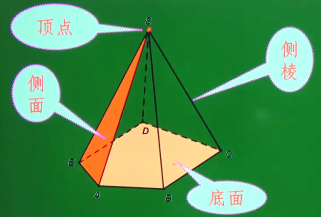

1）底面是三角形、四边形、五边形······的棱锥分别叫做三棱锥、四棱锥、五棱锥······

2）棱锥使用表示顶点和底面各顶点的字母表示，如上图中：五棱锥S-ABCDE

3）如果棱锥的底面为正多边形，且顶点在底面的射影是底面的中心，那么这样的棱锥称为正棱锥。（正多边形指的是各个内角都相等，各条边也都相等的多边形。底面的中心既是该正多边形的内切圆圆心，也是该正多边形的外接圆圆心，因为正多边形的内切圆圆心和外接圆圆心是同一个圆心）

* 正锥体顶点到底面中心的垂直线段称为该正椎体的高
* 正棱锥各侧面底边上的高均相等，叫做正棱锥的斜高，它是正棱锥每一个侧面关于其对应底边的高
* 正锥体的高和某条斜高，连接它们的底部，可以构成一个直角三角形

​	

* 侧棱长等于底面边长的正三棱锥又称为正四面体（此时正棱锥的四个面都是正多边形且全部全等）

**3、棱台**

用一个平行于棱锥底面的平面去截棱锥，底面与界面之间的部分，这样的多面体叫做棱台。

​	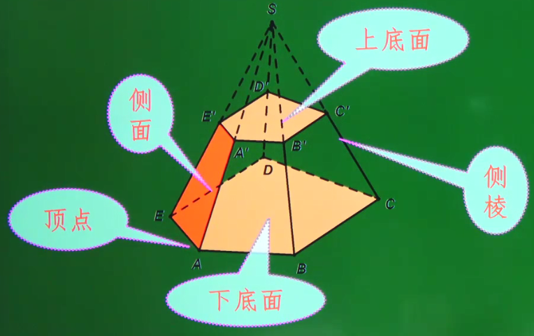

1）由三棱锥、四棱锥、五棱锥······截得的棱台分别叫做三棱台、四棱台、五棱台······

2）棱台使用表示上底面和下底面的各个顶点表示，如上图中：五棱台ABCDE-A'B'C'D'E

3）判断一个几何体是否为棱台：

* 各侧棱的延长线是否相交于一点（或不存在平行的一对侧棱）
* 截面是否平行于原棱锥的底面，如果平行则是，如果不平行则不是

4）棱台两底面相似，侧面都是梯形。

## 圆柱、圆锥、圆台、球、简单组合体

**1、圆柱**

以矩形的一边所在直线为旋转轴，其余三边旋转形成的面所围成的旋转体叫做圆柱。

​			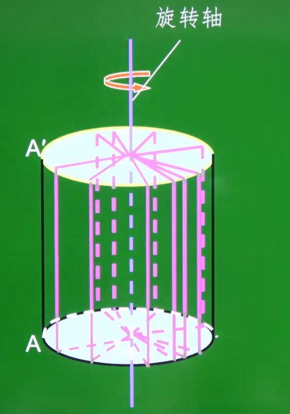				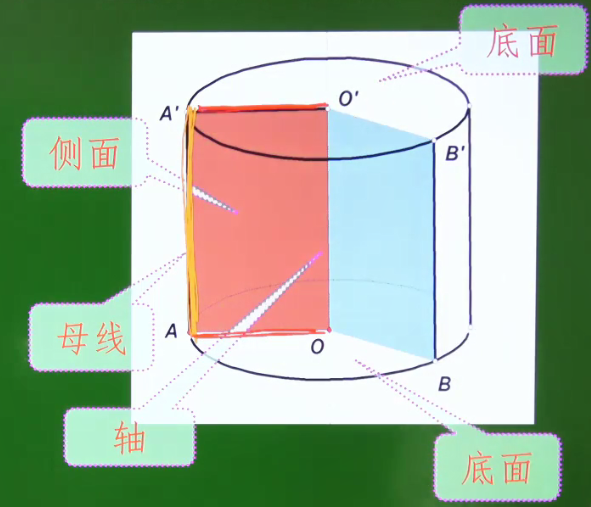

* 轴：旋转轴叫做圆柱的轴
* 底面：垂直于轴的边旋转而成的圆面叫做圆柱的底面
* 侧面：平行于轴的边旋转旋转而成的曲面叫做圆柱的侧面
* 母线：无论旋转到什么位置，不垂直于轴的边都叫做圆柱侧面的母线（母线有无数条）

圆柱使用表示它的轴的字母表示，如上图中：圆柱O'O

**2、圆锥**

以直角三角形的一条直角边所在直线为旋转轴，其余两边旋转形成的面所围成的旋转体叫做圆锥。

​		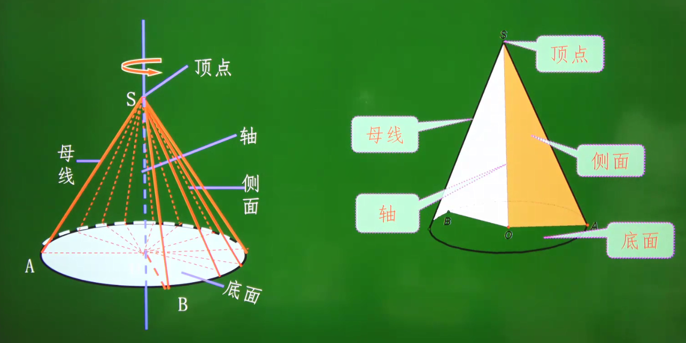

* 底面是圆面
* 侧面展开图是以母线为半径的扇形面
* 母线相交于顶点
* 平行于底面的截面是与底面平行且半径不相等的圆面
* 轴截面是等腰三角形面

**3、圆台**

用平行于圆锥底面的平面去截圆锥，底面与截面之间的部分叫做圆台。（台体都是由椎体所截得到的，比如棱台也是由棱锥所截得到的）

​		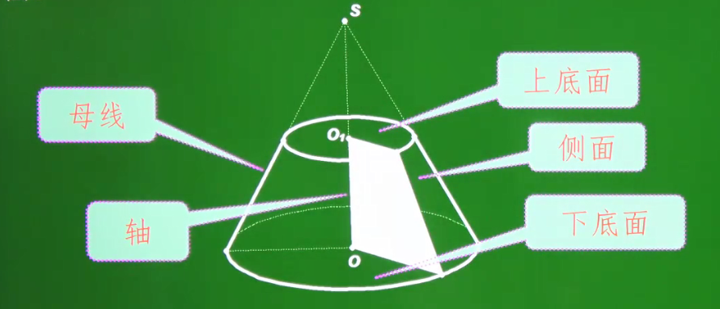

用表示它的轴的字母表示圆台，如上图中：圆台O'O

**4、球**

以半圆的直径所在直线为旋转轴，半圆面旋转一周形成的旋转体叫做球体，简称球。

​		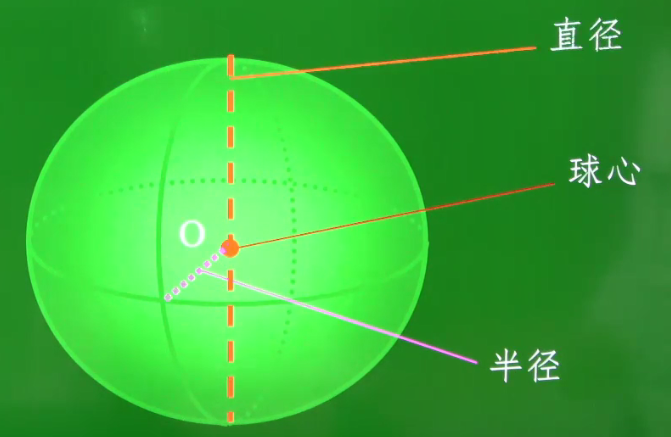

* 球心：半圆的圆心叫做球心
* 半径：半圆的半径叫做球的半径（球的半径是球面上任意一点与球心连接所成的线段）
* 直径：半圆的直径叫做球的直径（球的直径是球面上任意两点经过球心连接所成的线段）

球常用表示球心的字母表示，如上图中：球O

**5、简单几何体**

1）简单几何体有：

* 柱体（棱柱，圆柱）
* 锥体（棱锥，圆锥）
* 台体（棱台，圆台）
* 球

2）简单几何体分为：

* 多面体（棱柱、棱锥、棱台）
* 旋转体（圆柱、圆锥、圆台、球）

**6、简单组合体**

1）由简单几何体柱、锥、台、球构成简单组合体。比如：

​		

2）由简单几何体截取或挖出一部分后，简单几何体变为简单组合体。比如：

​		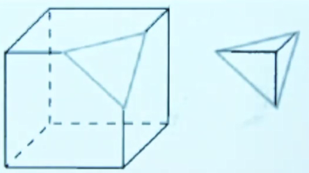

## 中心投影、平行投影、三视图

由于光的照射，在不透明物体后面的屏幕上可以留下这个物体的影子，这种现象叫做投影。其中，把光线叫做投影线，把留下物体影子的屏幕叫做投影面。

​	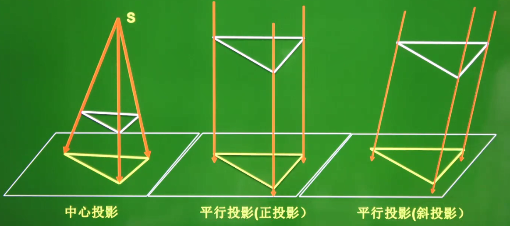

取两条物体上某一点与其投影面上的投影点的连线，如果它们是平行的，则为平行投影，如果延长后相交于一点，则为中心投影。

**1、中心投影**

把光由一点向外散射形成的投影，叫做中心投影，中心投影的投影线交于一点。

​		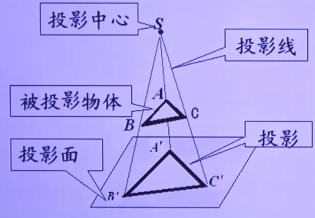

中心投影的投影大小与被投影物体和投影面的距离有关。

**2、平行投影**

把在一束平行光线照射下形成的投影，叫做平行投影。平行投影按照投影线是否正对着投影面（投影线是否平行投影面），可以分为斜投影和正投影两种：

* 斜投影：投影线不正对着（不垂直）投影面
* 正投影：投影线正对着（垂直）投影面

​		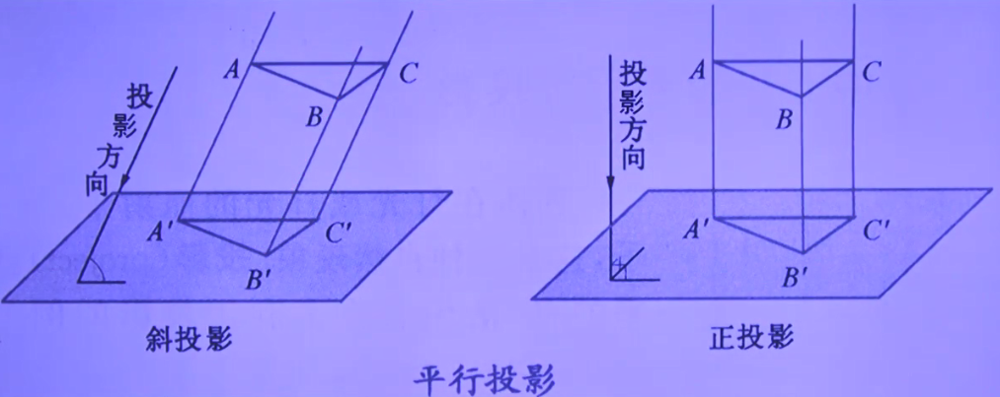

**3、三视图**

视图是指将物体按正投影向投影面投射所得到的图形。根据不同的方向对几何体进行正投影，可以分为三种视图：

​		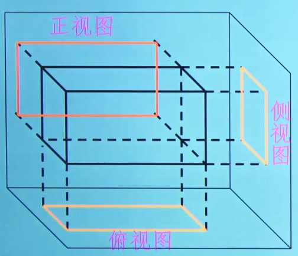

* 正视图：光线从几何体的前面向后面正投影，得到的投影图
* 侧视图：光线从几何体的左面向右面正投影，得到的投影图
* 俯视图：光线从几何体的上面向下面正投影，得到的投影图

几何体的正视图、侧视图、俯视图统称为几何体的三视图。三视图之间的关系为：长对正（正视图与俯视图）、高平齐（正视图与侧视图）、宽相等（俯视图与侧视图）。

1）棱锥的三视图

​		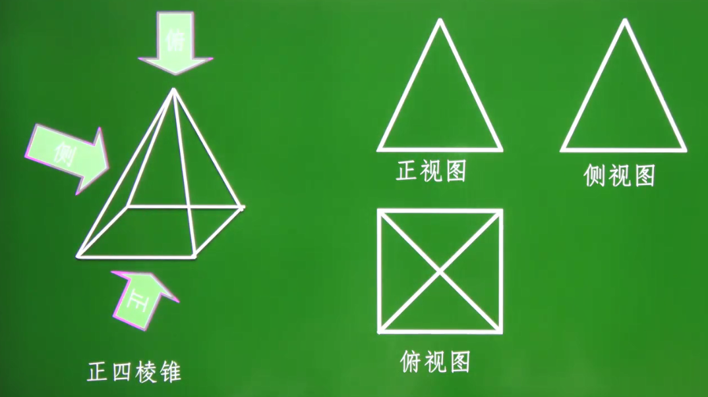

2）正四棱台的三视图

​		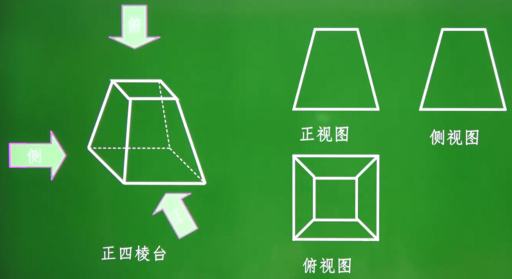

3）圆台的三视图

​		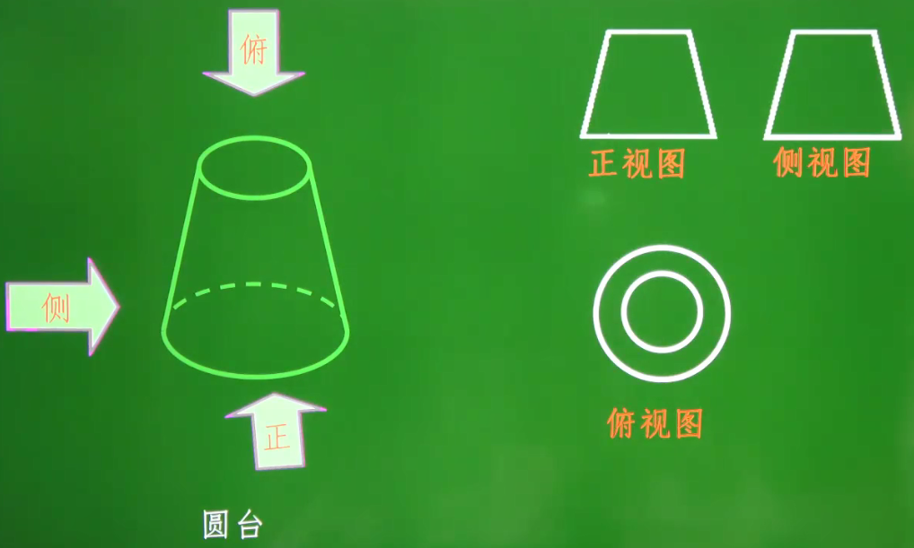

在画三视图时，对于不可见边界轮廓线，应用虚线表示出来。

## 空间几何体的直观图

**1、使用斜二测法画平面图形的直观图**

​		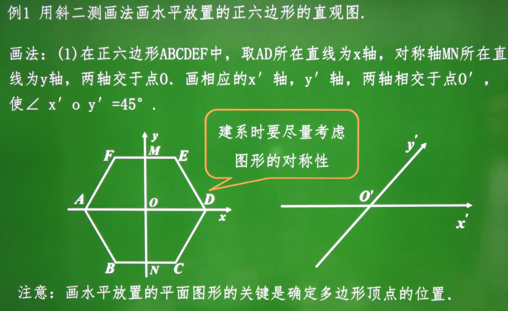

​		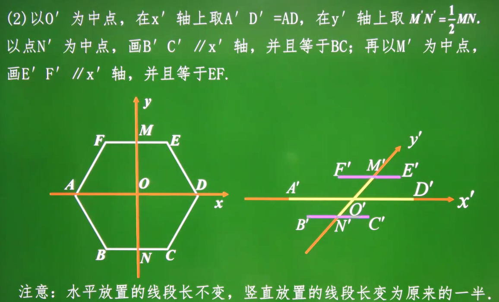

​		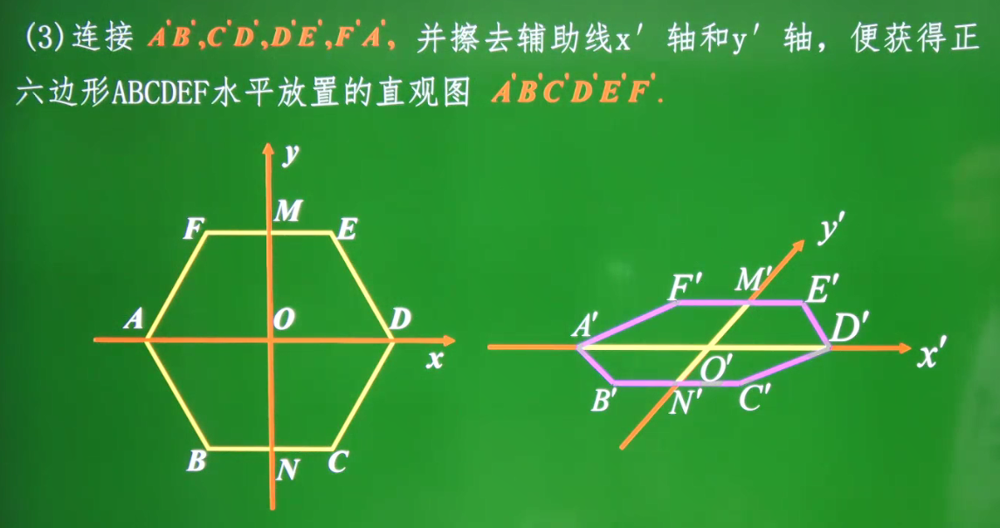

​		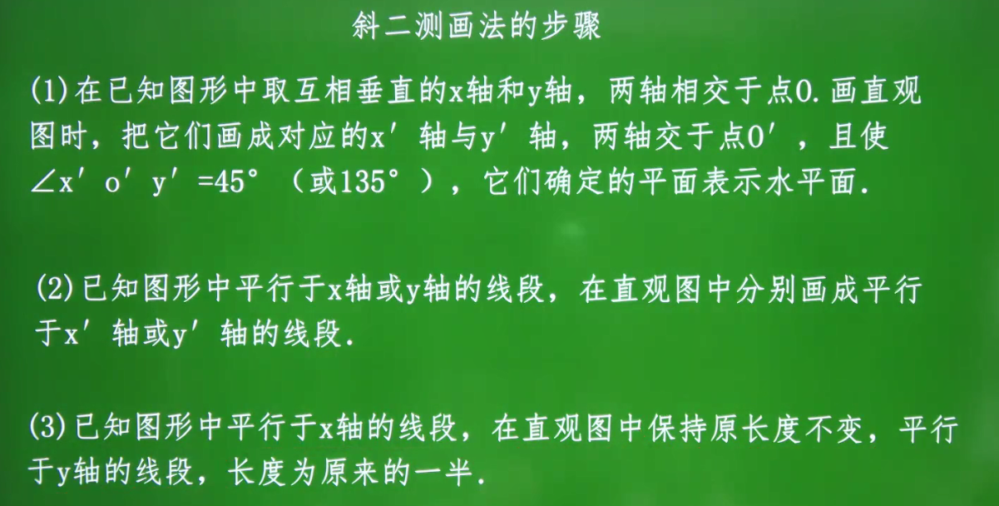

**2、使用斜二测法画空间几何体的直观图**

​		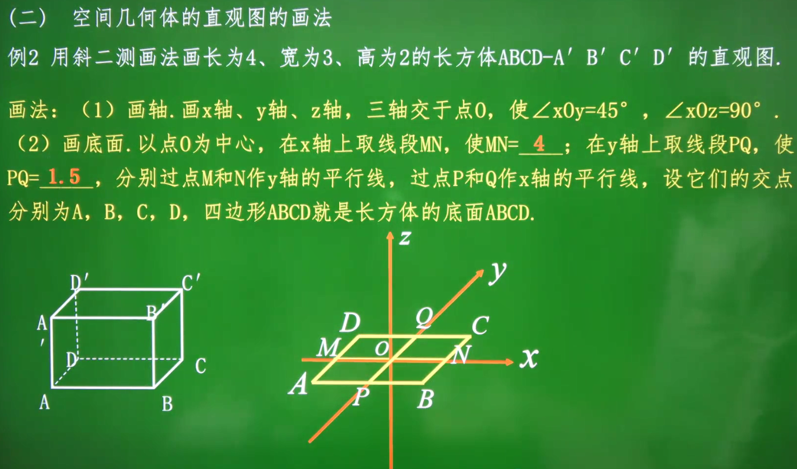

​		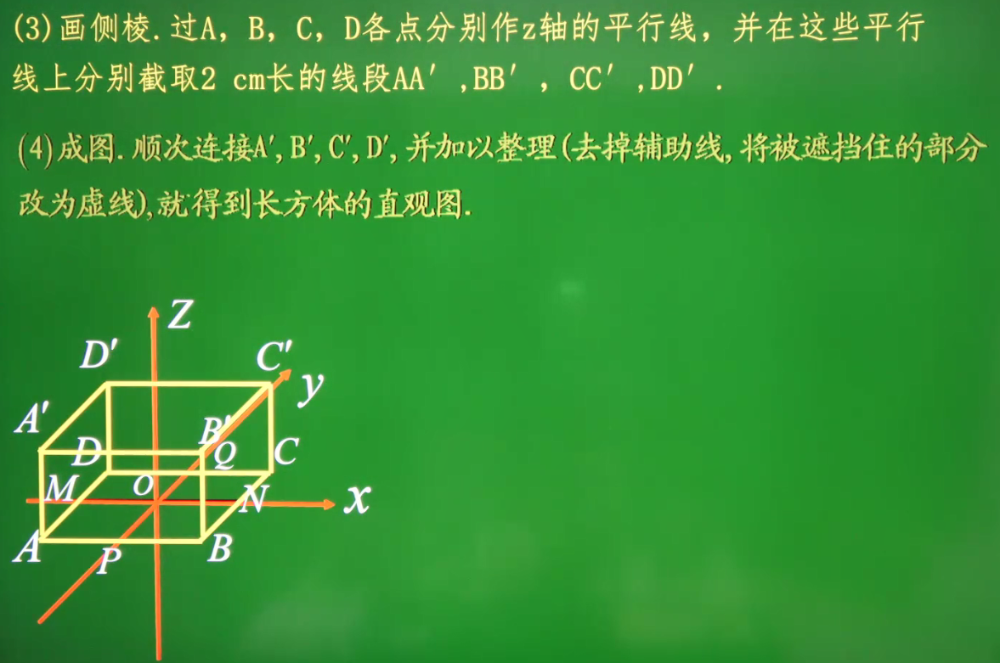

斜二测法画直观图的要点：

* 保持与x轴的平行（或共线）关系，且长度不变（横保长）
* 保持与y轴的平行（或共线）关系，但长度变为原来长度的一般（纵减半）

## 柱体、椎体、台体的表面积

**1、棱柱、棱锥、棱台的表面积**

棱柱、棱锥、棱台都是由多个平面图形围成的几何体，它们的展开图是多个平面图形，所以只要会计算各种平面图形的面积就会计算棱柱、棱锥、棱台的面积，它们的表面积就是侧面的各个平面图形面积之和加上底面面积，即表面积等于侧面积与底面积的和。

**2、圆柱、圆锥、圆台的表面积**

圆柱、圆锥、圆台的表面积计算思想也是将其展开，然后计算每个平面的面积之和。

1）圆柱的展开图是两个相等圆和一个矩形，所以两个相等圆的面积和矩形的面积之和就是圆柱的表面积。

​		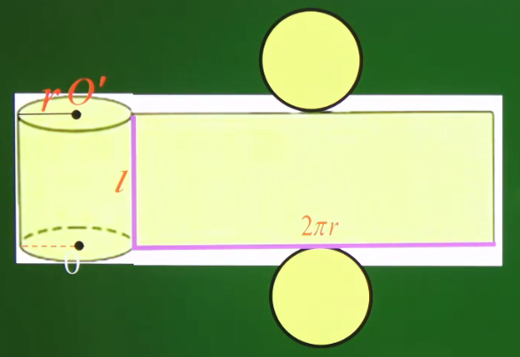

* 对于两个相等圆，使用圆的面积公式计算它们的面积和
* 侧面展开图矩形的宽为圆柱的高（或母线），由于矩形是根据底面圆周围绕的，所以矩形的长为底面圆的周长

​		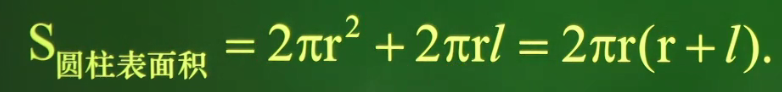

2）圆锥的展开图是一个圆和一个扇形，所以这个圆的面积和这个扇形的面积之和就是圆锥的表面积。

​		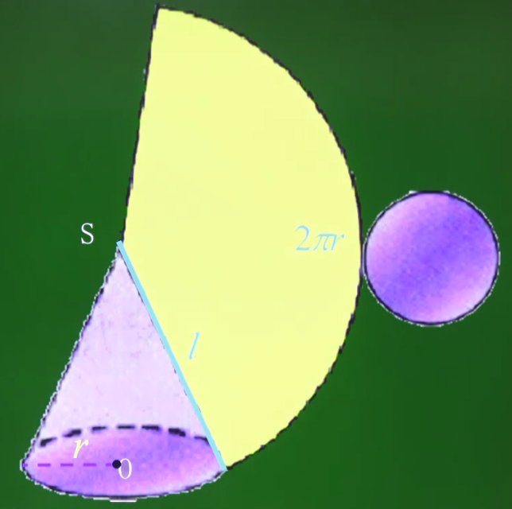

* 对于圆，使用圆面积公式计算其面积
* 对于扇形，可以将其近似看成三角形，扇形的弧长看成三角形的底，扇形的半径看成三角形的高，然后像计算三角形的面积那样计算扇形的面积（由于扇形是围绕着底面圆周的，所以这个扇形的弧长就是底面圆的周长；另外，扇形的半径就是该圆锥的母线）

 		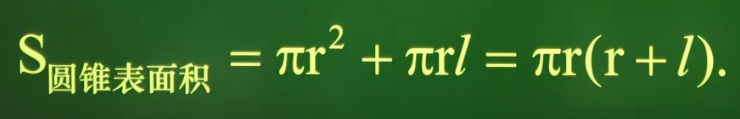

3）圆台的展开图是两个不等圆和一个扇环，所以这两个不等圆的面积和这个扇环的面积之和就是圆台的表面积。

​		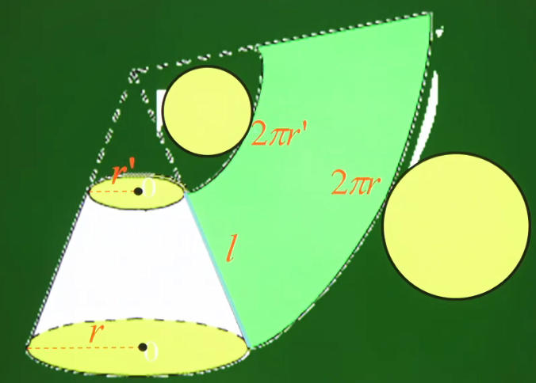

* 对于两个不等圆，使用圆的面积公式分别计算然后再相加
* 对于扇环，可以将其近似看成梯形，扇环的两条弧长看成梯形的上底和下底，圆台的母线可以看成梯形的高，然后像计算梯形的面积那样计算扇环的面积（由于圆台是由圆锥所截得到的，所以扇环的短弧是围绕着所截的圆的，它的弧长就等于这个圆的周长，扇环的长弧是围绕着底面圆，所以它的弧长是底面圆的周长）

​		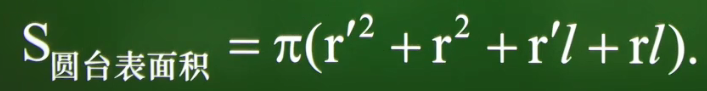

**3、圆柱、圆锥、圆台的表面积公式之间的关系**

​		

 

## 柱体、椎体、台体的体积

**1、柱体、锥体、台体的体积公式**

以前学过的特殊柱体——正方体、长方体以及圆柱的体积公式，都可以统一为V=Sh（V表示体积，S表示底面积，h表示高）

1）柱体的体积为：V=Sh  （V表示体积，S表示底面积，h表示高）

2）锥体的体积为：V=1/3Sh  （V表示体积，S表示底面积，h表示高）

3）台体的体积：由于圆台（棱台）是由圆锥（棱锥）截成的，因此可以利用两个锥体的体积差，得到圆台（棱台）的体积公式。

​		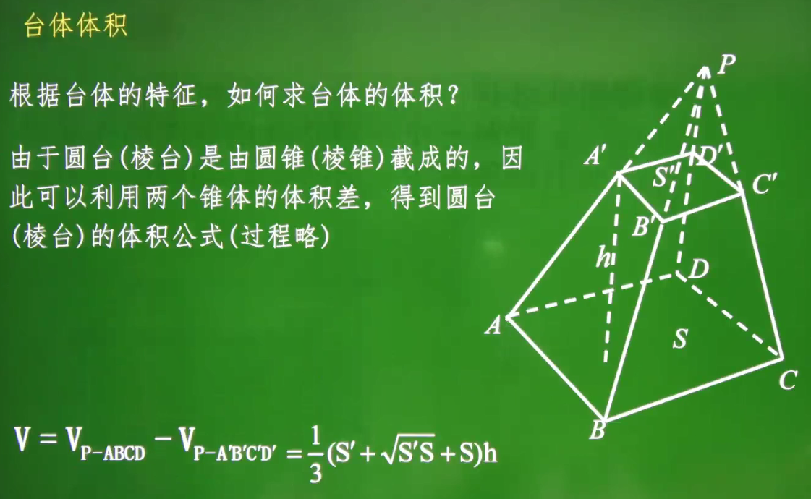

如果没有给锥体而是直接给了台体，我们也可以直接用公式计算，其中S'表示上底面的面积，S表示下底面的面积，h表示圆台（棱台）的高，即上底面垂于下底面垂线段的长度。

**2、柱体、锥体、台体体积公式之间的关系**

​		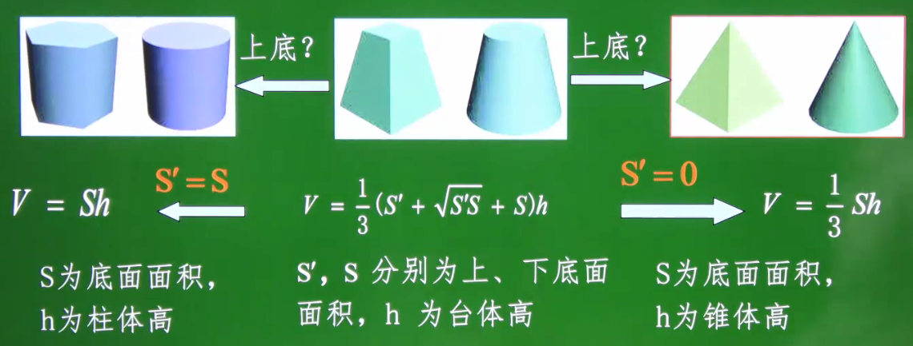

## 球的表面积和体积

**1、球的表面积**

半径为r的球的表面积：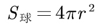（球的表面积是大圆面积的4倍)

**2、球的体积**

半径为r的球的体积：

# 2. 点、直线、平面之间的位置关系

## 平面

平面是绝对的平、无厚度、可以无限延展的抽象的数学概念。

**1、平面的画法、表示方法、记法**

1）常常把水平的平面画成一个平行四边形，用平行四边形表示平面，平行四边形的锐角通常画成45。，且横边长等于其邻边长的2倍。

​	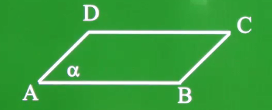

2）常用平面的一部分来表示该平面，如下图：

​	

**2、点、线、面的基本位置关系**

1）点与平面的位置关系：平面内有无数个点，平面可以看成点的集合，点在平面内和点在平面外都可以用元素与集合的属于、不属于关系来表示。

​		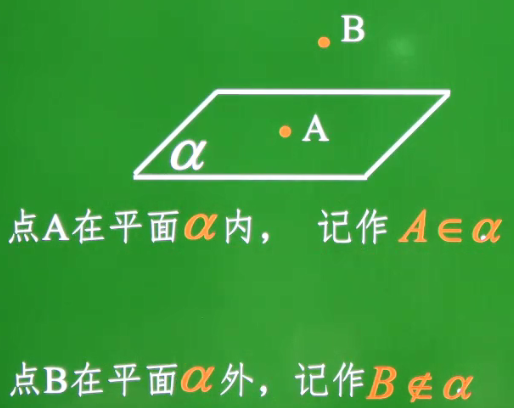

2）点线面位置关系的表示：设A是点、l, m是直线、α, β是平面

​		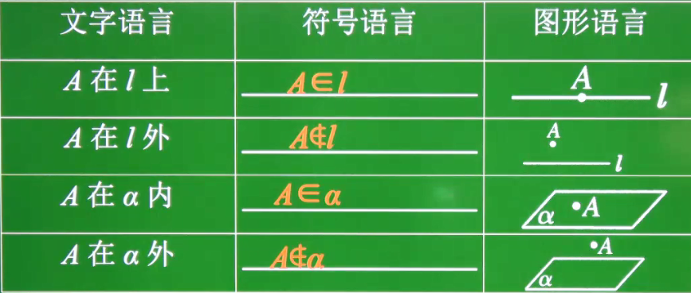

​		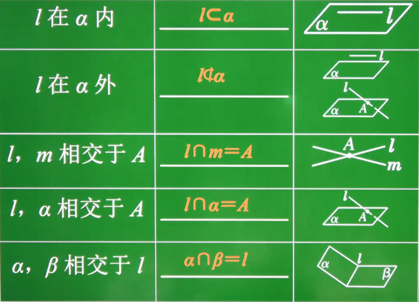

**3、从集合的角度理解点、线、面之间的关系**

​		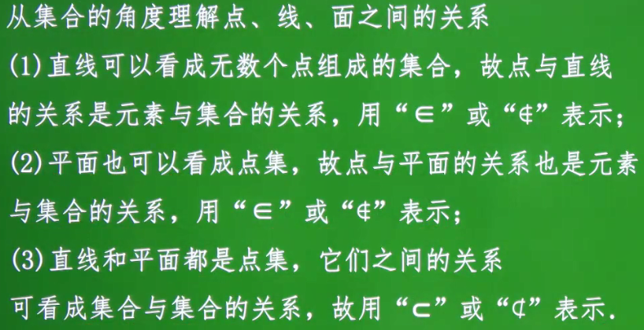

**4、平面公理**

1）公理1：如果一条直线上的两点在一个平面内，那么这条直线也在此平面内。 

​		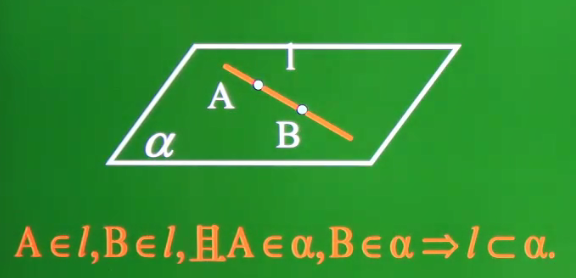

2）公理2：过不在同一条直线上的三点，有且只有一个平面。

​		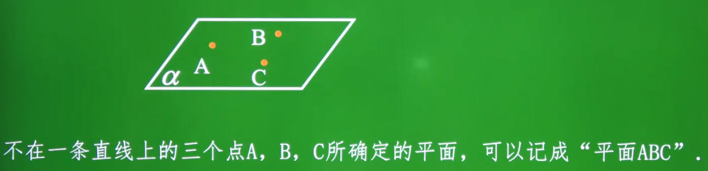

​	推论如下：

* 推论1：经过一条直线和此直线外的一点，有且只有一个平面
* 推论2：经过两条平行直线，有且只有一个平面
* 推论3：经过两条相交直线，有且只有一个平面

3）公理3：如果两个不重合的平面有一个公共点，那么它们有且只有一条经过该点的公共直线。

​		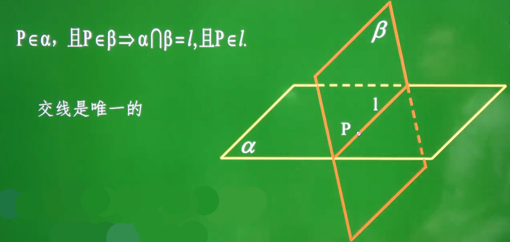

作用如下：

* 判断两个平面相交的依据
* 判断点在直线上

## 空间中直线与直线位置之间的关系

**1、空间中两直线的位置关系**

在平面中，两直线有平行、相交两种位置关系；而在空间中，两直线除了具有平行、相交的位置关系，还有异面的位置关系，即两条直线不在同一平面且不相交。（或两条直线无法构成同一平面。在前面所学的平面公理中，阐述了两条直线相交或两条直线平行就可以构成一个平面）

​		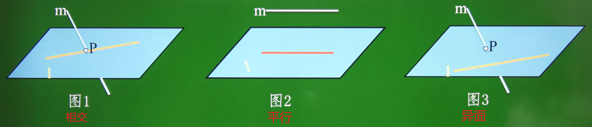

​		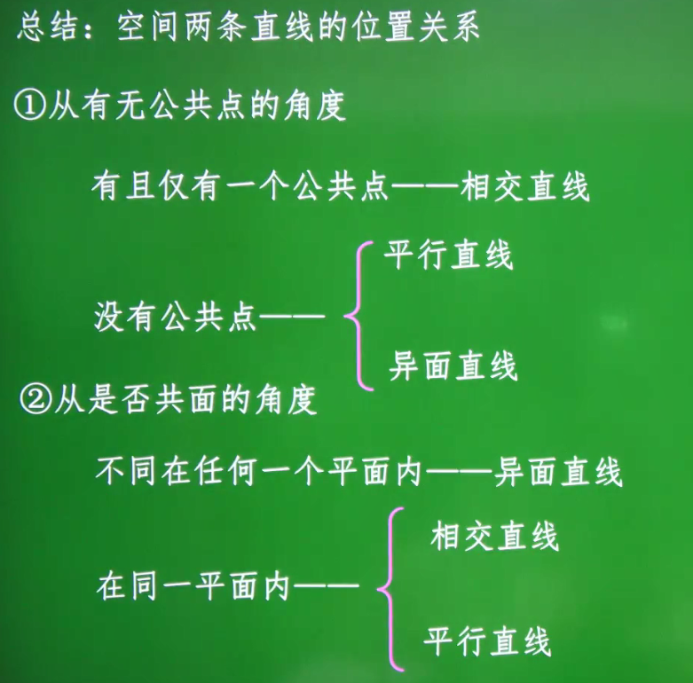

**2、异面直线**

1）把不在同一个平面内且不相交的两条直线叫做异面直线（既不相交也不平行也不在同一平面的两条直线）。

* 经过这两条异面直线无法作出一个平面
* 不可能找到一个平面同时包含这两条异面直线

​		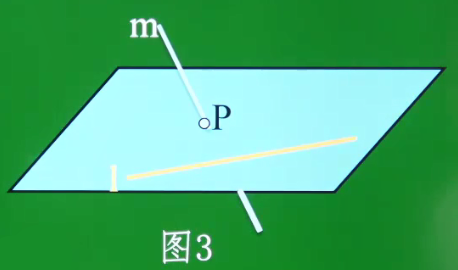	

2）异面直线的画法：通常用一个或两个平面来衬托异面直线不在同一平面内的特点。

​		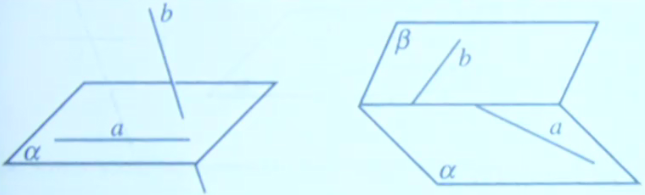

**3、空间两直线平行**

公理4：平行于同一直线的两条直线互相平行。

（公理4实质上是说平行具有传递性，在平面、空间这个性质都适用）

**4、空间四边形**

顺次连接不共面的四点A、B、C、D所组成的四边形叫做空间四边形。

​		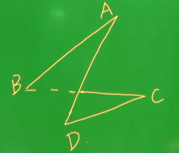

1）上图中，ABCD就是一个空间四边形，顶点ABD在同一平面，BCD在同一平面，但这四个顶点不全在同一平面。

2）相对顶点B与D、A与C的连线BD、AC叫做这个空间四边形的对角线。

**5、等角定理**

定理：空间中如果两个角的两百边分别对应平行，那么这两个角相等或互补。

​		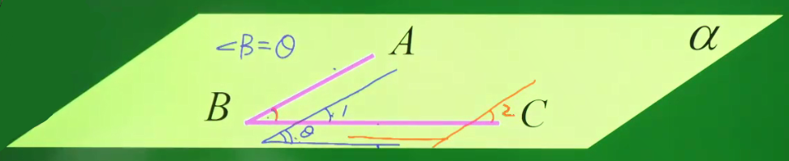

定理的推论：如果两条相交直线和另两条相交直线分别平行，那么这两组直线所成的锐角（或直角）相等。

**6、两条异面直线所成的角**

a，b是两条异面直线，在空间中任选一点O，过点O分别作a，b的平行线a'和b'，则这两条线所成的锐角或直角，称为异面直线a, b所成的角。

​	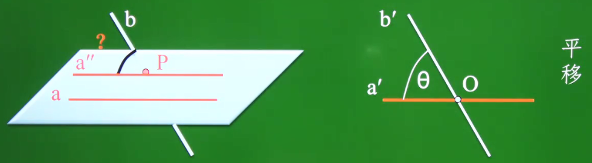

* 可以直接在空间中平移某条异面直线使得两者相交得到两条异面直线所成的角，也可以从空间中将这两条直线平移至一个平面得到这两条异面直线所成的角
* 若两条异面直线所成的角为90。则称它们互相垂直，记作a⊥b
* 异面直线所成的角的取值范围是0。< 角 ≤ 90。

## 直线与平面、平面与平面间的位置关系

**1、直线与平面的位置关系**

1）根据直线与平面的交点个数可以将直线与平面的位置关系分为三种：

* 直线在平面内（有无数个交点）
* 直线与平面相交（有且只有一个交点）
* 直线与平面平行（无交点）

​		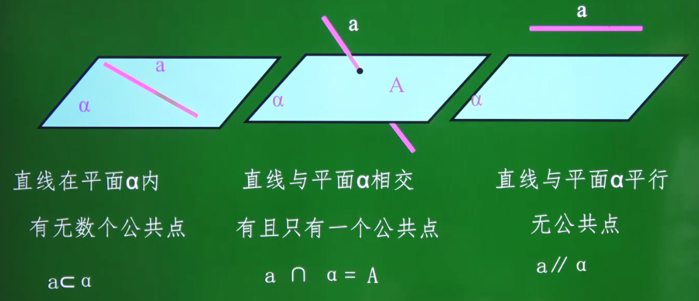

2）根据直线是否在平面内可以直线与平面的位置关系分为两种：

* 直线在平面内
* 直线在平面外（直线与平面相交或平行的情况）

**2、平面与平面的位置关系**

平面与平面的位置关系有两种：

* 两个平面平行——没有公共点
* 两个平面相交——有一条公共直线，相当于无数个交点

​	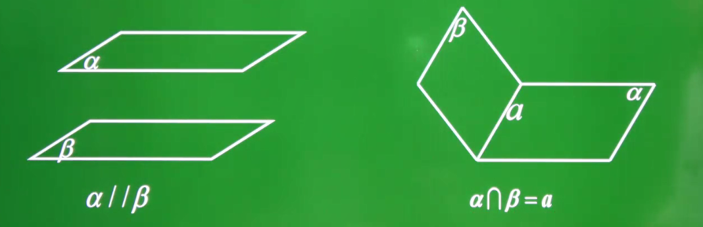

## 直线与平面平行的判定

判定直线与平面是否平行，只需要判定直线与平面有没有交点，这是通过定义法来判定的。但是直线和平面是无限延伸的，所以判定它们是否有交点是一件麻烦的事情，为此可以使用直线与平面平行的判定定理：<u>平面外一条直线与此平面内的一条直线平行，则该直线与此平面平行</u>（线线平行 => 线面平行）。

​		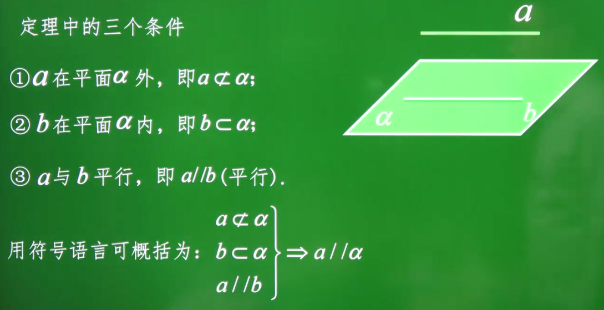

使用直线与平面平行的判定定理有三个前提条件：

* 被判定的直线在该平面外
* 辅助直线在该平面内
* 被判定的直线与辅助直线平行

简称为“面内、面外、平行”。

​	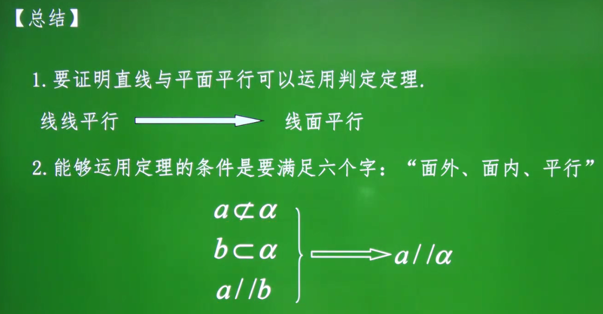

## 平面与平面平行的判定

**1、两个平面平行的定义**

若两个平面没有公共点，则这两个平面平行

1）如果两个平面平行，那么在其中一个平面内的所有直线一定都和另一个平面平行。

2）反过来，如果一个平面内的所有直线都和另一个平面平行，那么这两个平面平行。

**2、平面与平面平行的判定定理**

一个平面内两条相交直线直线与另一个平面平行，则称这两个平面平行。（线面平行 => 面面平行） 

​		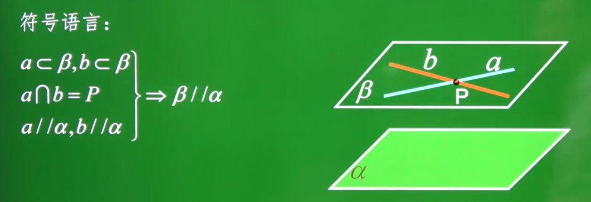

1）注意定理必须需要满足以下条件才成立：

​		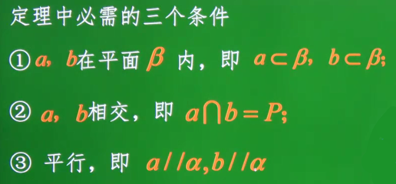

2）判定直线与平面是否平行是通过线线平行得到线面平行，判定平面与平面平行是通过线面平行得到面面平行。

3）如果一个平面内的一条直线与另一个平面平行，这两个平面不一定平行，也有可能是相交。

4）如果一个平面内的两条平行直线与另一个平面平行，这两个平面不一定平行，也有可能是相交。

5）如果一个平面内有无数条直线都与另外一个平面平行，这两个平面不一定平行，也有可能是相交。

6）一个平面内任何直线都与另外一个平面平行，则这两个平面平行。

## 直线与平面平行的性质

一条直线与一个平面平行，则过这条直线的任一平面与此平面的交线与该直线平行。

​		

## 平面与平面平行的性质

如果两个平行平面同时和第三个平面相交，那么它们的交线平行。

​		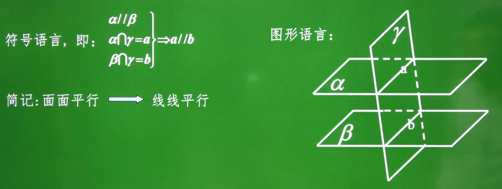

1）如果两个平面平行，那么在一个平面内的所有直线都与另一个平面平行。

2）如果两个平行平面同时和第三个平面相交，那么它们的交线平行。

3）夹在两个平行平面间的所有平行线段相等。

## 直线与平面垂直的判定

**1、直线和平面垂直的定义**

如果直线l与平面α内的任意一条直线都垂直，则该直线l与平面α互相垂直，记作l⊥α。

​	

1）如果已知直线l与平面α垂直，则直线l与平面α内的任意一条直线都垂直。

2）若直线与平面内的无数条直线垂直，则直线不一定垂直于平面。

**2、直线和平面垂直的画法**

画直线与水平平面垂直时，通常把直线画成与表示平面的平行四边形的一边垂直。

​	

**3、直线和平面垂直的判定**

通过定义可知，直线和平面垂直的前提是该直线和平面内的任意一条直线垂直，但是我们不可能通过判定任意一条直线与平面垂直来判定直线与平面垂直，因为平面内的直线是无数的，判定不完。所以可以使用直线和平面垂直的判定定理来判定直线和平面垂直：<u>一条直线与一个平面内的两条相交直线都垂直，则该直线与此平面垂直。</u>

​	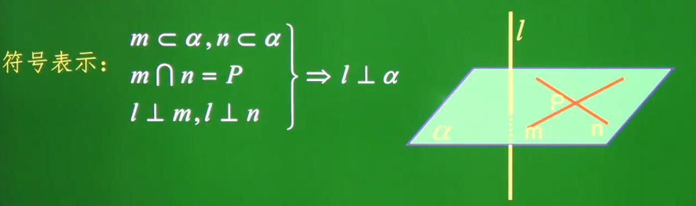

1）两条平行直线中的一条垂直于一个平面，那么另一条直线也垂直这个平面。

​		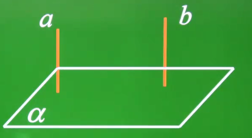

## 直线与平面所成角

直线与平面所成角的范围是0。≤ 角 ≤ 90。，分为三种情况：

1）直线与平面相交但不垂直于平面：此时在该直线上任取一个不为与平面相交的点，然后经过该点作垂直于平面的直线，就构成了一个角。

​		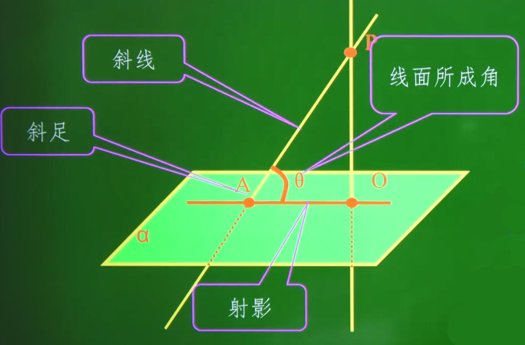

2）直线垂直于平面：此时线面所成的角是直角。

​		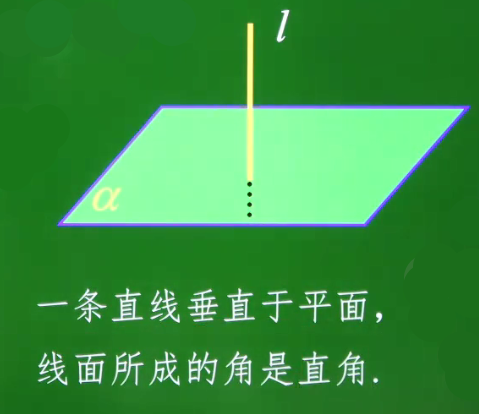

3）直线在平面内或与平面平行：此时线面所成的角是0。的角。

​		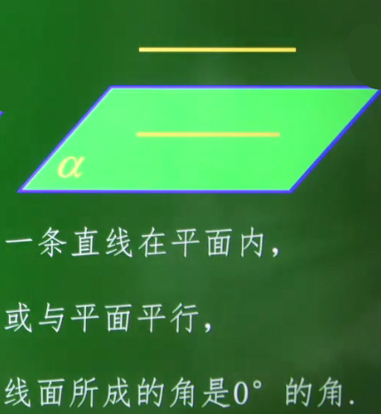

## 平面与平面垂直的判定

**1、半平面、二面角、二面角的平面角**

1）半平面：由一条直线出发产生的两个平面称为半平面。半平面有两种：

​		

2）二面角：从一条直线出发的两个半平面所组成的图形叫做二面角，这条直线叫做二面角的棱，这两个半平面叫做二面角的面。

​		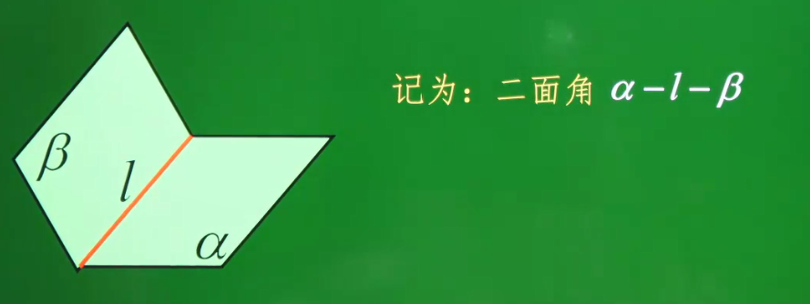		

* 二面角使用“面-直线-面的形式”表示

3）二面角的平面角：二面角的平面角用于表示该二面角的大小。在二面角α-l-β的棱l上任取一点O，以点O为垂足，在半平面α和β内分别作垂直于棱l的射线OA和OB，则射线OA和OB构成的∠AOB叫做二面角α-l-β的平面角。

​		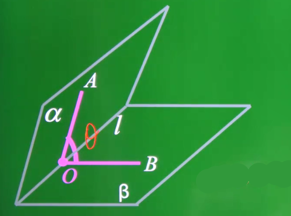

* 二面角的平面角的取值范围为0。≤ 角 ≤ 180。

* 二面角的平面角的大小与在棱l上所选的O点的位置没有关系。

4）直二面角：二面角的平面角等于90。，则这个二面角称为直二面角。

**2、平面与平面垂直的定义**

两个平面相交，如果它们构成的二面角是直二面角，就说这两个平面互相垂直，记作α⊥β

​		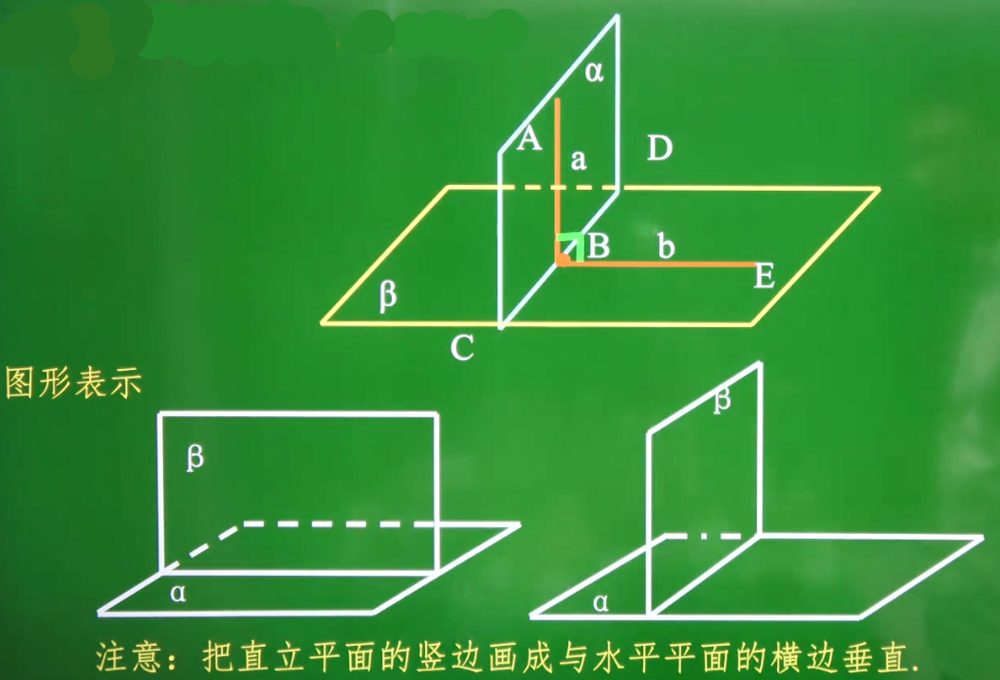

**3、平面与平面垂直的判定定理**

平面内某条直线垂直于该平面与另一个平面的交线，则该平面垂直于另一个平面。

​		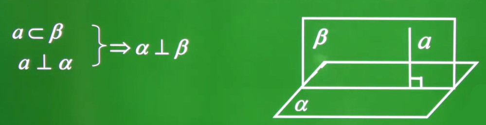

## 直线与平面垂直的性质

已知直线m，n和平面α，如果m⊥平面α，n⊥平面α，则直线m，n平行。（垂直于同一平面的两条直线互相平行）

​		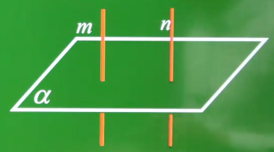

可推：

1）垂直于同一直线的两个平面平行。

2）两条平行直线中的一条直线垂直于平面，则另一条直线也垂直于这个平面。

## 平面与平面垂直的性质定理

两个平面垂直，则一个平面内垂直于交线的直线与另一个平面垂直。

​		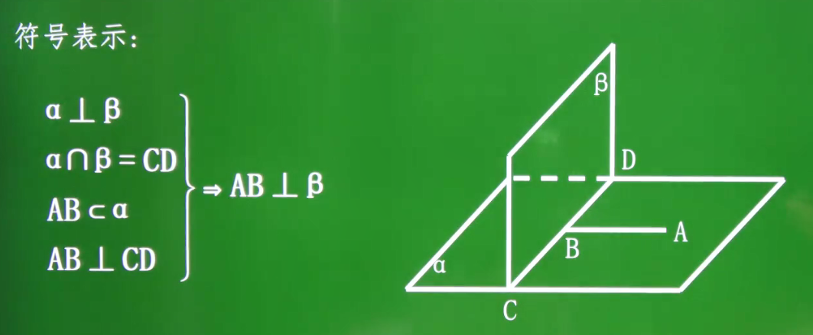

1）如果两个相交平面都垂直于另一个平面，那么这两个平面的交线也垂直于这个平面。

​		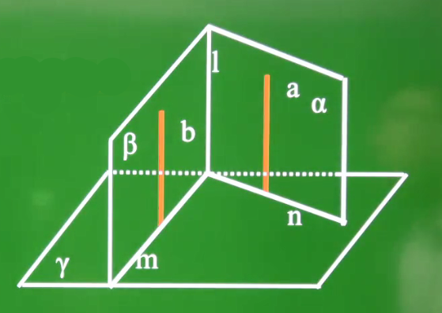

# 3. 直线与方程

## 倾斜角与斜率

**1、直线的倾斜角**

x轴正方向与直线l向上方向之间所成的角，称为该直线的倾斜角。

​		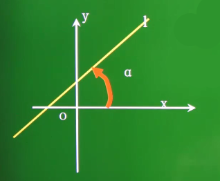

规定：

1）当直线l与x轴平行或重合时，它的倾斜角为0。

2）直线的倾斜角α的取值范围为：[ 0。，180。)

**2、直线的斜率**

一条直线的倾斜角α的正切值叫做这条直线的斜率，通常用小写字母k表示，即k=tanα（注意，α≠90。，因为tan 90。没有意义）

​		

**3、斜率公式**

经过两点P1(x1,y1)，P1(x2,y2)（x1≠x2）的直线的斜率公式如下：

​		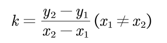

1）该公式与两点坐标的顺序无关，即斜率公式也可以写成如下形式：

​		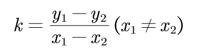

2）公式表明，直线的斜率可以通过直线上任意两点的坐标来表示，而不需要求出直线的倾斜角利用求tan解。

3）当x1=x2时，公式不适用，因为会导致公式分母为0，没有意义。同时x1=x2时，说明直线是垂直x轴，此时该直线的倾斜角为90。，而tan 90。也是没有意义的。

4）斜率为正，倾斜角为锐角；斜率为负，倾斜角为钝角；斜率为0，倾斜角为0。；斜率不存在时，倾斜角为直角。

## 利用斜率判定两条直线平行或垂直

**1、两条直线平行的判定**

设两条直线l1与l2的斜率分别为k1，k2：

​		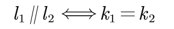

1）该公式成立的前提是：两条直线不重合，且两条直线均存在斜率。

​		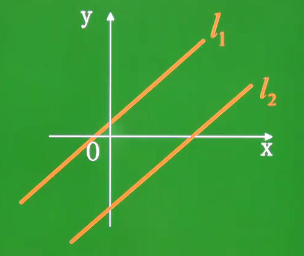

2）两条直线互相平行可以推出这两条直线的斜率是相等的；但反过来，两条直线的斜率相等，则有两种情况

* 这两条直线平行
* 这两条直线是同一条直线，它们重合了

若没有特别说明，“两条直线平行”一般指两条不重合的直线。

3）特别地，不重合的两条直线的倾斜角都为90。时，这两条直线互相平行。

**2、两条直线垂直的判定**

两条直线的斜率分别为k1，k2，且k1k2=-1，则说明这两条直线互相垂直。

​		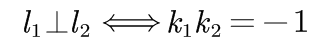

1）反过来，如果两条直线垂直且均存在斜率，则斜率乘积为-1。

2）特别地，一条直线的倾斜角为90。（说明该直线不存在斜率），另一条直线的倾斜角为0。，这两条直线互相垂直。

## 直线的点斜式方程

由直线上一定点和该直线的斜率确定的直线方程，叫直线的点斜式方程。过点P0(x0，y0)，斜率为k的直线l的方程为：

​		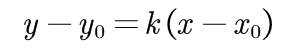

​		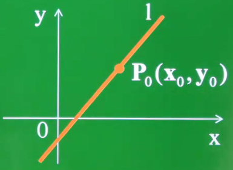

1）直线的点斜式方程成立的条件：直线的斜率存在，即直线的倾斜角不为90。

2）直线的点斜式是由斜率公式两边同时乘以分母而得到的。

​		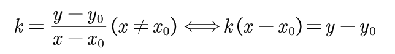

​	在变形之前x≠x0，因为分母不能为0，在变形之后则可以。

2）过点P0(x0，y0)垂直于x轴的直线，该直线的点斜式方程为：x=x0即x-x0=0

​		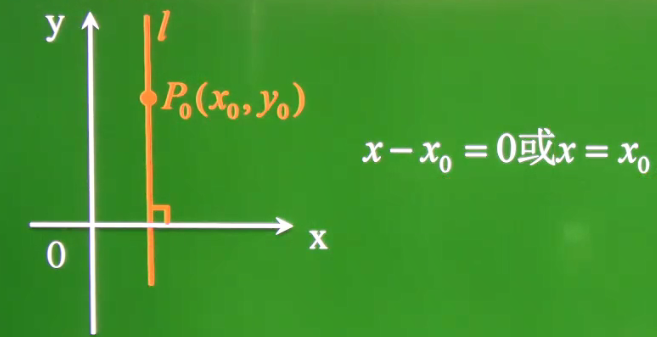

3）过点P0(x0，y0)平行于x轴的直线，该直线的点斜式方程为：y=y0即y-y0=0

​		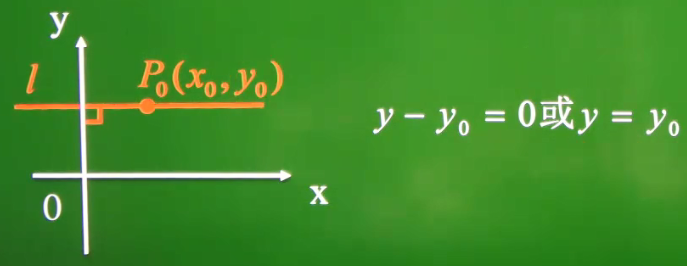

4）x轴所在直线的点斜式方程为：y=0；y轴所在直线的点斜式方程为：x=0

## 直线的斜截式方程

直线的斜截式方程由该直线的斜率k与它在y轴上的截距b确定。所以，直线的斜截式方程为：y=kx+b

​		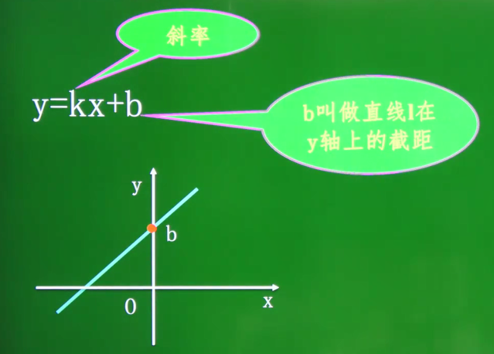

1）k为直线的斜率；b为直线在y轴上的截距，即直线与y轴的交点到原点的正负距离。  

2）直线的斜截式方程成立的条件是：直线的斜率存在。

3）直线的斜截式是一个一次函数。

4）直线的斜截式方程一眼就可以看出该直线的斜率和截距。

## 直线的两点式方程

已知直线上的两点P1(x1，y1)，P2(x2，y2)（其中x1≠x2，y1≠y2），求通过这两点的直线方程。设点P(x,y)是直线上不同于P1，P2的点，有该直线的两点式方程如下：

​		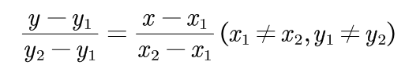

1）直线的两点式方程不能用来表示与坐标轴平行或重合的直线的方程，因为直线与x轴平行或重合时y1=y2，方程分母为0没有意义；直线与y轴平行或重合时x1=x2，方程分母为0没有意义。

2）对于给定的两点P1(x1，y1)，P2(x2，y2)

* 当x1=x2时，这条直线的方程是x=x1亦即x=x2
* 当y1=y2时，这条直线的方程是y=y1亦即y=y2。

## 直线的截距式方程

**1、直线的截距式方程**

直线方程由直线在x轴和y轴的截距确定，这样的方程叫做直线方程的截距式方程。如下：

​		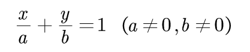

1）其中a表示横截距（直线与x轴的交点到原点的正负距离）；b表示纵截距（直线与y轴的交点到原点的正负距离）

2）直线的截距式方程适用于横、纵截距都存在且都不为0（直线与x轴y轴都相交，即直线不经过原点）的直线。

**2、中点坐标公式**

以P1(x1，y1)，P2(x2，y2)为端点的线段的中点坐标为：

​		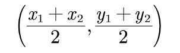

## 直线的一般式方程

把关于x，y的二元一次方程Ax+By+C=0（A、B不同时为0）叫做直线的一般式方程，简称一般式。

1）直线的点斜式、斜截式、两点式、截距式方程都只能表示有斜率的直线，而直线的一般式方程可以表示任意一条直线。

2）对于直线的一般式，一般作如下约定：

* x的系数为正
* x，y的系数及常数项一般不出现分数，
* 一般按含x项、含y项、常数项的顺序排列

## 两直线交点坐标与两直线距离公式

**1、两条直线的交点**

求两条直线的交点坐标，首先将它们的一般式方程列为方程组，解方程组即可得到这两条直线的交点坐标。

​		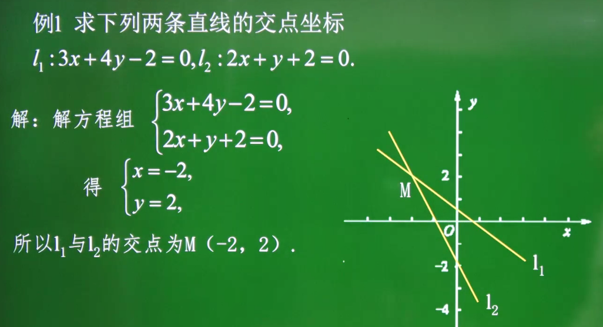

**2、两条直线的位置关系**

利用方程组的解的情况、或者两直线方程的系数关系，可以判定两直线的位置关系。

​		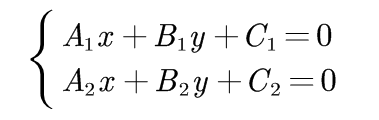

1）利用方程组的解的情况判定两直线的位置关系：

* 当方程组只有一组解时，这两条直线相交，方程组的解是这两直线的交点
* 当方程组无解时，这两条直线平行
* 当方程组存在无数组解时，这两条直线重合

2）根据两直线方程的系数判定两直线的位置关系：

​		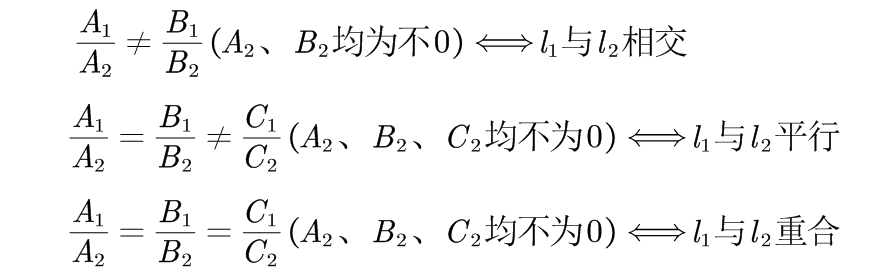

**3、两点间的距离公式**

两点经过同一点作垂线，连接这两点的线段构成了直角三角形的斜边，直角三角形斜边的长度就是这两点间的距离。（利用三角形勾股定理）

​		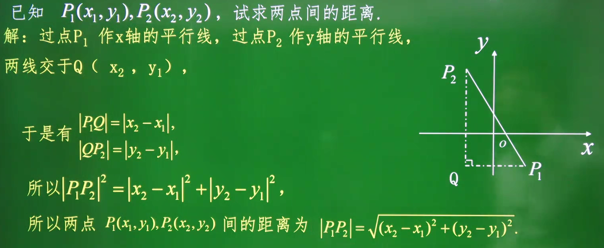

# 3. 圆与方程

## 圆的标准方程

**1、圆的定义**

平面内到一定点的距离等于定长的点的轨迹是圆。

​		

其中M(x,y)是圆上动点，C是圆心，r是半径。圆上的点组成的集合：P = { M(x,y) |  |MC|=r}，

**2、圆的标准方程**

将圆放置在平面直角坐标系中，圆心C的位置用坐标 (a,b) 表示，半径r的大小等于圆上任意点 M(x,y) 与圆心C (a,b) 的距离，即 |MC|=r。

​		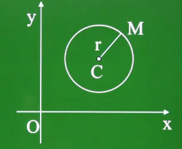

1）对于圆上所有点的集合为 P={M| |MC|=r}，由两点间的距离公式，点M可以表示为：

​		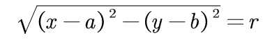

对其进行化简，两边同时乘方得到：

​		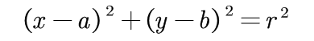

这就是圆的标准方程，其中圆心为 (a,b)，圆的半径为r

2）对于x2+y2=1，它的圆心为 (0,0)，半径为1，这样的圆称为单位圆。

**3、点与圆的位置关系**

设点M到圆心的距离为d，则有：

​	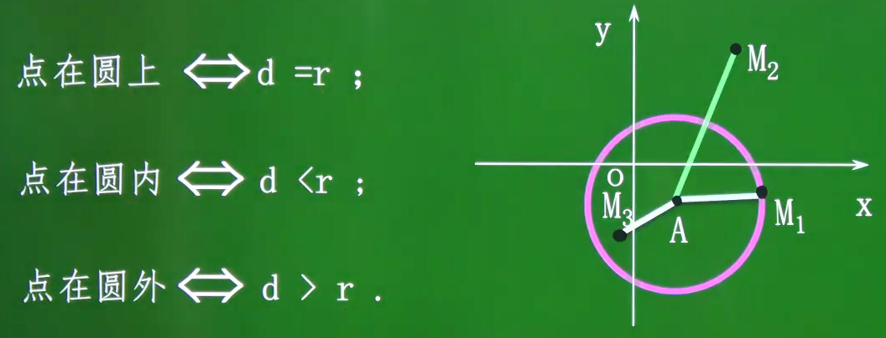

## 圆的一般方程

**1、圆的一般方程的探讨（二元二次方程与圆）**

把圆的标准方程 (x-a)2+(y-b)2=r2 展开整理可以得到 x2+y2+Dx+Ey+F=0。推理如下：

​		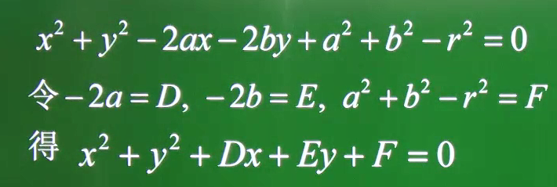

注意：任何一个圆可以使用二元二次方程 x2+y2+Dx+Ey+F=0 表示，但 x2+y2+Dx+Ey+F=0 不一定都表示圆，示例及证明如下：

​		

​		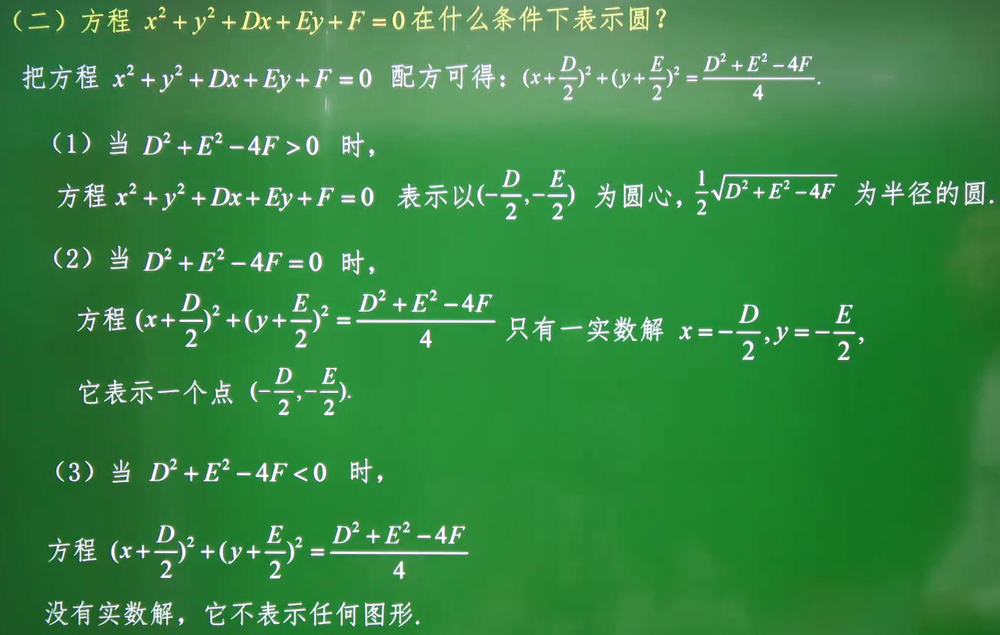

**2、圆的一般方程**

任何一个圆的方程都可以写成 x2+y2+Dx+Ey+F=0 的形式，且当 D2+E2-4F>0 时，方程才表示一个圆，我们把它叫做圆的一般方程。

​		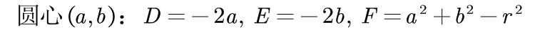

​		

1）在 x2+y2+Dx+Ey+F=0 中，满足以下三个条件它才能是表示圆的一般方程：

* D2+E2-4F>0 
* x2与y2的系数相同
* 不存在“xy”这样的项

2）从圆的标准方程中可以明确知道圆的圆心和半径，所以圆的标准方程更侧重于圆的几何方程；圆的一般方程则是突出了代数方程的形式结构。 

 

​	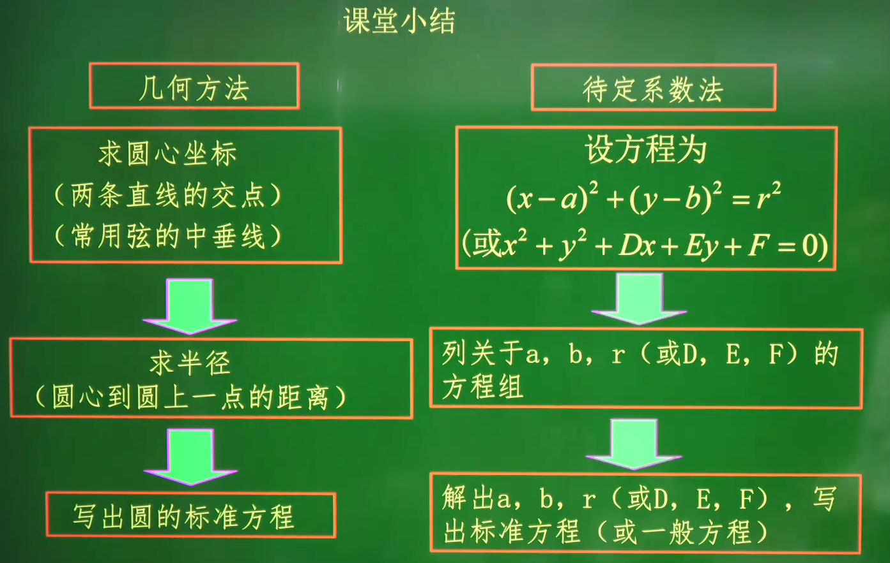

## 圆与圆的位置关系

**1、圆与圆的位置关系**

圆与圆的位置关系在初中阶段已详细讲过，这里做一下简单的复习。

1）代数法：

​		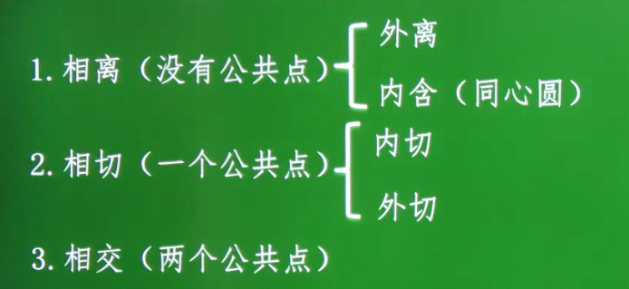

使用代数法表示圆的位置关系时不太具体，比如经计算后得到两个圆有一个交点，此时只能判断它们是相切关系，但相切关系又分为内切和外切，无法具体到是哪种位置关系，还得继续判断。

2）几何法：

​		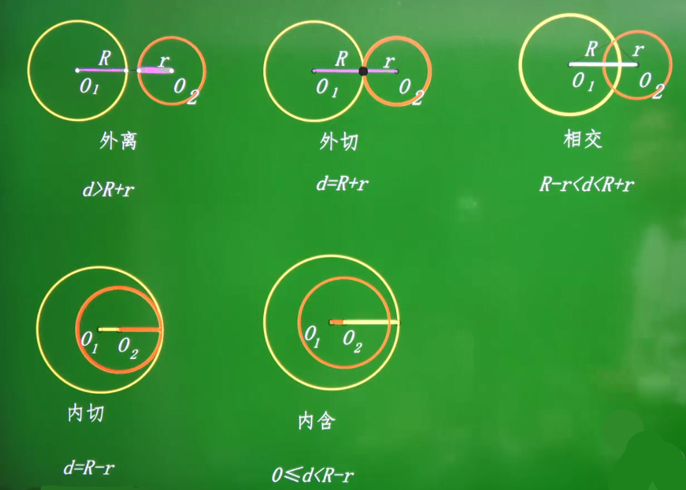

其中d表示圆心距（两圆圆心的距离），R表示大圆半径，r表示小圆半径。（如果给定两个圆的半径但没有告诉哪个大哪个小，那它们在作差运算时，一定要加上绝对值）

**2、两圆位置关系的判断方法总结**

已知圆C1：(x-a)2+(y-b)2=r12   与圆C2：(x-c)2+(y-d)2=r22，它们的位置关系有以下两种判断方法：

​		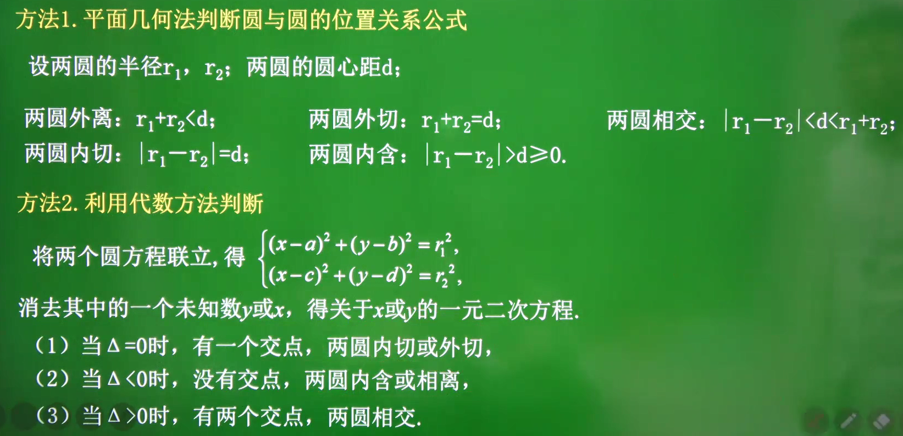

方法1中，两个圆的半径可以从圆的方程中求出，求两圆的圆心距，先从圆的方程中确定这两个圆的圆心，然后利用两点间的距离公式计算这两个圆圆心点之间的距离，就得到了圆心距。

**3、两圆公切线的情况**

​		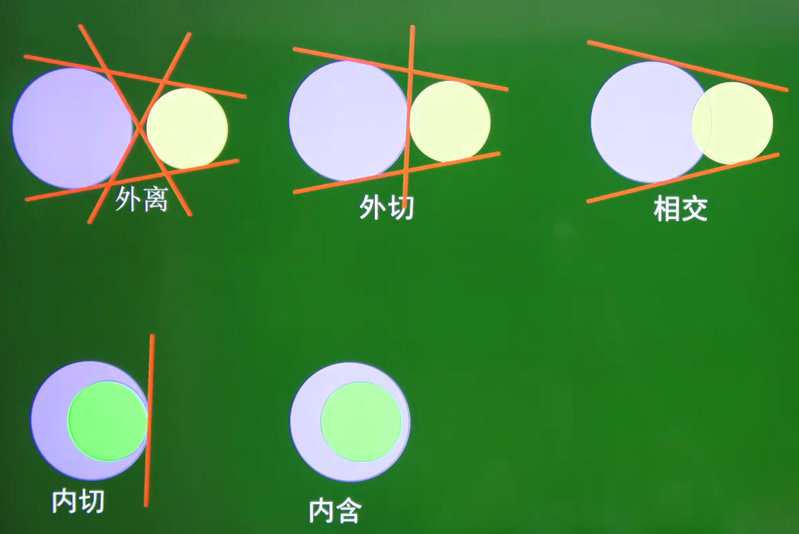

两圆外离，公切线有4条；两圆外切，公切线有3条；两圆相交，公切线有2条；两圆内切，公切线有1条；两圆内含，没有公切线。

**4、相交两圆的公共弦方程**

两圆相交时，会产生两个交点，连接这两个交点的线段叫做公共弦，对于这两个圆来讲，公共弦是一条线段，存在长度；对于坐标系来讲，公共弦如果两端可以延长则变成了一条直线，直线是存在方程的。设圆C1：x2+y2+D1x+E1y+F1=0   与圆C2：x2+y2+D2x+E2y+F2=0，它们相交于A，B两点，这两点一定在公共弦上，求公共弦的方程有如下两种方法：

​		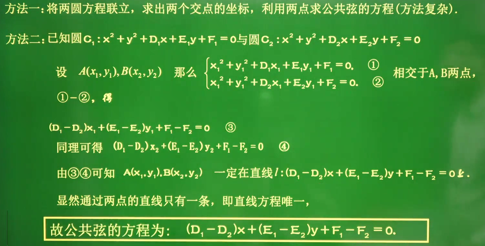

## 空间直角坐标系

**1、空间直角坐标系的建立**

以单位正方体 OABC-D'A'B'C' 的顶点O为原点，分别以射线 OA，OC，OD' 的方向为正方向，以线段 OA，OC，OD' 的长为单位长，建立三条数轴：x轴、y轴，z轴；这时我们就说建立了一个空间直角坐标系Oxyz。

​		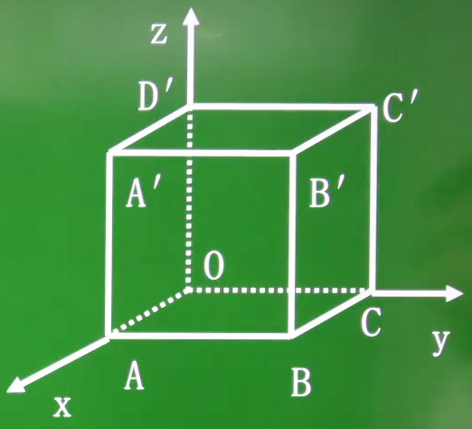

O为坐标原点，x轴、y轴、z轴叫做坐标轴，通过两个坐标轴的平面叫坐标平面，分别称为 xOy平面、yOz平面、zOx平面

**2、空间直角坐标系的画法**

画空间直角坐标系时遵循以下三点：

1）一般情况下，x轴方向指向左下，y轴方向指向正右，z轴方向指向正上。

2）x轴与y轴、x轴与z轴所成角为135。，y轴和z轴垂直，所成角为90。，总和构成360。

3）由于空间直角坐标系表示的是空间，所以在直观上，y轴和z轴的单位长度相同，x轴上单位长度为y轴或z轴的单位长度一半，但在实际长度都是一样的。

​		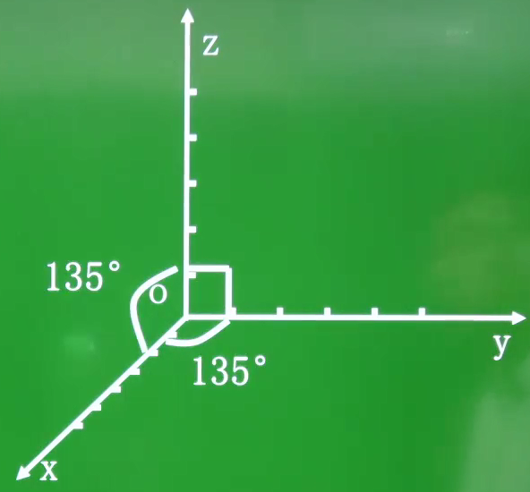

**3、空间直角坐标系的划分**

空间直角坐标系分为8个卦限定（八卦限）。在平面直角坐标系中，象限不包括坐标轴上的点，在空间直角坐标系中与其类似，卦限内的点不包括平面上的点。

​		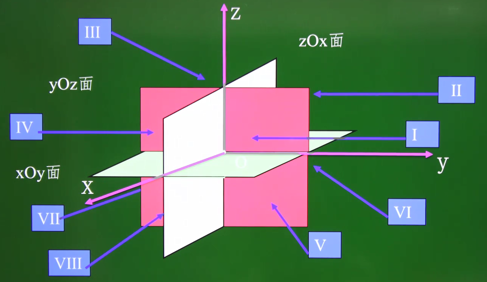

**4、空间直角坐标系中的坐标**

如下图所示，设点M为空间一定点，过点M分别做垂直于x、y、z轴的平面，交点依次为P、Q、R，设点P、Q、R在x、y、z轴上的坐标分被为x、y、z，那么点M就对应唯一确定的有序实数组 (x, y, z) 。反过来，给定有序实数组 (x, y, z)，我们可以在x、y、z轴上分别取坐标为实数x、y、z的点P、Q、R，分别过这三点各作一个平面， 分别垂直于x、y、z轴，这三个平面的唯一交点就是有序实数组 (x, y, z) 确定的点M。

​		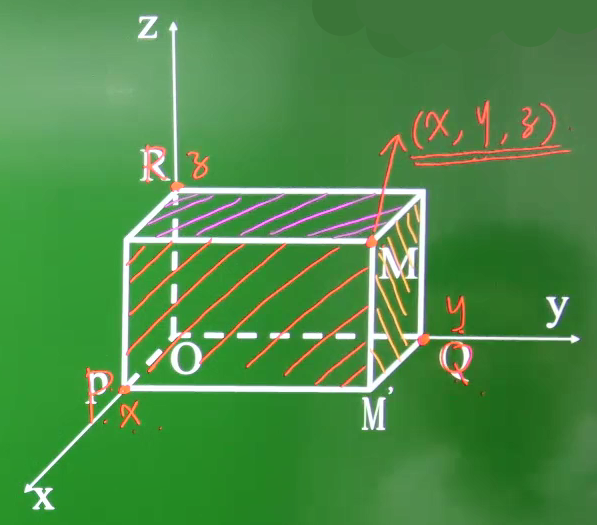

这样，空间上一点M的坐标可以用有序是数组 (x, y, z) 来表示，有序实数组 (x, y, z) 叫做点M在空间直角坐标系中的坐标，记作 M(x, y, z) ,其中x，y，z分别叫做点M的横坐标、纵坐标、竖坐标。

**5、特殊位置的点的坐标**

​		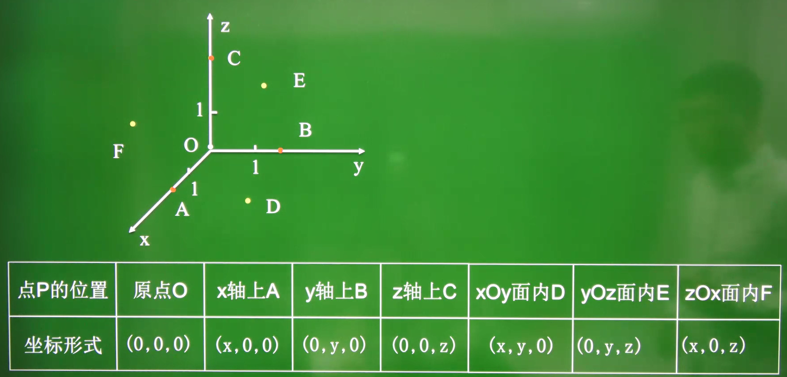

**6、空间点的对称**

在空间直角坐标系中，一个点关于什么轴对称，则这个轴的坐标值不变，另外两个轴的坐标值取反；如果一个点是关于原点对称，则三个轴的坐标值都取反。

​		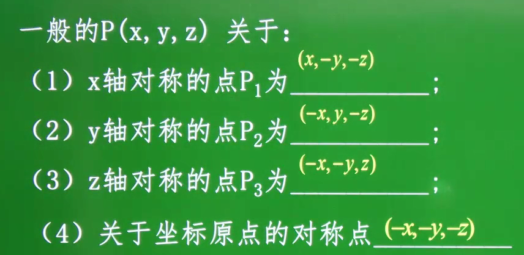

## 空间两点间的距离公式

**1、空间两点间的距离公式**

在空间直角坐标系中，点P1(x1，y1，z1)、点P2(x2，y2，z2)，它们之间的距离为：

​		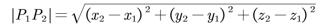

**2、空间中点坐标公式**

在空间直角坐标系中，点P1(x1，y1，z1)、点P2(x2，y2，z2)，它们的中点 (x, y, z)为：

​		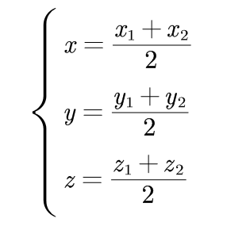

​		
