# 1. 算法初步

## 算法

在数学中，算法是指按照一定规则解决某一类问题的明确和有限的步骤。现在，算法通常可以编成计算机程序，让计算机执行并解决问题。

​		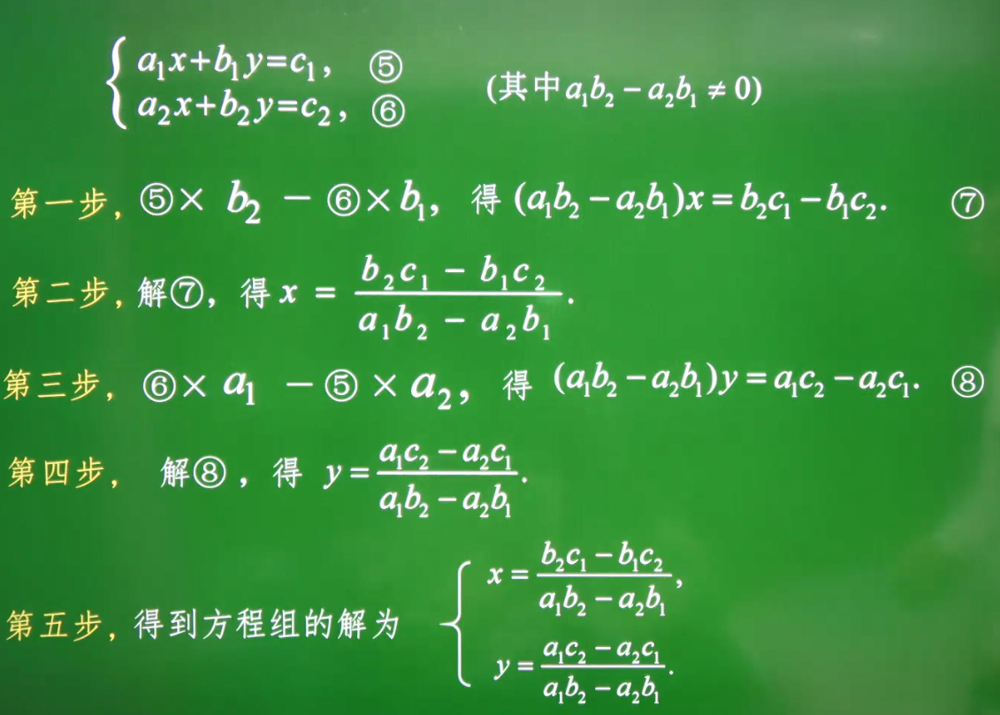

## 程序框图与算法的基本逻辑结构

**1、程序框图**

程序框图又称流程图，是一种用程序框、流程线及文字说明来准确、直观地表示算法的图形。

1）在程序框图中，一个或几个程序框的组和表示算法中的一个步骤；带有方向箭头的流程线将程序框连接起来，表示算法步骤的执行顺序。

2）基本的程序框和它们各自表示的功能如下：

​		

**2、算法的基本逻辑结构**

1）顺序结构：

​		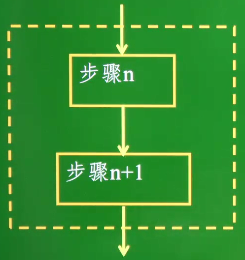

2）条件结构：

​		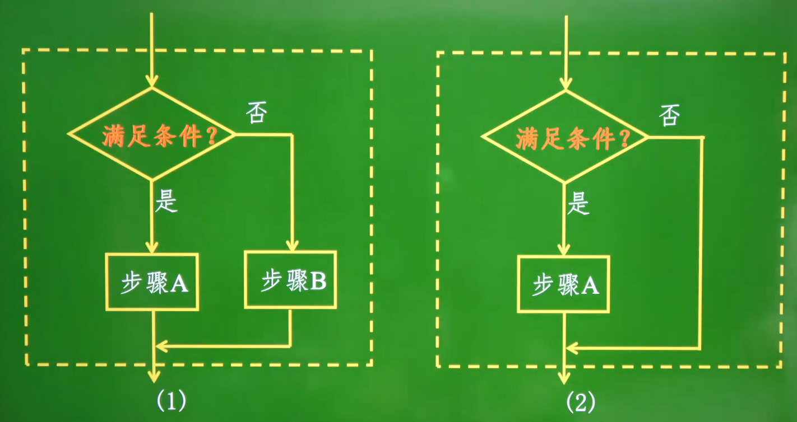

3）循环结构：

​		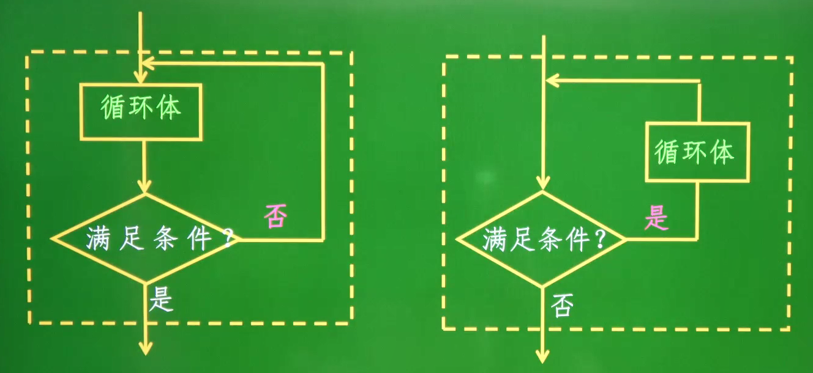

## 输入语句、输出语句、赋值语句

​		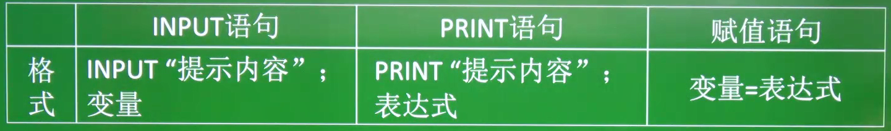

 		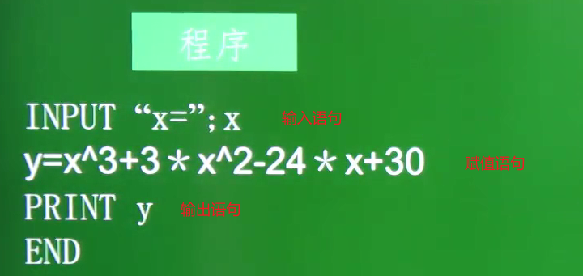

## 条件语句

​		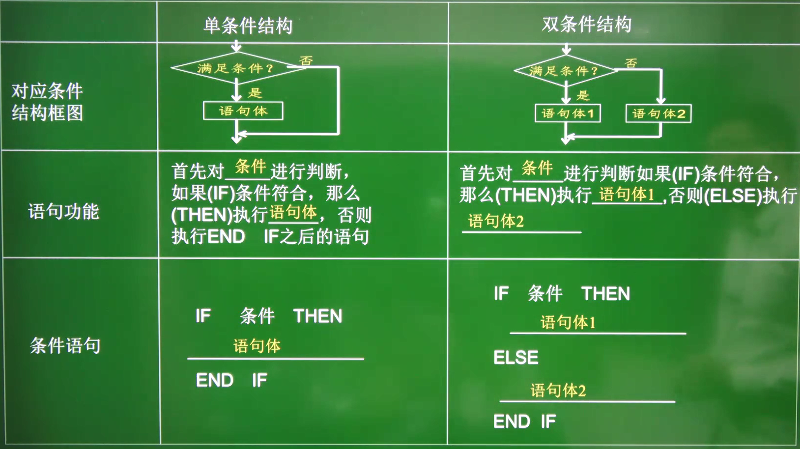、

## 循环语句

**1、循环结构的定义及两种基本形式**

​		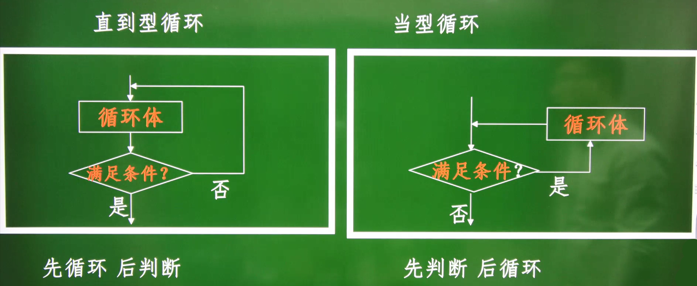

**2、直到型循环**

​		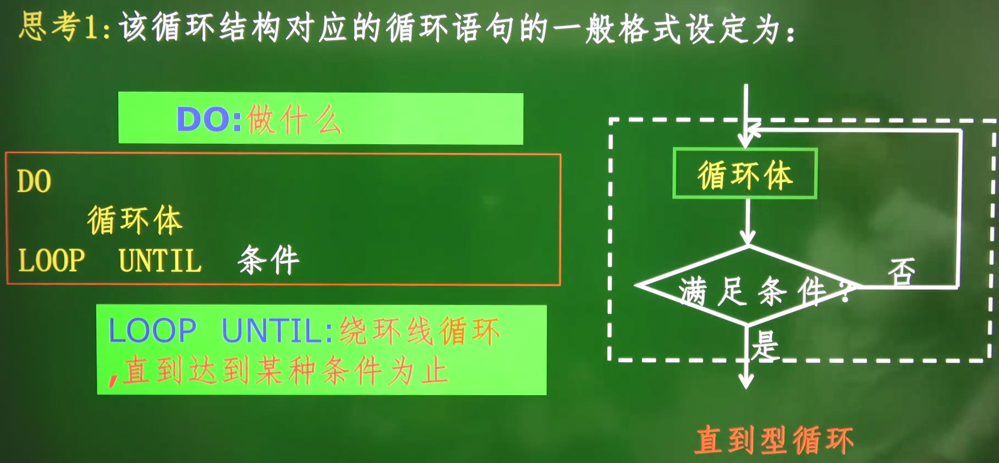

**3、当型循环**

​		

## 算法案例

**1、算法的表示方式**

算法的三种表示方式：

​		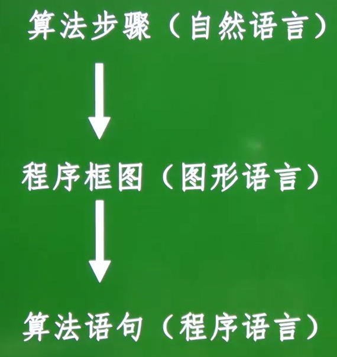

**2、求两个数的最大公约数**

求两个数的最大公约数可以使用辗转相除法（欧几里得算法）、辗转相减法（《九章算术》中的更相减损法）。

1）辗转相除法，也称欧几里得算法：

​		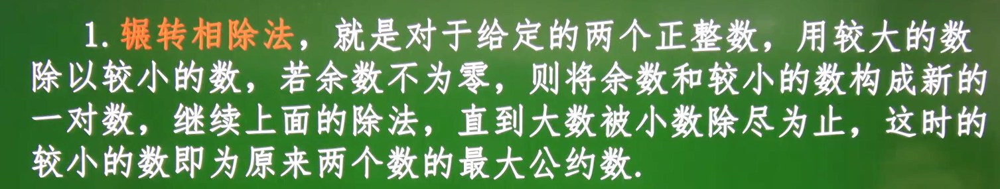

2）辗转相减法，来自于《九章算术》中的更相减损法：

​		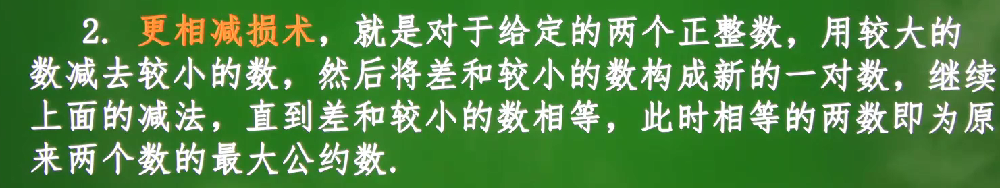

两者的比较如下：

​		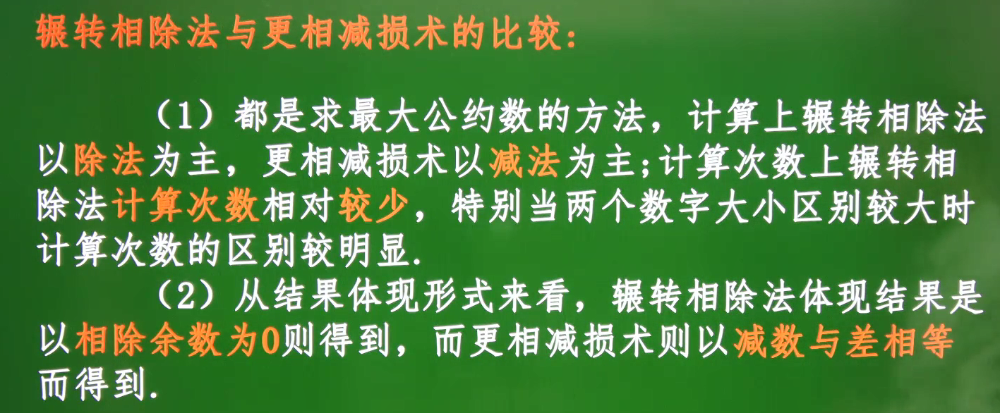

示例如下：

​		

# 2. 统计

## 简单随机抽样

**1、统计相关概念**

总体：所有考察对象的全体；

个体：总体中的每一个考察对象；

样本：从总体中抽取的一部分个体叫做这个总体的一个样本；

样本容量：样本中个体的数目。

**2、简单随机抽样的概念及其特点**

设一个总体含有N个个体，从中逐个不放回地抽取n个个体作为样本（n≤N），如果每次抽取时总体的各个个体被抽到的可能性都相等，就把这种抽样方法叫做简单随机抽样，这样抽取的样本，叫做简单随机样本。

简单随机抽样的特点：

（1）总体个数N是有限的

（2）逐个抽取

（3）不放回的抽取

（4）样本容量n≤N总体个数

（5）每个个体被抽到的可能性相等

**3、常用的简单随机抽样方法及其优缺点**

常用的简单随机抽样方法有：抽签法、随机数法

1）抽签法：抽签法把总体中的N个个体编号，把号码写在号签上，将号签放在一个容器中，搅拌均匀后，每次从中抽取一个号签，连续抽取n次，就得到了一个容量为n的样本。基本步骤如下：

* 将总体中的N个个体编号；
* 将这N个号码写在形状、大小相同的号签上；
* 将号签放在同一箱中，并搅拌均匀；
* 从箱中每次抽出一个号签，连续抽出n次；
* 将总体中与抽到的号签编号一致的n个个体取出。

说明：将个体编号时，可利用已有的编号，例如学生的学号、座位号等；当总体个数不多时，适宜采用抽签法。

2）随机数法：利用随机数表、随机数骰子或计算机产生的随机数进行抽样，叫做随机数法。

抽签法和随机数法各自的特点如下：

* 抽签法：操作简单，但是当总体个数较多时制作号签工作量大，也很难做到“搅拌均匀”。
* 随机数法：简单易行，避免了抽签法制作号签的麻烦，也有效的避免了搅拌不均匀的弊端，但是读数和计数时容易出错。

## 系统抽样

**1、系统抽样的概念及特点**

在抽样中，当总体个数较多时，可将总体分成均衡的几个部分，然后按照预先制定的规则，从每一部分抽取一个个体，得到所需要的样本，这样的抽样方法叫做系统抽样。

系统抽样的特点：

（1）当总体容量N较大时，采用系统抽样

（2）当总体分成均衡的若干部分指的是将总体分段、分段的间隔要求相等，因此系统抽样又称等距抽样，间隔一般为K=N/n（因为因为存在不整除的情况，所以是一般为K=N/n，如果出现不整除的情况，则可以随机剔除总体中多余的个体，使得最后能够整除）

（3）预先指定的规则是指：在第1组内采用简单随机抽样确定一个随机编号，在此编号的基础上加上分段间隔的整倍数，即为其他每组中的抽样编号。

**2、系统抽样与简单随机抽样的对比**

1）系统抽样比简单随机抽样更容易实施，可节约成本。

2）系统抽样所得到的样本的代表性和编号有关，而简单随机抽样所得样本代表性与编号无关。

3）系统抽样比简单随机抽样应用的范围广，尤其时工业生产线上产品质量的检验，不知道产品的数量，因此不能用简单随机抽样。

4）当总体中元素个数较少时，常采用简单随机抽样；当总体中元素个数较多时，常采用系统抽样。

**3、系统抽样的步骤**

​		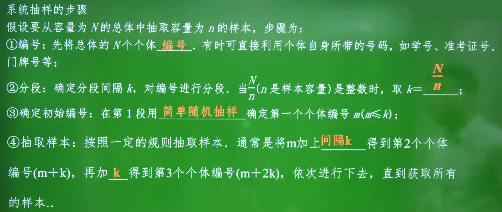

## 分层抽样

**1、分层抽样的概念**

当总体由差异明显的几部分组成时，为了使样本更客观地反映总体情况，常常将总体中的个体按不同的特点分成层次比较明显的几部分，然后按照各部分在总体中所占的比实施抽样，这种抽样方法叫分层抽样。

​		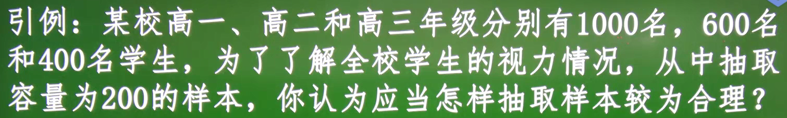

**2、分层抽样的步骤**

分层抽样的步骤分为4步：分层、计算比、确定各层样本容量、抽样。

（1）将总体按特征进行分层（分层）

（2）计算各层中的个体数在总体个体数中的占比（计算比）

（3）按各层个体数占总体个体数的比确定各层应抽取的样本的容量（确定各层样本容量）

（4）在每一层可可采用简单随机抽样或系统抽样进行抽样，组成样本（抽样）

**3、简单随机抽样、系统抽样、分层抽样的比较**

​		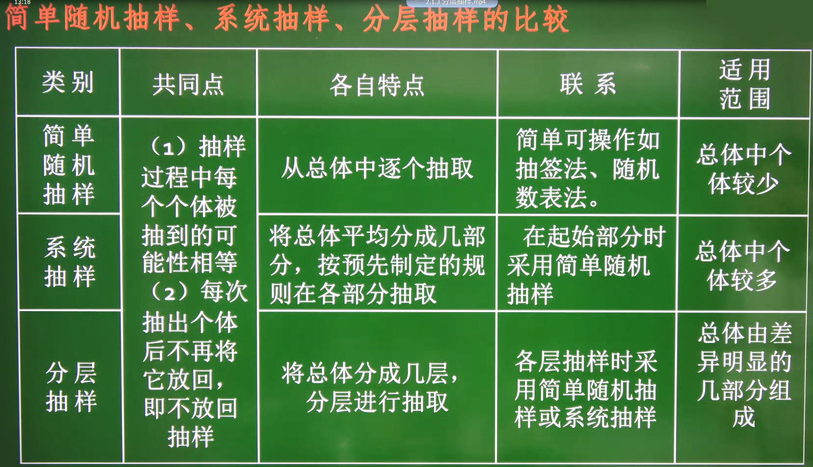

可以看出，不管哪种是抽样方法，最终都依赖于简单随机抽样方法。

## 用样本的频率分布估计总体分布

**1、频率分布表**

1）通过实际问题构建频率分布表。

​		

针对上述问题，得到的频率分布表如下：

​		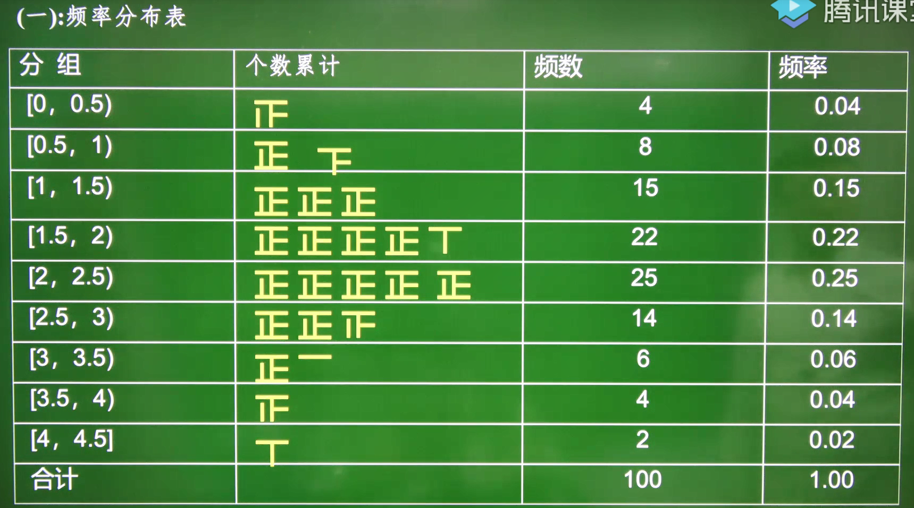

在频率分布表，频数表示该组数据中的个体数量，每组数据中的频数之和等于样本容量；频率表示该组数据的频数占样本容量的百分比，每组数据中的频率总和为1，即100%。

2）列出一组样本数据的频率分布表的步骤如下：

* 第一步，求极差
* 第二步，决定组距与组数（组距根据实际需要确定；组数=极差/组距，多余部分也凑成一组）

* 第三步，将数据分组
* 第四步，列频率分布表

**2、频率分布直方图**

在列出了一组样本数据的频率分布表之后，可以根据频率分布表画出对应的频率分布直方图：

​		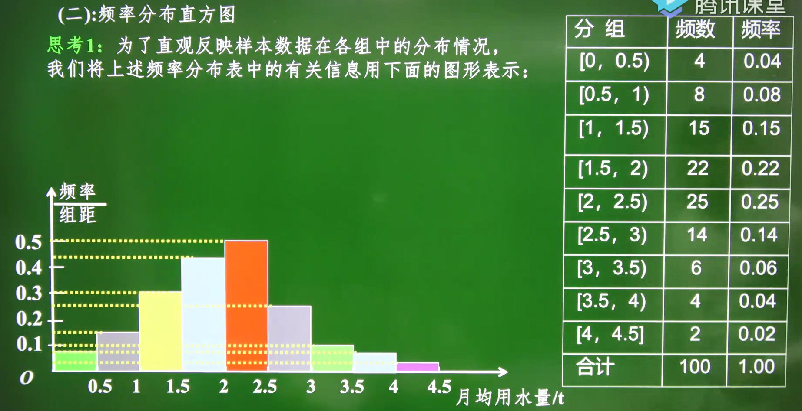

1）在频率分布直方图中：

* 特别需要注意，频率分布直方图中的纵坐标是：频率/组距
* 频率分布直方图中，每个小长方形的高是纵坐标的值，即频率/组距；小长方形的宽是组距；小长方形的面积是：组距×频率/组距=频率，即小长方形的面积表示的是该组数据的频率，所有小长方形的面积总和为1，即100%
* 各区间频数=样本容量×各区间的频率

2）频率分布直方图的作图步骤为：

* 第一步，画平面直角坐标系
* 第二步，在横轴上确定各组分点，在纵轴上标出单位长度
* 第三步，以组距为宽，各组的频率与组距的商为高，分别画出各组对应的小长方形

**3、茎叶图**

频率分布图、频率分布直方图和折线图的主要作用是表示样本数据的分布情况，此外我们还可以用茎叶图来表示样本数据的分布情况。

1）茎叶图的两种形式如下：

​		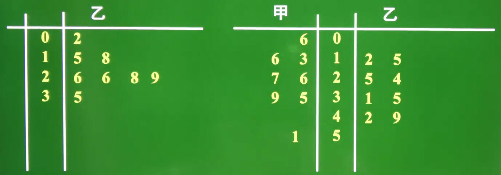

2）茎叶图示例如下：

​		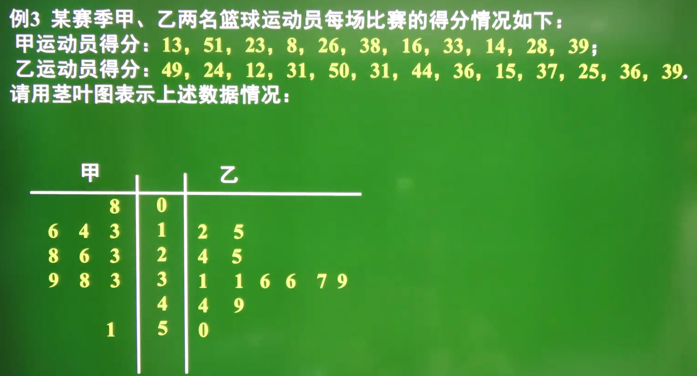

## 标准差与方差

**1、标准差**

标准差是样本数据到平均数的一种平均距离，标准差较小，数据的离散程度较小。标准差一般用s表示，计算公式如下：

​		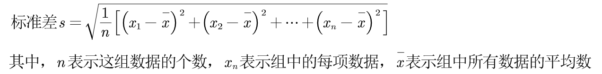

1）标准差描述一组数据围绕平均数波动的大小，反映了一组数据变化的幅度和离散程度的大小，标准差较大，数据的离散程度较大；

2）标准差是方差的开平方。

3）标准差的取值范围为：[0,+∞)

**2、方差**

方差用于刻画数据的离散程度，方差越大，数据离散程度越大，方差越小，数据的离散程度越小。方差计算公式如下：

​		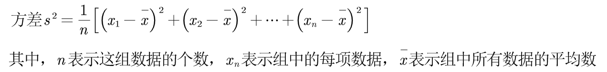

1）方差与标准差作用相同，描述一组数据围绕平均数波动程度的大小

2）方差是标准差的平方

3）方差的取值范围为：[0,+∞)

## 用样本的数字特征估计总体的数字特征

**1、相关概念**

1）众数：在一组数据中，出现次数最多的数据叫做这一组数据的众数。

2）中位数：将一组数据按大小依次排列，把处在最中间位置的一个数据（或中间两个数据的平均数）叫做这组数据的中位数。

3）平均数：一组数据的总和除以数据的个数所得的值。

**2、从频率分布直方图中估计众数**

如果只给了频率分布直方图，而没有给样本数据，此时我们可以从频率分布直方图中估计众数。

​		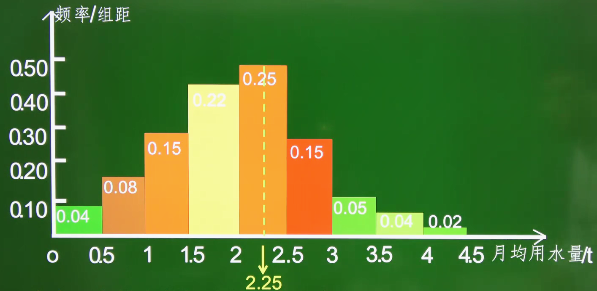

结论：在样本数据的频率分布直方图中，众数的估计值是最高矩形的中点的横坐标值。

**3、从频率分布直方图中估计中位数**

如果只给了频率分布直方图，而没有给样本数据，此时我们可以从频率分布直方图中估计中位数。

​		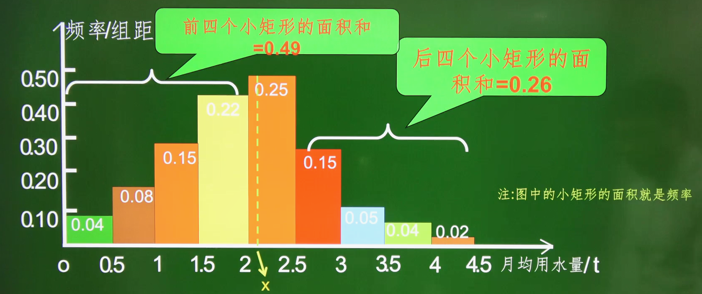

分析：在样本数据中，有50%的个体小于或等于中位数，也有50%的个体大于或等于中文数，因此在频率分布直方图中，中位数左边和右边的直方图的面积应该相等，由此可以估计中位数的值。

结论：在频率分布直方图中，把频率分布直方图划分左右两个面积相等的分界线与x轴交点的横坐标来估计中位数。（上图中，设中位数x，则可以建立方程：0.04+0.08+0.15+0.22+(x-2)×0.5=0.5，解得x=2.02，所以中位数是2.02）

**4、从频率分布直方图中估计平均数**

如果只给了频率分布直方图，而没有给样本数据，此时我们可以从频率分布直方图中估计平均数。

​		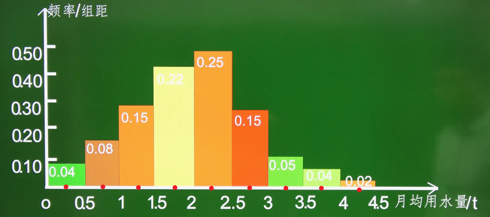

结论：频率分布直方图中，用每个小矩形的面积乘以小矩形底边中点的横坐标得到值之和，就是估计平均数。（上图中，估计平均数为0.04×0.25+0.08×0.75+0.15×1.25+0.22×1.75+0.25×2.25+0.15×2.75+0.05×3.25+0.04×3.75+0.02×4.25=2.02t ）

**5、关于估计值的偏差说明**

1）从频率分布直方图中估计的众数、中位数、平均数与基于样本数据计算得到的众数、中位数、平均数会产生偏差，这主要是因为在制作频率分布直方图时“丢失”了一些样本数据（因为是将数据划分到了各组中，而每组只是表示大致的范围，不告诉每个具体的数据值），所以会有偏差。

2）在只有样本频率分布直方图的情况下，才可按上述方法估计众数、中位数和平均数，并由此估计总体特征。如果有了原始样本数据，则基本原始样本数据计算的值是准确的。

## 变量之间的相关关系

如果两个变量中的一个变量取值一定时，另一个变量的取值带有一定的随机性，那么这两个变量之间的关系，叫做相关关系。（相关关系具有随机性，不具有确定性，确定性的关系比如正方形的面积和周长，给定正方形的面积，则它的周长是确定的）

* 如果散点图中的点是从左下角到右下角的区域，那么这两个变量的相关关系称为正相关。
* 如果散点图中点的分布是从左上角到右下角的区域，那么这两个变量的相关关系称为负相关。

​		 

## 两个变量的线性相关

**1、线性相关**

1）回归直线：如果两个变量散点图中的点分布从整体上看大致在一条直线附近，那么称这两个变量（x，y轴所表示的两个变量）之间具有线性相关关系，这条直线叫做回归直线。

​		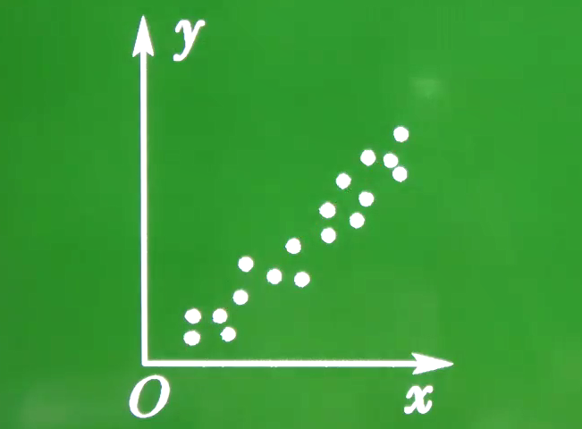

2）线性回归方程与最小二乘法：用最小二乘法求线性回归直线方程，假设我们已经得到两个具有线性相关关系的变量的一组数据(x1，y1)，(x2，y2)，···，(xn，yn)，用 Q=(y1-bx1-a)2+(y2-bx2-a)2+...+(yn-bxn-a)2 表示点到直线y=bx+a的“整体距离”，当Q最小时，a，b的值可由下列公式给出：

​		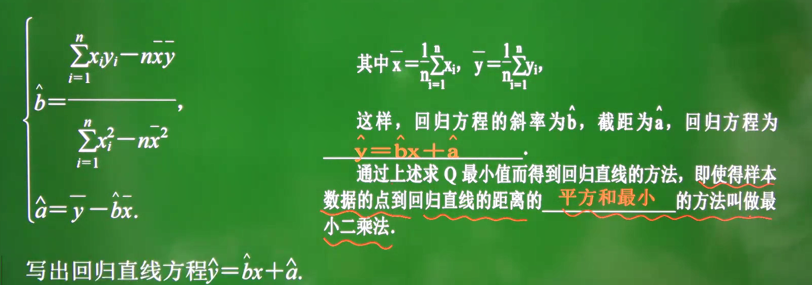

* 上述公式说明如下：

​		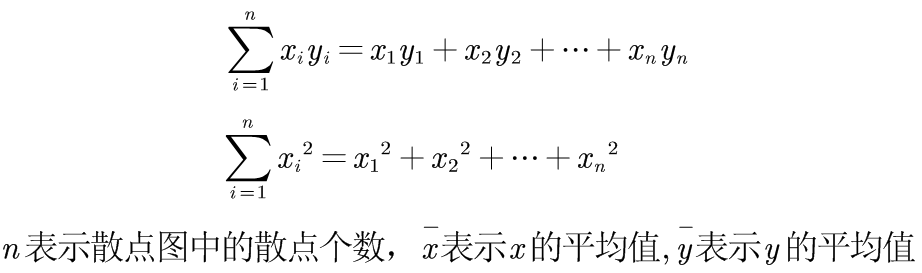

* 回归直线方程一定经过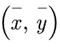者一点，这点是样本点的中心。对于单变量样本数据而言，平均数是样本的中心，类似地，对于双变量样本点而言，回归直线是样本点的中心。
* 求线性回归直线方程的步骤如下：

​			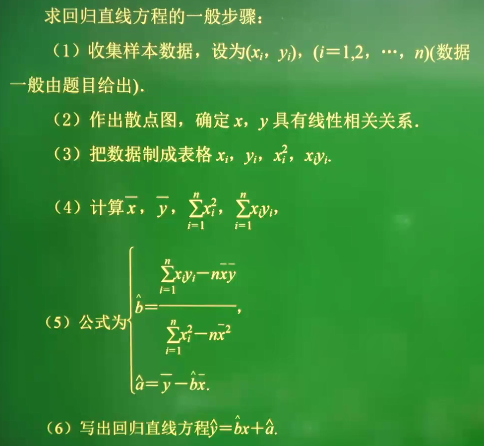

# 3. 概率

## 随机事件的概率

**1、必然事件、不可能事件、随机事件**

必然事件：在条件S下，一定会发生的事件，叫做相对于条件S的必然事件，简称必然事件。

不可能事件：在条件S下，一定不会发生的事件，叫做相对于条件S的不可能事件，简称不可能事件。

随机事件：在条件S下，可能发生也可能不发生的事件，叫做相对于条件S的随机事件，简称随机事件。

1）必然事件和不可能事件是确定的，因此两者称为确定事件。

2）确定事件和随机事件统称为事件，一般用大写字母A、B、C······表示。

**2、频数、频率**

​		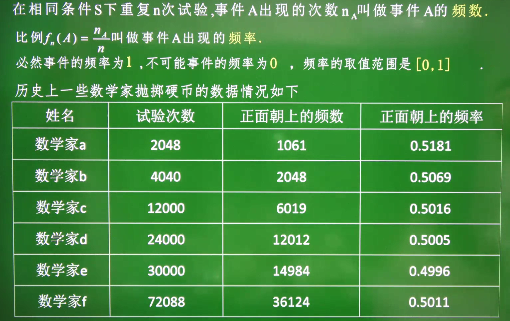

可以发现，抛硬币正面朝上的频率稳定在0.5附近，其实它就是概率。

**3、概率**

​		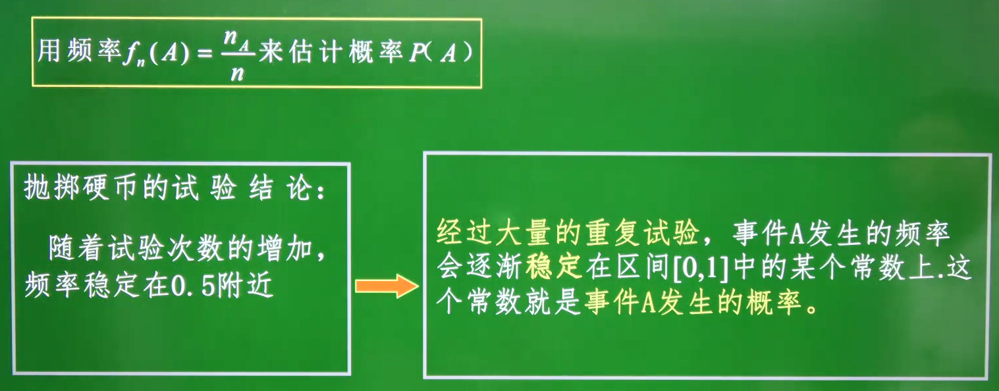

**4、小结**

1）事件的分类：

​		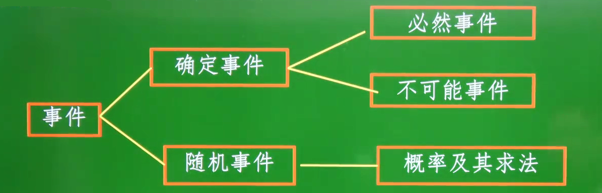

2）频数、频率：

​		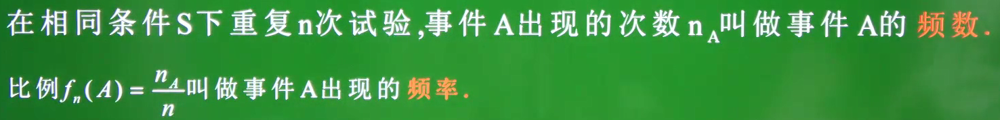

3）随机事件的概率：

​		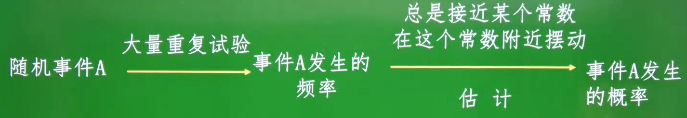

4）频率与概率的区别和联系：频率是随机的，试验前不能确定；而概率是客观存在的，与试验无关。

## 概率的意义

**1、概率的正确理解**

随机事件在一次实验中发生与否是随机的，但随机性中含有规律性：即随着实验次数的增加，该随机事件发生的概率会越来越接近于该事件发生的概率。

**2、游戏的公平性**

​		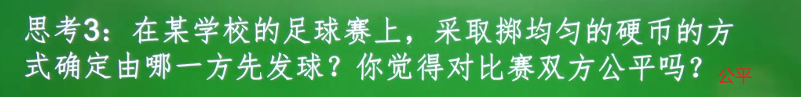

​		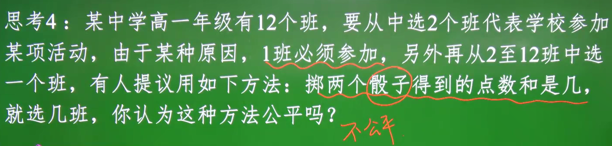

**3、决策中的概率思想**

​		

**4、天气预报的概率解释**

​		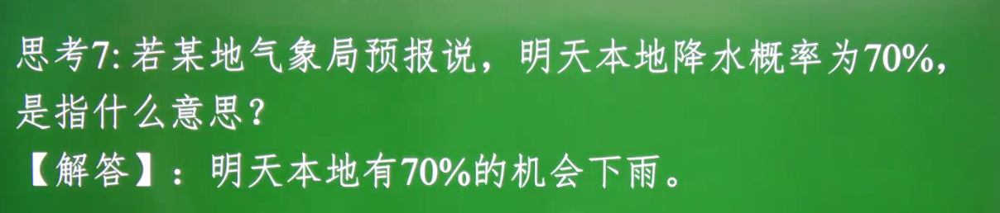

**5、试验与发现**

​		

## 概率的基本性质

**1、概率与集合**

两个集合存在着包含与相等的关系，集合可以进行交、并、补运算，我们可以把一次试验可能出现的所有结果看成是一个集合，必然事件对应全集，随机事件对应子集，不可能事件对应空集，从而可以类比集合的关系与运算，分析事件之间的关系与运算，进一步理解概率。**2、事件的关系与运算**

1）包含事件：对于事件A与事件B，如果当事件A发生时，事件B一定发生，称事件B包含事件A或事件A包含于事件B，记作：B⊇A或A⊆B

2）不可能事件：不可能事件用Φ表示，它与任何事件的关系约定为：任何事件都包含不可能事件

3）相等事件：当两个事件A、B满足B⊇A或A⊇B（A、B事件互相包含），则事件A与事件B相等，记作：A=B

4）并事件（和事件）：当且仅当事件A发生、或者事件B发生时，事件C发生（事件C等同与事件A和事件B中的任一事件），则称事件C为事件A与事件B的并事件，记作C=A∪B或C=A+B（事件A和事件B不可能同时发生，两者只能发生一个，哪个发生哪个就是事件C）

5）交事件（积事件）：当且仅当事件A发生并且事件B也发生时，事件C发生，则称事件C为事件A与事件B的交事件（AB事件同时发生构成了事件C），记作：C=A∩B或C=AB

**3、互斥事件与对立事件**

1）互斥事件：若事件A∩B为不可能事件，即A∩B=Φ，此时称事件A与事件B互斥，记作：A∩B=Φ，A与B互斥（事件A与事件B不可能同时发生，比如并事件中的每个事件都不可能同时发生）

2）对立事件：若A∩B为不可能事件（即互斥事件），A∪B为必然事件且它们共同构成了基本事件空间，则称事件A与事件B互为对立事件，记作：A∩B=Φ且A∪B=Ω（Ω为基本事件空间，基本事件空间指的是这个试验可能发生的所有事件） 

* 对立事件指的是：事件A与事件B不能同时发生，但必须有一个要发生
* 对立事件的前提是它们是互斥的，不能同时发生，所以对立事件包含了互斥事件；但互斥事件不一定对立事件
* 事件A与事件B互为对立事件时，它们对应的集合关系是补集关系

**4、概率的几个基本性质**

（1）概率的取值范围是[0,1]，即0≤P(A)≤1，必然事件的概率是1，不可能事件的概率是0。

（2）如果事件A与事件B互斥，则事件A∪B发生的概率等于A事件发生的概率加上B事件发生的概率，即P(A∪B)=P(A)+P(B)，这就是概率的加法公式，也称互斥事件的概率的加法公式。

（3）如果事件A与事件B互为对立事件，则A∩B为不可能事件，A∪B为必然事件，所以P(A∪B)=P(A)+P(B)=1。

## 古典概型

**1、基本事件**

在一次试验中可能出现的每一个基本结果称为基本事件。

1）例如抛掷硬币，基本事件有两个：正面朝上、反面朝上

2）基本事件都是随机事件，所以也称随机事件为基本事件

3）基本事件具有如下特点：

* 任何两个基本事件是互斥的
* 任何事件（除不可能事件外）都可以表示成多个基本事件的和
* 试验中出现的基本事件的个数是有限个的（有限性）
* 每个基本事件出现的可能性相等（等可能性）

**2、古典概型**

（1）试验中所出现的基本事件是有限个的（有限性）

（2）每个基本事件出现的可能性相等（等可能性）

将具有以上两个特点的概率模型称为古典概率模型，简称古典概型。

**3、古典概型的概率计算公式**

​		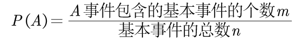

1）在使用古典概型的概率公式时，前提是使用的概率模型是古典概型。

2）若一个古典概型有n个基本事件，则每个基本事件发生的概率P=1/n。

## 几何概型

**1、几何概型**

如果每个事件发生的概率只与构成该事件区域的长度（或面积、或体积）成比例，则称这样的概率模型为几何概率模型，简称几何模型。

1）几何概率模型的特点如下：

* 试验中所有可能出现的基本事件有无限多个（无限性）
* 每个基本事件的发生都是等可能的（等可能性）

2）几何概型的概率计算公式：

​		

3）几何概型的三种类型：与长度有关的几何概型、与面积有关的几何概型、与体积有关的几何概型。

**2、几何概型的应用示例**

合理的建立与基本事件对应的集合模型，恰当选择用以解决问题的几何模型的测度。

1）长度型：

​		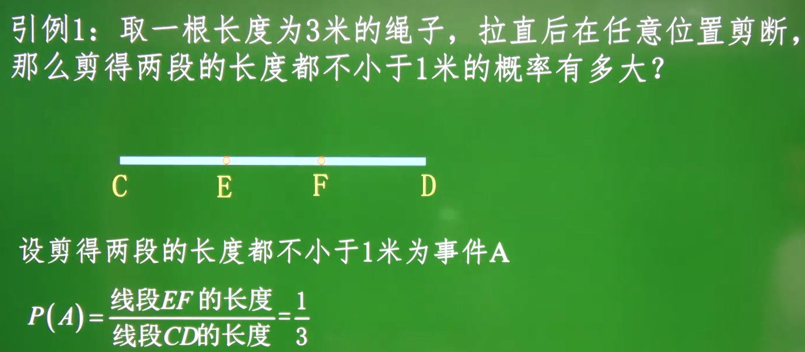

2）面积型：

​		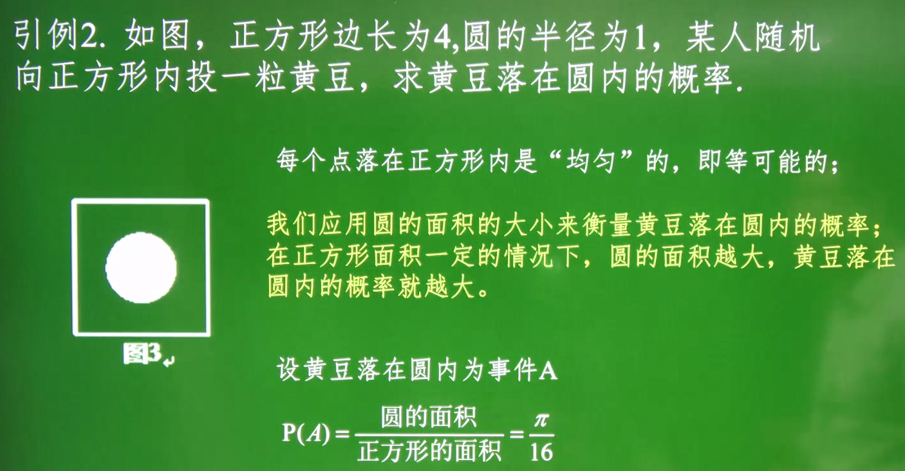

3）体积型：

​		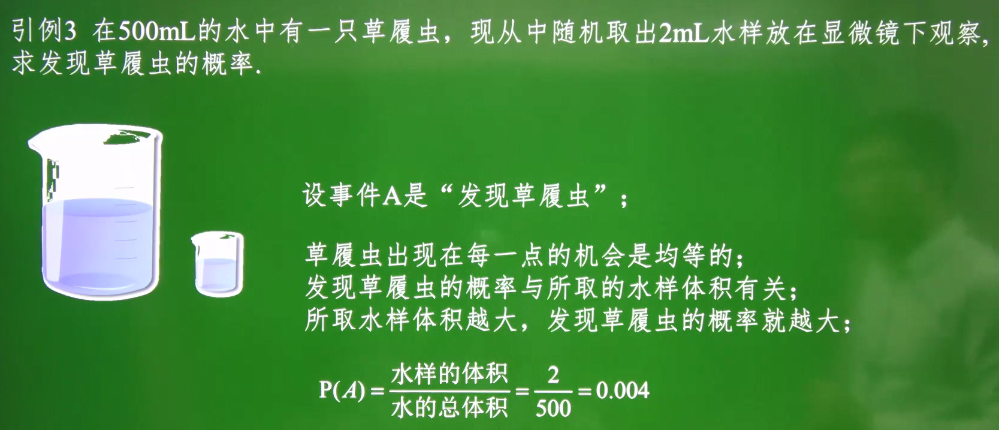

**3、几何概型与古典概型的联系与区别**

​		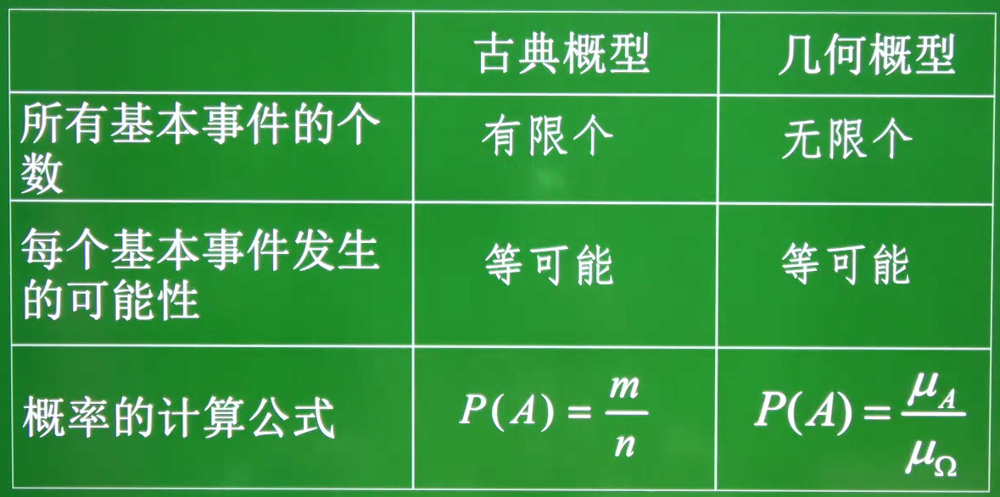

