# 1. 解三角形

借助正弦、余弦、正切的定义可以解三角形，但它们只能解直角三角形，而通过本章学习的正弦定理、余弦定理，可以解任意三角形。

## 正弦定理

1）正弦定理：三角形的某条边比上这条边对角的正弦值，等于这个三角形外接圆半径的2倍，即等于外接圆的直径。

​		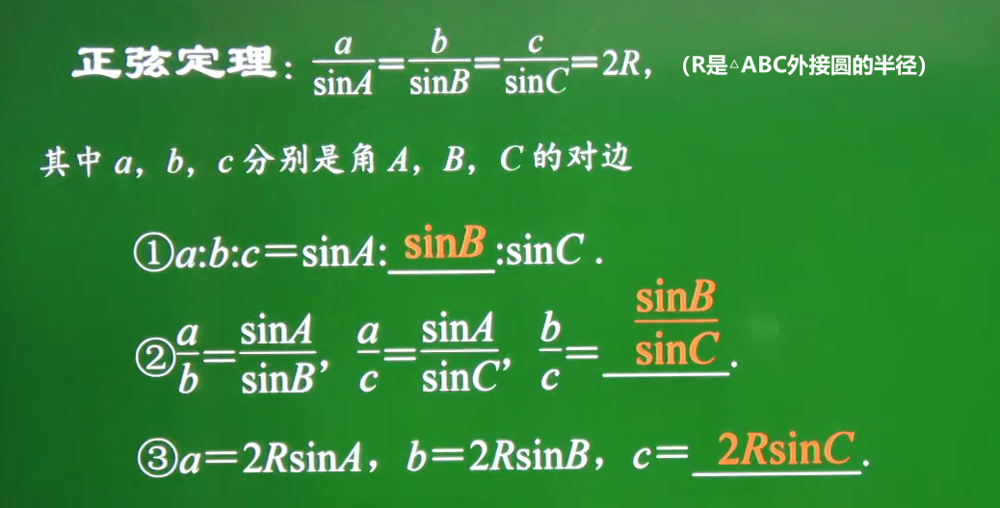

上图中下面三个公式是正弦定理常见的三个变形式。

3）正弦定理可以解决以下三角形问题：

* 已知两角和任意一边，求其他两边和一角
* 已知两边和其中一边的对角，求其他的边和角

## 余弦定理

1）余弦定理：三角形中任一边的平方，等于其他两边的平方和，减去这两边与其夹角的余弦的积的两倍。

​		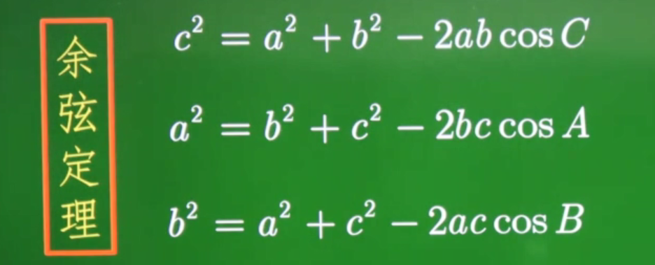

2）余弦定理的推论：

​		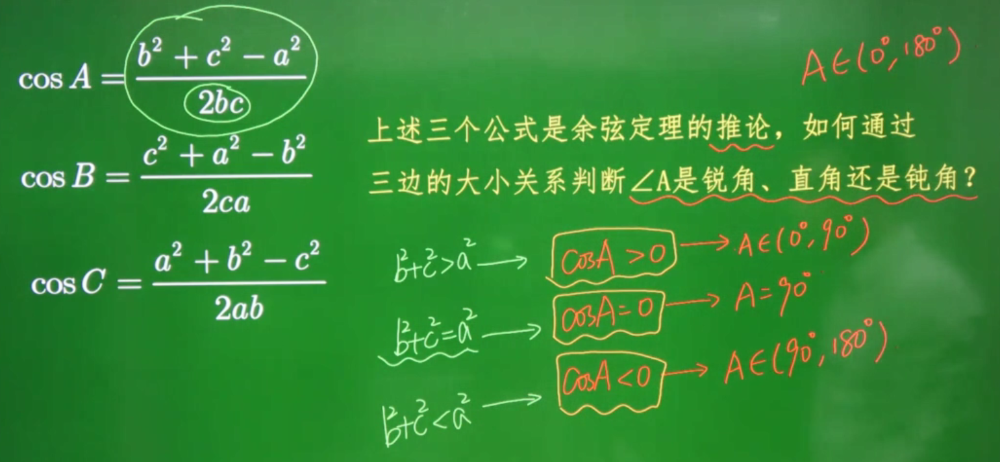

3）余弦定理可以解决以下三角形问题：

* 已知两边和它们的夹角，求第三边和另外两个角
* 已知三边，求三个角在

## 解三角形

**1、三角形的面积**

1）在小学初中阶段，是通过底边乘以高来计算三角形的面积的，即：二分之一倍的底边长度乘以该底边上的高。（其中底边是三条边中任选的，高必须是所选底边的高）

​		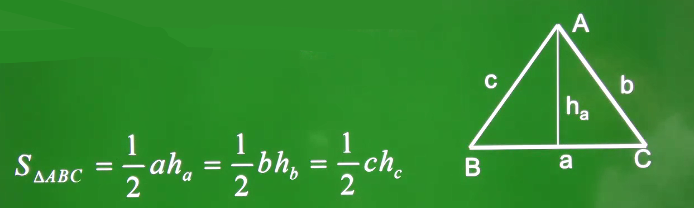

2）底边上的高等于：该底边的邻边乘以这条邻边与该底边所成夹角的正弦值。所以三角形面积公式还可以写成：

​		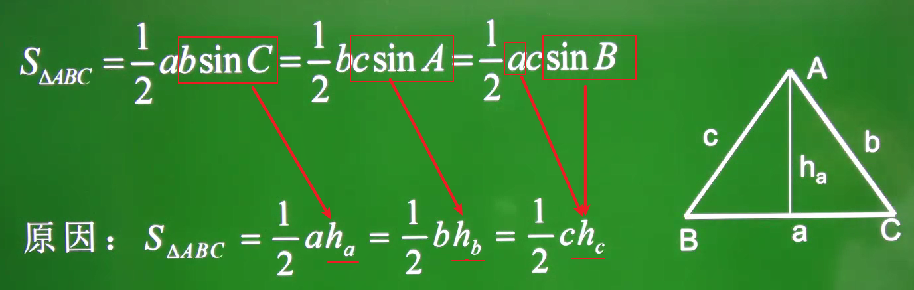

即三角形的面积等于：二分之一倍的两个相邻边的乘积乘以这两个相邻边所成夹角的正弦值。（如果给定了三角形的两个相邻边的长度及其夹角，就可以不做高线求该三角形的面积了）

3）三角形面积公式小结：

​		

**2、正弦定理复习**

​		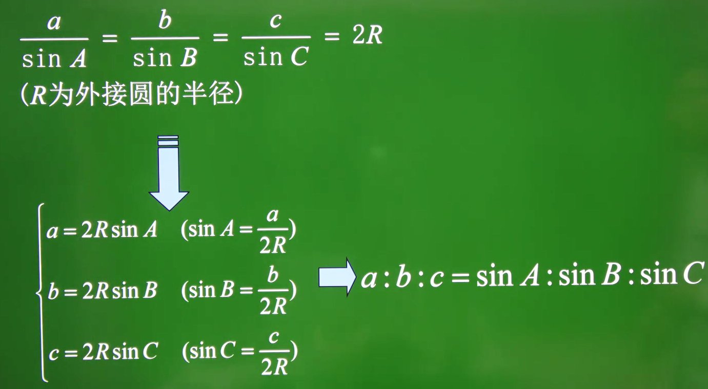

**3、余弦定理复习**

​		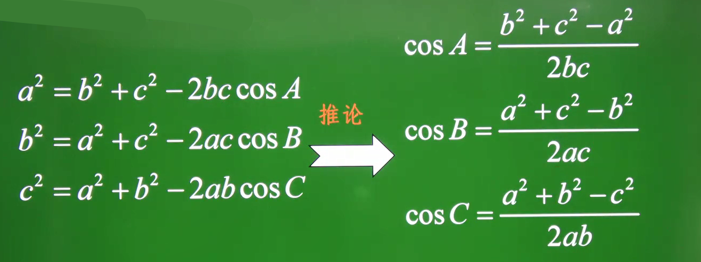

# 2. 数列

## 数列的概念与简单表示法

**1、数列的定义**

按照一定顺序排列着的一列数叫数列。

​		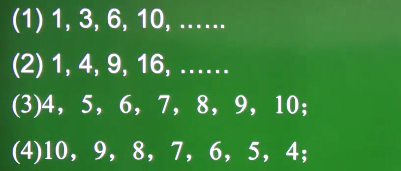

* 数列中的每一个数叫做这个数列的项
* 数列中的每一项都和它的序号有关，排在第一位的数称为这个数列的第1项，通常叫做首项，记作a1，排在第二位的数称为这个数列的第2项，记作a2，依次类推，排在第n位的数称为这个数列的第n项，记作an
* 数列的一般形式可以写成a1，a2，a3，···，an，···，其中an是数列的第n项，整个数列又可简记为 {an}
* 数列中的项是可以重复的，比如-1,1,-1,1···，又如3,3,3，····，它是一个常数数列，

**2、数列的分类**

1）根据数列项数的多少，可以将数列分为：有穷数列、无穷数列

​		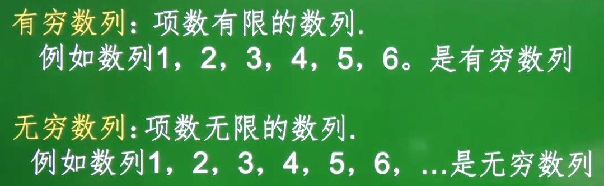

2）根据数列项的大小，可以将数列分为：递增数列、递减数列、常数数列、摆动数列

​		

**3、数列的表示**

数列可以使用通项公式法、图像法、列表法表示。

1）数列的通项公式：如果数列{an}的第n项与序号n之间的关系可以用一个式子来表示，那么这个式子叫做这个数列的通项公式。

​		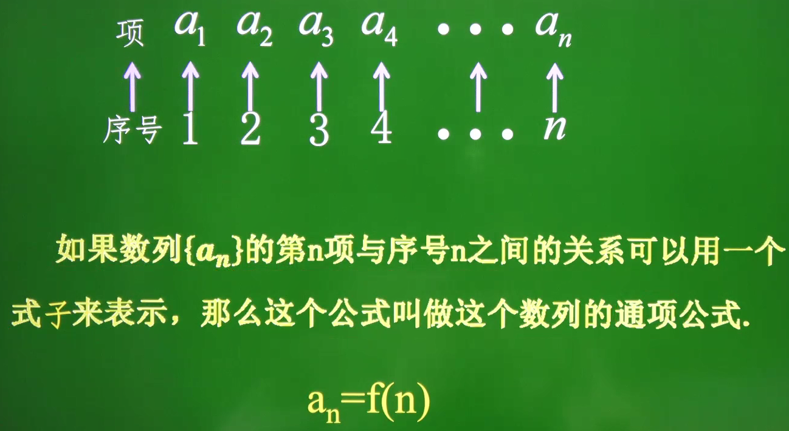

​		

2）数列与函数的关系：数列是一种特殊的函数，数列的定义域为N*正整数或定义域该数列规定的有限子集正整数，数列的图像是有穷个或无穷个孤立点，并且这些点位于y轴右侧。

​		

由于数列是一种特殊的函数，所以也可以用函数的图像法或列表法表示数列。

## 等差数列

**1、等差数列的定义**

如果一个数列从第2项起，每一项与它的前一项的差等于同一个常数，这个数列就叫做等差数列。这个常数叫做等差数列的公差，公差常用字母d表示，an+1-an = d (n≥1且n∈N\*)  或 a n+1-an = d (n≥2且n∈N*)

​		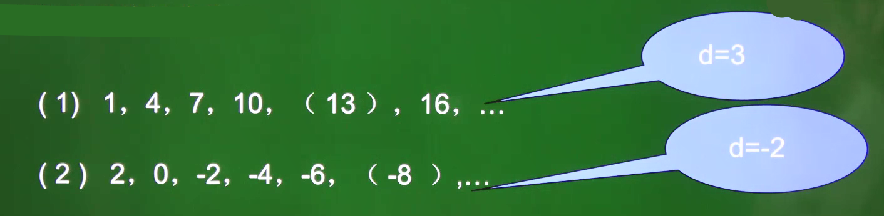

等差数列的等价条件如下：

​			或  

**2、等差数列的通项公式**

1）等差数列的通项公式：

​		

​		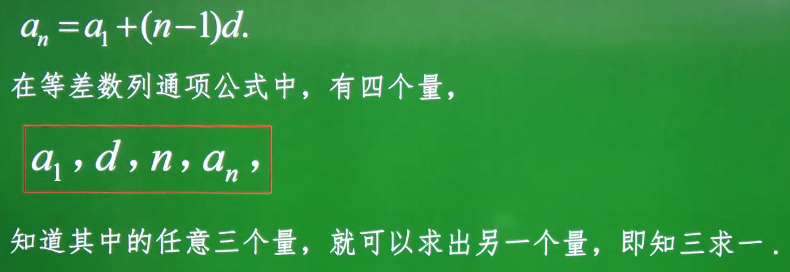

等差数列通项公式的函数式形式：

​		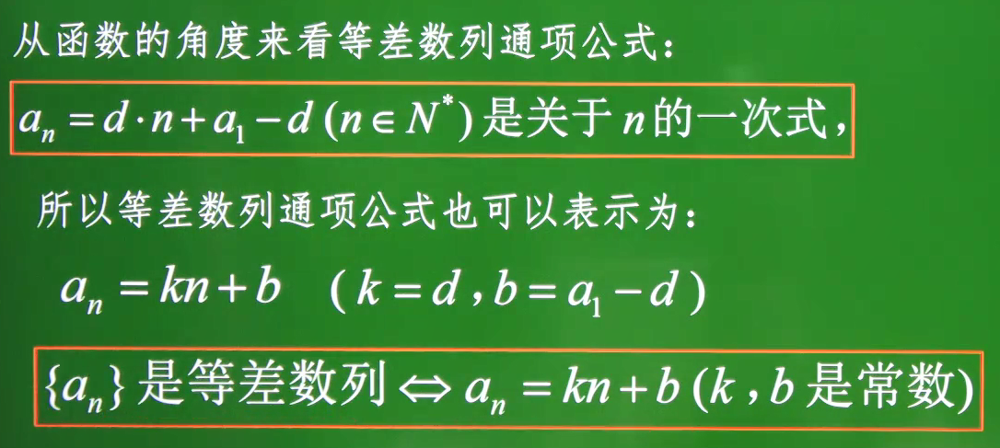

2）等差数列的几个重要结论如下：

​		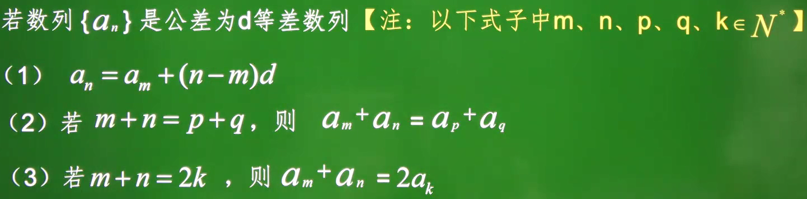

**3、等差中项**

​		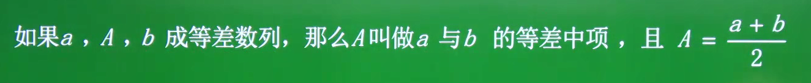

**4、等差数列前n项和公式**

Sn表示等差数列的前n项和；a1表示等差数列的首项；an表示等差数列的通项公式；d表示等差数列的公差。 

​		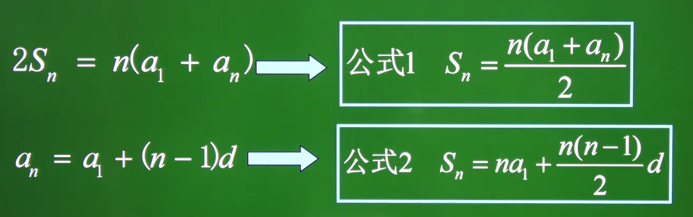

## 等比数列

**1、等比数列的定义**

如果一个数列从第2项起，每一项与它的前一项的比等于同一个常数，那么这个数列就叫做等比数列。这个常数叫做等比数列的工笔，通常用字母q表示。

​		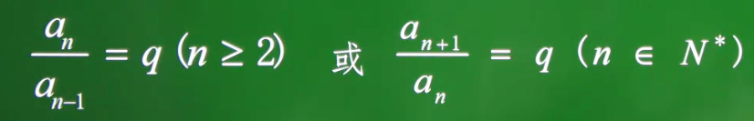

**2、等比数列的通项公式**

1）等比数列的通项公式：

​		

2）等比数列的几个重要结论如下：

​		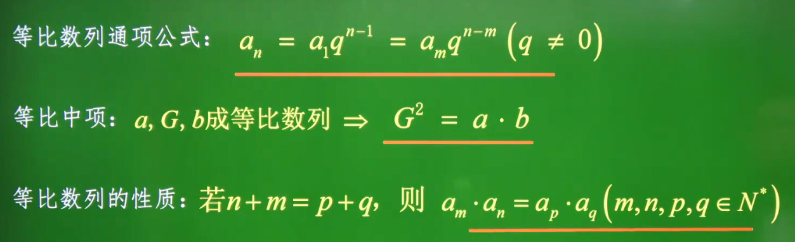

**3、等比数列的前n项和及其性质**

​		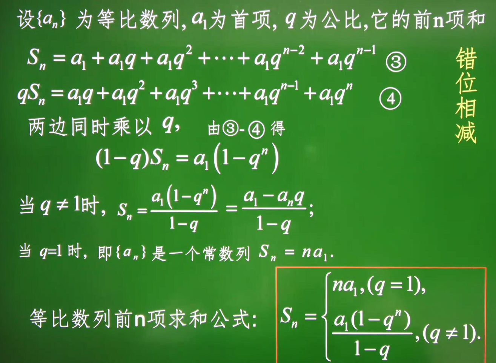

 

## 数列求通项公式方法总结

求数列的通项公式的常用方法有：观察法、公式法、已知Sn求an法、累加法、累乘法、构造等比数列法。对于观察法和公式法，前面已经学习过，这里讨论后面几种方法。（注意：这里所讨论的求数列的通项公式是指求任意数列的通项公式，而不仅仅限于等差数列、等比数列）

**1、已知Sn求an法**

an与Sn的关系：

​		

可以利用这种关系求数列的通项公式，但要注意，求出通项公式后，对于第一项是不满足 an=Sn-Sn-1 的，所以需要用给出的Sn求出a1，然后判断 a1 是否满足求出的通项公式，如果满足则说明这个通项同时可以表达这个数列，如果不满足，则该数列的第一项需要另行表示。

​		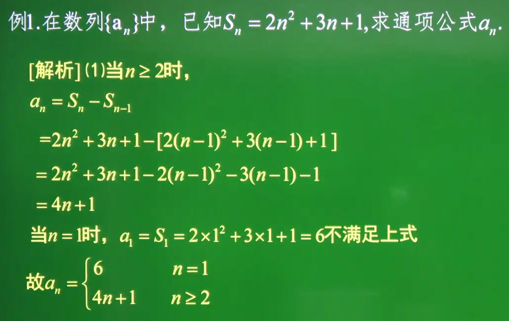

​		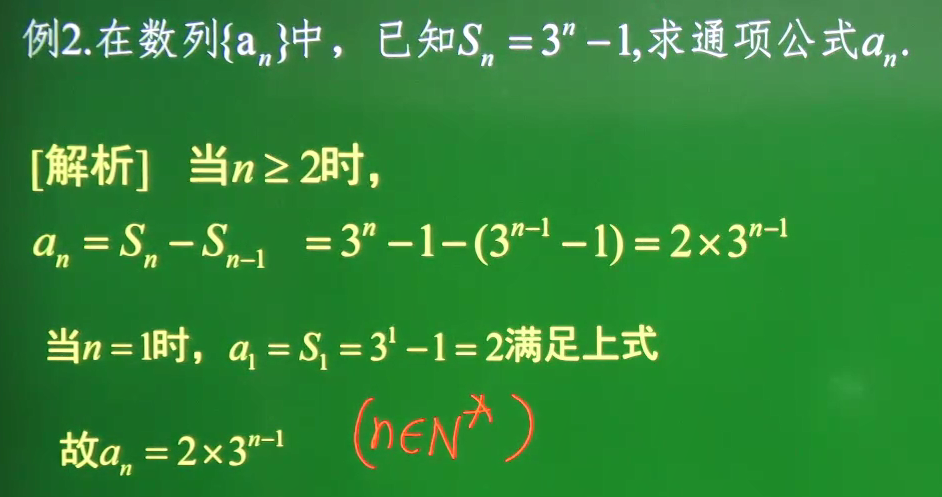

**2、累加法**

​		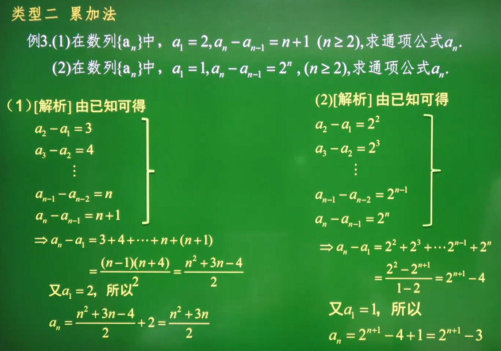

# 3. 不等式

## 不等关系与不等式

具有大小关系的关系称为不等关系，表示不等关系的式子叫做不等式。

**1、比较实数的大小**

实数可以比较大小，对于两个实数a、b，其大小关系有三种：a>b、a=b、a<b，它们满足的性质如下：

* a>b  <=>  a-b>0
* a=b  <=>  a-b=0
* a<b  <=>  a-b<0

​		

可以根据这三种性质利用**作差比较法**比较两个数或两个式子的大小。

**2、不等式的性质**

​		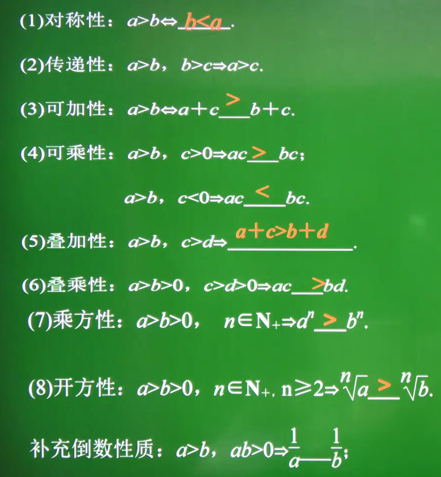

## 一元二次不等式及其解法

**1、一元二次不等式的定义**

含有一个未知数，且未知数的最高次数是2的的不等式，叫做一元二次不等式。例如 x2+2x-3<0.

**2、一元二次不等式的解法**

一元二次不等式、一元二次方程、二次函数三者是可以相互转换的，解一元二次不等式正是利用这三者之间的关系。大致步骤如下：

（1）将一元二次不等式化为一端为0的形式，即化为一元二次不等式的一般式。比如将  x2+2x<3 化为  x2+2x-3<0

（2）将一元二次不等式看作是一元二次方程，然后求解该一元二次方程，根据解的个数可以知道该一元二次方程所代表的二次函数的抛物线图像与x轴有几个交点。比如将 x2+2x-3<0 看作为 x2+2x-3=0，解得x1=-3，x2=1，可知该一元二次方程所代表的二次函数的抛物线图像与x轴有2个交点。

（3）将一元二次方程变为二次函数，并将该二次函数化成二次函数的顶点式，得到二次函数的顶点式后，可以一眼看出该二次函数抛物线图像的顶点坐标，或者直接通过二次函数顶点坐标公式求出顶点坐标。（如果知道抛物线的开口方向，这一步是可以忽略的）

（4）根据该二次函数抛物线图像与二次项系数的关系（a>0则抛物线图像开头向上，a小于0抛物线图像开头向下）和第2步求得的与x轴的交点个数（如果需要，以及第3步求得的顶点坐标）画出二次函数的抛物线图像，最终根据抛物线图像，解不等式。

## 二元一次不等式（组）及简单的线性规划

**1、直线分区的概念**

在平面直角坐标系中，任意一条直线可以将整个平面分成三个区域：直线上、直线这一侧区域、直线另一侧区域。根据直线的倾斜程度（斜率）不同有以下几种情况：

* 如果直线与x轴重合或平行，则分为直线上、直线上方区域、直线下方区域
* 如果直线与y轴重合或平行，则分为直线上、直线左方区域、直线右方区域
* 如果直线的倾斜角是锐角，则分为直线上、直线左上方区域、直线右下方区域
* 如果直线的倾斜角是钝角，则分为直线上、直线左下方区域、直线右上方区域

以直线 x-y-6=0 为例，该直线将平面分成这三个区域：直线上、左上方区域、右下方区域。

​		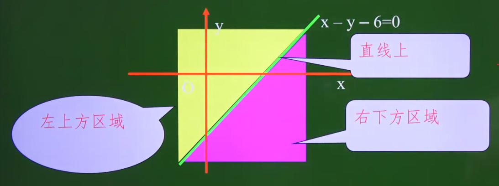

对于直线 x-y-6=0 来讲，有以下性质及二元一次不等式：

* 对于直线左上方区域中的任意一点 (x,y) ，都有x-y-6>0
* 对于直线上的任意一点 (x,y) ，都有x-y-6=0
* 对于直线右下方区域中的任意一点 (x,y) ，都有x-y-6<0

这就蕴含了二元一次不等式的几何意义。

**2、二元一次不等式的几何意义**

二元一次不等式 Ax+By+C>0 在平面直角坐标系中表示直线 Ax+By+C=0 某一侧所有的点组成的平面区域。（若不等式中可以取等号，则边界直线应该画成实线，否则应该画成虚线，表示不取等号）

​		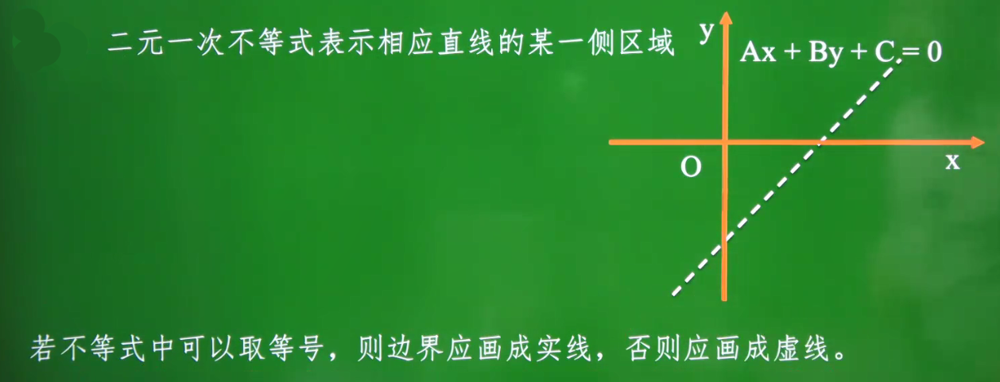

求解某个二元一次不等式所表示的平面区域，步骤如下：

1）根据给定的二元一次不等式，画出直线的图像。

* 二元一次不等式可以转换为一次函数，而一次函数的图像就是一条直线，利用一次函数的性质在平面直角坐标系中画出该直线

* 包含直线则将直线画成实线，不包含直线则将直线画成虚线

2）取特殊点定义域，判断满足不等式的区域是哪一块区域。

* 从直线某侧任取一点，并代入二元一次不等式中，如果该点满足不等式，则说明该点所在侧区域满足不等式，即为解集，如果该点不满足不等式，则说明直线的另一侧满足不等式，另一侧为不等式的解集。
* 为了方便计算，如果直线不经过原点的话，通常取原点 (0,0) 作为特殊点

**3、二元一次不等式组的几何意义**

二次一次不等式的集合意义是该二元一次方程表示直线的某侧区域。而二元一次不等式组的几何意义是：取二元一次不等式组中每个二元一次不等式区域的公共部分。

​		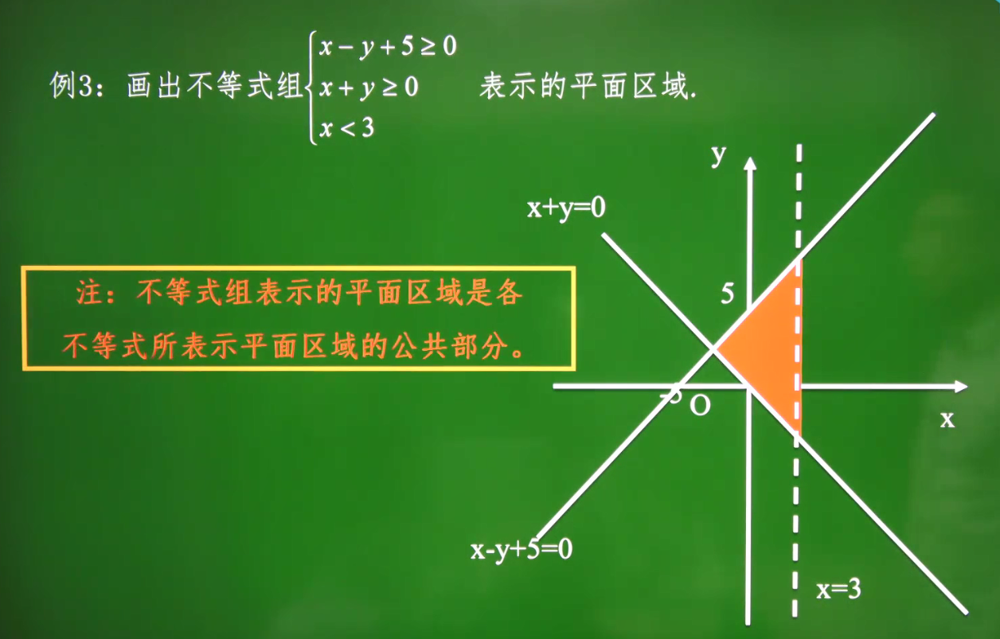

**4、线性规划的相关概念、问题**

​		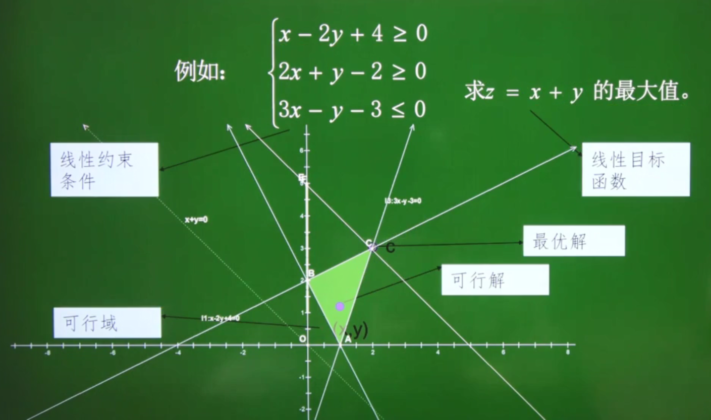

* 线性约束条件：二元一次不等式组
* 可行域：二元一次不等式组的解集构成的区域
* 可行解：可行域中的任意一点
* 线性目标函数：问题中的二元一次函数，如上图中的函数 z=x+y
* 最优解：满足线性目标函数的解

**5、线性规划问题的求解**

给出一个二元一次不等式（线性约束条件），再给出一个以二元一次不等式组的两个未知数作为因变量的二元一次函数（线性目标函数），求最优解，即求最大值或最小值问题。

​		

​		

​		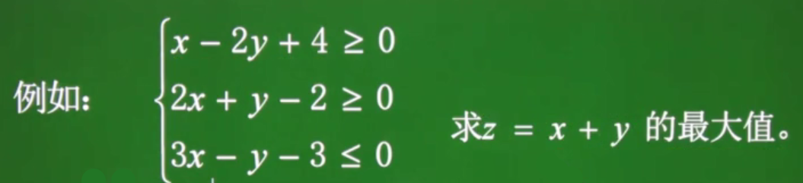

​		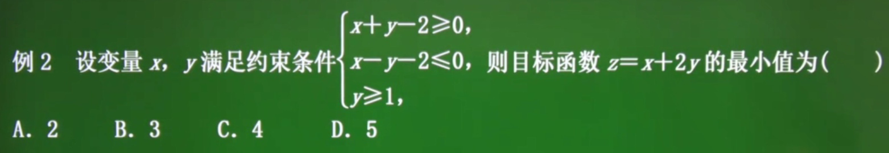

利用图解法解决线性规划问题的步骤：

（1）解二元一次不等式组（线性约束条件），然后画出二元一次不等式组（线性约束条件）所表示的区域。

（2）做出目标函数的等值线。（作出目标函数中关于两个自变量所构成的直线）

（3）将目标函数等值线向可行区域方向移动，确定最优解。

（4）将最优解代入目标函数求出最大值或最小值。

​		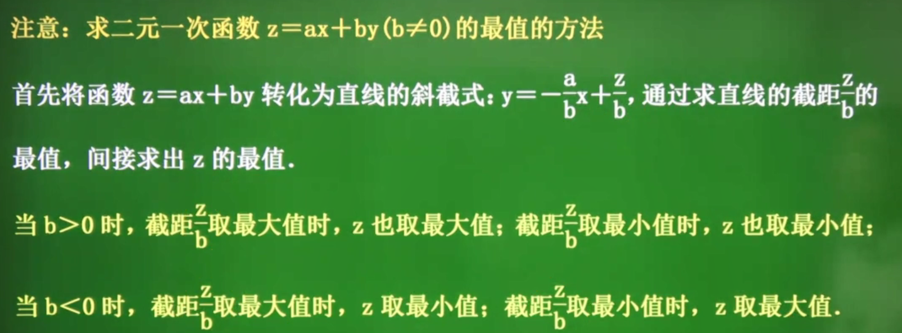

**6、求解线性规划问题的个人理解**

（对于求解线性规划问题中的最大值或最小值的问题，我个人的理解出来的解法是：

（1）解二元一次不等式组（线性约束条件），然后画出二元一次不等式组（线性约束条件）所表示的区域。

（2）找出可行区域与直线（二元一次不等式组中每个二元一次不等式所表示的直线）、x轴、y轴的交点坐标。

（3）将各个坐标代入目标函数中，判断最大值或最小值。

## 基本不等式

**1、认识基本不等式**

基本不等式也称均值不等式，即：两个正数的算术平均数大于等于它们的几何平均数

​		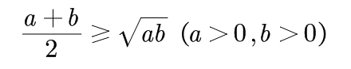

* 基本不等式等号成立的前提是：当且仅当a=b时取等号
* 在数学中，把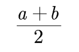叫做整数a、b的算术平均数，把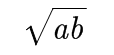叫做正数a、b的几何平均数。
* 基本不等式是由完全平方差公式推出来的

**2、基本不等式的应用**

1）基本不等式可以用来求最值。有两种情况：

（1）和定积有最大值：当两个数（式子）的和的值确定时，可以利用基本不等式求出这两个数（式子）的积的最大值。

（2）积定和有最小值：当两个数（式子）的积确定时，可以利用基本不等式求出这两个数（式子）的和的最小值。

​	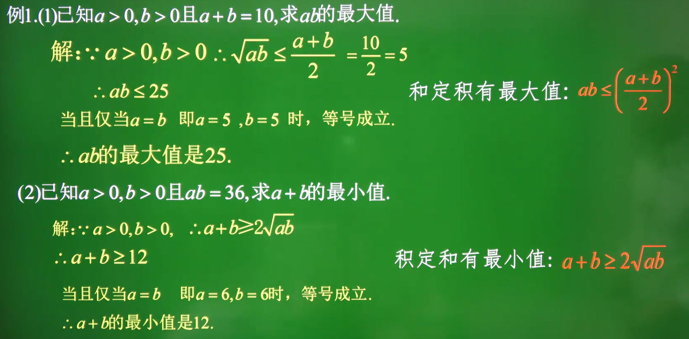

2）利用基本不等式求解最值的步骤可以概括为：一正二定三相等

* 一正：判断给定的两个数（式子）的值是否都是正数，只有这两个数（式子）的值都是正数时，才可以使用基本不等式求解最值。（如果不满足这个条件，可以使用配凑系数法或配方法使其满足条件）
* 二定：判断给定的两个数（式子）的和或者积的值是否是确定的，只有这两个数（式子）的和或者积的值是确定的，才可以使用基本不等式求解最值。（如果不满足这个条件，可以使用配凑系数法或配方法使其满足条件）
* 三相等：满足前两个条件后，就可以使用基本不等式求解最值，求解后，需要判断不等式的等号是否成立，如果成立，成立的条件是什么。

