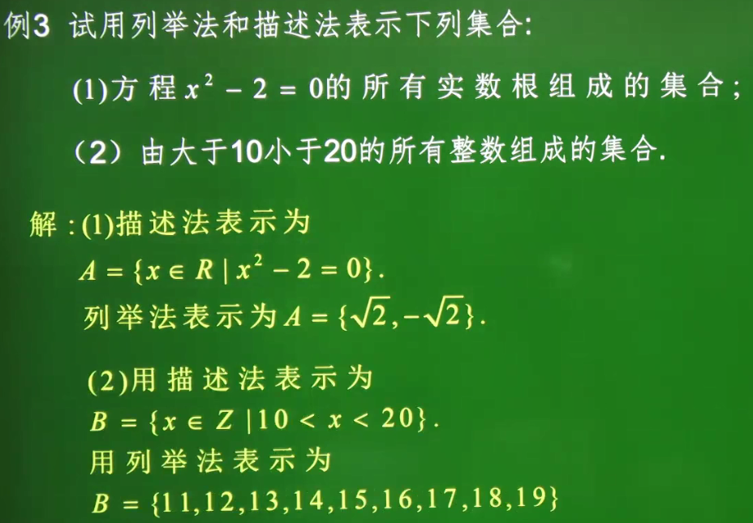

# 1. 集合与函数概念

## 集合的含义与表示

**1、集合的有关概念**

1）元素：把研究的对象称为元素。（一般常用小写字母a,b,c···表示元素）

2）集合：把一些元素组成的总体叫做集合，简称集。（一般常用大写字母A,B,C···表示集合）

注意：组成集合的元素可以是物、数、点等等。

**2、集合的三大特性**

（1）确定性：集合中的元素必须是确定的。

（2）互异性：集合中的元素必须是互不相同的。

（3）无序性：集合中的元素是无先后顺序的，集合中的任何两个元素都可以交换位置。

只要构成两个集合的元素是一样的，我们就称这两个集合是相等的。

**3、重要数集**

（1）N：自然数集（含0），即非负整数集

（2）N+或N*：正整数集（不含0）

（3）Z：整数集

（4）Q：有理数集

（5）R：实数集

**4、元素对于集合的关系**

（1）属于（belong to）：如果a是集合A中的元素，就说a属于A，记作a∈A

（2）不属于（not belong to）：如果a不是集合A中的元素，就说a不属于A，记作a∉A

**5、集合的分类**

（1）有限集：含有限个元素的集合

（2）无限集：含无限个元素的集合

（3）空集：不含任何元素的集合（空集记作Ø，空集也是集合）

**6、集合的表示方法**

（1）列举法：将集合中的元素一一列举出来，并用花括号 { } 括起来的方法叫做列举法。

（2）描述法：将集合的所有元素都具有的性质（满足的条件）表示出来，写成 {x|p(x)} 的形式。其中x表示被描述的对象p(x)被描述对象的特征。

​	

