# 1. 常用逻辑用语

## 命题及其关系

**1、命题**

把用语言、符号或式子表达的，可以判断真假的陈述句称为命题。判断为真的陈述句为真命题，判断为假的陈述句称为假命题。

1）把具有“若p，则q”的形式的陈述句，也可以写成“如果p，那么q”的形式，通常把这种形式的命题中的p叫做命题的条件，q叫做结论，记作：p => q.

​		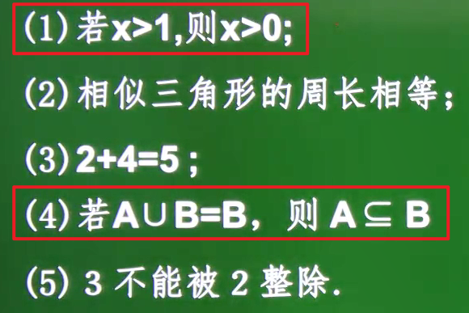

2）对于一个命题，不管其真假，表面上不是“若p，则q”的形式，但都可以将其改写为“若p，则q”的形式。

​		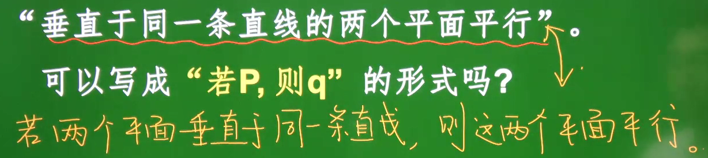

**2、四种命题**

四种命题指的是：原命题、逆命题、否命题、逆否命题。

1）逆命题：在两个命题中，如果第一个命题的条件是第二个命题的结论，第一个命题的结论是第二个命题的条件，那么这两个命题叫做互逆命题。如果把其中一个命题叫做原命题，那么另一个命题就叫做原命题的逆命题。（逆命题可以理解为：条件与结论的互换）

​		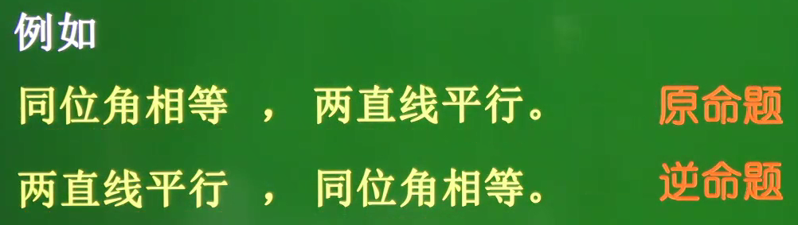

2）否命题：在两个命题中，一个命题的条件和结论分别是另一个命题的条件的否定和结论的否定，这样的两个命题就叫做互否命题。若把其中一个命题叫做原命题，则另一个命题叫做原命题的否命题。（否命题可以理解为：否定原命题的条件和结论，但位置不变）

​		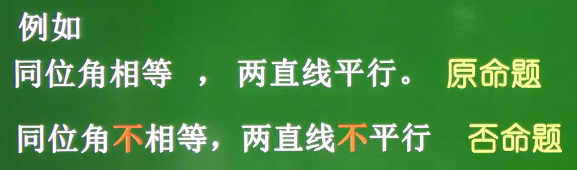

3）逆否命题：  在两个命题中，一个命题的条件和结论分别是另一个命题的结论的否定和条件的否定，这样的两个命题叫做逆否命题。若把其中一个命题叫做原命题，则另一个命题就叫做原命题的逆否命题。（逆否命题可以理解为：先对原命题进行否定得到否命题，再对否命题进行逆，得到逆否命题；或者先对原命题进行逆，得到逆命题，再对逆命题进行否定，得到逆否命题）  

* 逆否命题和否命题互为逆命题，即否命题的逆是逆否命题
* 逆否命题和逆命题互为否命题，即逆命题的否是逆否命题

​		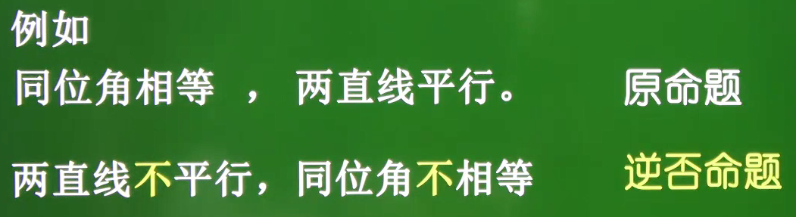

​	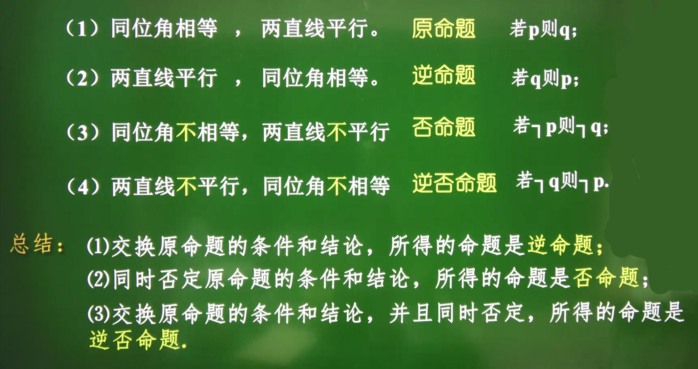

​	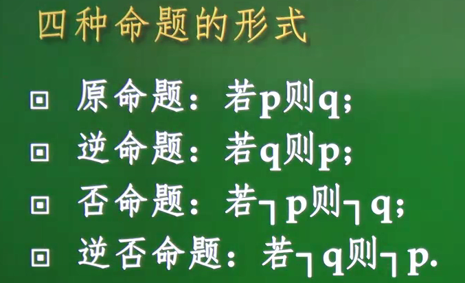

**3、四种命题的真假关系**

（1）原命题的真假和逆命题的真假没有关系。

（2）原命题的真假和否命题的真假没有关系。

（3）原命题和逆否命题同真同假。

（4）逆命题和否命题同真同假。

记为：**原命题与逆否命题同真同假，逆命题与否命题同真同假。**

​		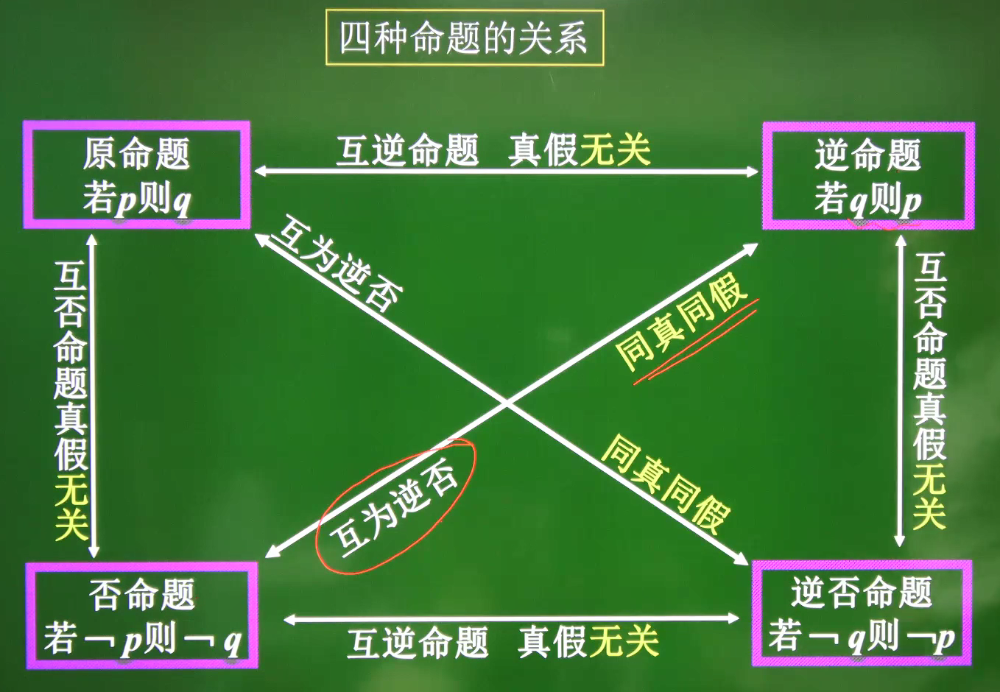

另一种记法：互逆命题真假无关；互否命题真假无关；互为逆否命题同真同假。

## 充分条件与必要条件

**1、推断符号的含义**

条件与结论有“推得出”、“推不出”两种关系：

​		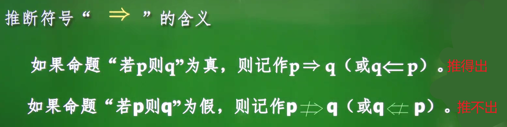

**2、充分条件与必要条件**

1）充分条件与必要条件：

​		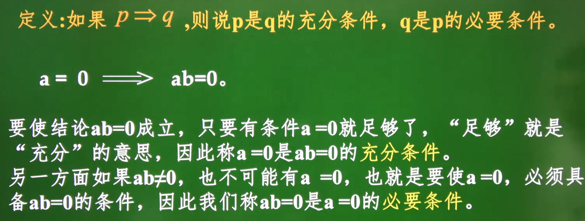

2）充要条件：

​		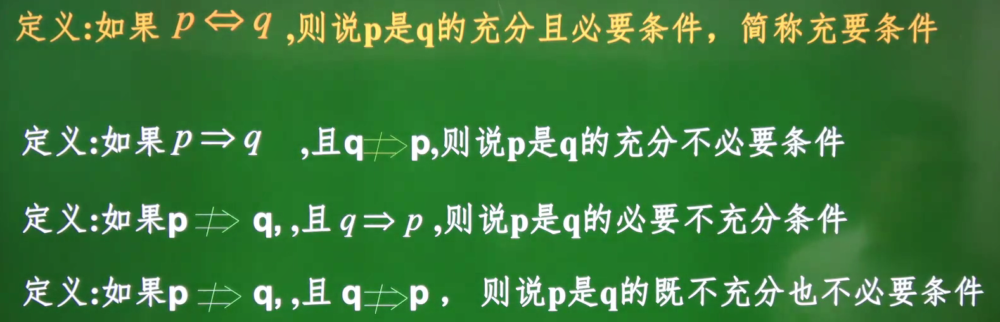

​	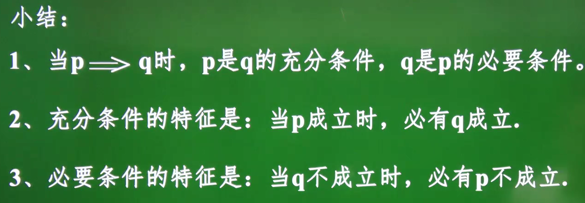

## 简单的逻辑联结词

**1、简单命题与复合命题**

简单命题：不含逻辑联结词的命题称为简单命题，常用小写字母p, q, r,···表示（前面学习的命题都是简单命题）

复合命题：由逻辑联结词（或、且、非）将多个简单命题组合起来的命题称为复合命题，表示形式为：p或q、p且q、非p

**2、逻辑联结词**

逻辑联结词有：或、且、非

（1）或：一真则真，假假为假

​			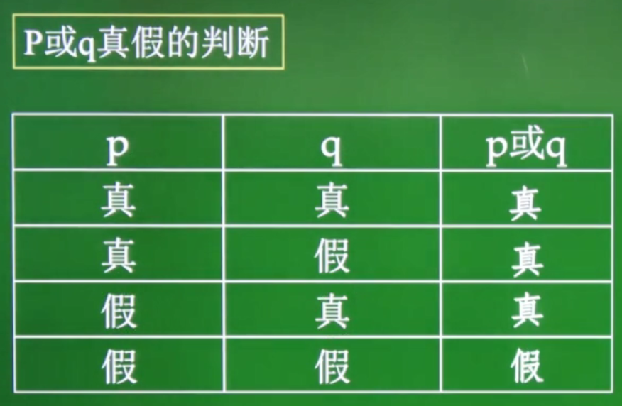

（2）且：真真为真，一假则假

​			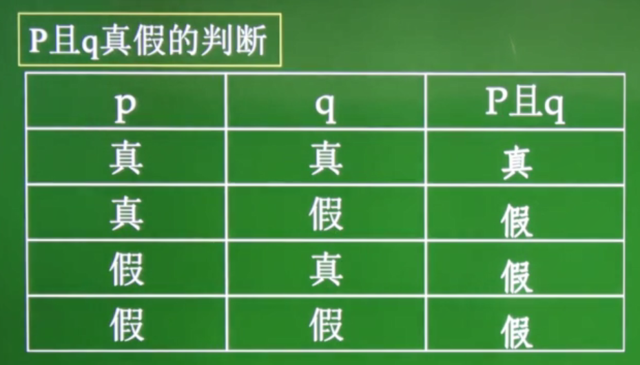

（3）非：真为假，假为真（非表示否定）

​			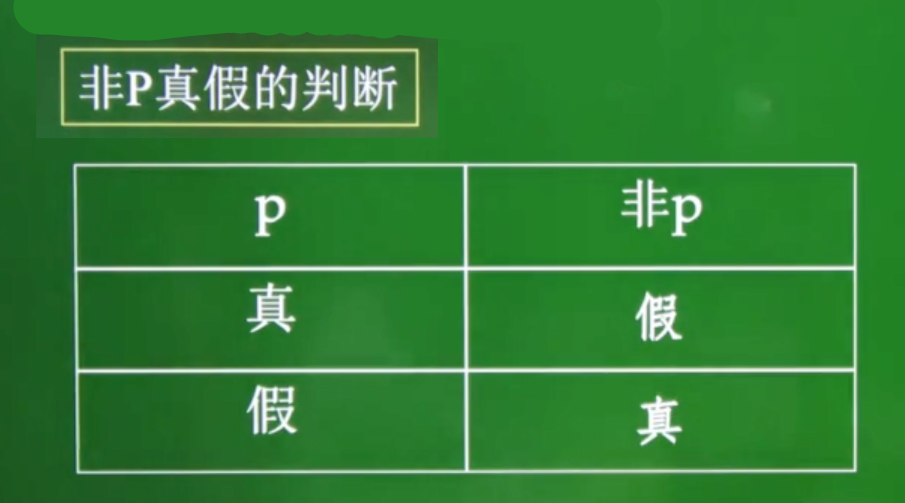

**3、命题的否定与否命题的区别**

命题的否定与否命题是两个不同的概念。

1）命题的否定：

* 命题的否定只否定命题的结论，不否定命题的条件。对于命题“若p，则q”，则该命题的否定是“若p，则┐q”
* 任何命题都有否命题
* 命题的否定（非）是原命题的矛盾命题，两者的真假性必然是一真一假

2）否命题：

* 否命题既否定命题的条件又否定命题的结论。对于命题“若p，则q”，则该命题的否命题是“若┐p，则┐q”
* 只有“若p，则q”形式的命题才有否命题
* 否命题与原命题可能是同真、同假、也可能是一真一假

​	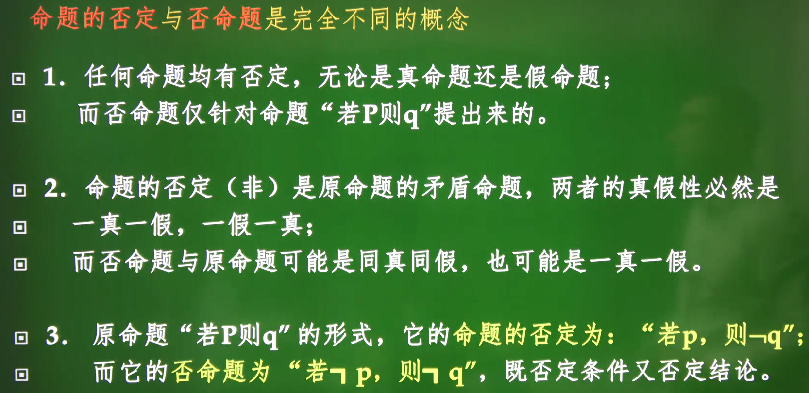

​	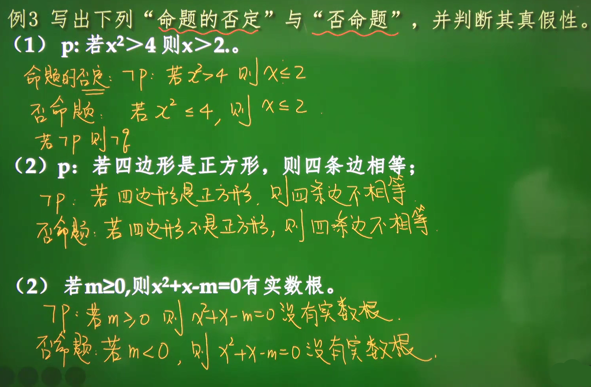

## 全称量词与存在量词

全称量词与存在量词统称为量词，都表示数量的意思，其中全称量词表示全部，存在量词表示部分。

**1、全称量词与存在量词的概念、表示**

1）全称量词：“所有”、“任何”、“一切”等都是全称量词。

* 全称量词表示全部
* 全称量词使用“∀”表示
* 包含全称量词的命题称为全称命题

​	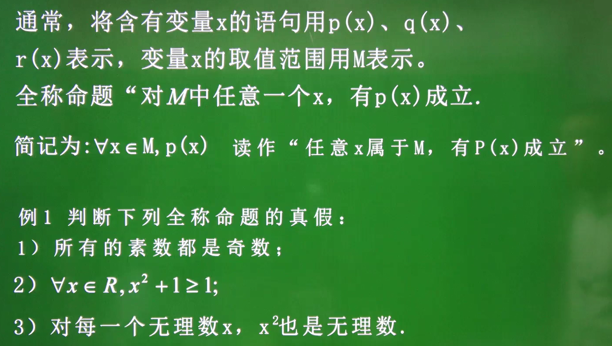

2）存在量词：“有”，“存在”，“有些”、“有的”、“某个”等都是存在量词。

* 存在量词表示部分
* 存在量词使用“∃”表示
* 包含存在量词的命题称为存在命题或特称命题

​	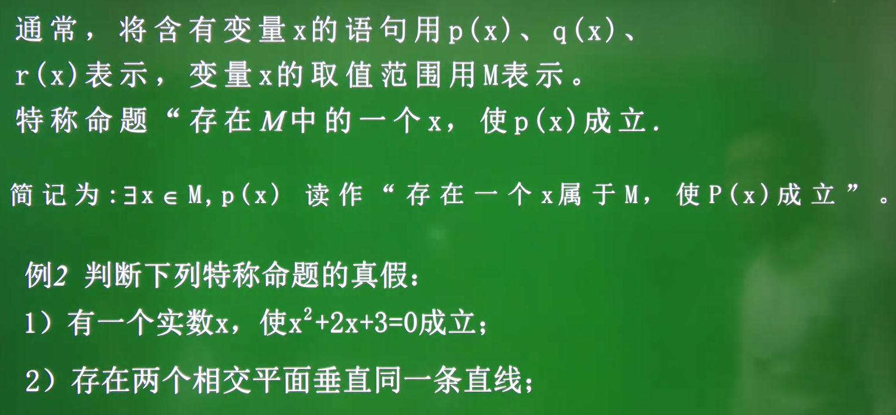

**2、量词命题的否定**

上节已经讲过，命题的否定与否命题是两个不同的概念，命题的否定只否定命题的结论。对于量词命题（包含全称量词或是存在量词的命题）的否定，与普通命题的否定是不一样的，因为量词命题包含了量词（全称量词或是存在量词），所以对它否定时，不仅要对命题进行否定，还要对量词进行否定。

* 全称命题的否定：将全称量词变为存在量词，再将命题否定（全称命题的否定是特称命题）
* 特称命题的否定：将存在量词变为全称量词，再将命题否定（特称命题的否定是全称命题）

​	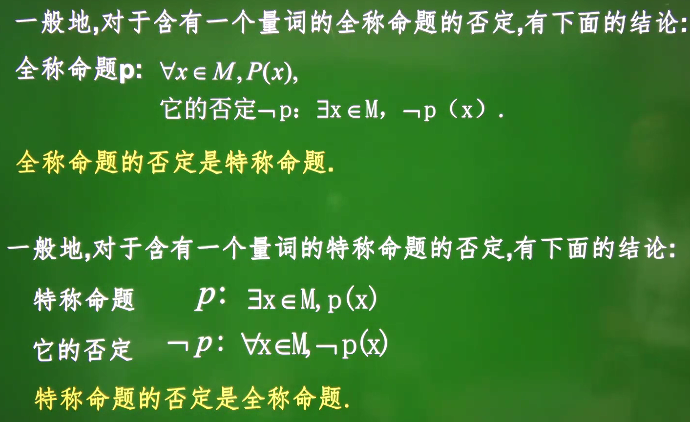

​	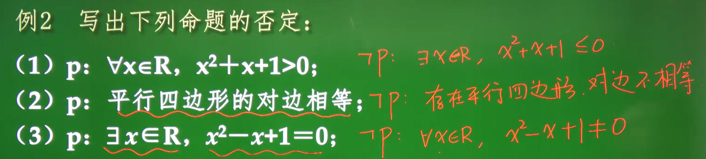

# 2. 圆锥曲线与方程

## 曲线与方程

**1、函数、函数图像、方程、方程的解**

函数可以写成二元方程的形式，函数图像是该函数所表示方程的解，函数图像上的一个点所在坐标代表其方程的一组解；反过来，方程的解就是该函数的图像，方程的一组解就是函数图像上的一个点。（函数图像上的点所在坐标都是方程的解，方程的解一定在函数图像上）

​		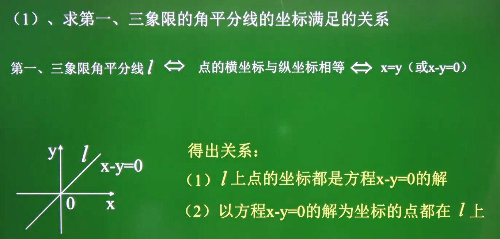

​		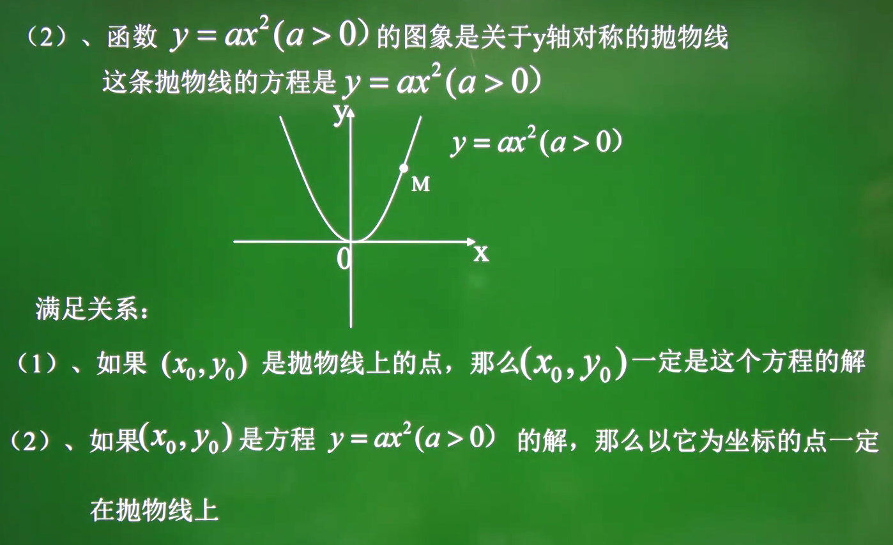

**2、曲线的方程、方程的曲线**

​		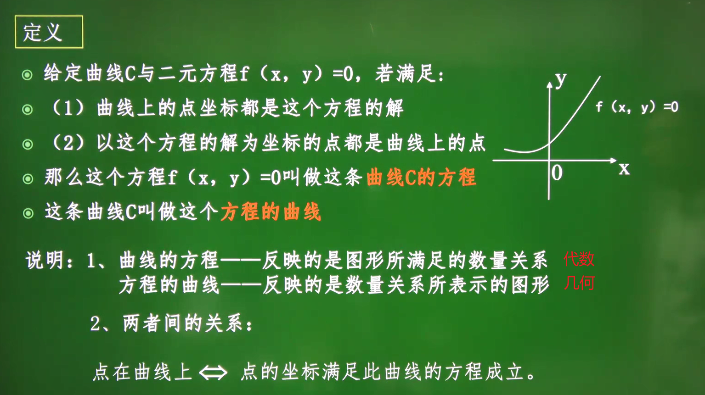

求曲线方程的一般步骤：

​		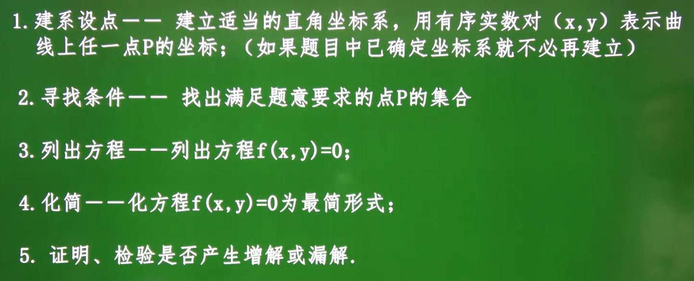

在本章后面学习的椭圆、双曲线、抛物线，它们的标准方程都是利用这种方法推导出来的。

## 椭圆及其标准方程

**1、椭圆的作法**

取一根绳子，把它的两个端点F1、F2固定在木板上，并且让绳子处于宽松状态，即F1到F2的距离小于绳子的长度；用铅笔尖P把婶子拉紧，然后绕着F1、F2进行360。的移动，所产生的轨迹就是椭圆。

​		

* 绳子的长度将其记为2a；由于绳子的长度固定，所以P到两个定点F1、F2的距离之和也固定且等于绳子的长度，即|PF1|+|PF2|=2a
* 这两个定点称为椭圆的两个焦点，两个焦点之间的距离称为焦距，记为2c，即|F1F2|=2c

**2、椭圆的定义**

平面上到两个定点F1、F2的距离之和等于常数（通常记为2a且该常数必须大于|F1F2|）的点的轨迹叫做椭圆。

​		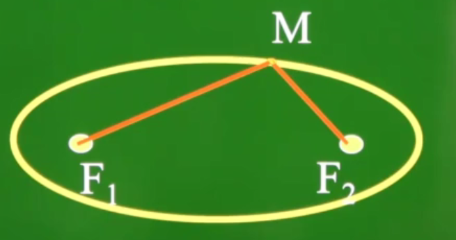

​		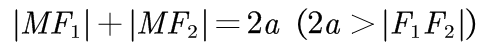

* 两个定点称为椭圆的两个焦点，两个焦点之间的距离称为焦距，记为2c，即|F1F2|=2c
* 椭圆上的动点P到两个焦点的距离等于一个常数，记作2a，这个常数必须大于焦距，即2a>|F1F2|或2a>2c

**3、椭圆标准方程的推导**

见视频。

**4、椭圆的标准方程**

将椭圆放在平面直角坐标系中进行研究，由于椭圆两个焦点既可以x轴也可以放在y轴上，所以椭圆的标准方程有两种。

（1）焦点在x轴上的椭圆标准方程：

​		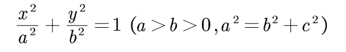

（2）焦点在y轴上的椭圆标准方程：

​		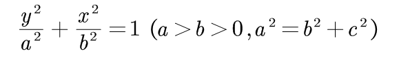

说明如下：

* 给定椭圆标准方程，判断该椭圆的焦点在哪个坐标轴上时，只需要看椭圆标准方程的分母，哪个分母大就在其对应的坐标轴上。
* 椭圆标准方程中，a是椭圆上的点到两个焦点之间的距离之和的一半；b是在椭圆标准方程推导过程中使用的换元，b2=a2-c2；c是两个焦点之间的距离的一半，求c可以使用a2=b2+c2计算，求出c后可以根据椭圆标准方程判断焦点在哪个轴上，进而求出焦点坐标；求出c后还可以计算两个焦点之间的距离，即2c
* a>b>0，因为a是椭圆上一点到两焦点距离之和的一半，作为距离，不可能为负，作为标准方程的分母它也不能为0，所以只能大于0；至于它为什么大于b，是因为椭圆的定义中规定了2a>2c，可推出a>c，又因为b2=a2-c2，所以a必然是大于b的。
* 如果给定的椭圆方程不是标准方程，可以想办法将其配为椭圆标准方程

​	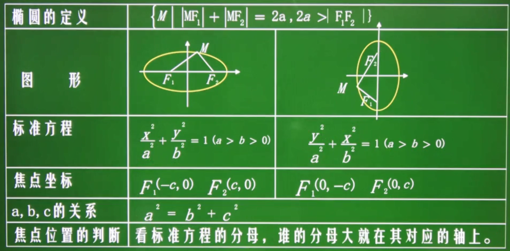

**5、小结**

​		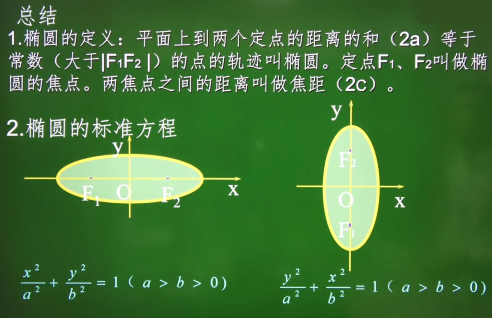

## 椭圆的几何性质

**1、椭圆的范围**

椭圆是位于矩形之中的，且具有以下性质：

1）焦点在x轴上的椭圆：

* 椭圆与x轴的交点：（-a, 0），（a, 0）
* 椭圆与y轴的交点：(0, -b），（0, b）

​		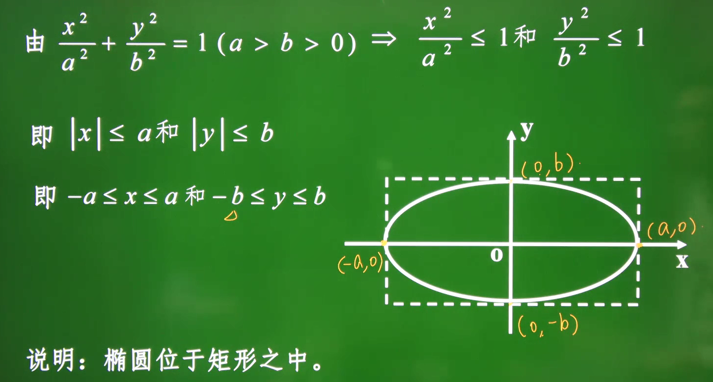

2）焦点在y轴上的椭圆：

* 椭圆与x轴的交点：（-b, 0），（b, 0）
* 椭圆与y轴的交点：(0, -a），（0, a）

**2、椭圆的对称性**

椭圆关于x轴对称；椭圆关于y轴对称椭；圆关于原点中心对称。

1）故坐标轴是椭圆的对称轴，原点是椭圆的对称中心（椭圆的对称中心也叫做椭圆的中心）

2）对于椭圆上的任意一点，都可以在椭圆上找到与之对应的：关于x轴对称的点、关于y轴对称的点、关于原点中心对称的点。

**3、椭圆的顶点、轴、长轴、短轴**

1）顶点：椭圆上的与坐标轴相交的点称为椭圆的顶点。椭圆有4个顶点，x轴正负半轴各一个，y轴的正负半轴各一个。

2）轴、长轴、短轴：椭圆的两个同轴顶点相连所成的线段叫做轴，由于椭圆有4个顶点，所以有2条轴，其中较长的轴叫做长轴，长轴长等于2a，较短的轴叫做短轴，短轴长等于2b。

3）长半轴长、短半轴长：长半轴长指的是长轴长度的一半，长半轴长等于a；短半轴长指的是短轴长度的一半，短半轴长等于b，即a、b分别是椭圆的长半轴长和短半轴长。

以焦点在x轴上的椭圆为例：

​		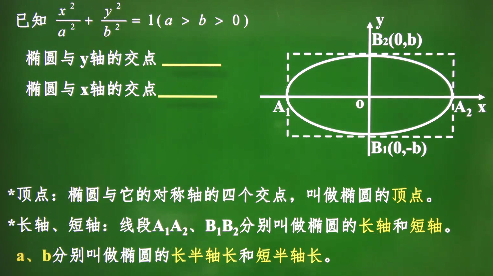

**4、椭圆的离心率**

椭圆的焦距2c与长轴长2a的比叫做椭圆的离心率e。

​		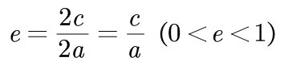

1）因为a>c>0，所以椭圆的取值范围为0<e<1

2）离心率对椭圆形状的影响：离心率越大，椭圆越扁；离心率越小，椭圆越圆。

* e越接近1，c就越接近a，从而b就越小，椭圆短半轴就越短，椭圆也就越扁
* e越接近0，c就越接近0，从而b就越大，椭圆短半轴就越长，椭圆也就越圆（当c越小，说明b越趋近于a，因为a2=b2+c2，而当b=a时，椭圆标准方程就变成了圆，从而说明c越小，b越大，椭圆也就越圆）

## 双曲线及其标准方程

**1、双曲线的定义**

平面内到两个定点F1、F2的距离的差的绝对值等于常数（通常记为2a且该常数必须小于|F1F2|，且不等于0）的点的轨迹叫做双曲线。

​		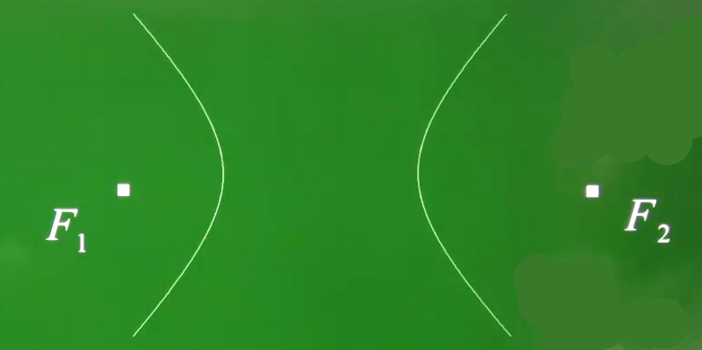

1）两个定点叫做双曲线的焦点，两焦点之间的距离叫做双曲线的焦距，通常将|F1F2|记为2c（c>0）

2）对于定义中的常数2a：

* 常数2a小于|F1F2|，即2a<2c，这是因为三角形的两边之差小于第三边
* 常数2a不能等于0，否则研究的就不是双曲线了，而是线段F1F2的垂直平分线

3）定义中要求的是差的绝对值，它可以保证有两条曲线，即双曲线，如果不是差的绝对值，则只有一条曲线。

**2、双曲线标准方程的推导**

见视频。

**3、双曲线标准方程**

将双曲线放在平面直角坐标系中进行研究，由于双曲线两个焦点既可以x轴也可以放在y轴上，所以双曲线的标准方程有两种。

​		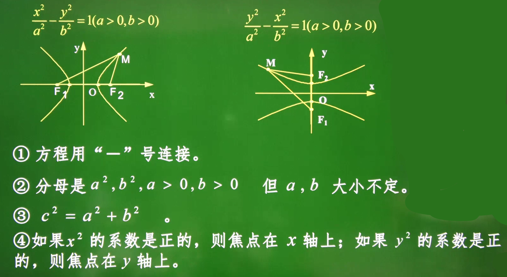

1）焦点在x轴上的双曲线标准方程：

​		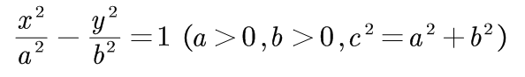

2）焦点在y轴上的双曲线标准方程：

​		

说明如下：

* 给定双曲线标准方程，判断该双曲线的焦点在哪个坐标轴上，只需要看双曲线标准方程中的x2和y2的系数即可，它们两者的系数必然一正一负的，而焦点就是在正的那一方所对应的坐标轴上。
* 双曲线标准方程中，a是双曲线上的一点到两焦点的距离之差的绝对值的一半；b是在双曲线标准方程推导过程中使用的换元，b2=c2-a2；c是双曲线两焦点之间的距离的一半，即焦距的一半，求c可以使用a2+b2=c2计算，求出c后可以根据双曲线方程判断焦点在哪个轴上，进而求出焦点坐标；求出c还可以计算两个焦点之间的距离，即焦距等于2c

* 如果给定的双曲线方程不是标准方程，可以想办法将其配为双曲线标准方程。
* 焦点在x轴上的双曲线，焦点坐标为(-c,0)，(c,0)；焦点在y轴上的双曲线，焦点坐标为(0,-c)，(0,c)

**4、双曲线与椭圆之间的区别与联系**

双曲线与椭圆有着非常相似但又有实质区别的关系。

​		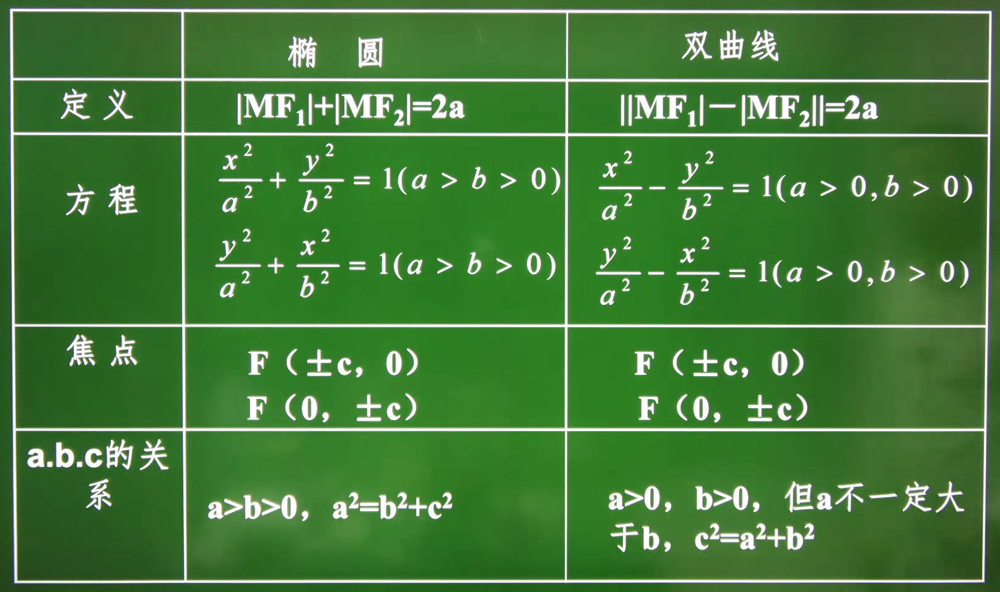

（椭圆a最大，双曲c最大）

## 双曲线的几何性质

**1、双曲线的范围**

1）焦点在x轴上的双曲线的范围：x≤-a, x≥a，y∈R

​		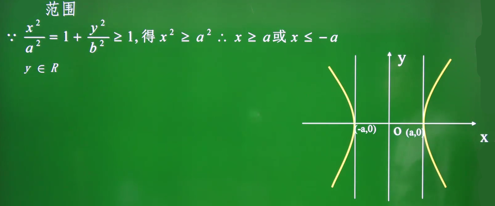

2）焦点在y轴上的双曲线的范围：y≤-a, y≥a，x∈R

​		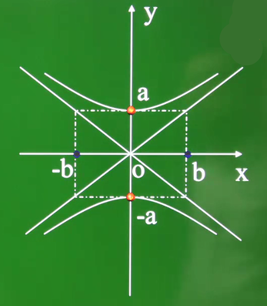

**2、双曲线的对称性**

不管双曲线的焦点在哪个轴上，双曲线都：关于x轴对称、关于y轴对称、关于原点中心对称

* x轴和y轴是双曲线的对称轴
* 原点是双曲线的对称中心，双曲线的对称中心也叫做双曲线的中心
* 对于双曲线上的任意一点，都可以在双曲线上其他位置找到与之对应的：关于x轴对称的点、关于y轴对称的点、关于原点中心对称的点。

以焦点在x轴上的双曲线为例：

​		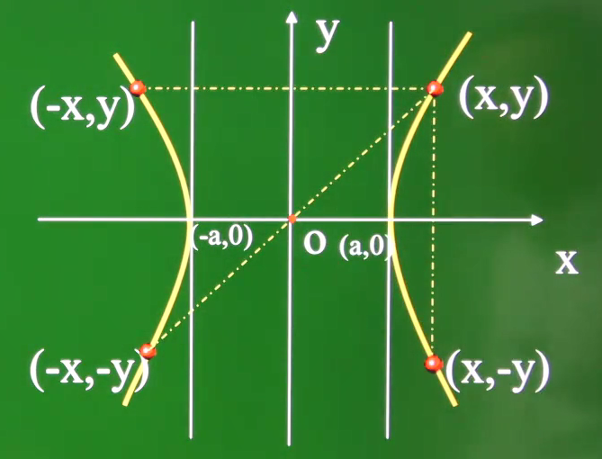

**3、双曲线的顶点、实轴、虚轴**

1）顶点：双曲线与其焦点所在坐标轴相交而产生的点，叫做双曲线的顶点，双曲线有两个顶点（双曲线的顶点与双曲线的焦点是两个概念）

* 焦点在x轴上的双曲线：与x轴有两个顶点，顶点坐标为：(-a, 0)，(a, 0)
* 焦点在y轴上的双曲线：与y轴有两个顶点，顶点坐标为：(0, -a)，(0, a)

2）实轴：双曲线的两个顶点相连而形成的轴叫做实轴，实轴长度等于2a

3）虚轴：双曲线与另一条坐标轴没有交点，但的确存在一条轴，这条轴就是虚轴，虚轴长度等于2b

* 焦点在x轴上的双曲线：虚轴两点坐标为：(0, -b)，(0, b)
* 焦点在y轴上的双曲线：虚轴两点坐标为：(-b, 0)，(b, 0)

4）实半轴长：实轴长度的一半，即实半轴长为a

5）虚半轴长：虚轴长度的一半，即虚半轴长为b

6）等轴双曲线：实轴和虚轴长度相等（2a=2b）的双曲线叫做等轴双曲线。

**4、双曲线的渐近线**

双曲线有两条渐近线，当双曲线无限延伸时，双曲线无限靠近渐近线，但永远也不会相交。（关于渐近线的证明体现了极限的思想）

1）以x轴为焦点的双曲线的两条渐近线：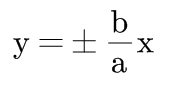

​		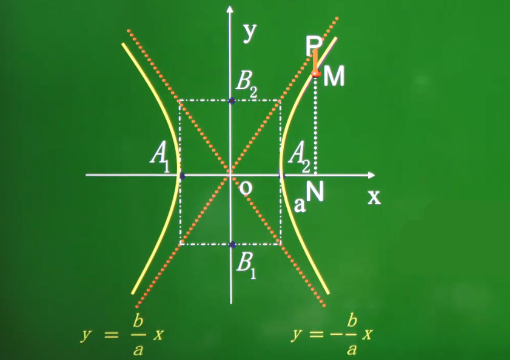

2）以y轴为焦点的双曲线的两条渐近线：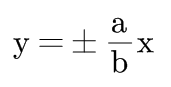

**5、双曲线的离心率**

焦距与实轴长的比叫做双曲线的离心率，记作e

​		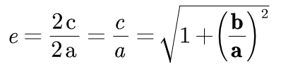

e的取值范围为 e>1，e反映了双曲线开口的大小：

* e越大  <=>  双曲线开口越大
* e越小  <=>  双曲线开口越小

以焦点在x轴的双曲线为例：

​		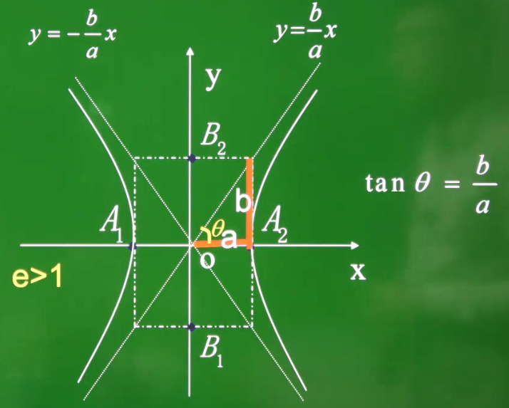

## 抛物线及其标准方程

**1、抛物线的定义**

在平面内，到一个定点F和一条定直线l的距离相等的点的轨迹叫做抛物线。

* 定点F叫做抛物线的焦点；定直线l叫做抛物线的准线；且定点L不在定直线l上
* 抛物线上的一点到定点F的距离记作d，即|MF|=d，由于抛物线上的点到定点和定直线的距离是相等的，所以它到定直线的距离也是d

​		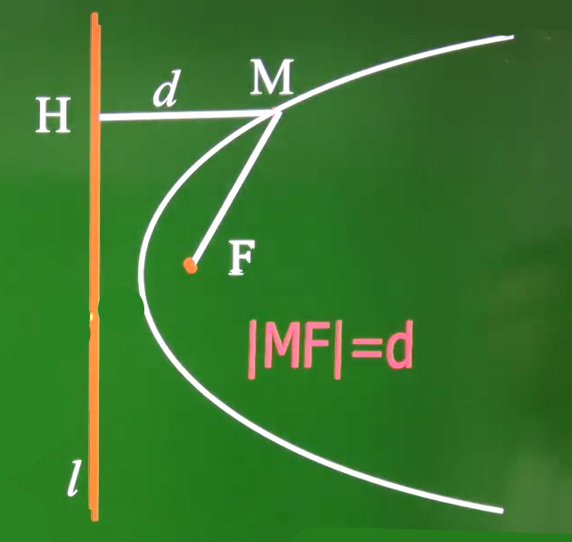

**2、抛物线标准方程的推导**

见视频。

**3、抛物线的标准方程**

将抛物线放在平面直角坐标上进行研究，将抛物线顶点对准原点，且原点是定直线与焦点所连线段的中点。根据抛物线的开口方向，抛物线的标准方程有4种形式：

（1）抛物线的开口朝x轴正半轴：y2 = 2px（p>0)

（2）抛物线的开口朝x轴负半轴：y2 = -2px（p>0)

（3）抛物线的开口朝y轴正半轴：x2 = 2py（p>0)

（4）抛物线的开口朝y轴负半轴：x2 = -2py（p>0)

其中p表示的是：经过原点，连接焦点和准线所形成的线段的长度。

​		

给定一个抛物线标准方程，要求求出相关信息，如该抛物线标准方程所表示的焦点坐标、准线方程、开口方向等；或者给定相关信息，要求写出其表示的抛物线标准方程。回答这些问题的关键是要知道抛物线的开口方向，知道了抛物线的开口方向，进而才可以求出抛物线的焦点坐标，准线方程等，因为<u>抛物线的焦点坐标总是在抛物线开口所朝的方向，准线则与之相反</u>。确定抛物线的开口方向的方法为：

* 根据抛物线标准方程的一次项，判断一次项变量的取值是正的还是负的（在抛物线标准方程中，因为二次项是平方，它的值必定大于等于0，而二次项又等于一次项，所以一次项的值一定也大于等于0，进而可以判断变量的正负取值情况），如果是正的，则说明抛物线开口朝向其对应坐标轴的正半轴；如果是负的，则说明抛物线开口朝向其对应坐标轴的负半轴。

<u>概括为：抛物线的开口方向取决于抛物线标准方程中一次项变量的正负情况所对应半轴</u>。的例如给定抛物线标准方程：y2=4x。可知一次项为4x，又因为y2≥0，且y2=4x，所以4x≥0，进而得到x≥0，所以抛物线的开口方向朝着x轴的正半轴。

## 抛物线的几何性质

​		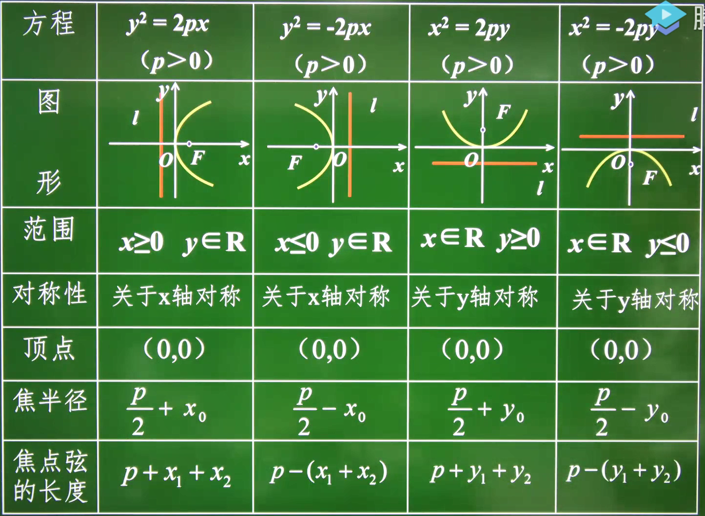

说明如下：

1）焦半径：抛物线上一点到焦点的距离称为焦半径。由于焦半径是抛物线上一点到焦点的距离，所以根据抛物线的定义可知，焦半径也是抛物线上一点到准线的距离。

​		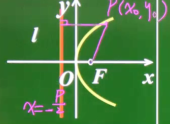

2）焦点弦及其长度：焦点弦指的是过抛物线焦点且与抛物线有两个交点的的线段，它的长度即为焦点弦的长度。焦点弦可以看做是两条焦半径组成，所以焦点弦的长度可以根据焦半径的长度得知，即焦点弦的长度等于两条焦半径的长度之和。

​		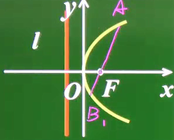

# 3. 空间向量与立体几何

## 空间向量及其运算——加减运算

**1、空间向量的有关概念**

在空间中，具有大小和方向的量称为空间向量。（由于空间向量与平面向量存在着许多类似的地方，所以这里只简单介绍了空间向量的相关概念，详情可以参考平面向量章节）

​		

**2、空间向量的加减运算**

空间向量的加减运算和平面向量的加减运算基本上是相同的。（这里只简单介绍，详情可以参考平面向量章节）

​		

​		

## 空间向量及其运算——数乘运算

​		

​		

​		

​		

## 空间向量的数量积

​		

三垂线定理及其逆定理：

​		

​		

## 空间向量的正交分解及其坐标表示

**1、平面向量基本定理的复习**

​		

**2、空间向量基本定理**

​		

**3、空间向量的坐标表示**

1）空间向量的坐标表示及几何意义：

​		

2）给定两个点，求以这两个点为起点终点的空间向量的坐标，只需要用空间向量的终点坐标减去起点坐标即可得到该空间向量的坐标，实际上它是两个空间向量进行差运算而得到的。

​		

**4、空间向量的相关公式**

1）已知空间向量的坐标，则该空间向量的长度为：

​		

2）已知两个空间向量的坐标，则这两个空间向量所成夹角的余弦值计算如下，进而还可以求出夹角的大小。

​		

3）已知空间中两点的坐标，则这两点的中点坐标为：

​		

## 立体几何中的向量方法

**1、直线的方向向量**

​		

**2、平面的法向量**

​		

求平面的一个法向量的方法：

​		

​		

**3、用空间向量方法证明“平行关系”**

针对每一点，视频中都作了详细介绍了，详情参考视频。

​		

**4、用空间向量方法证明“垂直关系”**

针对每一点，视频中都作了详细介绍了，详情参考视频。

​		

**5、用空间向量方法求“夹角”问题**

针对每一点，视频中都作了详细介绍了，详情参考视频。

​		

