# 1. 计数原理

## 分类加法计数原理与分步乘法计数原理

**1、分类加法计数原理**

​	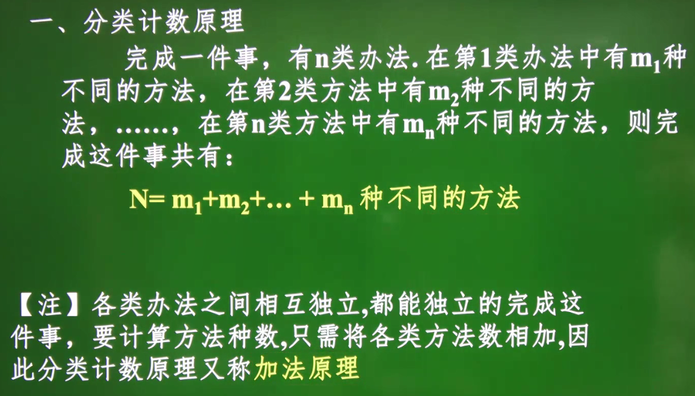

**2、分步乘法计数原理**

​	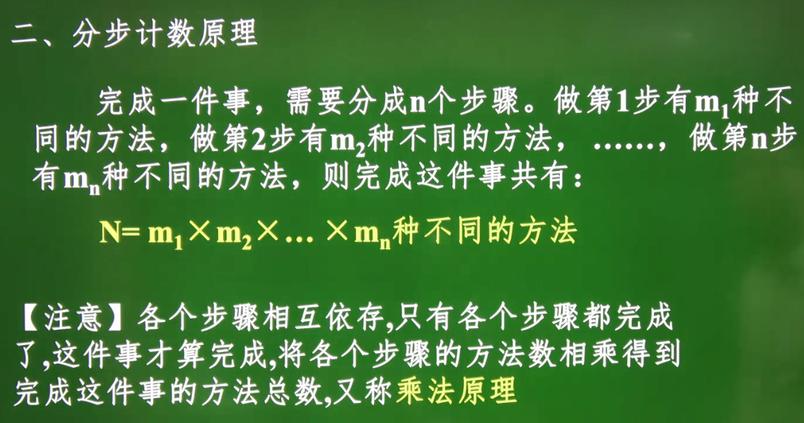

练习1：

​	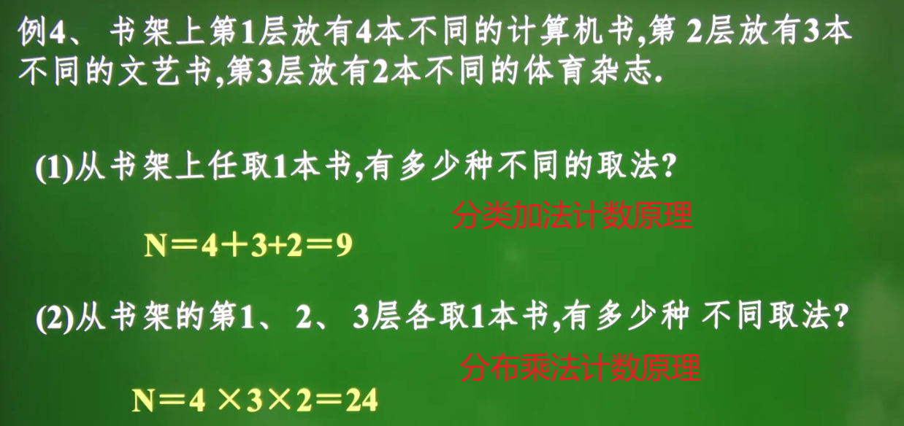

练习2：分类加法计数原理与分步加法计数原理的结合使用

​	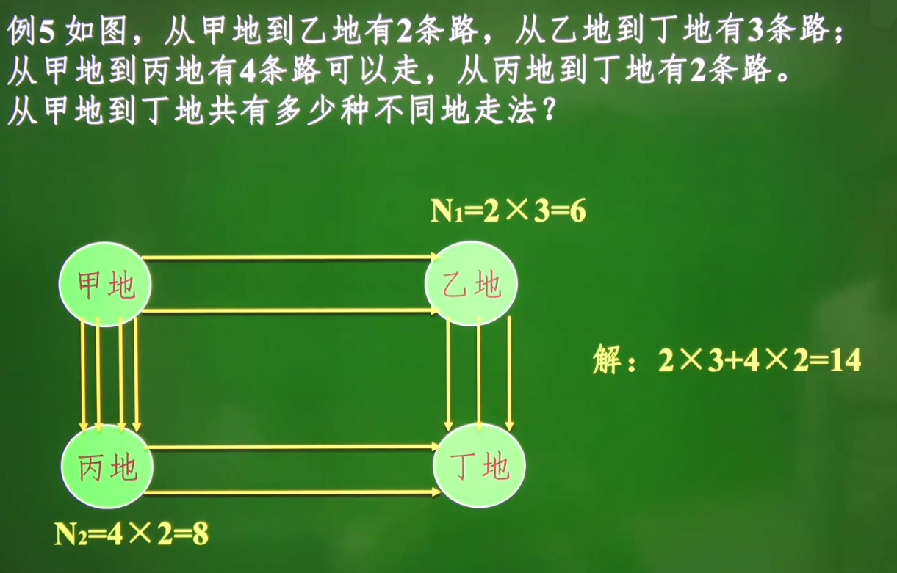

## 排列

**1、排列的相关概念**

1）排列：从n个不同的元素中取出m (m≤n) 个元素，按照一定的顺序排成一列，叫做从n个不同元素中取出m个元素的一个排列。

2）排列数：从n个不同元素中取出m (m≤n) 个元素的所有排列的个数，叫做从n个不同的元素中取出m个元素的排列数，用符号 Amn表示。（即从n个不同元素中取出m (m≤n) 个元素并排列，有多少种不同的取法以及每种取法有多少种排列，而排列数就是所有取法的排列种数之和）

3）全排列：从n个不同元素全部取出的一个排列，叫做n个不同元素的一个全排列。

4）阶乘：从1乘开始一直乘，直到乘到指定数n，所得的结果就叫做该指定数的阶乘，记作n!。

* 5! =1×2×3×4×5 = 120
* 特别的，0的阶乘为1。

**2、排列数的计算**

排列数的计算公式1：

​		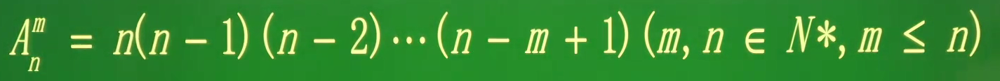

排列数的计算公式2：

​		

1）在排列数的计算公式中，n表示一共有多少个元素，对应着下标；m表示要从n个元素中取出多少个元素进行排列，对应着上标。

2）公式1和公式2是等同的，两者可以互推。不同的是：

* 公式1更适合计算小规模的排列，而大规模的排列适合用公式2
* 公式2比公式1更适合用来作证明

3）可以从两个角度理解公式1，例如存在A46，它表示从6个元素中选取4个元素进行排列，运用公式1从两个角度计算排列数：

* 将A46看作是：从6×(6-1)×(6-2)···(6-4+1)为止，即6×5×4×3 = 360
* 将A46看作是：从6开始往前乘，一共有4个因数，即6×5×4×3 = 360

4）特别地，对于全排列，它的排列数为：n!（这可以从公式2中证明，既然是全排列，则n=m，所以公式2中的分母变为0! ，而0! = 1，所以整个式子变为n!）

​	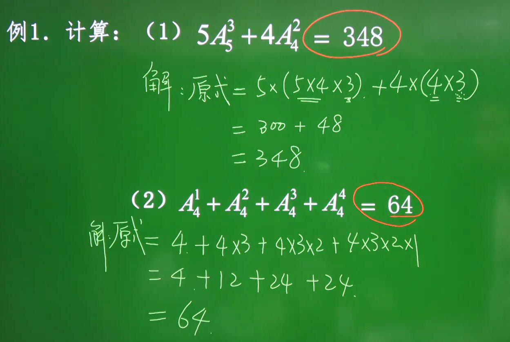

## 组合

**1、组合的相关概念**

1）组合：从n个元素中取出 m (m≤n) 个元素组成一组，叫做从n个不同元素中取出m个元素的一个组合。

2）组合数：从n个不同元素中取出 m (m≤n) 个元素的所有组合的个数，叫做从n个不同元素中取出m个元素的组合数，用符号Cmn表示。（即从n个不同元素取出 m (m≤n)个元素有多少种不同的取法）

**2、组合与排列的区别与联系**

1）组合与排列的区别：

​		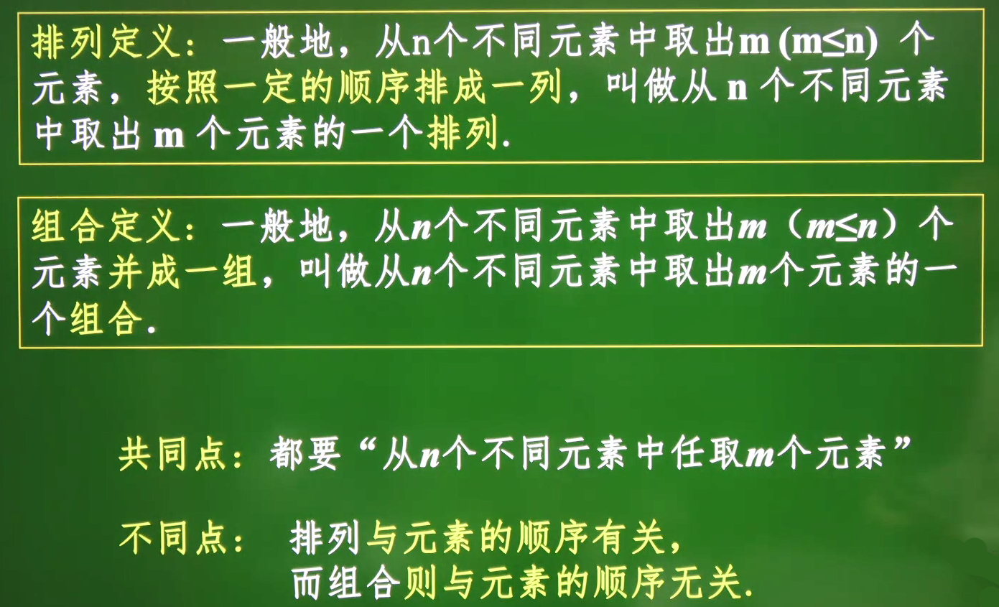

​		

2）组合与排列的联系：

​		

利用组合与排列的联系可以求组合数。

**3、组合数的计算**

由于排列包含了组合，先组合（取元素）再进行排列。所以排列数的计算可以表示为组合数乘以一组的排列数：

​		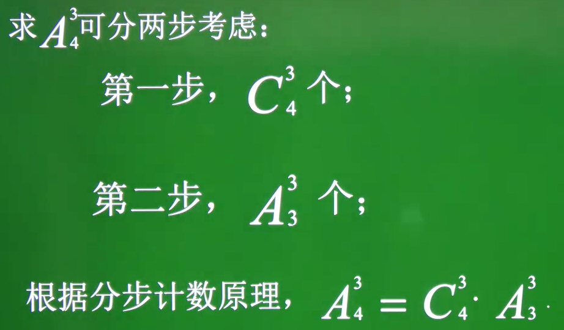

进行移项，从而可以得出组合数的计算公式：

​		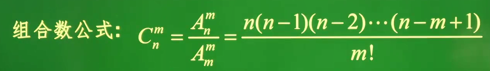

规定：

* 从n个不同元素中取出 m (m=n）个元素的组合数为1，即Cmn = 1(m=n)
* 从n个不同元素中取出0个元素的组合数为1，即C0n = 1

所以只要会计算排列数，那么组合数的计算也没有问题。例题如下：

​		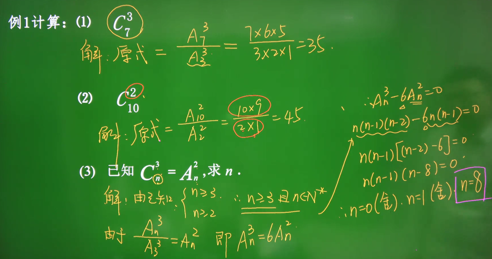

**3、组合数的性质**

1）从n个不同元素中取出m个元素的组合数，等于从这n个元素中取出n-m个元素的组合数。

​	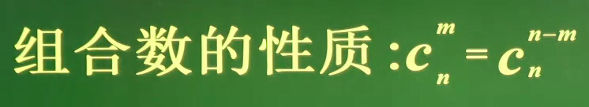

利用该性质可以将大量计算化成小量计算，即简化计算：

​	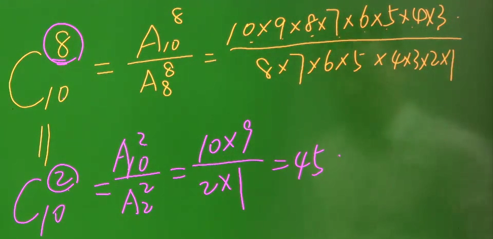

2）组合数还有这个性质：

​		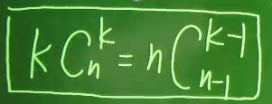

​	

## 二项式定理

对于(a+b)2，我们可以很轻松的写出它的展开式：a2+2ab+b2，这是我们初中阶段所学的完全平方公式，但如果是(a+b)3、(a+b)4、···、(a+b)n方，就无法运用完全平方公式将其展开了，虽然我们也可以用暴力的方法将其展开，即将一个一个的(a+b)相乘，但这种方法效率非低，对于次数高的，很容易出错。而使用二次项定理就能够轻而易举的将其展开，不管次数有多高。二项式定理如下：

**1、二项式定理**

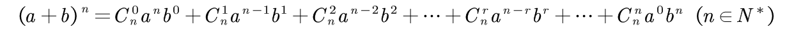

1）上式的右边称为二项展开式，展开式的项数为n+1项，各项次数都等于二项式的次数。

2）在二项展开式中，字母a按降幂排列，次数由n递减到0；字母b按升幂排列，次数由0递增到n

3）二项式系数可以写成组合数的形式，组合数的下标为二项式的次数，组合数的上标由0递增到n

4）展开式中的第r+1项，即通项Tr+1可以表示为：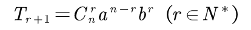

5）需要注意，在二项式展开式中，二项式的系数为Crn，由于展开式有n+1项，所以二项式的系数也有n+1个，且二项式的系数≥1，因为二项式系数是组合数；而二项式系数与项的系数两者不是同一个概念，项的系数为二项式系数与后面数字进行乘积，得到的最终的系数。

6）在二项式定理中，令a=1，b=x，则有：

​		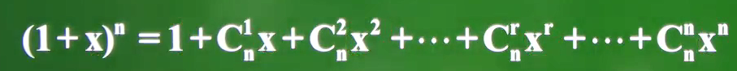

在上式中，令x=1，则有：

​		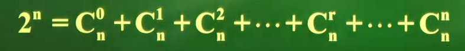

**2、杨辉三角与二次项系数**

(a+b)n 展开式中的二次项系数构成了一个杨辉三角：

​		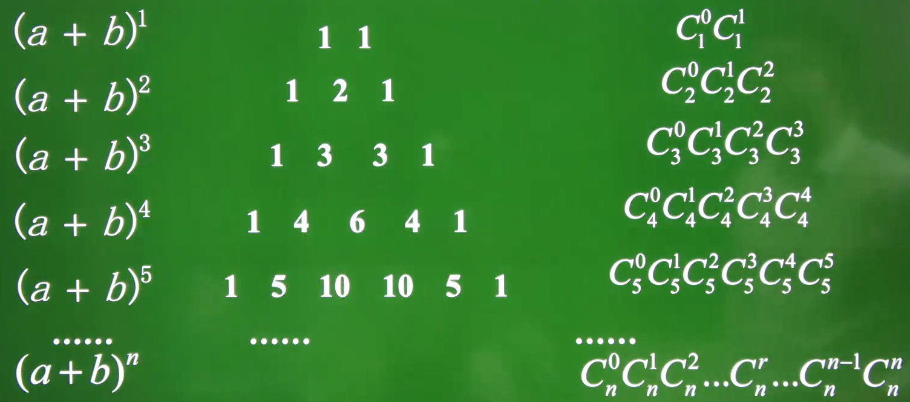

从中可以发现：

1）Cmn = Cn-mn（这其实是组合数的性质）

2）在杨辉三角中，某个二项式系数等于上边与它相邻的两个二次项系数的和（这其实也是杨辉三角的性质）

​		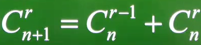

3）对于一个二项式定理展开式，其二项式的系数大小是关于中心对称的，且二项式系数的最大值一定在中间

* n为偶数时，二项式系数的最大值有一个：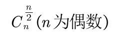，对应着二次项展开式的第(n/2)+1项
* n为奇数时，二项式系数的最大值有两个且相等：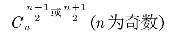，对应着二次项展开式的第(n-1)/2+1或(n+1)/2+1项

**3、二项式系数的性质**

1）对称性：

​		

2）最大值与增减性：

​		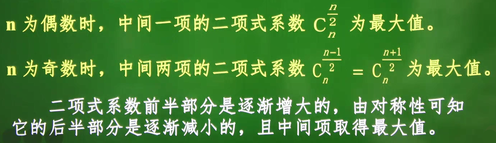

3）当a=b=1时，各二项式系数的和：

​		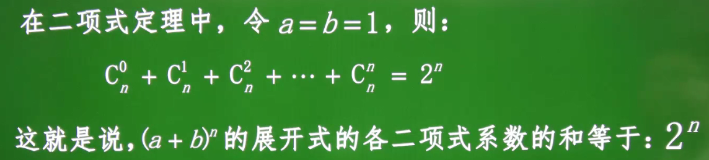

# 2. 随机变量及其分布

## 随机变量相关概念

随机变量：如果随机试验的结果可以用一个变量来表示（或随着试验结果变化而变化的变量），那么这样的变量叫做随机变量。

1）随机变量常用字母X、Y、ꚕ、ƺ等表示。

2）随机变量分为离散型随机变量和连续型随机变量。

* 离散型随机变量：所有取值可以一一列出的随机变量，称为离散型随机变量。
* 连续型随机变量：如果随机变量可能取的值是某个区间的一切值，这样的随机变量叫做连续型随机变量。

3）某些随机试验的结果不具备数量性质，但仍可以用数量来表示它，比如抛硬币，将正面朝上记为1，反面朝上记为0

4）若X是随机变量，则Y=aX+b（a、b是常数）也是随机变量。

本章的内容主要是研究离散型随机变量、连续型随机变量。

## 离散型随机变量的分布列

**1、离散型随机变量的分布列**

设离散型随机变量Y的所有可能取值为x1，x2，x3，···，xi，···，xn，Y的每一个取值xi（i=1,2,···，n)的概率为P(Y=xi)=pi，则称表格：

| Y    | x1 | x2 | ···  | x2 | ···  | xn |
| ---- | ------------- | ------------- | ---- | ------------- | ---- | ------------- |
| p    | p1 | p2 | ···  | pi | ···  | pn |

为离散型随机变量Y的概率分布，简称Y的分布列。

1）离散型随机变量的分布列完全描述了由这个随机变量所刻画的随机现象。

2）分布列列出了离散型随机变量Y的所有取值，并且指出每一种取值的概率。

3）分布列中每一种取值的概率大于等于0且小于1，即 0≤pi<1；所有取值的概率之和等于1，即p1+p2+···=1

4）离散型随机变量除了可以用分布列表示，还可以用等式、或图像来表示。

* 等式：有时为了表达简单，用等式P(Y=xi)=pi，i=1,2,3,···,n，表示Y的分布列（ P(Y=xi)=pi表示取值为xi时情况的概率为pi）
* 图像：

​		

**2、离散型随机变量分布列的二种特殊形式**

离散型随机变量有两种特殊形式：两点分布、超几何分布。

1）两点分布：

​		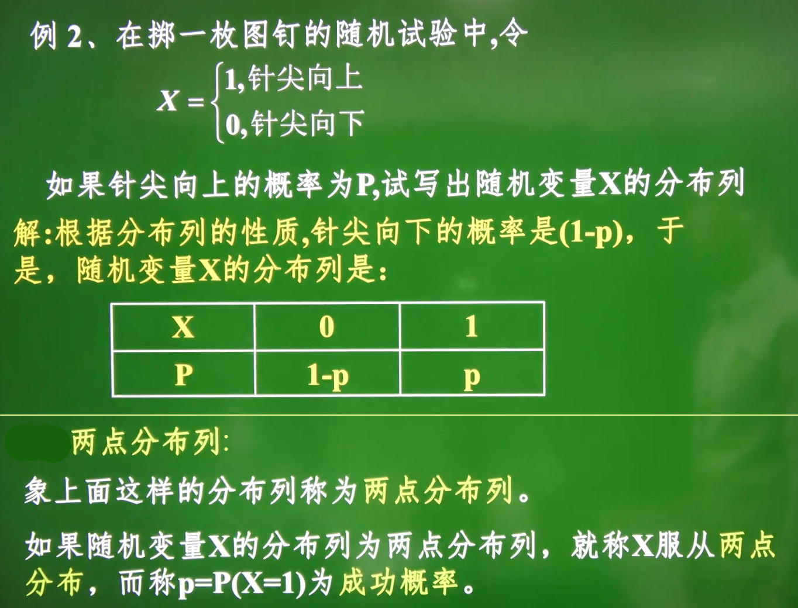

2）超几何分布：

​		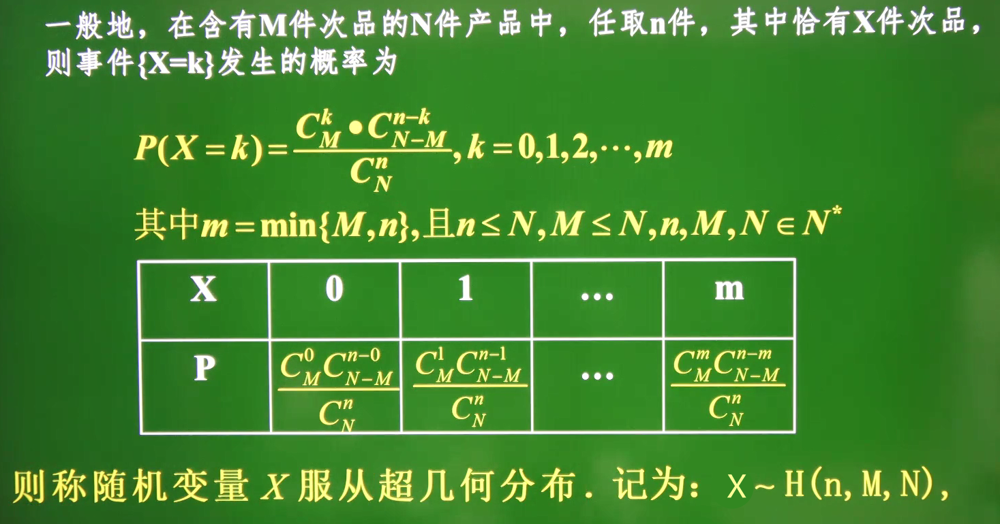

​		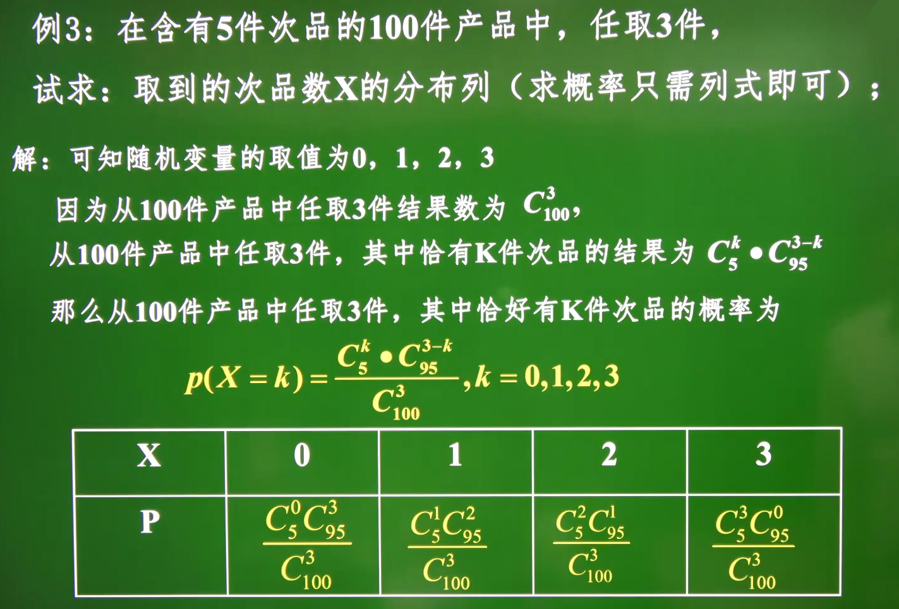

## 条件概率

对任意事件A和事件B，在已知事件A发生的条件下事件B发生的概率，叫做条件概率，记作 P(B|A)

​		

Ω为基本事件空间。

1）P(B|A) 相当于把事件A看作新的基本事件空间，然后求B事件在新的基本事件空间上发生的概率，即求A∩B发生的概率。条件概率的计算公式为：

​		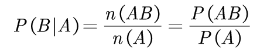

* A∩B事件在基本事件空间中发生的个数 比上 A事件在基本空间中发生的个数
* A∩B事件在基本事件空间中发生的概率 比上 A事件在基本事件空间中发生的概率。

条件概率的取值范围为：0 ≤ P(B|A) ≤ 1

2）如果事件B和事件C互斥，那么 P[B∪C|A] = P(B|A) + P(C|A)

​		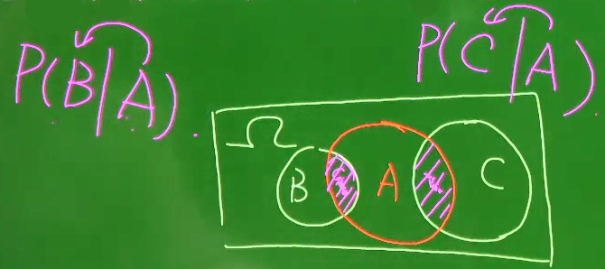 	

3）概率P(B|A)与P(AB)的区别与联系如下：

​		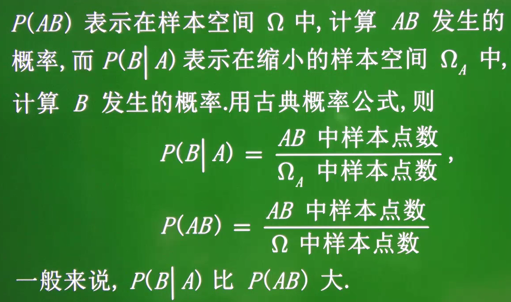

一般来说，P(B|A) 大于等于 P(AB)，即P(B|A) ≥ P(AB)，因为在它们计算公式中，分子都是一样大的，又因为P(AB)的分母是基本事件空间，而P(B|A)的分母是基于事件A产生的缩小的基本事件空间，它一定比基本事件空间小，所以分母越小反而越大，故P(B|A) ≥ P(AB)；等号成立的条件是：基本事件空间与基于事件A产生的缩小的基本事件空间相等。

## 事件的相互独立性

**1、独立事件**

设A、B为两个事件，如果P(AB)=P(A)P(B)，则称事件A与事件B相互独立。

1）即事件A是否发生，对事件B发生的概率没有影响，这样两个事件叫做相互独立事件。

2）如果事件A与事件B相互独立，那么事件A与事件B的互斥事件相互独立、事件A的互斥事件与事件B相互独立、事件A的互斥事件与事件B的互斥事件相互独立。

​		

3）注意，互斥事件与相互独立事件是两个不同的概念：

* 两个事件互斥是指这两个事件不可能同时发生
* 两个事件相互独立是指一个事件的发生与否对另一个事件发生的概率没有影响

**2、独立事件同时发生的概率**

两个独立事件A、事件B同时发生，构成了交事件，也称为积事件，即当且仅当事件A发生并且事件B也发生时，事件C发生，则称事件C为事件A与事件B的交事件（事件AB同时发生构成了事件C），记作：C=A∩B或C=AB。

1）事件A与事件B同时发生的概率为：事件A发生的概率乘以事件B发生的概率。

​		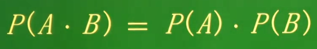

2）同理，如果事件A1，A2，···，An相互独立，那么这n个事件同时发生的概率等于每个事件发生的概率的积。

 		

## 独立重复试验与二项分布

**1、独立重复试验**

n次独立重复试验：在相同条件下，重复做的n次试验称为n次独立重复试验。

* 在n次独立重复试验中，Ai 是“第i次试验的结果”，显然有：P(A1A2···An) = P(A1)P(A2)···P(An)
* “相同条件下”意味着各次试验的结果不会受到其他次试验的影响。

**2、二项分布**

在n次独立重复试验中，设事件A发生的次数为X，在每次试验中事件A发生的概率为p，那么在n次独立重复试验中，事件A恰好发生k次的概率为：

​		

此时，称随机变量X服从二项分布，记作 X~B(n, p)，并称p为成功概率，1-p为失败概率。

* n表示独立重复试验的次数；p表示给定事件A在每次独立重复试验中发生的概率，即成功概率，1-p表示给定事件A在每次独立重复试验中不发生的概率，即失败概率，p和1-p构成了两点分布，两者概率相加为1；k表示给定事件A恰好发生的次数。
* 根据二项分布可以得到随机变量X的概率分布（即随机变量X的分布列）如下：

 			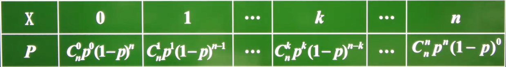

例题如下：

​	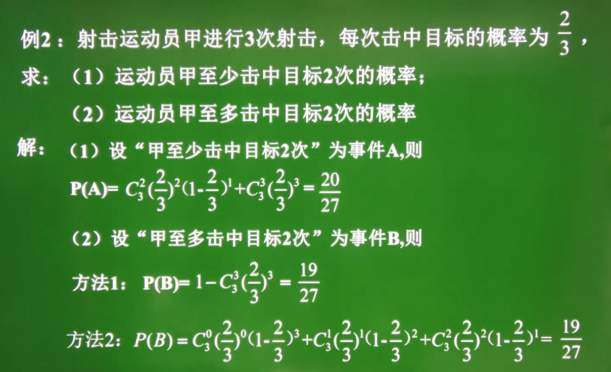

## 离散型随机变量的均值 、方差、标准差

离散型随机变量的均值、方差、标准差与统计中数据的平均数、方差、标准差类似。

**1、离散型随机变量的均值**

若离散型随机变量X的概率分布为：

​		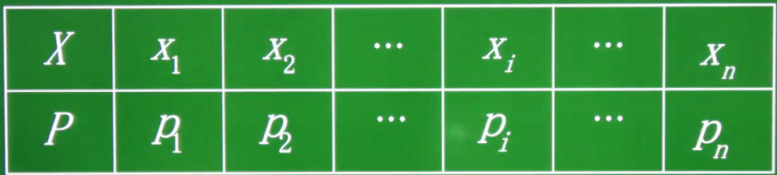

则称 **EX= x1p1 + x2p2 + ··· +xipi + ··· xnpn** 为离散型随机变量X的均值，也称数学期望，它反映了离散型随机变量取值的平均水平。

1）离散型随机变量X的均值满足：E(aX+b) = aEX+b

2）离散型随机变量X的均值具有以下性质：

* 若离散型随机变量X服从两点分布，则EX=p

​		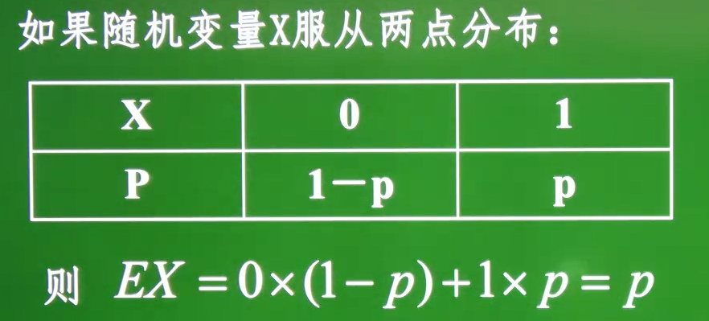

* 若离散型随机变量X服从二项分布，即X~B(n, p)，则EX = np

**2、离散型随机变量的方差、标准差**

若离散型随机变量X的概率分布为：

​		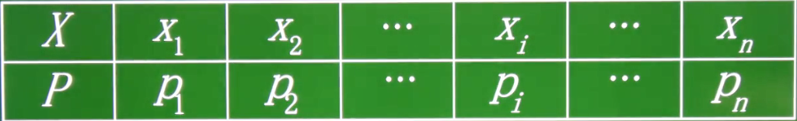

则称 **DX=(x1-EX)2p1+···+(xi-EX)2pi+···+(xn-EX)2pn** 为离散型随机变量X的方差。

1）类比统计中数据的方差与标准差的关系，离散型随机变量的标准差等于方差开平方，即

2）离散型随机变量的方差与标准差都是反映离散型随机变量偏离于均值的平均程度的量，它们的值越小，则随机变量偏离于均值的平均程度越小，即越集中于均值。

3）离散型随机变量X的方差具有以下性质：

* D(aX+b) = a2DX
* 若离散型随机变量X服从两点分布，则 DX = p(1-p)
* 若离散型随机变量X服从二项分布，即X-B(n, p) ，则 DX = np(1-p)

​	

## 正态分布

离散型随机变量取可列个不同值，它关注的是某些特定值的概率，使用概率分布来描述每种可能取值出现的概率。连续型随机变量可能取某个区间上的任何值，它关注的是落在某个区间概率，使用密度函数来描述概率。离散型随机变量的概率分布在前面已经研究过，本节研究的是连续型随机变量的概率分布。

**1、正态曲线定义**

​	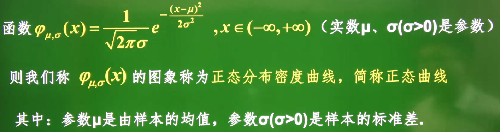

正态分布密度函数也称为正态分布密度曲线，简称正态曲线，其图像大致如下：

​	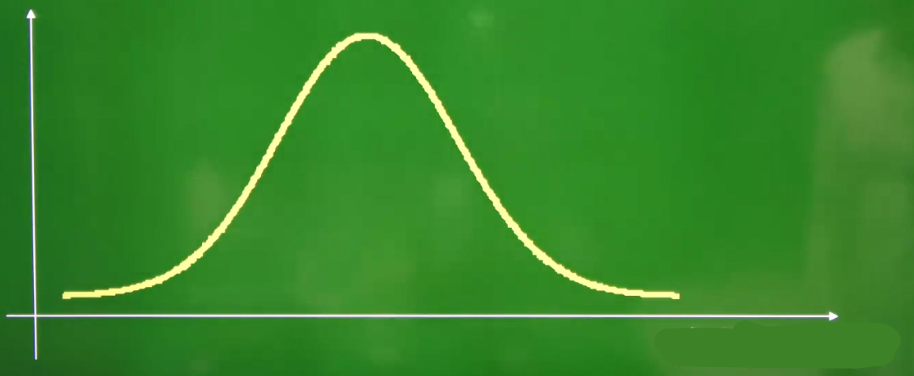

**2、正态分布的定义**

如果对于任何实数 a<b，随机变量X在区间 [a,b] 的概率约等于正态曲线在区间 [a,b]上的积分（即曲边多边形的面积）：

​	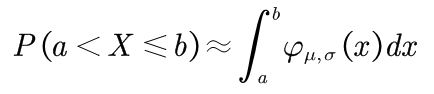

​	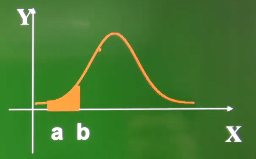

则称随机变量X服从正态分布，记作 X~N(μ,ơ2)。

1）正态分布由参数μ、ơ确定，μ表示随机变量的均值，ơ表示随机变量的标准差，ơ2表示随机变量的方差。

2）均值μ反映的是随机变量取值的平均情况，所以均值μ是正态分布曲线的对称轴

​			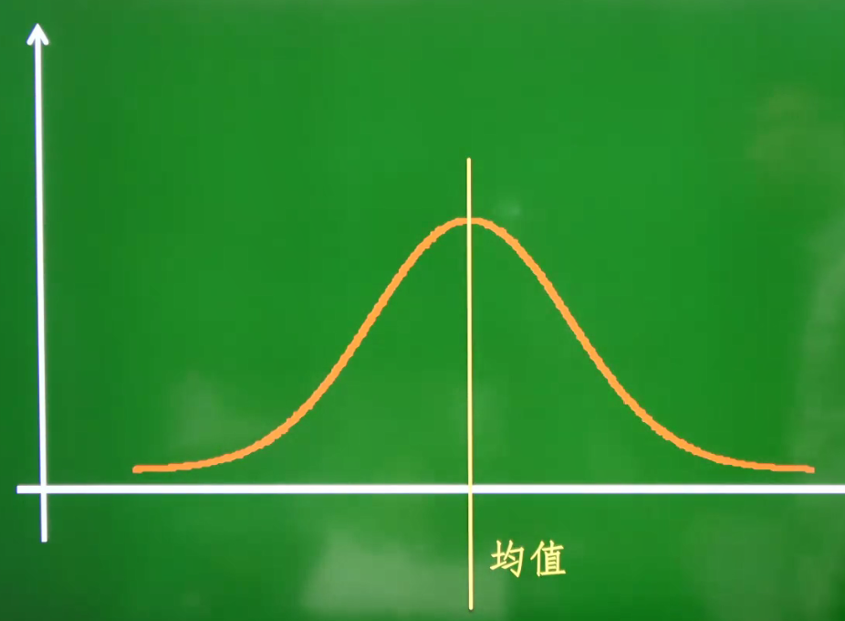

* ơ反映的是变量取值的集中与分散的程度，ơ越小，变量取值对于均值来讲越集中，ơ越大，变量取值对于均值来讲越分散

​			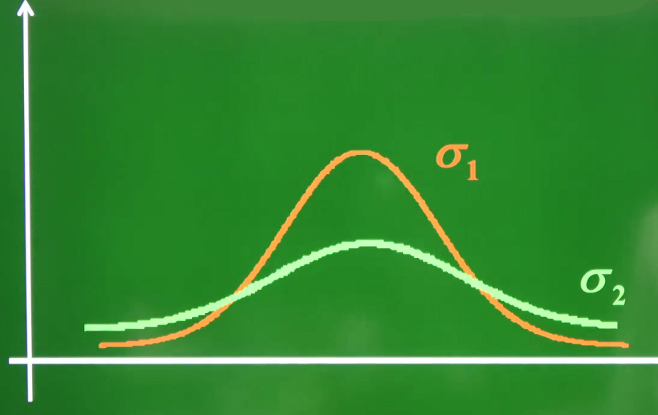

**3、正态分布密度函数图像的性质**

​	

其图像形状大致如下：

​	

有以下性质：

1）图像具有两头低，中间高，左右对称的基本特征。

2）正态分布曲线是单峰的，关于 x=μ 对称，且当 x=μ 时，函数值为最大值。（μ为随机变量的均值）

​		

3）正态分布曲线的值域为 (0, f(μ)]，即 (0, 最大值]

4） x∈(-∞,μ) 时 f(x) 为增区间；当 x∈(μ,+∞) 时 为减区间。即当x<μ时，曲线上升；当x>μ时，曲线下降，并且当曲线向左、右两边无限延伸时，以x轴为渐近线，向它无限靠近。

5）当ơ固定时，曲线的位置由μ确定，故称μ为位置参数。

​		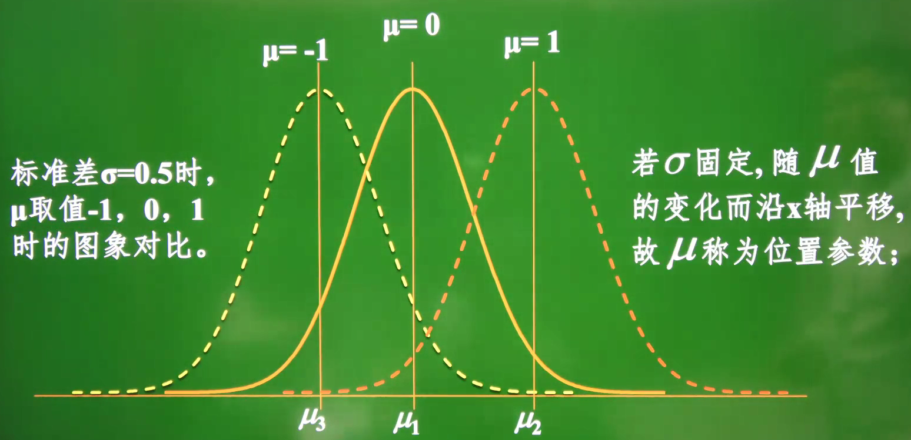

6）当μ固定时，曲线的形状由ơ确定，故称ơ为形状参数。

* ơ越大，曲线矮胖，表示总体的分布越分散
* ơ越小，曲线高瘦，表示总体的分布越集中

​		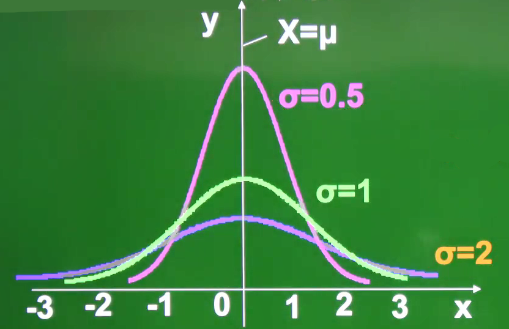

7）正态分布曲线下的区域面积的规律：

* x轴与正态曲线所夹面积恒等于1。（对应着总概率为1）

​			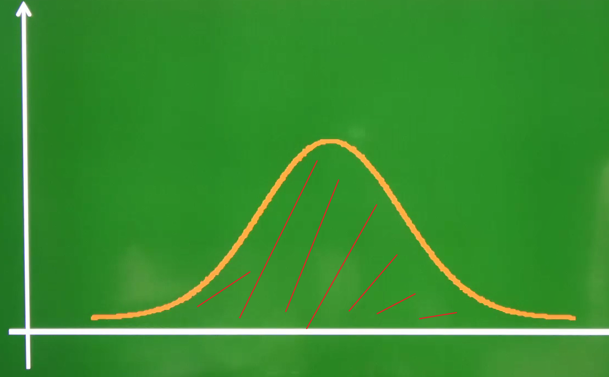

* 对称区域的面积相等。

​			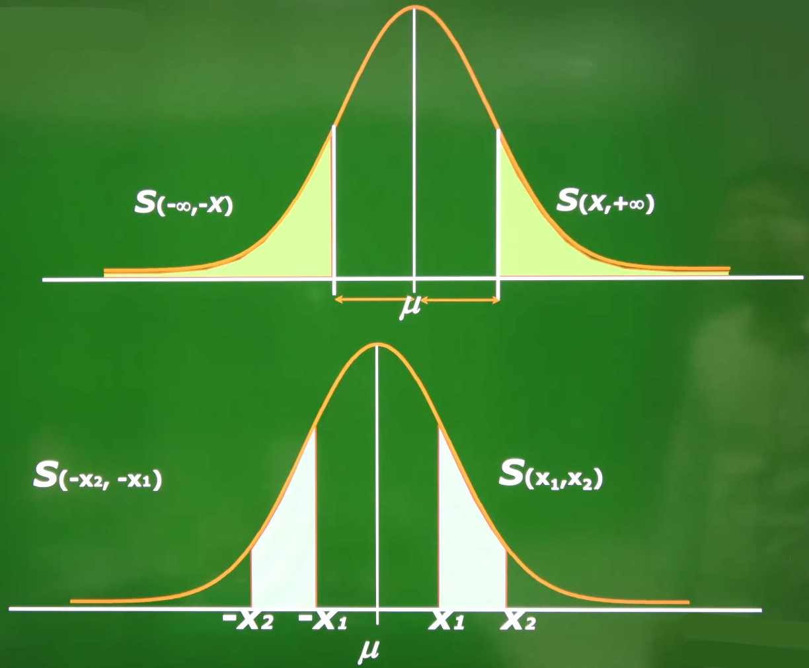

**4、标准正态分布的密度函数表示式及其性质**

标准正态分布是正态分布的一种特殊情况，是把正态分布密度函数中的μ赋为0，ơ赋为1而得到的。

​		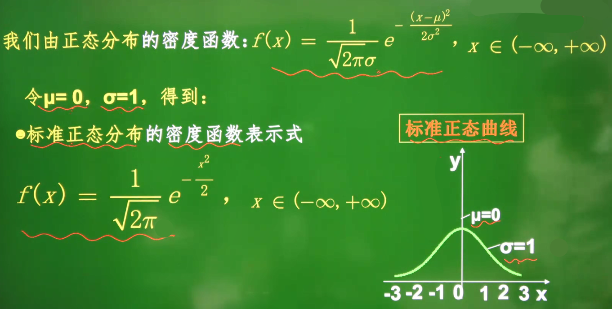

若随机变量X服从标准正态分布，则记作 X~N(0,1)。标准正态分布图像的性质如下：

​		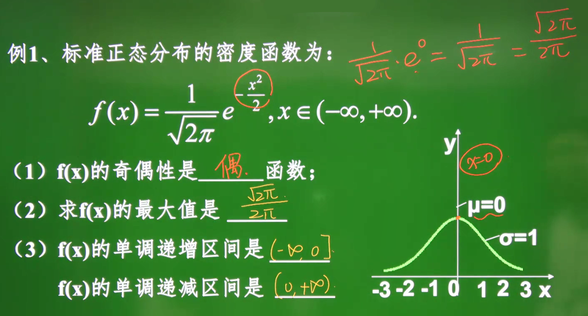

**5、特殊区间的概率**

若 X~N(μ,ơ2)，则对于任何实数 a>0，随机变量X在区间 (μ-a, u+a) 的概率等于 区间 (μ-a, u+a) 的积分，即区间 (μ-a, u+a)上曲边多边形的面积。

​		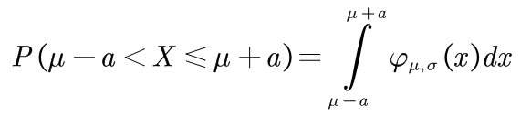

​	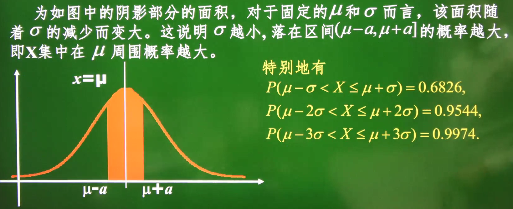

​	

上图是三个特殊区间的概率。有：

* 分布在区间 (μ-ơ, u+ơ) 的概率为68.3%，分布在区间 (μ-ơ, u+ơ) 外的概率为 1-68.3%=31.7%

* 分布在区间 (μ-2ơ, u+2ơ) 的概率为95.4%，分布在区间 (μ-2ơ, u+2ơ) 外的概率为 1-95.4%=4.6%

* 分布在区间 (μ-3ơ, u+3ơ) 的概率为99.7%，分布在区间 (μ-3ơ, u+3ơ) 外的概率为 1-99.7%=0.3%

由于当a=3ơ时，正态分布的取值几乎总取值区间 (μ-3ơ, u+3ơ] 之内，其他区间取值几乎不可能，所以在实际运用只考虑3ơ这个区间就够了，这称为 **3ơ原则**。

# 3. 统计案例

## 独立性检验的基本思想及其初步应用

独立性检验的基本思想及其初步应用：

​	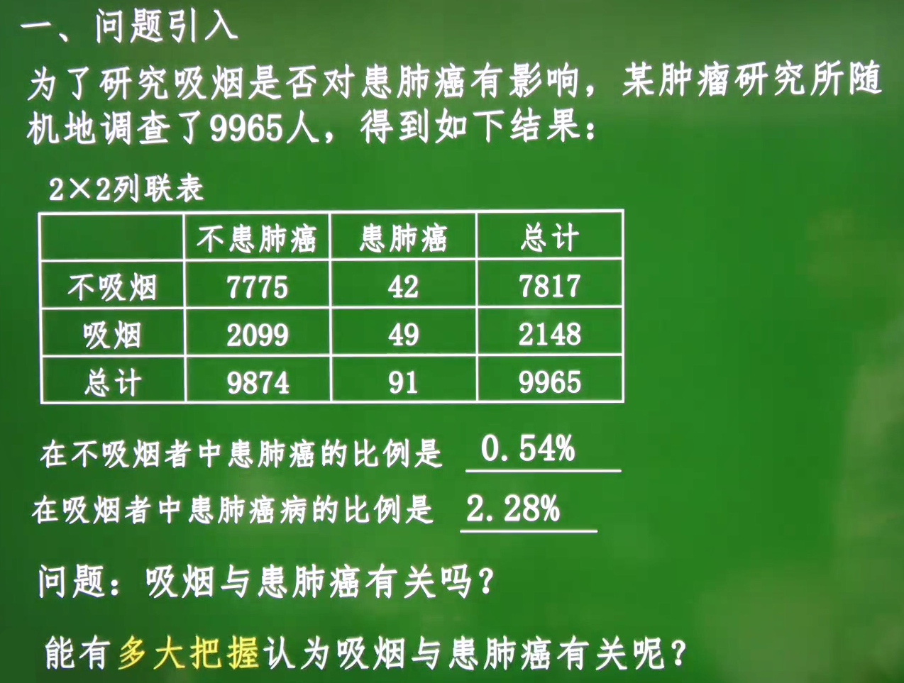

​	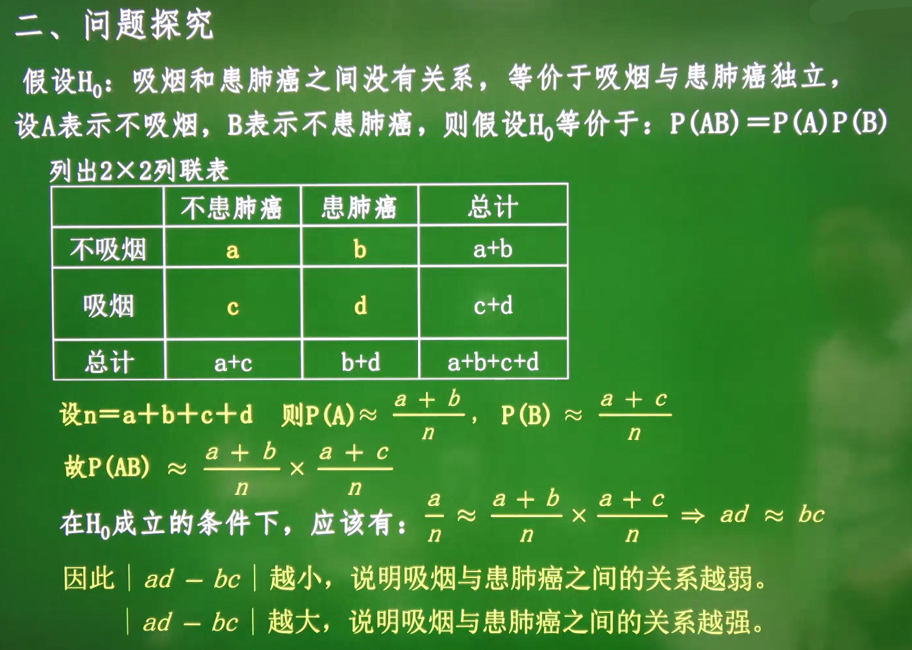

​	

​	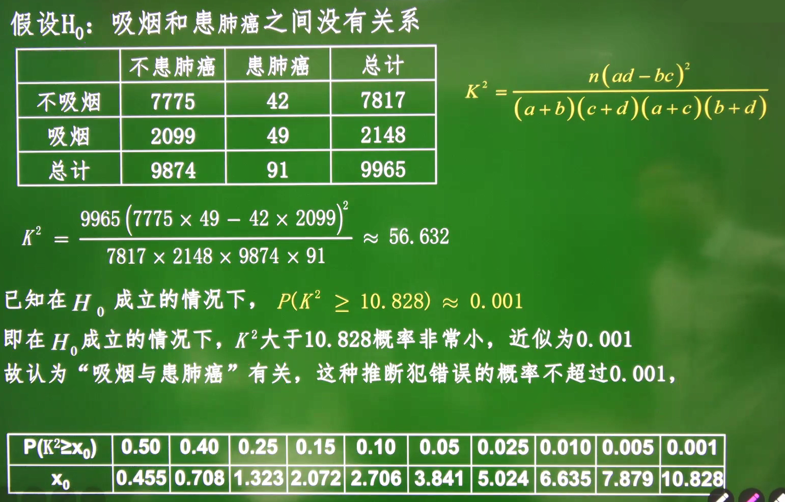

习题：

​	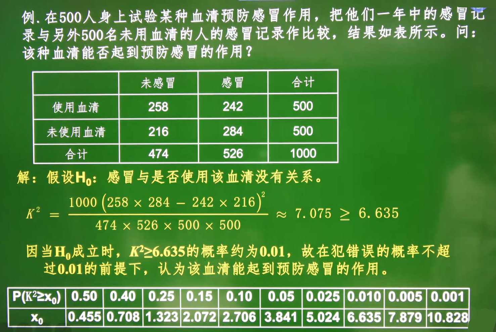

反证法原理与假设检验原理的对比：

​	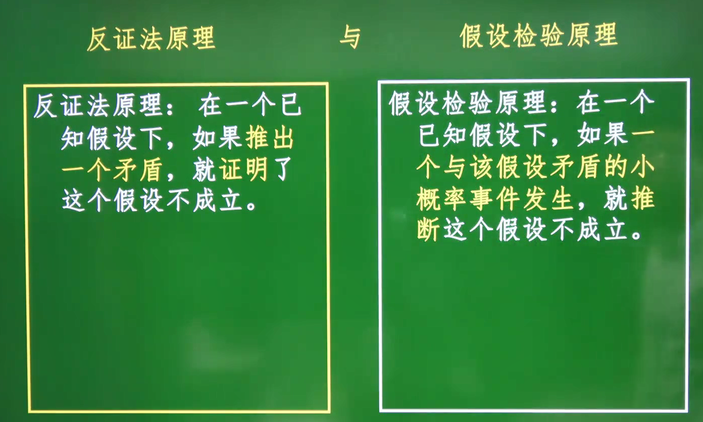

